# 一 人工智能

人工智能 包含 机器学习,机器学习 包含 深度学习

## 主要分支介绍

通讯、感知与行动是现代人工智能的三个关键能力，在这里我们将根据这些能力/应用对这三个技术领域进行介绍：

- 计算机视觉(CV)、
- 自然语言处理(NLP)
    在 NLP 领域中，将覆盖文本挖掘/分类、机器翻译和语音识别。
    - 语音识别
    - 文本挖掘/分类
- 机器人

# 二 机器学习工作流程

## 1 什么是机器学习

机器学习是从数据中自动分析获得模型，并利用模型对未知数据进行预测。

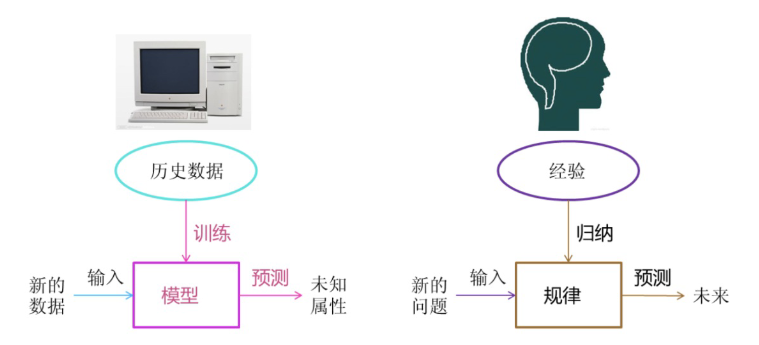

## 2 机器学习工作流程

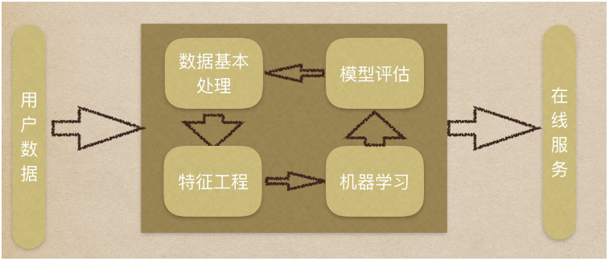

### 机器学习工作流程总结

1. 获取数据
2. 数据基本处理
3. 特征工程
4. 机器学习(模型训练)
5. 模型评估
    - 结果达到要求,上线服务
    - 没有达到要求,重新上面步骤

1. 获取到的数据集介绍

- 数据简介
    在数据集中一般：

    - 一行数据我们称为一个样本
    - 一列数据我们成为一个特征

    - 有些数据有目标值（标签值），有些数据没有目标值（如上表中，电影类型就是这个数据集的目标值）

- 数据类型构成：

    - 数据类型一：特征值+目标值（目标值是连续的和离散的）
    - 数据类型二：只有特征值，没有目标值

- 数据分割：

    - 机器学习一般的数据集会划分为两个部分：
        - 训练数据：用于训练，构建模型
        - 测试数据：在模型检验时使用，用于评估模型是否有效
    - 划分比例：
        - 训练集：70% 80% 75%
        - 测试集：30% 20% 25%

    

    2.数据基本处理

    即对数据进行缺失值、去除异常值等处理

    

    3.特征工程

    - 3.1什么是特征工程
        特征工程是使用专业背景知识和技巧处理数据，使得特征能在机器学习算法上发挥更好的作用的过程。
        意义：会直接影响机器学习的效果

    - 3.2 为什么需要特征工程(Feature Engineering)

        > 机器学习领域的大神Andrew Ng(吴恩达)老师说“Coming up with features is difficult, time-consuming, requires expert knowledge.
        > “Applied machine learning” is basically feature engineering. ”
        > 注：业界广泛流传：数据和特征决定了机器学习的上限，而模型和算法只是逼近这个上限而已。

    - 3.3 特征工程包含内容

        - 特征提取
        - 特征预处理
        - 特征降维

    - 3.4 各概念具体解释

        - 特征提取
            将任意数据（如文本或图像）转换为可用于机器学习的数字特征
        - 特征预处理
            通过一些转换函数将特征数据转换成更加适合算法模型的特征数据过程

        - 特征降维
            指在某些限定条件下，降低随机变量(特征)个数，得到一组“不相关”主变量的过程

    4 机器学习
    选择合适的算法对模型进行训练（具体内容见1.5）

    5 模型评估
    对训练好的模型进行评估（具体内容见1.6）

    

## 3.机器学习算法分类

根据数据集组成不同，可以把机器学习算法分为：

- 监督学习
- 无监督学习
- 半监督学习
- 强化学习

### 1 监督学习 特征值和目标值

​	定义：

- 输入数据是由输入特征值和目标值所组成。
    - 函数的输出可以是一个连续的值(称为回归），
    - 或是输出是有限个离散值（称作分类）。

#### 1.1回归问题  连续

例如：预测房价，根据样本集拟合出一条连续曲线

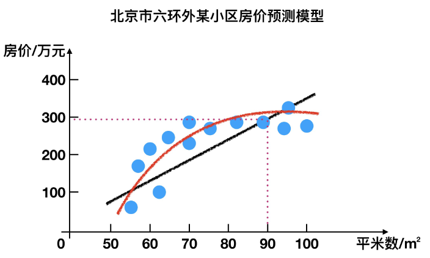

#### 1.2分类问题 离散

例如：根据肿瘤特征判断良性还是恶性，得到的是结果是“良性”或者“恶性”，是离散的。

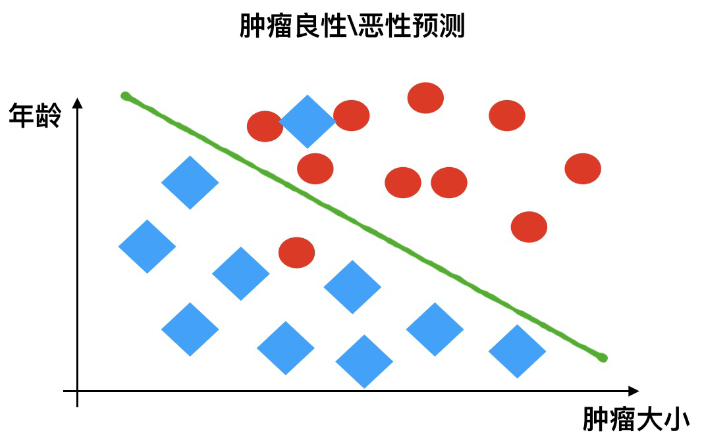

### 2 无监督学习 没有目标值

- 定义：
    - 输入数据是由输入特征值组成，没有目标值
        - 输入数据没有被标记，也没有确定的结果。样本数据类别未知；
        - 需要根据样本间的相似性对样本集进行类别划分。

#### 有监督，无监督算法对比：

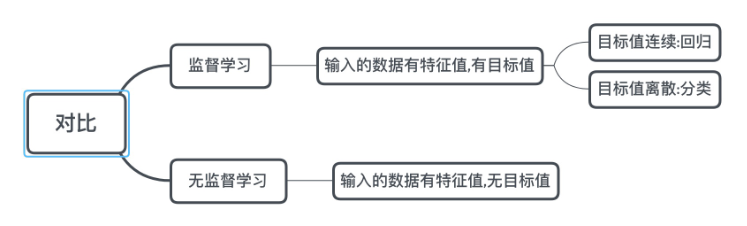

### 3 半监督学习 有一部分标记数据

- 定义：
    - 训练集同时包含有标记样本数据和未标记样本数据。

举例：

- 监督学习训练方式：

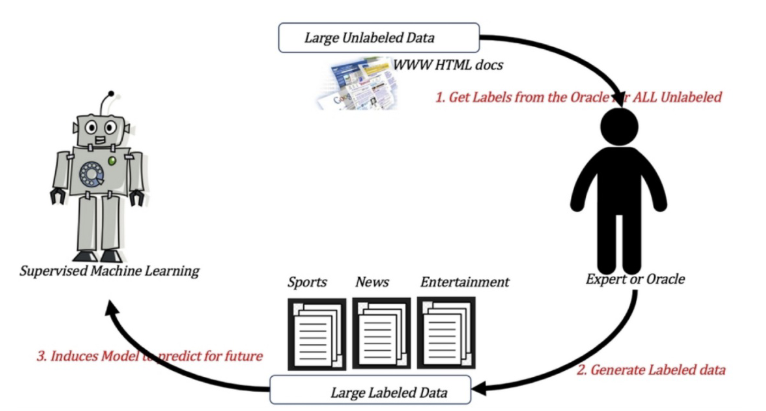

- 半监督学习训练方式

    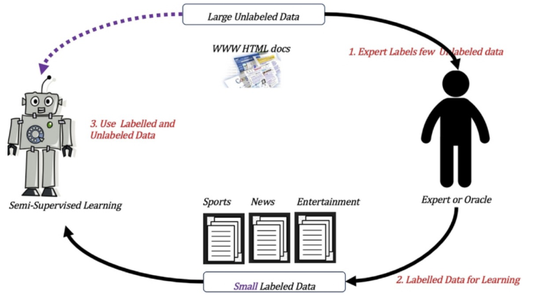

### 4 强化学习  自动决策

- 定义：
    实质是make decisions 问题，即自动进行决策，并且可以做连续决策。

    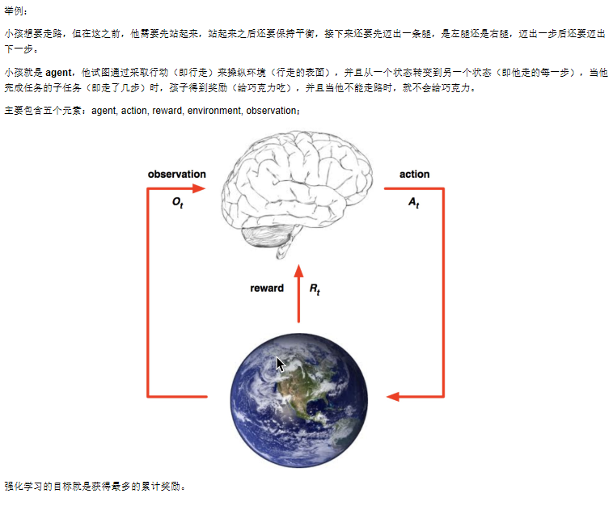

#### 监督学习和强化学习对比

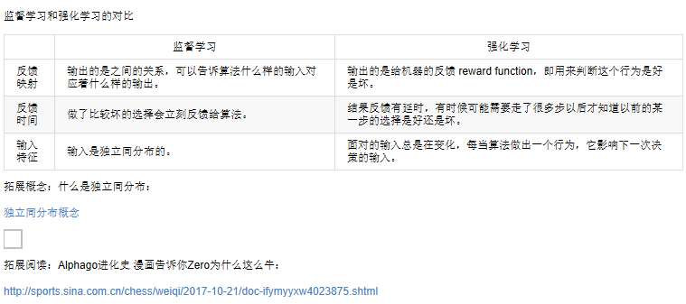

### 5 小结

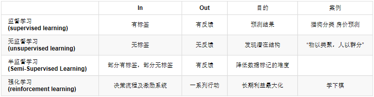

### 6 模型评估

##### 1 分类模型评估

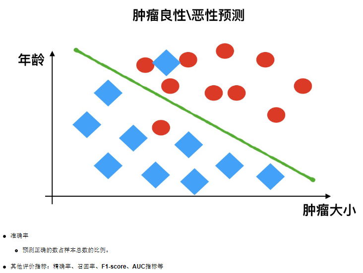

##### 2 回归模型评估

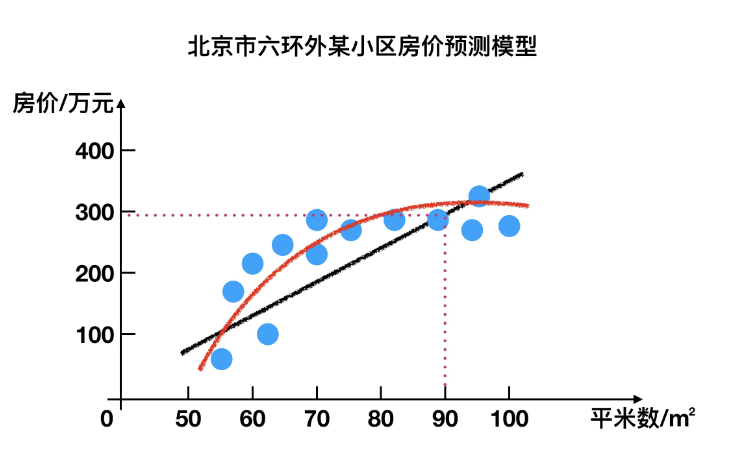

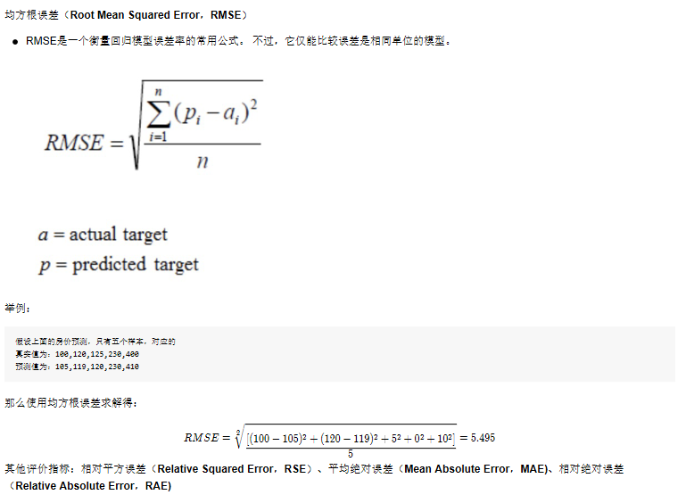

##### 3 拟合

模型评估用于评价训练好的的模型的表现效果，其表现效果大致可以分为两类：过拟合、欠拟合。
在训练过程中，你可能会遇到如下问题：
训练数据训练的很好啊，误差也不大，为什么在测试集上面有问题呢？
当算法在某个数据集当中出现这种情况，可能就出现了拟合问题。

###### 欠拟合

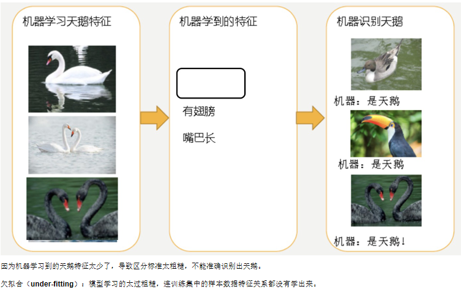

###### 过拟合

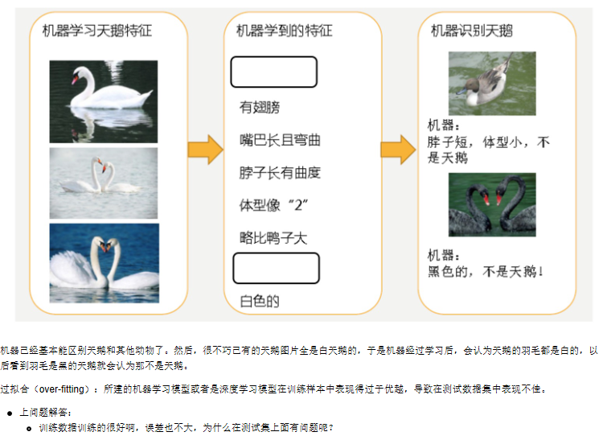

### 8 深度学习简介

深度学习（Deep Learning）（也称为深度结构学习【Deep Structured Learning】、层次学习【Hierarchical Learning】或者是深度机器学习【Deep Machine Learning】）是一类算法集合，是机器学习的一个分支。

