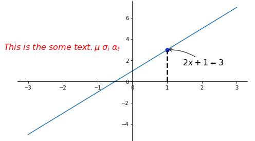
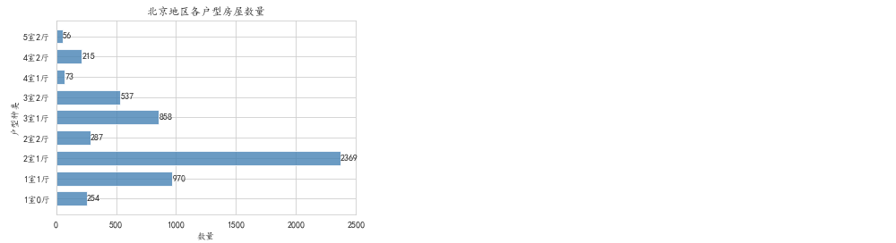

[tutorials/matplotlibTUT at master · MorvanZhou/tutorials (github.com)](https://github.com/MorvanZhou/tutorials/tree/master/matplotlibTUT)

# 一 matplotlib的基本使用

##  1.什么是Matplotlib

是专门用于开发2D图表(包括3D图表)
以渐进、交互式方式实现数据可视化


## 2 为什么要学习Matplotlib

可视化是在整个数据挖掘的关键辅助工具，可以清晰的理解数据，从而调整我们的分析方法。
能将数据进行可视化,更直观的呈现
使数据更加客观、更具说服力

matplotlib.pytplot包含了一系列类似于matlab的画图函数。
`import matplotlib.pyplot as plt`


## 3 图形绘制流程：

### 1.创建画布 -- plt.figure()	figsize	dpi

```python
    figsize:指定图的长宽  (10,8) 1000X800
    dpi:图像的清晰度
    返回fig对象
plt.figure(figsize=(), dpi=)
```

### 2.绘制折线图图像 -- plt.plot(x, y)

`plt.plot([1, 2, 3, 4, 5, 6 ,7], [17,17,18,15,11,11,13])`

### 3.显示图像 -- plt.show()

```python
import matplotlib.pyplot as plt
# 1.创建画布
plt.figure(figsize=(10, 10), dpi=100)
# 2.绘制折线图
plt.plot([1, 2, 3, 4, 5, 6 ,7], [17,17,18,15,11,11,13])
# 3.显示图像
plt.show()
```


## 画存在的图像(PIL读取图片)

```python
from PIL import Image
image = Image.open('./img/71479714_p0.jpg')
```

> pil显示图片(外部显示)

```pyton
image.show()
```

> plt显示

```python
plt.figure(figsize=(10,8))
plt.axis('off') # 不显示坐标轴
plt.title('黄前久美子')
plt.imshow(image)
# 解决中文显示问题
plt.rcParams['font.sans-serif'] = ['KaiTi']  # 指定默认字体
plt.rcParams['axes.unicode_minus'] = False  # 解决保存图像是负号'-'显示为方块的问题
plt.show()
```


> 得到图片信息

```python
print(type(image))
print(image.size)  				#图片的尺寸
print(image.mode)  				#图片的模式
print(image.format)  			#图片的格式
print(image.getpixel((0,0)))	#得到像素：
```


> image.getpixel((宽, 高))

```python
print(image.getpixel((0,0)))	#得到像素
# (188, 225, 254)
```

### 将 PIL Image 图片转换为 numpy 数组 np.array(image) [高, 宽,通道]

```python
img = np.array(image)
img

# array([[[188, 225, 254],
#         [188, 225, 254],
#         [188, 225, 254],
#         ...,
#         [188, 225, 254],
#         [188, 225, 254],
#         [188, 225, 254]],
#        ...
```

> numpy image 查看图片信息 .shape .dtypes

```python
print(img.shape)
print(img.dtype)

# (1654, 1048, 3)
# uint8
```

> numpy数据可以直接被画图 通道为 [高, 宽, 通道]

```python
plt.figure(figsize=(9, 16))
plt.imshow(img)
plt.axis('off')
plt.show()
```


> 将 numpy 数组转换为 PIL 图片  Image.fromarray(数组)

```python
new_img = Image.fromarray(img)

plt.figure(figsize=(9, 16))
plt.imshow(new_img)
plt.axis('off')
plt.show()
```


## Matplotlib图像结构


# 二 实现基础绘图

## 1 中文显示问题解决

### 解决方案一：

下载中文字体（黑体，看准系统版本）
步骤一：下载 SimHei 字体（或者其他的支持中文显示的字体也行）

步骤二：安装字体
linux下：拷贝字体到 usr/share/fonts 下：
`sudo cp ~/SimHei.ttf /usr/share/fonts/SimHei.ttf`
windows和mac下：双击安装

步骤三：删除~/.matplotlib中的缓存文件

```bash
cd ~/.matplotlib
rm -r *
```


步骤四：修改配置文件matplotlibrc
`vi ~/.matplotlib/matplotlibrc`
将文件内容修改为：

```bash
font.family         : sans-serif
font.sans-serif     : SimHei
axes.unicode_minus  : False
```


### 解决方案二：

在Python脚本中动态设置matplotlibrc,这样也可以避免由于更改配置文件而造成的麻烦，具体代码如下：

```python
from pylab import mpl
# 设置显示中文字体
mpl.rcParams["font.sans-serif"] = ["SimHei"]
```

有时候，字体更改后，会导致坐标轴中的部分字符无法正常显示，此时需要更改axes.unicode_minus参数：

```python
# 设置正常显示符号
mpl.rcParams["axes.unicode_minus"] = False
```


### 解决方案三:

```python
# 解决中文显示问题
plt.rcParams['font.sans-serif'] = ['KaiTi']  # 指定默认字体
plt.rcParams['axes.unicode_minus'] = False  # 解决保存图像是负号'-'显示为方块的问题
# 3.显示图像
plt.show()
```


## 2 xlabel() ylabel() title() 添加描述信息	

添加x轴、y轴描述信息及标题

> 通过fontsize参数可以修改图像中字体的大小

```python
plt.xlabel("时间")
plt.ylabel("温度")
plt.title("中午11点0分到12点之间的温度变化图示", fontsize=20)
```


## 3 xticks() yticks() 添加刻度值  

添加自定义x,y刻度

plt.xticks(x, **kwargs)
x:要显示的刻度值

plt.yticks(y, **kwargs)
y:要显示的刻度值

```python
# 增加以下两行代码
# 构造x轴刻度标签
x_ticks_label = ["11点{}分".format(i) for i in x]		这里必须用 format 
# 构造y轴刻度
y_ticks = range(40)
# 修改x,y轴坐标的刻度显示
# 坐标刻度不可以直接通过字符串修改,直接是数字可以修改
plt.xticks(x[::5], x_ticks_label[::5])
plt.yticks(y_ticks[::5])
```


## 4 xlim() ylim() x,y轴数字显示	

```python
plt.ylim([0, 200])

ax1.set_ylim([0, 200])
```


## 5 grid() 添加网格显示	

为了更加清楚地观察图形对应的值

```python
# True 显示线
# linestyle 线的风格
# alpha 透明度
plt.grid(True, linestyle='--', alpha=0.5)
```


## 6 axis('off') 不显示坐标轴

```python
plt.axis('off') # 不显示坐标轴
```


## 7 刻度间隔

```python
import matplotlib.pyplot as plt
from matplotlib.pyplot import MultipleLocator   #从pyplot导入MultipleLocator类，这个类用于设置刻度间隔

plt.figure(figsize=(30, 15), dpi=100)
# 设置刻度间隔
x_major_locator=MultipleLocator(1)
y_major_locator=MultipleLocator(1)
ax=plt.gca()    # ax为两条坐标轴的实例
# 设置xy刻度
ax.xaxis.set_major_locator(x_major_locator)
ax.yaxis.set_major_locator(y_major_locator)


plt.legend(loc="best")  # 显示图例
plt.grid()
plt.title("compare")
plt.savefig("compare.png")
```


## 8 设置图形风格 color='r',linestyle='--', label="北京",linewidth=10,zorder=1

| 颜色字符 | 风格字符 |
| -------- | -------- |
| r        | 红       |
| g        | 绿       |
| b        | 蓝       |
| w        | 白色     |
| c        | 青色     |
| m        | 洋红     |
| y        | 黄色     |
| k        | 黑色     |
|          |          |

- linewidth: 线宽 简写lw
- zorder: 绘图顺序，其值越大，画上去越晚，线条的叠加就是在上面的

```python
plt.plot(x, y_beijing, color='r', linestyle='--', label="北京", linewidth=10)	
```

## 9 显示图例 label legend

> 注意：如果只在plt.plot()中设置label还不能最终显示出图例，还需要通过plt.legend()将图例显示出来。


 ```python
# 绘制折线图
plt.plot(x, y_shanghai, label="上海")
# 使用多次plot可以画多个折线
plt.plot(x, y_beijing, color='r', linestyle='--', label="北京")
# 显示图例
plt.legend(loc="best")
 ```

| Location String | Location Code |
| --------------- | ------------- |
| 'best'          | 0             |
| 'upper right'   | 1             |
| 'upper left'    | 2             |
| 'lower left'    | 3             |
| 'lower right'   | 4             |
| 'right'         | 5             |
| 'center left'   | 6             |
| 'center right'  | 7             |
| 'lower center'  | 8             |
| 'upper center'  | 9             |
| 'center'        | 10            |

```python
# 画出温度变化图
# 0.准备x, y坐标的数据
x = range(60)
y_shanghai = [random.uniform(15, 18) for i in x]
y_beijing = [random.uniform(1, 13) for i in x]


# 增加以下两行代码
# 构造x轴刻度标签
x_ticks_label = ["{}分".format(i) for i in x]
# 构造y轴刻度
y_ticks = range(40)

# 修改x,y轴坐标的刻度显示
# 坐标刻度不可以直接通过字符串修改,直接是数字可以修改
plt.xticks(x[::5], x_ticks_label[::5])
#plt.yticks(y_ticks[::5])


# 添加网格显示
# True 显示线
# linestyle 线的风格
# alpha 透明度
plt.grid(True, linestyle="--", alpha = 0.5)


# 添加描述信息
plt.xlabel("时间")
plt.ylabel("温度")
plt.title("中午11点--12点某城市温度变化图", fontsize=20)


# .绘制折线图
plt.plot(x, y_shanghai, label="shanghai")

# 绘制北京 同时可以设置样式
plt.plot(x, y_beijing, color="r", linestyle="--", label="北京")

# 显示图例
plt.legend(loc="best")

# 图像保存
plt.savefig("./img/test.png")

# 解决中文显示问题
plt.rcParams['font.sans-serif'] = ['KaiTi']  # 指定默认字体
plt.rcParams['axes.unicode_minus'] = False  # 解决保存图像是负号'-'显示为方块的问题
# 3.显示图像
plt.show()
```

## 10 tick 能见度


```python
import matplotlib.pyplot as plt
import numpy as np

x = np.linspace(-3, 3, 50)
y = 0.1*x

plt.figure()
plt.plot(x, y, linewidth=10, zorder=1)      # 层级为1
plt.ylim(-2, 2)

ax = plt.gca()
ax.spines['right'].set_color('none')
ax.spines['top'].set_color('none')
ax.spines['top'].set_color('none')
ax.xaxis.set_ticks_position('bottom')
ax.spines['bottom'].set_position(('data', 0))
ax.yaxis.set_ticks_position('left')
ax.spines['left'].set_position(('data', 0))

# 将坐标轴数值拿出来单独设置参数,防止被线挡住
for label in ax.get_xticklabels() + ax.get_yticklabels():
    label.set_fontsize(12)
    # set zorder for ordering the plot in plt 2.0.2 or higher
    #                   背景颜色           边缘颜色             背景不透明度   层级是2
    label.set_bbox(dict(facecolor='white', edgecolor='none', alpha=0.8, zorder=2))
plt.show()
```


## 11 text() 添加数据在图标显示	

> 参数

- x轴坐标
- y轴坐标
- 显示的内容
- fontdict={'size': 16, 'color': 'r'} 字体调整

```python
house_type1 = show_houses['户型']
house_type_num = show_houses['数量']

# 横向条形图
# 
plt.barh(house_type1, house_type_num, height=0.7, color='steelblue', alpha=0.8)

# 把x轴坐标延长到2500
plt.xlabel("数量")
plt.ylabel("户型种类")
plt.title("北京地区各户型房屋数量")

# 给每个柱子加数字
for x, y in enumerate(house_type_num):

    plt.text(y + 0.2, x - 0.1, '%s' % y, fontdict={'size': 16, 'color': 'r'})
    
# 解决中文显示问题
plt.rcParams['font.sans-serif'] = ['KaiTi']  # 指定默认字体
plt.rcParams['axes.unicode_minus'] = False  # 解决保存图像是负号'-'显示为方块的问题
plt.show()
```


## 12 annotation 标注

```python
import matplotlib.pyplot as plt
import numpy as np

x = np.linspace(-3, 3, 50)
y = 2*x + 1

plt.figure(num=1, figsize=(8, 5),)
plt.plot(x, y,)

# 挪动坐标轴
ax = plt.gca()
ax.spines['right'].set_color('none')
ax.spines['top'].set_color('none')
ax.spines['top'].set_color('none')
ax.xaxis.set_ticks_position('bottom')
ax.spines['bottom'].set_position(('data', 0))
ax.yaxis.set_ticks_position('left')
ax.spines['left'].set_position(('data', 0))

x0 = 1
y0 = 2*x0 + 1

# 从x0 y0 到 0 y0           # k-- 代表黑色虚线
plt.plot([x0, x0,], [0, y0,], 'k--', linewidth=2.5)
# 散点图
plt.scatter([x0, ], [y0, ], s=50, color='b')

# method 1:
#####################
#             文字   y0指的是%s, 坐标,       基准坐标,        文本显示位置,基于文字坐标移动
plt.annotate(r'$2x+1=%s$' % y0, xy=(x0, y0), xycoords='data', xytext=(+30, -30),
             # 文字坐标
             textcoords='offset points', fontsize=16,
             # 箭头           类型            连接方式
             arrowprops=dict(arrowstyle='->', connectionstyle="arc3,rad=.2"))

# method 2:
########################
#         x    y   值
plt.text(-3.7, 3, r'$This\ is\ the\ some\ text. \mu\ \sigma_i\ \alpha_t$',	# 正则表达式
         fontdict={'size': 16, 'color': 'r'})

plt.show()
```



## 13 savefig() 图像保存

```python
# 保存图片到指定路径
plt.savefig("test.png")
```

> 注意：plt.show()会释放figure资源，如果在显示图像之后保存图片将只能保存空图片。

```python
import matplotlib.pyplot as plt
import random
from pylab import mpl

# 设置显示中文字体
mpl.rcParams["font.sans-serif"] = ["SimHei"]

# 设置正常显示符号
mpl.rcParams["axes.unicode_minus"] = False

# 0.准备数据
x = range(60)
y_shanghai = [random.uniform(15, 18) for i in x]

# 1.创建画布
plt.figure(figsize=(20, 8), dpi=100)

# 2.绘制图像
plt.plot(x, y_shanghai)

# 2.1 添加x,y轴刻度
# 构造x,y轴刻度标签
# 坐标刻度不可以直接通过字符串修改,直接是数字可以修改
x_ticks_label = ["11点{}分".format(i) for i in x]
y_ticks = range(40)
# 刻度显示
plt.xticks(x[::5], x_ticks_label[::5])
plt.yticks(y_ticks[::5])

# 2.2 添加网格显示
# True 显示线
# linestyle 线的风格
# alpha 透明度
plt.grid(True, linestyle="--", alpha=0.5)

# 2.3 添加描述信息
plt.xlabel("时间")
plt.ylabel("温度")
plt.title("中午11点--12点某城市温度变化图", fontsize=20)

# 2.4 图像保存
plt.savefig("./img/test.png")

# 3.图像显示
plt.show()
```

## 14 Matplotlib显示

在OpenCV的Python绑定中，图像以BGR顺序表示为NumPy数组。使用该`cv2.imshow`功能时效果很好。但是，如果打算使用Matplotlib，该`plt.imshow`函数将假定图像按RGB顺序排列。调用`cv2.cvtColor`解决此问题，也可以使用`opencv2matplotlib`便捷功能。

```python
img = cv.imread("lion.jpeg")
plt.figure()
plt.imshow(imutils.opencv2matplotlib(img))
```

## 15 gca 坐标轴

```python
import matplotlib.pyplot as plt
import numpy as np

x = np.linspace(-3, 3, 50)
y = 0.1*x

plt.figure()
plt.plot(x, y, linewidth=10, zorder=1)      # 层级是1
plt.ylim(-2, 2)

# 挪动坐标轴
ax = plt.gca()
ax.spines['right'].set_color('none')
ax.spines['top'].set_color('none')
ax.spines['top'].set_color('none')
ax.xaxis.set_ticks_position('bottom')
ax.spines['bottom'].set_position(('data', 0))
ax.yaxis.set_ticks_position('left')
ax.spines['left'].set_position(('data', 0))

# 将坐标轴数值拿出来单独设置参数,防止被线挡住
for label in ax.get_xticklabels() + ax.get_yticklabels():
    label.set_fontsize(12)
    # set zorder for ordering the plot in plt 2.0.2 or higher
    #                   背景颜色           边缘颜色             背景不透明度   层级是2
    label.set_bbox(dict(facecolor='white', edgecolor='none', alpha=0.8, zorder=2))

plt.show()
```


## 15 loss画图

```python
def loss_read():
    '''
    读取列表并画图
    '''

    with open('./records/loss.txt', mode='r', encoding='utf-8') as loss:
        lines = loss.readlines()

    # 没有数据直接返回
    if len(lines) == 0:
        return None

    # 去除空值和换行
    lines = [line for line in lines if line != '' and line !='\n' ]

    # 转化为float
    y = [eval(line) for line in lines]
    print(y)
    # [2, 3, 4, 6, 8, 5, 3, 0, 6, 5, 3, 2, 1]

    x = [i for i in range(len(y))]
    print('x: ', x)
    print('y: ', y)

    # 画图
    plt.figure(figsize=(16,9))
    plt.plot(x, y, color='red')

    # 标识坐标上的数字
    for a, b in list(zip(x, y)):
        # 参数1: x轴坐标
        # 参数2: y轴坐标
        # 参数3: 显示的内容
        #                保留2位小数
        plt.text(a, b, "{:.2f}".format(b))

    plt.grid()
    plt.xlabel('epoch')
    plt.ylabel('acc')
    plt.title('Loss')
    plt.ylim([0, 1])  # y轴数据
    plt.savefig('./records/loss.jpg')
    plt.show()
```


---

# 三 在一个坐标系中绘制多个图像

## 3.1 直接多次plot

```python
# 增加北京的温度数据
y_beijing = [random.uniform(1, 3) for i in x]
# 绘制折线图
plt.plot(x, y_shanghai)
# 使用多次plot可以画多个折线
plt.plot(x, y_beijing, color='r', linestyle='--')
```

## 3.2 subplot

### subplot显示图片

> 以下img是通过 OpenCV获取到的,所以是 bgr,要转换成rgb

```python
import matplotlib.pyplot as plt

# 4.图像显示
plt.figure(figsize=(10, 8), dpi=100)	#这一行可以不要
# rgb => bgr
plt.subplot(131), plt.imshow(img[:, :, ::-1]), plt.title('原图')
plt.subplot(132), plt.imshow(erosion[:, :, ::-1]), plt.title('腐蚀')
plt.subplot(133), plt.imshow(dilate[:, :, ::-1]), plt.title('膨胀')

# 解决中文显示问题
plt.rcParams['font.sans-serif'] = ['KaiTi']  # 指定默认字体
plt.rcParams['axes.unicode_minus'] = False  # 解决保存图像是负号'-'显示为方块的问题
plt.show()
```


### subplot显示灰度图片

```python
import matplotlib.pyplot as plt

# 5.图像显示
plt.figure(figsize=(10, 8), dpi=100)	#这一行可以不要
# 221 一共两行两列,这是第一个
# 这里两个语句换行写也没问题
plt.subplot(221), plt.imshow(img, cmap=plt.cm.gray), plt.title('原图')
#plt.xticks([]), plt.yticks([])
# 221 一共两行两列,这是第二个
plt.subplot(222), plt.imshow(result, cmap=plt.cm.gray), plt.title('Sobel滤波后结果')

# 221 一共两行两列,这是第三个
plt.subplot(223), plt.imshow(img, cmap=plt.cm.gray), plt.title('原图')
# 221 一共两行两列,这是第四个
plt.subplot(224), plt.imshow(result1, cmap=plt.cm.gray), plt.title('Scharr滤波后结果')


# 解决中文显示问题
plt.rcParams['font.sans-serif'] = ['KaiTi']  # 指定默认字体
plt.rcParams['axes.unicode_minus'] = False  # 解决保存图像是负号'-'显示为方块的问题
plt.show()
```

### analyze_feature_map示例

```python
#-----------------------------------------------#
#   绘制不同特征层处理的图像
#-----------------------------------------------#

import torch
from torchvision.models import efficientnet_b3
import matplotlib.pyplot as plt
import numpy as np
from PIL import Image
from torchvision import transforms

# 预处理
data_transform = transforms.Compose([
            transforms.Resize(int(224*1.25)),
            transforms.RandomCrop((224, 224)),
            transforms.ToTensor(),
            transforms.Normalize([0.485, 0.456, 0.406],
                                [0.229, 0.224, 0.225])
        ])

# create model
model = efficientnet_b3(num_classes=50)
# load model weights
model_weight_path = "./efficientnet_v1_b3_pt_sche_best_model.pkl"
model.load_state_dict(torch.load(model_weight_path))
print(model)

# load image
img = Image.open("./15-0181.jpg")
# [N, C, H, W]
img = data_transform(img)
# expand batch dimension
img = torch.unsqueeze(img, dim=0)

# forward 5次下采样后的最终计算结果
features = model.features
out_put = []
x = features[0:2](img)  # 112
out_put.append(x)
x = features[2:3](x)    # 56
out_put.append(x)
x = features[3:4](x)    # 28
out_put.append(x)
x = features[4:6](x)    # 14
out_put.append(x)
x = features[6:8](x)    # 7
out_put.append(x)


for feature_map in out_put:
    # [N, C, H, W] -> [C, H, W]
    im = np.squeeze(feature_map.detach().numpy())
    # [C, H, W] -> [H, W, C]
    im = np.transpose(im, [1, 2, 0])

    #----------------------------------------------#
    # show top 12 feature maps 显示前12个
    #----------------------------------------------#
    plt.figure(figsize=(8,8), dpi=100)
    for i in range(12):
        ax = plt.subplot(3, 4, i+1) # 3行4列 第i+1张
        # [H, W, C]
        # plt.imshow(im[:, :, i], cmap='gray')  # 灰色
        plt.imshow(im[:, :, i])                 # 蓝绿色
    plt.show()

```

## 3.5 subplots nrows ncols

> 可以通过subplots函数实现(旧的版本中有subplot，使用起来不方便)，推荐subplots函数

> matplotlib.pyplot.subplots(nrows=1, ncols=1, **fig_kw) 创建一个带有多个axes(坐标系/绘图区)的图
>
> Parameters:    

- nrows, ncols : 设置有几行几列坐标系

> Returns:    

fig : 图对象
axes : 返回相应数量的坐标系

```python
fig, axes = plt.subplots(nrows=1, ncols=2, figsize=(20, 8), dpi=100)
```

> 注意：plt.函数名()相当于面向过程的画图方法，axes.set_方法名()相当于面向对象的画图方法。

### 显示图片

```python
axes[0].imshow(img)
axes[0][1].imshow(img)
```


### 设置标题等方法不同	set_xticks	set_xticklabels

```python
set_xticks
set_yticks
set_xticklabels	
set_yticklabels	

# 2.1 添加x,y轴刻度
# 构造x,y轴刻度标签
x_ticks_label = ["11点{}分".format(i) for i in x]
y_ticks = range(40)
axes[0].set_xticks(x[::5])
axes[0].set_yticks(y_ticks[::5])
axes[0].set_xticklabels(x_ticks_label[::5])
axes[1].set_xticks(x[::5])
axes[1].set_yticks(y_ticks[::5])
axes[1].set_xticklabels(x_ticks_label[::5])
```

### 设置网格	grid

```python
# 2.2添加网格,不需要set_
axes[0].grid(True, linestyle="--", alpha = 0.5)
axes[1].grid(True, linestyle="--", alpha = 0.5)
```

### 添加描述信息 set_xlabel 	set_title

```python
# 2.3添加描述信息
axes[0].set_xlabel('时间')
axes[0].set_ylabel('温度')
axes[0].set_title('中午11点--12点上海温度变化图', fontsize=20)

axes[1].set_xlabel('时间')
axes[1].set_ylabel('温度')
axes[1].set_title('中午11点--12点北京温度变化图', fontsize=20)
```

### 显示图例 legend

```python
# 2.4显示图例
axes[0].legend(loc="best")
axes[1].legend(loc="best")
```


### 图像保存 plt.savefig

```python
# 和保存单图片相同
plt.savefig('./img/multi.pgn')
```

```python
# 0.准备数据
x = range(60)
y_shanghai = [random.uniform(15, 18) for i in x]
y_beijing = [random.uniform(1, 5) for i in x]

# 1.创建画布
# plt.figure(figsize=(20, 8), dpi=100)
fig, axes = plt.subplots(nrows=1, ncols=2, figsize=(20, 8), dpi=100)


# 2.绘制图像
# plt.plot(x, y_shanghai, label="上海")
# plt.plot(x, y_beijing, color="r", linestyle="--", label="北京")
axes[0].plot(x, y_shanghai, label="上海")
axes[1].plot(x, y_beijing, color="r", linestyle="--", label="北京")


# 2.1 添加x,y轴刻度
# 构造x,y轴刻度标签
x_ticks_label = ["11点{}分".format(i) for i in x]
y_ticks = range(40)
axes[0].set_xticks(x[::5])
axes[0].set_yticks(y_ticks[::5])
axes[0].set_xticklabels(x_ticks_label[::5])
axes[1].set_xticks(x[::5])
axes[1].set_yticks(y_ticks[::5])
axes[1].set_xticklabels(x_ticks_label[::5])


# 2.2添加网格,不需要set_
axes[0].grid(True, linestyle="--", alpha = 0.5)
axes[1].grid(True, linestyle="--", alpha = 0.5)


# 2.3添加描述信息
axes[0].set_xlabel('时间')
axes[0].set_ylabel('温度')
axes[0].set_title('中午11点--12点上海温度变化图', fontsize=20)

axes[1].set_xlabel('时间')
axes[1].set_ylabel('温度')
axes[1].set_title('中午11点--12点北京温度变化图', fontsize=20)


# 2.4显示图例
axes[0].legend(loc="best")
axes[1].legend(loc="best")


# 解决中文显示问题
plt.rcParams['font.sans-serif'] = ['KaiTi']  # 指定默认字体
plt.rcParams['axes.unicode_minus'] = False  # 解决保存图像是负号'-'显示为方块的问题


# 保存多图像,和单图像方式相同
plt.savefig('./img/multi.png')

# 3.显示图像
plt.show()
```

### 固定row的长度,使用整数和求取即可


> n行一列,选择位置
>
> row = i // row_number
>
> col = i % row_number

```python
def draw_multi(images, titles, row_number=4):
    '''
    画图,多张
    images: [n, h, w, 3]
    titles: [n]
    '''

    # 显示图像
    fig, axes = plt.subplots(nrows=2, ncols=4, figsize=(20, 8), dpi=100)

    for i in range(len(images)):
        # print(images[i].size()) # torch.Size([3, 224, 224])
        # print(targets[i])       # tensor(6)  单个值,没有形状

        image = images[i]
        title = titles[i]

        # 4行一列,选择位置
        row = i // row_number
        col = i % row_number
        # print(row, col)

        axes[row][col].imshow(image)
        # 添加title
        axes[row][col].set_title(title)


    # 解决中文显示问题
    plt.rcParams['font.sans-serif'] = ['KaiTi']  # 指定默认字体
    plt.rcParams['axes.unicode_minus'] = False   # 解决保存图像是负号'-'显示为方块的问题
    plt.show()
```


## 3.6 其他方式显示多张图片	add_subplot	twinx

```python
# l 是 x轴下标  lx 是x下标文字
# 画图
fig = plt.figure(figsize=(10, 8), dpi=100)

# 显示折线图
ax1 = fig.add_subplot(111) 
ax1.plot(l, price, 'or-', label='价格')    # "or-" 显示那个小红圆点
for i,(_x,_y) in enumerate(zip(l,price)):
    plt.text(_x,_y,price[i])

# y轴数字显示
ax1.set_ylim([0, 200])
ax1.set_ylabel('价格')    
# 标签位置
plt.legend(loc='upper left')    


# 显示条形图
ax2 = ax1.twinx()  # 显示次坐标轴ax2=ax1.twinx()
plt.bar(l, num, alpha=0.3, color='green', label='数量')
ax2.set_ylabel('数量')
# 标签位置
plt.legend(loc="upper right")

# x轴坐标显示
plt.xticks(l,lx)

plt.show()
```


# 四 折线图的应用场景

- 呈现公司产品(不同区域)每天活跃用户数
- 呈现app每天下载数量
    呈现产品新功能上线后,用户点击次数随时间的变化
- 拓展：画各种数学函数图像
    - 注意：plt.plot()除了可以画折线图，也可以用于画各种数学函数图像

```python
import numpy as np
# 0 准备数据
x = np.linspace(-10, 10, 1000)
y = np.sin(x)

# 1.创建画布
plt.figure(figsize=(20,8), dpi=100)

# 2.绘制函数图像
plt.plot(x, y)
# 2.1网格显示
plt.grid()

# 3.显示图像
plt.show()
```


# 五 常见图形绘制	plt.???

## 折线图	plot

> 以折线的上升或下降来表示统计数量的增减变化的统计图
> 特点：能够显示数据的变化趋势，反映事物的变化情况。(变化)

​                                  圆点       设置线型为空，也即没有线连接点

api：plt.plot(x, y, color='red', marker='.', linestyle='')

color：w：white b：black  r：red g：green b：blue  c：cyan y：yellow m：magenta


> grid也能画点阵图

```python
a = np.array([0, 1, 2, 3])
b = np.array([2, 3, 4])
X, Y = np.meshgrid(a, b)
X, Y
# (array([[0, 1, 2, 3],
#         [0, 1, 2, 3],
#         [0, 1, 2, 3]]),
#  array([[2, 2, 2, 2],
#         [3, 3, 3, 3],
#         [4, 4, 4, 4]]))

plt.plot(X, Y, 
         color='red',
         marker='.',  # 设置点类型为圆点
         linestyle='')  # 设置线型为空，也即没有线连接点
plt.grid()
plt.show()
```


```python
x = np.linspace(0,1000,20)
y = np.linspace(0,500,20)

X,Y = np.meshgrid(x, y)

plt.plot(X, Y,
         color='limegreen',  # 设置颜色为limegreen
         marker='.',         # 设置点类型为圆点
         linestyle='')       # 设置线型为空，也即没有线连接点
plt.grid(True)
plt.show()
```


## 散点图	scatter

> 用两组数据构成多个坐标点，考察坐标点的分布,判断两变量之间是否存在某种关联或总结坐标点的分布模式。
> 特点：判断变量之间是否存在数量关联趋势,展示离群点(分布规律)

​                                                             透明度          点的形状           size大小

`plt.scatter(x, y, color='red', alpha=0.5, marker='x', s=50)`

```python
# 数据可视化
# x[:, 0] 所有行,第0列
# c=y 基于y分成不同类别
plt.scatter(x[:, 0], x[:, 1], c=y)
```


```python
# 0.准备数据
# 房屋面积数据：
x = [225.98, 247.07, 253.14, 457.85, 241.58, 301.01,  20.67, 288.64,
     163.56, 120.06, 207.83, 342.75, 147.9,  53.06, 224.72,  29.51,
     21.61, 483.21, 245.25, 399.25, 343.35]
# 房屋价格数据：
y = [196.63, 203.88, 210.75, 372.74, 202.41, 247.61,  24.9, 239.34,
     140.32, 104.15, 176.84, 288.23, 128.79,  49.64, 191.74,  33.1,
     30.74, 400.02, 205.35, 330.64, 283.45]

# 1.创建画布
plt.figure(figsize=(20, 8), dpi=100)

# 2.绘制散点图
plt.scatter(x, y)


plt.xlabel('房屋面积')
plt.ylabel('房屋价格')
plt.title('啊啊啊', fontsize=20)
plt.grid()


# 3.显示图像
plt.show()
```


```python
x = np.linspace(0,1000,20)
y = np.linspace(0,500,20)

X,Y = np.meshgrid(x, y)       

#                 透明度      点的标志
plt.scatter(X, Y, alpha=0.5,  marker='.')
plt.grid(True)
plt.show()
```


## 柱状图	bar

> 排列在工作表的列或行中的数据可以绘制到柱状图中。
>
> 特点：绘制连离散的数据,能够一眼看出各个数据的大小,比较数据之间的差别。(统计/对比)

plt.bar(x, width, align='center', **kwargs)

```python
Parameters:    
x : 	需要传递的数据
width : 柱状图的宽度
align : 每个柱状图的位置对齐方式
    {‘center’, ‘edge’}, optional, default: ‘center’
**kwargs :
color:选择柱状图的颜色
```

```python
# 0.准备数据
# 电影名字
movie_name = ['雷神3：诸神黄昏','正义联盟','东方快车谋杀案','寻梦环游记','全球风暴','降魔传','追捕','七十七天','密战','狂兽','其它']
# 横坐标
x = range(len(movie_name))
# 票房数据
y = [73853,57767,22354,15969,14839,8725,8716,8318,7916,6764,52222]

# 1.创建画布
plt.figure(figsize=(20, 8), dpi=100)

# 2.绘制柱状图  单独每个的颜色
plt.bar(x, y, width=0.5, color=['b','r','g','y','c','m','y','k','c','g','b'])

# 2.1修改x轴刻度显示
plt.xticks(x, movie_name, rotation=45)  # rotation=45 文字倾斜显示，防止覆盖，下图不是

# 2.2 添加网格显示
plt.grid(linestyle="--", alpha=0.5)

# 2.3 添加标题
plt.title("电影票房收入对比")

# 解决中文显示问题
plt.rcParams['font.sans-serif'] = ['KaiTi']  # 指定默认字体
plt.rcParams['axes.unicode_minus'] = False  # 解决保存图像是负号'-'显示为方块的问题
# 3.显示图像
plt.show()
```


## 直方图	hist

>  由一系列高度不等的纵向条纹或线段表示数据分布的情况。 一般用横轴表示数据范围，纵轴表示分布情况。
> 特点：绘制连续性的数据展示一组或者多组数据的分布状况(统计)

matplotlib.pyplot.hist(x, bins=None)

```python
Parameters:    
x : 需要传递的数据
bins : 组距
```

```python
# 生成均匀分布的随机数
x1 = np.random.normal(1.75, 1, 100000000)
# 画图看分布状况
# 1）创建画布
plt.figure(figsize=(20, 10), dpi=100)
# 2）绘制直方图
plt.hist(x1, 1000)
# 3）显示图像
plt.show()
```


## 饼图	pie

> 用于表示不同分类的占比情况，通过弧度大小来对比各种分类。
> 特点：分类数据的占比情况(占比)

plt.pie(x, labels=,autopct=,colors)

```python
Parameters:  
x:数量，自动算百分比
labels:每部分名称
autopct:占比显示指定%1.2f%%
colors:每部分颜色
shadow=True: x
```

> 例子

```python
# 因为是百分比所以要乘100
area_percentage = (area_cut_data['freqs'].values) * 100

labels  = ['30平米以下', '30-50平米', '50-70平米', '70-90平米','90-120平米','120-140平米','140-160平米','160平米以上']

plt.figure(figsize=(20, 8), dpi=100)
#plt.axes(aspect=1)    # 显示的是圆形,如果不加,是椭圆形
plt.pie(area_percentage, labels=labels, autopct='%.2f %%', shadow=True)
plt.legend(loc='upper right')
plt.show()
```


## 横向柱状图    barh

```python
house_type1 = show_houses['户型']
house_type_num = show_houses['数量']

# 横向条形图
plt.barh(house_type1, house_type_num, height=0.7, color='steelblue', alpha=0.8)

# 把x轴坐标延长到2500
plt.xlabel("数量")
plt.ylabel("户型种类")
plt.title("北京地区各户型房屋数量")


# 给每个柱子加数字
for x, y in enumerate(house_type_num):
    plt.text(y + 0.2, x - 0.1, '%s' % y)
    

# 解决中文显示问题
plt.rcParams['font.sans-serif'] = ['KaiTi']  # 指定默认字体
plt.rcParams['axes.unicode_minus'] = False  # 解决保存图像是负号'-'显示为方块的问题
plt.show()
```



## imshow 

day10 数字识别器

```python
# 每一行都是一副图片
train_image.iloc[0].values
```


```python
# 修改成默认形状
num = train_image.iloc[0].values.reshape(28, 28)

plt.imshow(num)
# 关掉轴
plt.axis('off')
plt.show()
```


## [复杂绘图](https://matplotlib.org/index.html)

