# 一 Numpy介绍

> Numpy（Numerical Python）是一个开源的Python科学计算库，用于快速处理任意维度的数组。
> Numpy支持常见的数组和矩阵操作。对于同样的数值计算任务，使用Numpy比直接使用Python要简洁的多。
> Numpy使用ndarray对象来处理多维数组，该对象是一个快速而灵活的大数据容器。

# 二 ndarray介绍 np.array([数组])

>  NumPy提供了一个N维数组类型ndarray，它描述了相同类型的“items”的集合。

```python
# 创建ndarray
score = np.array(
			[[80, 89, 86, 67, 79],
			[78, 97, 89, 67, 81],
			[90, 94, 78, 67, 74],
			[91, 91, 90, 67, 69],
			[76, 87, 75, 67, 86],
			[70, 79, 84, 67, 84],
			[94, 92, 93, 67, 64],
			[86, 85, 83, 67, 80]])
```


# 三 ndarray与Python原生list运算效率对比


# 四 ndarray的优势

## 4.1ndarray内存块

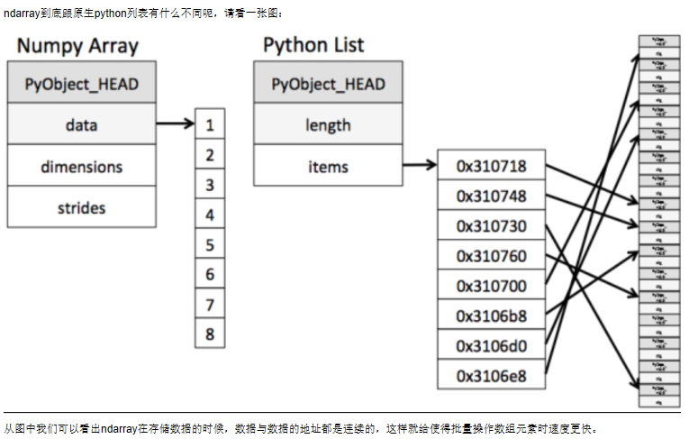

## 4.2 ndarray支持并行化运算（向量化运算）
numpy内置了并行运算功能，当系统有多个核心时，做某种计算时，numpy会自动做并行计算

## 4.3 效率远高于纯Python代码
Numpy底？层使用C语言编写，内部解除了GIL（全局解释器锁），其对数组的操作速度不受Python解释器的限制，所以，其效率远高于纯
Python代码。


# 五 N维数组-ndarray

## 1 ndarray的属性	shape	ndim	size	itemsize	dtype
数组属性反映了数组本身固有的信息。

| 属性名字         | 属性解释                   |
| ---------------- | -------------------------- |
| ndarray.shape    | 数组维度的元组,几行几列    |
| ndarray.ndim     | 数组维数                   |
| ndarray.size     | 数组中的元素数量           |
| ndarray.itemsize | 一个数组元素的长度（字节） |
| ndarray.dtype    | 数组元素的类型             |

## 2 ndarray的形状

```python
(2, 3)  	# 二维数组
(4,)    	# 一维数组
(2, 2, 3) 	# 三维数组
```

## 3 ndarray的类型 dtype

```python
type(a)
# type(a)

type(a.dtype)
# numpy.dtype
```

> dtype是numpy.dtype类型，先看看对于数组来说都有哪些类型

| 名称          | 描述                                              | 简写  |
| ------------- | ------------------------------------------------- | ----- |
| np.bool       | 用一个字节存储的布尔类型（True或False）           | 'b'   |
| np.int8       | 一个字节大小，-128 至 127                         | 'i'   |
| np.int16      | 整数，-32768 至 32767                             | 'i2'  |
| np.int32      | 整数，-2^31 至 2^32 -1                            | 'i4'  |
| np.int64      | 整数，-2^63 至 2^63 - 1                           | 'i8'  |
| np.uint8      | 无符号整数，0 至 255                              | 'u'   |
| np.uint16     | 无符号整数，0 至 65535                            | 'u2'  |
| np.uint32     | 无符号整数，0 至 2^32 - 1                         | 'u4'  |
| np.uint64     | 无符号整数，0 至 2^64 - 1                         | 'u8'  |
| np.float16    | 半精度浮点数：16位，正负号1位，指数5位，精度10位  | 'f2'  |
| np.float32    | 单精度浮点数：32位，正负号1位，指数8位，精度23位  | 'f4'  |
| np.float64    | 双精度浮点数：64位，正负号1位，指数11位，精度52位 | 'f8'  |
| np.complex64  | 复数，分别用两个32位浮点数表示实部和虚部          | 'c8'  |
| np.complex128 | 复数，分别用两个64位浮点数表示实部和虚部          | 'c16' |
| np.object_    | python对象                                        |       |
| np.string_    | 字符串                                            | 'S'   |
| np.unicode_   | unicode类型                                       | 'U'   |


 # 六 基本操作

## 1 生成数组的方法

### 1.1 生成0和1的数组	zeros	ones
- np.ones(shape, dtype)

 - np.ones_like(a, dtype)
 - np.zeros(shape, dtype)
 - np.zeros_like(a, dtype)

```python
np.ones((4, 8), dtype="int64")
np.zeros((3, 7), "int32")
```

 

### 1.2 从现有数组生成
#### 生成方式	np.array	np.asarray

> 从现有的数组当中创建,创建新数组

`np.array(object, dtype)`

> 相当于索引的形式，并没有真正的创建一个新的

`np.asarray(a, dtype)`


### 1.3 生成固定范围的数组

#### 1.3.1 等差-数量 np.linspace(start, stop, num, endpoint)

- 创建等差数组 — 指定数量
- 参数:
    - start:序列的起始值
    - stop:序列的终止值(包含)
    - num:要生成的等间隔样例数量，默认为50
    - endpoint:序列中是否包含stop值，默认为ture

```python
# 生成等间隔的数组
np.linspace(0, 100, 11)

# array([  0.,  10.,  20.,  30.,  40.,  50.,  60.,  70.,  80.,  90., 100.])
```


#### 1.3.2 等差-步长 np.arange(start, stop, step, dtype)

- 创建等差数组 — 指定步长
- 参数
    - start:序列的起始值
    - stop:序列的终止值(不包含)
    - step:步长,默认值为1


```python
np.arange(10, 50, 2)

# array([10, 12, 14, 16, 18, 20, 22, 24, 26, 28, 30, 32, 34, 36, 38, 40, 42, 44, 46, 48])

# 生成0~9
np.arange(10)
```

只有一个参数n, 结果从0到n-1

```python
np.arange(8)
# array([0, 1, 2, 3, 4, 5, 6, 7])
```


#### 1.3.3 等比 np.logspace(start, stop, num, endpoint,)

- 创建等比数列
- 参数:
    - start:**指数位**的起始值
    - stop:**指数位**的终止值(不包含)
    - num:要生成的等比数列数量，默认为50
    - endpoint: 序列中是否包含stop值，默认为ture
    - base: 以谁为底,默认为10


```python
# 生成10^x
np.logspace(0, 2, 3)
# [1. 10. 100.]

np.logspace(0, 2, 3, True, 2)
# [1. 2. 4.]
```

### 1.4 生成随机数组

#### 1.4.1 随机数种子 np.random.seed()

```python
np.random.seed(0)
```

#### 1.4.2 [0,1)均匀分布 np.random.rand(shape) 

rand函数根据给定维度生成[0,1)之间的数据，包含0，不包含1

```python
np.random.rand(2, 3)
# array([[0.3248705 , 0.65984683, 0.64359502],
#        [0.33185357, 0.00306095, 0.41077135]])

x0 = np.random.rand(100000000)
x0[:10]
# array([0.5456143 , 0.88312297, 0.32421148, 0.15401629, 0.67226434,
#        0.56196923, 0.16909588, 0.6796958 , 0.94886958, 0.28348645])
```

#### 1.4.3 [low, high)均匀分布 np.random.uniform(low, high, shape)

```python
np.random.uniform(-1, 1, (10, 3))
# array([[ 0.09405052,  0.494251  , -0.27938749],
#        [-0.17447803,  0.89270897,  0.29250855],
#        [ 0.3677955 ,  0.12627602,  0.32208686],
#        [ 0.36702947,  0.34117405, -0.58473068],
#        [ 0.47980737, -0.74443145,  0.0034732 ],
#        [-0.20931394, -0.02315332,  0.1463432 ],
#        [ 0.11810946, -0.28055895, -0.77494863],
#        [-0.65763925,  0.23662058, -0.85077936],
#        [-0.59779567, -0.25226129,  0.44606479],
#        [-0.89635932,  0.42718311,  0.7002187 ]])

x1 = np.random.uniform(-1, 1, 100000000)
# array([-0.29647219,  0.91746919,  0.69953847, -0.40651234, -0.66505026,
#        -0.50997519, -0.92903734, -0.69720143,  0.45621768, -0.20427129])

```

#### 1.4.4 [low,high)随机整数 np.random.randint(low, hight, shape)

\- 返回随机整数，范围区间为[low,high)，包含low，不包含high

\- 参数：low为最小值，high为最大值，size为数组维度大小，dtype为数据类型，默认的数据类型是np.int

\- high没有填写时，默认生成随机数的范围是[0，low)

```python
np.random.randint(1, 10, 10)
# array([2, 2, 2, 8, 7, 1, 2, 7, 1, 8])

x2 = np.random.randint(1, 100, 100000000)
x2[:10]
# array([34, 61, 17, 13, 87, 89, 94, 24, 23,  4])
```

#### 1.4.5 标准正态分布 np.random.randn(shape) 

```python
np.random.randn(5, 2)
# array([[ 0.97913651,  0.93566778],
#        [ 1.76129964, -1.05762828],
#        [-0.12451387, -0.34265781],
#        [ 0.2905087 ,  0.6055226 ],
#        [ 0.42451823,  0.74824112]])

x3 = np.random.randn(100000000)
x3[:10]
# array([-0.100373  ,  1.72954941,  0.21276524,  1.57384612,  0.52616906,
#         1.18571037,  0.59647072, -0.73832465,  0.84987623, -0.72266512])
```

#### 1.4.6 正态分布 np.random.normal(loc=0.0, scale=1.0, size=None)

```python
np.random.normal(-10, 10, (4, 3))
# array([[ -2.57807931,  -8.85365004,   6.14462005],
#        [-10.76978955,  10.54454598,  -7.53056653],
#        [ -4.12895711, -28.55533191,  -3.30968384],
#        [-11.6796023 , -12.84510772, -16.62350309]])

x4 = np.random.normal(10, 20, 100000000)
x4[:10]
# array([ 5.20721304, 10.12537702,  2.8987281 , -2.73548844,  1.43011466,
#       45.97980592, 17.56769003, 48.39749876, 18.70275014, 11.80587616])
```

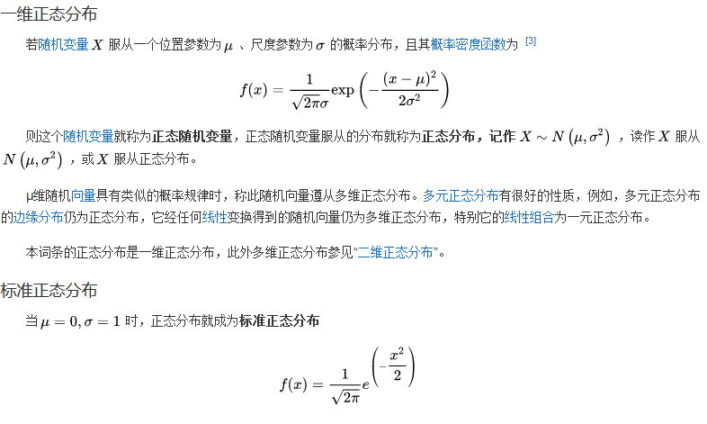

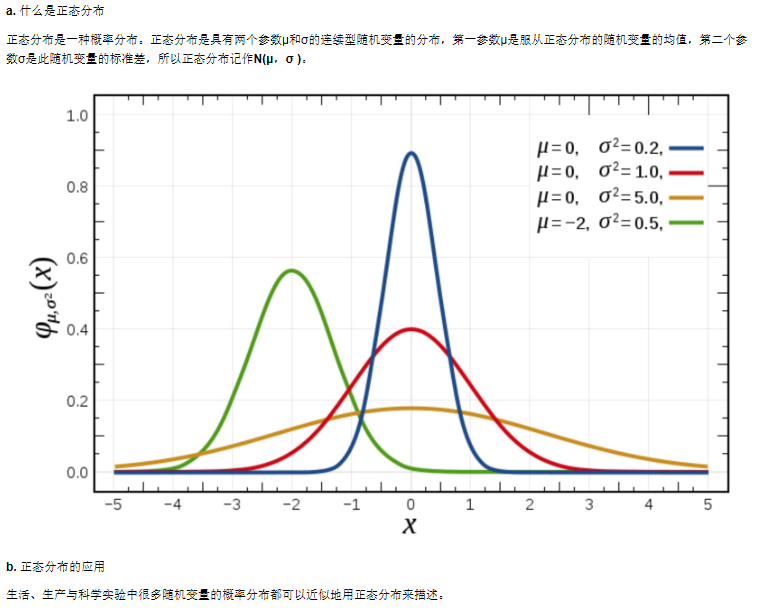

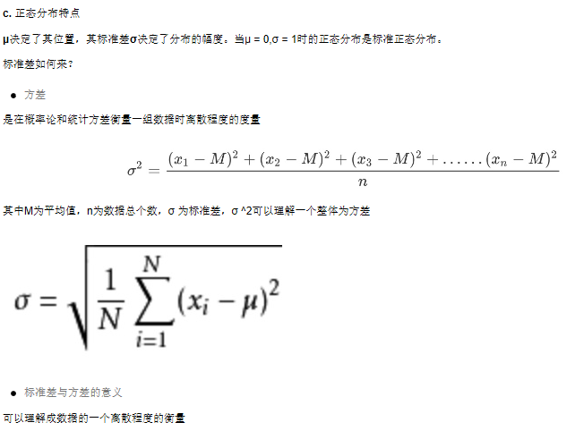


#### 1.4.7 np.random.choice

##### 随机选择一个数

```python
# [0, 5)中随机输出一个随机数
np.random.choice(5)
# 3
```

##### 随机选择多维数据

```python
# 在[0, 5)内输出五个数字并组成一维数组(ndarray)
np.random.choice(5, 3)
# 相当于np.random.randint(0, 5, 3)
# array([1, 0, 4])

# 在[0, 5)内输出五个数字并组成2维数组(ndarray)
np.random.choice(5, (3, 2))
# array([[0, 4],
#        [0, 4],
#        [2, 2]])
```

##### 从数组、列表或元组中随机抽取(必须为一维数据)

```python
x5 = np.random.randint(1, 10, 1000)
x5[:10]
# array([5, 8, 9, 7, 3, 9, 2, 4, 1, 6])

np.random.choice(x5, 10)
# array([9, 3, 1, 2, 2, 9, 8, 5, 7, 1])
```

#### 参数 replace True: 不取重复数据(默认) False:取重复数据

```python
np.random.choice(x5, 10, replace=False)
# array([5, 8, 3, 8, 8, 6, 3, 3, 1, 2])
```

##### 参数p 是个数组，大小(size)应该与指定的a相同，用来规定选取a中每个元素的概率，默认为概率相同

\- p 总和为0

```python
def softmax(x: np.ndarray, axis: int=0) -> np.ndarray:
    """将每个值求e的指数全都变为大于0的值，然后除以求指数之后的总和
        Softmax(x)_i = \frac {e^{x_i}} {{\sum_{j=1}^{n}} e^{x_j}}
    Args:
        x (np.ndarray): data
        axis (int, optional): 在哪个通道上计算. Defaults to 0.

    Returns:
        np.ndarray: softmax result
    """
    # 为了稳定地计算softmax概率， 一般会减掉最大的那个元素
    x -= np.max(x, axis=axis, keepdims=True)
    x = np.exp(x)
    return x / np.sum(x, axis=axis, keepdims=True)


p = np.random.uniform(0, 1, 1000)
p = softmax(p)
p[:10]
# array([0.00073921, 0.00138132, 0.00086981, 0.00092825, 0.00085867,
#        0.00156019, 0.00106837, 0.00108963, 0.00106499, 0.00063174])

np.random.choice(x5, 10, p=p)
```

## 2 添加新数据 append

> arr = np.append(arr, new_data)

```python
# np.array()这样添加
data = np.append(data, 10)

# py数组这样添加
data.append(10)
```


## 3 数组的索引、切片

### 索引 先行后列

```python
arr = np.array(
[[80, 89, 86, 67, 79],
[78, 97, 89, 67, 81],
[90, 94, 78, 67, 74],
[91, 91, 90, 67, 69],
[76, 87, 75, 67, 86],
[70, 79, 84, 67, 84],
[94, 92, 93, 67, 64],
[86, 85, 83, 67, 80]])
arr

# 先行后列
arr[1][0]
# 78

# 切片返回数组
arr[1:2, :1]
#array([[78]])
```


### 二维数组索引

> 直接进行索引,切片
> 对象[:, :] -- 先行后列

> 获取第一个股票的前3个交易日的涨跌幅数据

```python
stock_change = np.random.normal(0, 1, (4, 5))
# array([[ 0.0476585 ,  0.32421568,  1.50062162,  0.48230497, -0.59998822],
#       [-1.92160851,  2.20430374, -0.56996263, -1.44236548,  0.0165062 ],
#       [-0.55710486, -0.18726488, -0.39972172,  0.08580347, -1.82842225],
#       [-1.22384505, -0.33199305,  0.23308845, -1.20473702, -0.31753223]])

# 二维的数组，两个维度 
stock_change[0, 0:3]
# 返回结果：
# array([-0.03862668, -1.46128096, -0.75596237])
```

### 三维数组索引

```python
# 三维
a1 = np.array([ [[1,2,3],[4,5,6]], [[12,3,34],[5,6,7]]])
# 返回结果
# array([[[ 1,  2,  3],
#         [ 4,  5,  6]],
#         [[12,  3, 34],
#         [ 5,  6,  7]]])

a1[0, 0, 1]   # 输出: 2
```

### 通过[]取指定位置元素

```python
# numpy通过[]取指定位置元素
x = np.array([1, 2, 3, 4, 5])
print(x[[1, 3]])    # [2, 4]

# pytorch通过[]取指定位置元素
x = torch.tensor([1, 2, 3, 4, 5])
print(x[[1, 3]])    # tensor([2, 4])
```

## 5 形状修改

### 5.1 b = a.reshape(shape, order) 不改变实际数据

- 将数组变为一行,然后按照列数重新切断,分成不同行
- 返回一个具有相同数据域，但shape不一样的视图
- 行、列不进行互换
- 不修改原值

```python
# 在转换形状的时候，一定要注意数组的元素匹配
change.reshape([5, 4])

# 不知道多少行,每行10列
stock_change.reshape([-1,10])  # 数组的形状被修改为: (2, 10), -1: 表示通过待计算   必须整除
x = x.reshape(-1, 1)
```

```python
reshape(-1) 变为一行
```


### 5.2  a.resize(new_shape) 改变实际数据

- 将数组变为一行,然后按照列数重新切断,分成不同行
- 修改数组本身的形状（需要保持元素个数前后相同）
- 行、列不进行互换

```python
tock_change.resize([5, 4])
# 查看修改后结果
stock_change.shape
# (5, 4)
```

### 5.3  a.T a.transpose
- 数组的转置
- 将数组的行、列进行互换
- transpose(两个变量代表维度), 支持多维数组

```python
stock_change.T.shape
(4, 5)

# 转换选择的维度
stock_change.transpose(0, 1)
```


### 5.4 flatten 多维变一维

```python
# 二维变为一维,下面的observations也是一维的,因此要一样
seen.flatten()
```

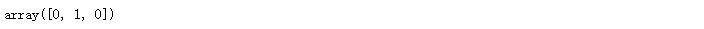


##  6 类型修改

### 6.1  数组.astype(type)
- 返回修改了类型之后的数组

```python
stock_change.astype(np.int32)
```

### 6.2  数组.tostring([order])或者ndarray.tobytes([order])

- 构造包含数组中原始数据字节的Python字节

```python
arr = np.array([[[1, 2, 3], [4, 5, 6]], [[12, 3, 34], [5, 6, 7]]])
arr.tobytes()
```


## 7 数组的去重	np.unique()

```python
temp = np.array([[1, 2, 3, 4],[3, 4, 5, 6]])
np.unique(temp)
# array([1, 2, 3, 4, 5, 6])
```


## 8 数组运算

### 8.1 逻辑运算 > < 

```python
# 生成10名同学，5门功课的数据
score = np.random.randint(40, 100, (10, 5))
# 取出最后每行5名同学的成绩，用于逻辑判断
test_score = score[6:, 0:5]
# 逻辑判断, 如果成绩大于60就标记为True 否则为False
test_score > 60
# array([[ True,  True,  True, False,  True],
#        [ True,  True,  True, False,  True],
#        [ True,  True, False, False,  True],
#        [False,  True,  True,  True,  True]])

# BOOL赋值, 将满足条件的设置为指定的值-布尔索引
test_score[test_score > 60] = 1
test_score
# array([[ 1,  1,  1, 52,  1],
#        [ 1,  1,  1, 59,  1],
#        [ 1,  1, 44, 44,  1],
#        [59,  1,  1,  1,  1]])
```


### 8.2 通用判断函数

#### np.all()

```python
# 判断前2名同学的成绩[0:2, :]是否全及格
np.all(score[0:2, :] > 60)
# False
```

#### np.any()

```python
# 判断前10名同学的成绩[0:2, :]是否有大于90分的
np.any(score[0:2, :] > 80)
# True
```


### 8.3 np.where（三元运算符）

通过使用np.where能够进行更加复杂的运算

#### np.where()

```python
# 判断前四名学生,前四门课程中，成绩中大于60的置为1，否则为0
temp = score[:4, :4]
np.where(temp > 60, 1, 0)
```

#### 复合逻辑需要结合np.logical_and和np.logical_or使用

```python
# 判断前四名学生,前四门课程中，成绩中大于60且小于90的换为1，否则为0
np.where(np.logical_and(temp > 60, temp < 90), 1, 0)
# 判断前四名学生,前四门课程中，成绩中大于90或小于60的换为1，否则为0
np.where(np.logical_or(temp > 90, temp < 60), 1, 0)
```


### 8.4 统计运算

#### 8.4.1 统计指标
在数据挖掘/机器学习领域，统计指标的值也是我们分析问题的一种方式。常用的指标如下：

##### min(a, axis, keepdims=True)    最小值 	

- Return the minimum of an array or minimum along an axis.

##### max(a, axis, keepdims=True)    最大值

- Return the maximum of an array or maximum along an axis.

##### median(a, axis, keepdims=True)    中位数

- Compute the median along the specified axis.

##### mean(a, axis, keepdims=True, dtype)    平均值

- Compute the arithmetic mean along the specified axis.

##### std(a, axis, keepdims=True, dtype)    标准差

- Compute the standard deviation along the specified axis.

##### var(a, axis, keepdims=True, dtype)    方差

- Compute the variance along the specified axis.

##### count() 总数

##### np.argmax(temp, axis=)	最大值下标

##### np.argmin(temp, axis=)    最小值下标


#### 8.4.2 案例：学生成绩统计运算

进行统计的时候，axis 轴的取值并不一定，Numpy中不同的API轴的值都不一样，在这里，axis 0代表列, axis 1代表行去进行统计

```python
# 接下来对于前四名学生,进行一些统计运算
# 指定列 去统计
temp = score[:4, 0:5]

# 这样只找出一个最大值
np.max(temp)

print("前四名学生,各科成绩的最大分：{}".format(np.max(temp, axis=0)))
print("前四名学生,各科成绩的最小分：{}".format(np.min(temp, axis=0)))
print("前四名学生,各科成绩波动情况：{}".format(np.std(temp, axis=0)))
print("前四名学生,各科成绩的平均分：{}".format(np.mean(temp, axis=0)))
```

结果：

```python
前四名学生,各科成绩的最大分：[96 97 72 98 89]
前四名学生,各科成绩的最小分：[55 57 45 76 77]
前四名学生,各科成绩波动情况：[16.25576821 14.92271758 10.40432602  8.0311892   4.32290412]
前四名学生,各科成绩的平均分：[78.5  75.75 62.5  85.   82.25]
```

如果需要统计出某科最高分对应的是哪个同学？

- np.argmax(temp, axis=)	最大值下标
- np.argmin(temp, axis=)    最小值下标

```python
print("前四名学生，各科成绩最高分对应的学生下标：{}".format(np.argmax(temp, axis=0)))
# 前四名学生，各科成绩最高分对应的学生下标：[0 2 0 0 1]
```


## 9 数组间运算

### 9.1 数组与数的运算

> 所有值都单独运算

```python
a = np.array([[1,2,3],[4,5,6]])
# array([[1, 2, 3],
#       [4, 5, 6]])

a + 4
# array([[ 5,  6,  7],
#       [ 8,  9, 10]])

a / 2
# array([[0.5, 1. , 1.5],
#       [2. , 2.5, 3. ]])
```


### 9.2 数组与数组的运算

```python
arr1 = np.array([[1, 2, 3, 4],[3,4,5,6]])
arr2 = np.array([[1, 2, 3, 4],[3,4,5,6]])
arr1 + arr2

# array([[ 2,  4,  6,  8],
#       [ 6,  8, 10, 12]])
```


```
arr1 = np.array([[1, 2, 3, 2, 1, 4], [5, 6, 1, 2, 3, 1]])
arr2 = np.array([[1, 2, 3, 4], [3, 4, 5, 6]])
```

上面这个能进行运算吗，结果是不行的！

#### 9.2.1 广播机制
数组在进行矢量化运算时，要求数组的形状是相等的。当形状不相等的数组执行算术运算的时候，就会出现广播机制，该机制会对数组进行扩
展，使数组的shape属性值一样，这样，就可以进行矢量化运算了。下面通过一个例子进行说明：

```python
arr1 = np.array([[0],[1],[2],[3]])
arr1.shape
# (4, 1)
arr2 = np.array([1,2,3])
arr2.shape
# (3,)
arr1+arr2
# 结果是：
array([[1, 2, 3],
       [2, 3, 4],
       [3, 4, 5],
       [4, 5, 6]])
```

上述代码中，数组arr1是4行1列，arr2是1行3列。这两个数组要进行相加，按照广播机制会对数组arr1和arr2都进行扩展，使得数组arr1和arr2都变成4行3列。
下面通过一张图来描述广播机制扩展数组的过程：

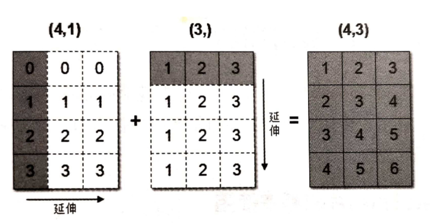

这句话乃是理解广播的核心。广播主要发生在两种情况，一种是两个数组的维数不相等，但是它们的后缘维度的轴长相符，另外一种是有一方
的长度为1。
广播机制实现了时两个或两个以上数组的运算，即使这些数组的shape不是完全相同的，只需要满足如下任意一个条件即可。

- 如果两个数组的后缘维度（trailing dimension，即从末尾开始算起的维度）的轴长度相符，
- 或其中的一方的长度为1。

广播会在缺失和（或）长度为1的维度上进行。
广播机制需要扩展维度小的数组，使得它与维度最大的数组的shape值相同，以便使用元素级函数或者运算符进行运算。

如果是下面这样，则不匹配：

```python
A  (1d array):  一维 10个	不等长,维度不为1
B  (1d array):  一维 12个
    
A  (2d array):  二维    2 x 1
B  (3d array):  三维    8 x 4 x 3
```


思考：下面两个ndarray是否能够进行运算？OK

```python
arr1 = np.array([[1, 2, 3, 2, 1, 4], [5, 6, 1, 2, 3, 1]])
arr2 = np.array([[1], [3]])

arr1 + arr2 
# array([[2, 3, 4, 3, 2, 5],
#        [8, 9, 4, 5, 6, 4]])
```


## 10 np.meshgrid() 网格

```python
a = np.array([0, 1, 2, 3])
b = np.array([2, 3, 4])
X, Y = np.meshgrid(a, b)
X, Y
# (array([[0, 1, 2, 3],
#         [0, 1, 2, 3],
#         [0, 1, 2, 3]]),
#  array([[2, 2, 2, 2],
#         [3, 3, 3, 3],
#         [4, 4, 4, 4]]))

plt.plot(X, Y, 
         color='red',
         marker='.',  # 设置点类型为圆点
         linestyle='')  # 设置线型为空，也即没有线连接点
plt.grid()
plt.show()
```

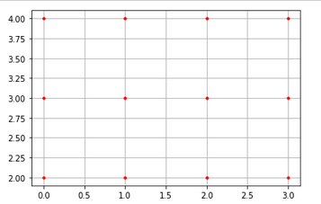

```python
x = np.linspace(0,1000,20)
y = np.linspace(0,500,20)

X,Y = np.meshgrid(x, y)

plt.plot(X, Y,
         color='limegreen',  # 设置颜色为limegreen
         marker='.',         # 设置点类型为圆点
         linestyle='')       # 设置线型为空，也即没有线连接点
plt.grid(True)
plt.show()
```

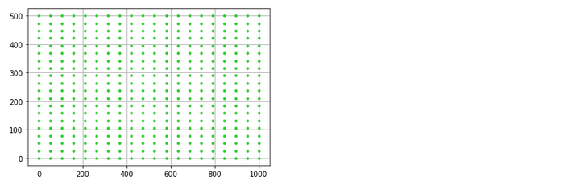

```python
x = np.linspace(0,1000,20)
y = np.linspace(0,500,20)

X,Y = np.meshgrid(x, y)       

#                 透明度      点的标志
plt.scatter(X, Y, alpha=0.5,  marker='.')
plt.grid(True)
plt.show()
```

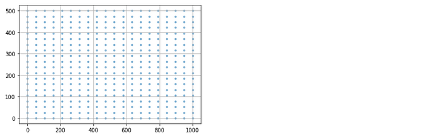

# 七 矩阵

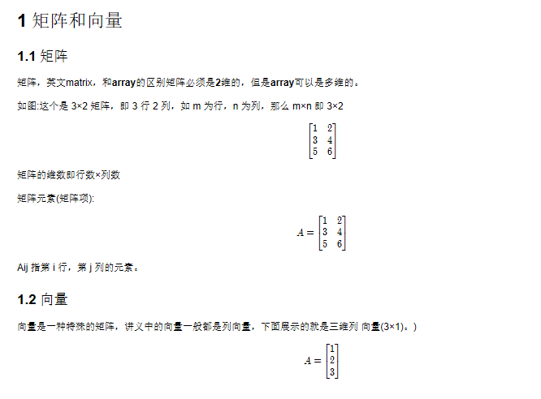

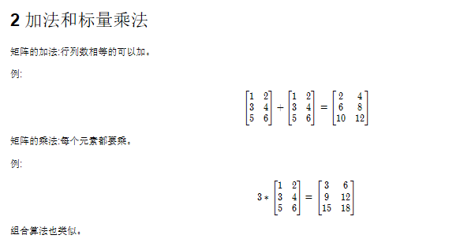

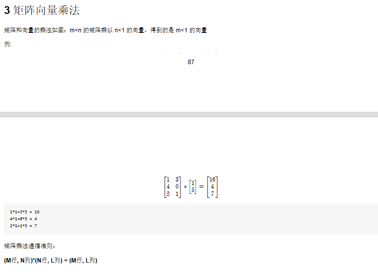

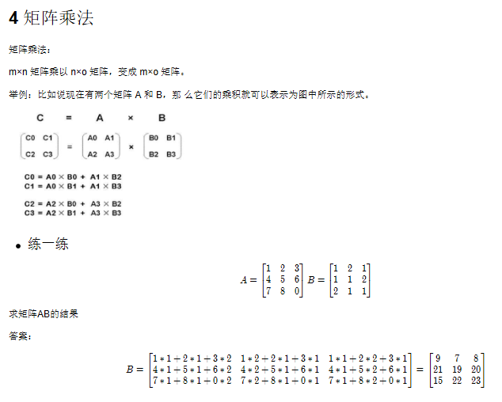

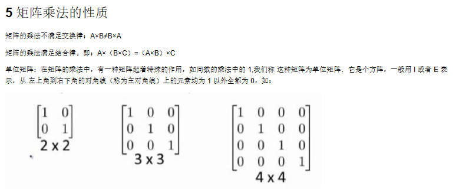

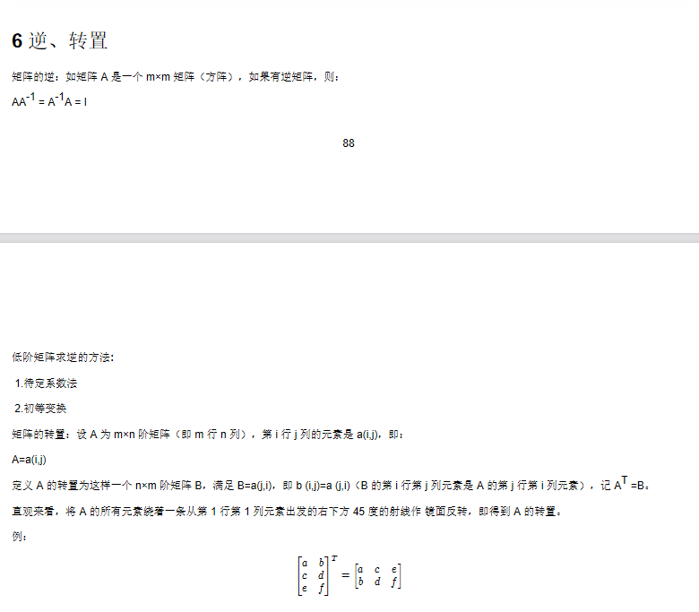

## 矩阵乘法api:	matmul	dot

**np.matmul**		矩阵和矩阵相乘
**np.dot**		   点乘, 支持矩阵和数字相乘

np.matmul和np.dot的区别:
	二者都是矩阵乘法。 np.matmul中禁止矩阵与标量的乘法。 在矢量乘矢量的內积运算中，np.matmul与np.dot没有区别。

```python
a = np.array([[80, 86],
              [82, 80],
              [85, 78],
              [90, 90],
              [86, 82],
              [82, 90],
              [78, 80],
              [92, 94]])

# b一定要写成这样, 里面的0.7和0.3不加中括号的话结果是一行,不是多行
b = np.array([[0.7], [0.3]])
np.matmul(a, b)
# array([[81.8],
#        [81.4],
#        [82.9],
#        [90. ],
#        [84.8],
#        [84.4],
#        [78.6],
#        [92.6]])

array([81.8, 81.4, 82.9, 90. , 84.8, 84.4, 78.6, 92.6])
# array([[81.8],
#        [81.4],
#        [82.9],
#        [90. ],
#        [84.8],
#        [84.4],
#        [78.6],
#        [92.6]])

c = 10
np.dot(c, a)
# array([[800, 860],
#        [820, 800],
#        [850, 780],
#        [900, 900],
#        [860, 820],
#        [820, 900],
#        [780, 800],
#        [920, 940]])

# 不支持标量和矩阵的乘法
np.matmul(c, a)
# 报错
```


# 八 numpy.ma

```
numpy.ma.masked_invalid 屏蔽出现无效值的数组（NaN 或 inf）
numpy.ma.compress_rows 压缩包含掩码值的2-D 数组的整行，将包含掩码值的整行去除
numpy.ma.compress_cols 压缩包含掩码值的2-D 数组的整l，将包含掩码值的整行去除
```


# 九 读取文件	loadtxt

```python
import numpy as np
import torch

# np 读取csv或者csv.gz文件
xy = np.loadtxt('../data/3.x/diabetes.csv.gz', delimiter=',', dtype=np.float32)

# torch从numpy获取数据
x_data = torch.from_numpy(xy[:, :-1])
y_data = torch.from_numpy(xy[:, [-1]])
print(x_data)
```


# stack()，hstack()，vstack()

## 1. stack()函数 

> 函数原型为：stack(arrays, axis=0)，arrays可以传数组和列表。axis的含义我下面会讲解，我们先来看个例子，然后我会分析输出结果。

```python
import numpy as np
a=[[1,2,3],
   [4,5,6]]
print("列表a如下：")
print(a)

print("增加一维，新维度的下标为0")
c=np.stack(a,axis=0)
print(c)

print("增加一维，新维度的下标为1")
c=np.stack(a,axis=1)
print(c)

输出：
列表a如下：
[[1, 2, 3], [4, 5, 6]]
增加一维，新维度下标为0
[[1 2 3]
 [4 5 6]]
增加一维，新维度下标为1
[[1 4]
 [2 5]
 [3 6]]
```

首先这里arrays我传的是一个列表，现在我开始讲解这个stack()函数的意思，它就是对arrays里面的**每个元素**(可能是个列表，元组，或者是个numpy的数组)变成numpy的数组后，再对**每个元素**增加一维(至于维度加在哪里，是靠axis控制的)，然后再把这些元素串起来(至于怎么串，我下面会说)。

**arrays里面的每个元素必须形状是一样的**，例如本例中列表a中的两个元素[1,2,3]和[4,5,6]的形状是一样的，如果把[4,5,6]换成[4,5] ，那么程序会报错！而axis代表的是在哪个维度上加一维，例如axis=0(**它是默认的**)代表的就是增加的这一维的下标为0，axis等于多少不是随便乱写的，如果参数arrays里面的每个元素是个1维的，那么调用stack()函数增加一维后会变成2维的，所以axis只能等于0和1（维度的下标是从0开始的），而参数axis=0和axis=1得到的结果是不一样的。

例如上面的代码中a列表中的第一个元素为[1,2,3]，那么当axis=0的时候，就是在它的中括号外面再加一个中括号，变成[ [1,2,3] ]**（其实1，2，3之间是没有逗号的，因为stack()函数会先把参数arrays中的每个元素变成numpy的数组，数组之间是没有逗号的，看看上面的代码输出就知道了，这里大家明白就行，我为了方便讲解，下面还会加上逗号）**，这样最外面那层中括号才代表维度下标为0的那维；当axis=1的时候，就是在里面加个中括号，变成了[ [1]，[2]，[3] ],这样里面加的那层中括号才代表维度下标为1的那维。同理当axis=0的时候[4,5,6]变成[ [ 4，5，6] ]，当axis=1的时候，变成[ [4]，[5]，[6] ]。下面我们讲如何把增加一维度后的每个元素串起来。

怎么把上面那两个元素增加维度后的结果串起来呢，其实很简单。现在我们已经知道了增加维度无非是增加中括号的意思，至于在哪里加中括号，取决于axis等于几。我们把增加的中括号想像成一个个的箱子。还拿上面的代码来说，**当axis=0**的时候，我们把套在[1,2,3]外面的中括号**(就是[ [1,2,3] ]最外层的那个中括号)**看做是箱子A，这个箱子A也会套在[4,5,6]的外面，所以我们就先把[1,2,3]和[4,5,6]放在一起，变成[1,2,3],[4,5,6]，然后再一起套上箱子A，变成[ [1,2,3],[4,5,6] ]这就是当axis=0的时候程序的输出结果。

现在再来看**当axis=1**的时候，对于[1，2，3]，我们把套在1外面的箱子**(就是上面讲的[ [1]，[2]，[3] ]中1外面的那层中括号)**看做A，套在2外面的看做B，套在3外面的看做C，同理，箱子A也会套在4的外面，箱子B也会套在5的外面，箱子C也会套在6的外面。那么我们就把1和4放一起，2和5放一起，3和6放一起，变成[ 1,4 ，2,5 ，3,6 ]然后把箱子A,B,C分别套在1,4 ， 2,5 ， 3,6的外面，变成[ [1,4] , [2,5] , [3,6] ]这就是程序中axis=1的时候程序的输出结果。

大家发现了没有，串起来的时候其实就是把arrays中每个元素在相同的位置套箱子的一些小块(这里叫小块这个名词可能不洽当，但是大家明白就行)放在一起后，再套箱子，就是外面套个中括号，这就是堆叠。

再看下面的代码的输出，测试下你理解的没有。

```python
import numpy as np
a=[[1,2,3,4],
   [5,6,7,8],
   [9,10,11,12]]
print("列表a如下：")
print(a)

print("增加一维，新维度的下标为0")
c=np.stack(a,axis=0)
print(c)

print("增加一维，新维度的下标为1")
c=np.stack(a,axis=1)
print(c)

输出：
列表a如下：
[[1, 2, 3, 4], [5, 6, 7, 8], [9, 10, 11, 12]]
增加一维，新维度的下标为0
[[ 1  2  3  4]
 [ 5  6  7  8]
 [ 9 10 11 12]]
增加一维，新维度的下标为1
[[ 1  5  9]
 [ 2  6 10]
 [ 3  7 11]
 [ 4  8 12]]
```

不知道和你想象的输出一样不一样，还有另一种情况，先看下面的代码。

```python
import numpy as np
a=[1,2,3,4]
b=[5,6,7,8]
c=[9,10,11,12]
print("a=",a)
print("b=",b)
print("c=",c)

print("增加一维，新维度的下标为0")
d=np.stack((a,b,c),axis=0)
print(d)

print("增加一维，新维度的下标为1")
d=np.stack((a,b,c),axis=1)
print(d)

输出：
('a=', [1, 2, 3, 4])
('b=', [5, 6, 7, 8])
('c=', [9, 10, 11, 12])
增加一维，新维度的下标为0
[[ 1  2  3  4]
 [ 5  6  7  8]
 [ 9 10 11 12]]
增加一维，新维度的下标为1
[[ 1  5  9]
 [ 2  6 10]
 [ 3  7 11]
 [ 4  8 12]]
```

你会发现输出结果和上面的代码一样，其实它俩就是一样的。只不过当你对arrays传参的时候，如果你传的参数是类似于(a,b,c)这种，它会把(a,b,c)当做一个元组来看，a,b,c都是元组的每个元素。然后分别对每个元素处理，上面我已经说了，arrays传的参数可以是列表，元组，或者numpy数组。所以传(a,b,c)和传[a,b,c]或者当x=[a,b,c]的时候传x，效果都是一样的。

上面的代码处理的arrays元素都是一维变二维的情况，下面我们看看二维变三维是什么样的。

```python
import numpy as np
a=[[1,2,3],
   [4,5,6]]
b=[[1,2,3],
   [4,5,6]]
c=[[1,2,3],
   [4,5,6]]
print("a=",a)
print("b=",b)
print("c=",c)

print("增加一维，新维度的下标为0")
d=np.stack((a,b,c),axis=0)
print(d)

print("增加一维，新维度的下标为1")
d=np.stack((a,b,c),axis=1)
print(d)
print("增加一维，新维度的下标为2")
d=np.stack((a,b,c),axis=2)
print(d)

输出：
('a=', [[1, 2, 3], [4, 5, 6]])
('b=', [[1, 2, 3], [4, 5, 6]])
('c=', [[1, 2, 3], [4, 5, 6]])
增加一维，新维度的下标为0
[[[1 2 3]
  [4 5 6]]

 [[1 2 3]
  [4 5 6]]

 [[1 2 3]
  [4 5 6]]]
增加一维，新维度的下标为1
[[[1 2 3]
  [1 2 3]
  [1 2 3]]

 [[4 5 6]
  [4 5 6]
  [4 5 6]]]
增加一维，新维度的下标为2
[[[1 1 1]
  [2 2 2]
  [3 3 3]]

 [[4 4 4]
  [5 5 5]
  [6 6 6]]]
```

**当axis=0**的时候，列表a，b，c最外面都需要套箱子(就是加中括号)，那么我把你们先放一起，变成下面这样

```python
[[1,2,3],[4,5,6]],
[[1,2,3],[4,5,6]],
[[1,2,3],[4,5,6]]
```

然后在最外面套箱子，变成

```python
[
    [[1,2,3],[4,5,6]],
    [[1,2,3],[4,5,6]],
    [[1,2,3],[4,5,6]]
]
```

当axis=1的时候，列表a，b，c中的[1,2,3]需要套同样的箱子，列表a，b，c中的[4,5,6]需要套同样的箱子，好，我先把你们放一块变成下面这样

```python
[
    [1,2,3],[1,2,3],[1,2,3],
    [4,5,6],[4,5,6],[4,5,6]
]
```

然后开始分别在 [1,2,3],[1,2,3],[1,2,3]的外面和[4,5,6],[4,5,6],[4,5,6]的外面套箱子，变成下面这样

```python
[
    [[1,2,3],[1,2,3],[1,2,3]],
    [[4,5,6],[4,5,6],[4,5,6]]
]
```

当axis=2的时候，列表a，b，c中的1，2，3，4，5，6都需要套箱子，我把你们先放一起变成：

```python
[
    [1,1,1  ,  2,2,2  , 3,3,3],
    [4,4,4  ,  5,5,5  , 6,6,6]
]
```

然后在1,1,1 ………6,6,6的外面分别套箱子变成：

```python
[
    [[1,1,1]  ,  [2,2,2]  , [3,3,3]],
    [[4,4,4]  ,  [5,5,5]  , [6,6,6]]
]
```

关于stack()函数就讲这么多，这也是我全部理解的部分。

## 2. hstack()函数

函数原型：hstack(tup) ，参数tup可以是元组，列表，或者numpy数组，返回结果为numpy的数组。看下面的代码体会它的含义

```python
import numpy as np
a=[1,2,3]
b=[4,5,6]
print(np.hstack((a,b)))

输出：[1 2 3 4 5 6 ]
```

```python
import numpy as np
a=[[1],[2],[3]]
b=[[1],[2],[3]]
c=[[1],[2],[3]]
d=[[1],[2],[3]]
print(np.hstack((a,b,c,d)))

输出：
[[1 1 1 1]
 [2 2 2 2]
 [3 3 3 3]]
```

它其实就是水平(按列顺序)把数组给堆叠起来，vstack()函数正好和它相反。

## 3. vstack()函数

函数原型：vstack(tup) ，参数tup可以是元组，列表，或者numpy数组，返回结果为numpy的数组。看下面的代码体会它的含义

```python
import numpy as np
a=[1,2,3]
b=[4,5,6]
print(np.vstack((a,b)))

输出：
[[1 2 3]
 [4 5 6]]
```

```python
import numpy as np
a=[[1],[2],[3]]
b=[[1],[2],[3]]
c=[[1],[2],[3]]
d=[[1],[2],[3]]
print(np.vstack((a,b,c,d)))

输出：
[[1]
 [2]
 [3]
 [1]
 [2]
 [3]
 [1]
 [2]
 [3]
 [1]
 [2]
 [3]]
```

它是垂直（按照行顺序）的把数组给堆叠起来。
