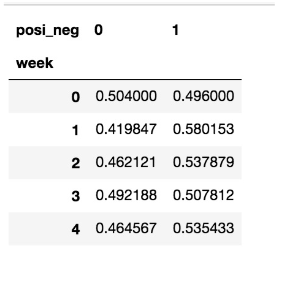

# 1 pandas介绍

- **专门用于数据挖掘的开源**python库
- 以Numpy为基础，借力Numpy模块在计算方面性能高的优势
- 基于matplotlib，能够简便的画图
- 独特的数据结构
- 封装了Matplotlib、Numpy的画图和计算


# 2 为什么使用Pandas

增强图表可读性


#  3 Pandas数据结构

Pandas中一共有三种数据结构，分别为：Series、DataFrame和MultiIndex（老版本中叫Panel ）。
其中Series是一维数据结构，DataFrame是二维的表格型数据结构，MultiIndex是三维的数据结构。

## 3.1 Series
Series是一个类似于一维数组的数据结构，它能够保存任何类型的数据，比如整数、字符串、浮点数等，主要由一组数据和与之相关的索引两
部分构成。

### 3.1.1 Series的创建

参数：

- data：传入的数据，可以是ndarray、list等
- index：索引，必须是唯一的，且与数据的长度相等。如果没有传入索引参数，则默认会自动创建一个从0-N的整数索引。
- dtype：数据的类型

```python
# 导入pandas
import pandas as pd
pd.Series(data=None, index=None, dtype=None)
```


#### 通过已有数据创建

- 指定内容，默认索引

```python
# arange(10) 生成0~9数字
pd.Series(np.arange(10))
```


#### 指定索引

```python
pd.Series([6.7,5.6,3,10,2], index=[1,2,3,4,5])
```


#### 通过字典数据创建

- 下标代表索引,内容就是内容

```python
color_count = pd.Series({'red':100, 'blue':200, 'green': 500, 'yellow':1000}
```


### 3.1.2 Series的属性

为了更方便地操作Series对象中的索引和数据，Series中提供了两个属性index和values

#### a.index

```python
color_count.index
# 结果
Index(['blue', 'green', 'red', 'yellow'], dtype='object')
```

#### a.values

```python
color_count.values
# 结果
array([ 200,  500,  100, 1000])
```

#### 也可以使用索引来获取数据：

```python
color_count[2]
# 结果
100
```


## 3.2 DataFrame

DataFrame是一个类似于二维数组或表格(如excel)的对象，既有行索引，又有列索引

- 行索引，表明不同行，横向索引，叫index，0轴，axis=0
- 列索引，表名不同列，纵向索引，叫columns，1轴，axis=1

### 3.2.1 DataFrame的创建

参数：

- data:  数据

- index：行标签。如果没有传入索引参数，则默认会自动创建一个从0-N的整数索引。
- columns：列标签。如果没有传入索引参数，则默认会自动创建一个从0-N的整数索引。

```python
# 导入pandas
import pandas as pd
pd.DataFrame(data=None, index=None, columns=None)
```

#### 通过已有数据创建

```python
pd.DataFrame(np.random.rand(2,3))


# 生成10名同学，5门功课的数据
score = np.random.randint(40, 100, (10, 5))
# 结果
array([[92, 55, 78, 50, 50],
       [71, 76, 50, 48, 96],
       [45, 84, 78, 51, 68],
       [81, 91, 56, 54, 76],
       [86, 66, 77, 67, 95],
       [46, 86, 56, 61, 99],
       [46, 95, 44, 46, 56],
       [80, 50, 45, 65, 57],
       [41, 93, 90, 41, 97],
       [65, 83, 57, 57, 40]])

# 使用Pandas中的数据结构 更容易读
score_df = pd.DataFrame(score)

# 构造列索引序列
subjects = ["语文", "数学", "英语", "政治", "体育"]
# 构造行索引序列                                   
stu = ['同学' + str(i) for i in range(score_df.shape[0])]
# 添加行索引
data = pd.DataFrame(score, index=stu, columns=subjects)
```

#### 通过字典创建

> 字典的key就是列名

```python
df = pd.DataFrame({"x":np.random.randn(500), "y":np.random.randn(500)})
```


### 3.2.2 DataFrame的属性

#### a.shape    形状   行,列

```python
data.shape
# 结果
(10, 5)
```


#### a.index    行索引列表	支持切片

```python
data.index
# 结果
Index(['同学0', '同学1', '同学2', '同学3', '同学4', '同学5', '同学6', '同学7', '同学8', '同学9'], dtype='object')
```

- index支持切片 data.index[:4]

```python
data.index[3:6]

# Index(['同学3', '同学4', '同学5'], dtype='object')
```


#### a.columns    列索引列表	支持切片

```python
data.columns
# 结果
Index(['语文', '数学', '英语', '政治', '体育'], dtype='object')
```

- columns支持切片

```python
data.columns[:4]

# Index(['语文', '数学', '英语', '政治'], dtype='object')
```


#### a.values    获取其中array的值	支持切片

```python
data.values

array([[92, 55, 78, 50, 50],
       [71, 76, 50, 48, 96],
       [45, 84, 78, 51, 68],
       [81, 91, 56, 54, 76],
       [86, 66, 77, 67, 95],
       [46, 86, 56, 61, 99],
       [46, 95, 44, 46, 56],
       [80, 50, 45, 65, 57],
       [41, 93, 90, 41, 97],
       [65, 83, 57, 57, 40]])
```

- values支持切片

```python
data.values[:4, :4]

# array([[48, 57, 77, 92],
#        [75, 57, 41, 72],
#        [47, 66, 43, 51],
#        [43, 93, 51, 65]])
```


#### a.T    转置

```python
data.T
```

#### a.head(5)    显示前5行内容

如果不补充参数，默认5行。填入参数N则显示前N行

```python
data.head(5)
# 效果相同
data[:5] 
```

#### tail(5)    显示后5行内容

如果不补充参数，默认5行。填入参数N则显示后N行

```python
data.tail(5)
```


### 3.2.3 DatatFrame索引的设置	

#### 3.2.3.1 修改行列索引值	a.index,columns	必须整体全部修改	

```python
stu = ["学生_" + str(i) for i in range(score_df.shape[0])]
# 必须整体全部修改
data.index = stu
data.columns = names
```

注意：以下修改方式是错误的

```python
# 错误修改方式
data.index[3] = '学生_3'
```

#### 3.2.3.2 重设索引	a.reset_index

- reset_index(drop=False)	
    - 设置新的下标索引
    - drop:默认为False，不删除原来索引，如果为True,删除原来的索引值
    - drop : boolean, 
        - default False添加一列,从0开始
        - True 当做新的索引，删除原来的索引

```python
# 重置索引,drop=False
data.reset_index()
```

#### 3.2.3.3 以某列值设置为新的索引	a.set_index

- set_index(keys, drop=True)
    - keys : 列索引名成或者列索引名称的列表
    - drop : boolean,
        - default True.当做新的索引，删除原来的列

1、创建

```python
df = pd.DataFrame({'month': [1, 4, 7, 10],
                    'year': [2012, 2014, 2013, 2014],
                    'sale':[55, 40, 84, 31]})
   month  sale  year
0  1      55    2012
1  4      40    2014
2  7      84    2013
3  10     31    2014
```

2、以月份设置新的索引

```python
#month指的是列表名字
df.set_index('month')
       sale  year
month
1      55    2012
4      40    2014
7      84    2013
10     31    2014
```

3、设置多个索引，以年和月份

```python
#year,month指的是列表名字
df = df.set_index(['year', 'month'])
df
            sale
year  month
2012  1     55
2014  4     40
2013  7     84
2014  10    31
```


## 3.3 MultiIndex与Panel

### 3.1 MultiIndex
MultiIndex是三维的数据结构;
多级索引（也称层次化索引）是pandas的重要功能，可以在Series、DataFrame对象上拥有2个以及2个以上的索引。

#### 3.3.1.1 multiIndex的特性
打印刚才的df的行索引结果

```python
df.index
MultiIndex(levels=[[2012, 2013, 2014], [1, 4, 7, 10]],
           labels=[[0, 2, 1, 2], [0, 1, 2, 3]],
           names=['year', 'month'])
```

多级或分层索引对象。

- index属性
    - names: levels的名称
    - levels：每个level的元组值

```python
df.index.names
# FrozenList(['year', 'month'])
df.index.levels
# FrozenList([[1, 2], [1, 4, 7, 10]])
```

#### 3.3.1.2 multiIndex的创建

```python
arrays = [[1, 1, 2, 2], ['red', 'blue', 'red', 'blue']]
pd.MultiIndex.from_arrays(arrays, names=('number', 'color'))

# 结果
MultiIndex(levels=[[1, 2], ['blue', 'red']],
           codes=[[0, 0, 1, 1], [1, 0, 1, 0]],
           names=['number', 'color'])
```

### 3.2 Panel  新版弃用了

#### 3.2.1 panel的创建

- class  pandas.Panel (data=None, items=None, major_axis=None, minor_axis=None)
    - 作用：存储3维数组的Panel结构
    - 参数：
        - data : ndarray或者dataframe
        - items : 索引或类似数组的对象，axis=0
        - major_axis : 索引或类似数组的对象，axis=1
        - minor_axis : 索引或类似数组的对象，axis=2

```python
p = pd.Panel(data=np.arange(24).reshape(4,3,2),
                 items=list('ABCD'),
                 major_axis=pd.date_range('20130101', periods=3),
                 minor_axis=['first', 'second'])
# 结果
# <class 'pandas.core.panel.Panel'>
# Dimensions: 4 (items) x 3 (major_axis) x 2 (minor_axis)
# Items axis: A to D
# Major_axis axis: 2013-01-01 00:00:00 to 2013-01-03 00:00:00
# Minor_axis axis: first to second
```

#### 3.2.2 查看panel数据

> 注：Pandas从版本0.20.0开始弃用：推荐的用于表示3D数据的方法是通过DataFrame上的MultiIndex方法

```python
p[:,:,"first"]
p["B",:,:]
```


# 4 基本数据操作

## 4.1 索引操作

Numpy当中我们已经讲过使用索引选取序列和切片选择，pandas也支持类似的操作，也可以直接使用列名、行名
称，甚至组合使用。

### 4.1.1 直接使用行列索引(先列后行)

获取'2018-02-27'这天的'close'的结果

```python
# 直接使用行列索引名字的方式（先列后行）
data['open']['2018-02-27']
# 23.53

# 不支持的操作
# 错误  先行后列不支持
data['2018-02-27']['open']
# 错误  不支持切片
data[:1, :2]
```

获取多列

```python
data[['open', 'close']]
```

##### 单维切片行,一次多维切片不支持

这样切片支持,不支持一次性多维切片  

```python
# 显示5行 
data[:5]
```

```python
# 显示2行,所以后面的 2 是在是5行的前2行
data[:5][:2]
```


### 4.1.2 a.loc, a.iloc  先行后列

- **使用loc:	只能指定行列索引的名字**

    - loc还能进行条件判断

        - ```python
            # 逻辑判断的结果可以作为筛选的依据
            data.loc[data["open"] > 23]
            # 等同于上面的
            data[data["open"] > 23]
            ```

- **使用iloc:   可以通过索引的下标去获取**

获取从'2018-02-27':'2018-02-22'，'open'的结果

```python
# 使用loc:只能指定行列索引的名字
data.loc['2018-02-27':'2018-02-22', 'open']
# 2018-02-27    23.53
# 2018-02-26    22.80
# 2018-02-23    22.88
# Name: open, dtype: float64
# 使用iloc可以通过索引的下标去获取

# 获取前3天数据,前5列的结果
data.iloc[:3, :5]
            open    high    close    low
# 2018-02-27    23.53    25.88    24.16    23.53
# 2018-02-26    22.80    23.78    23.53    22.80
# 2018-02-23    22.88    23.37    22.82    22.71
```

### 4.1.3 使用ix组合索引

获取行第1天到第4天，['open', 'close', 'high', 'low']这个四个指标的结果

```python
# 使用ix进行下表和名称组合做引
data.ix[0:4, ['open', 'close', 'high', 'low']]
# 推荐使用loc和iloc来获取的方式
# loc中填的是index和columns名字
data.loc[data.index[0:4], ['open', 'close', 'high', 'low']]

# 返回的是下标id
data.columns.get_indexer(['open', 'close', 'high', 'low'])
# array([0, 2, 1, 3], dtype=int64)

# iloc中填的是切片数字
data.iloc[0:4, data.columns.get_indexer(['open', 'close', 'high', 'low'])]

#               open     close    high     low
# 2018-02-27    23.53    24.16    25.88    23.53
# 2018-02-26    22.80    23.53    23.78    22.80
# 2018-02-23    22.88    22.82    23.37    22.71
# 2018-02-22    22.25    22.28    22.76    22.02
```


## 4.2 赋值操作 a.b=1  a[b]=1

对DataFrame当中的close列进行重新赋值为1

```python
# 直接修改原来的值
data['close'] = 1
# 或者
data.close = 1
```


## 4.3 a.info()

info()可以查看基本信息

```python
# info() 查看基本信息
file_data.info()
```


## 4.4 排序

排序有两种形式，一种对于索引进行排序，一种对于内容进行排序

### 4.4.1 DataFrame排序

#### a.sort_values(by=, ascending=)

- 单个键或者多个键进行排序,
- 参数：
    - by：指定排序参考的键
    - ascending:默认升序
        - False:	降序
        - True:     升序

```python
# 按照开盘价大小进行排序 , 使用ascending指定按照大小排序
data.sort_values(by="open", ascending=True).head()
```

```python
# 按照多个键进行排序
data.sort_values(by=['open', 'high']).head()
```

#### a.sort_index 索引排序

```python
# 对索引进行排序 从小到大
data.sort_index()
```

### 4.4.2 Series排序

#### a.sort_values(ascending=True)

series排序时，只有一列，不需要参数

```python
data['p_change'].sort_values(ascending=True).head()

# 日期代表索引
# 2015-09-01   -10.03
# 2015-09-14   -10.02
# 2016-01-11   -10.02
# 2015-07-15   -10.02
# 2015-08-26   -10.01
# Name: p_change, dtype: float64
```

#### sort_index() 排序

与df一致

```python
# 对索引进行排序
data['p_change'].sort_index().head()

# 2015-03-02    2.62
# 2015-03-03    1.44
# 2015-03-04    1.57
# 2015-03-05    2.02
# 2015-03-06    8.51
# Name: p_change, dtype: float64
```

## 4.5 删除数据    a.drop

参数:

- index或colum
- axis 默认=0,删除行;  1 删除列
- inplace=True 修改原值

day13 pubg

**通过id删除数据**

```python
# 通过作弊玩家索引删除数据
# inplace=True 修改原数据
train2.drop(train2[train2["killwithoutMoving"] == True].index, inplace=True)
train2.shape
# 数据少了一些
```

**删除列 a.drop([列], axis=1)**

```python
# 删除 id 和 target, axis=1 按列删除
x = data.drop(['id','target'], axis=1)
```

**复杂逻辑判断删除**

```python
# 有杀敌但没有移动的玩家,返回真和假
train2["killwithoutMoving"] = (train2['kills'] > 0) & (train2['totalDistance'] == 0)
# 作弊玩家
train2[train2["killwithoutMoving"] == True].head()
```


> 接着删除

```python
# 通过作弊玩家索引删除数据
# inplace=True 修改原数据
train2.drop(train2[train2["killwithoutMoving"] == True].index, inplace=True)
```


## 4.6 添加列    a.insert(id列, 列名, 值)

```python
# 添加id列
# column 列名
# value列值
result_Data.insert(loc=0, column="id", value=test_data.id)
result_Data.head()
```

## 4.7 添加列    a.loc

`a.loc[行, 新列名] = 新值`

```python
# dat10 商品评论情感分析
# 增加一列表示好评和差评
data.loc[data.loc[:, '评价'] == '好评', '评论称号'] = 1
data.loc[data.loc[:, '评价'] == '差评', '评论称号'] = 0
data.head()
```


## 4.8 替换 a.replace 默认不修改原值

`a.replace(to_replace=, value=, inplace=)`

- to_replace:替换前的值
- value:替换后的值
- inplace=True 修改原值

```python
a = pd.Series([1, 2, 3, 3, 5])
a
# 0    1
# 1    2
# 2    3
# 3    3
# 4    5
# dtype: int64

a.replace(to_replace=3, value=4)
# 0    1
# 1    2
# 2    4
# 3    4
# 4    5
# dtype: int64


a
# 默认不修改原值
# 0    1
# 1    2
# 2    3
# 3    3
# 4    5
# dtype: int64
```


#  5 DataFrame运算

## 5.1 算术运算

### a.add(other)	加上具体的一个数字

```python
data['open'].add(1)

# 2018-02-27    24.53
# 2018-02-26    23.80
# 2018-02-23    23.88
# 2018-02-22    23.25
# 2018-02-14    22.49
```

### a.sub(other)	减去具体的一个数字


## 5.2 逻辑运算

### 5.2.1 逻辑运算符号 > = <

- 例如筛选data["open"] > 23的日期数据
    - data["open"] > 23返回逻辑结果

```python
data["open"] > 23

# 2018-02-27     True
# 2018-02-26    False
# 2018-02-23    False
# 2018-02-22    False
# 2018-02-14    False
```
- 逻辑判断的结果可以作为筛选的依据


```python
# 逻辑判断的结果可以作为筛选的依据
data[data["open"] > 23].head()
# 等同于上面的
data.loc[data["open"] > 23]
```

- 完成多个逻辑判断 & |

```python
data[(data["open"] > 23) & (data["open"] < 24)].head()
```

- 复杂逻辑判断

```python
# 有杀敌但没有移动的玩家,返回真和假
train2["killwithoutMoving"] = (train2['kills'] > 0) & (train2['totalDistance'] == 0)
# 作弊玩家
train2[train2["killwithoutMoving"] == True].head()
```


> 接着删除

```python
# 通过作弊玩家索引删除数据
# inplace=True 修改原数据
train2.drop(train2[train2["killwithoutMoving"] == True].index, inplace=True)
```


### 5.2.2 逻辑运算函数

#### a.query(expr)

- expr:查询字符串

通过query使得刚才的过程更加方便简单

```python
data.query("open<24 & open>23").head()
```

#### a.isin(values)

例如判断'open'是否为23.53和23.85

```python
# 可以指定值进行一个判断，从而进行筛选操作
data[data["open"].isin([23.53, 23.85])]
```

## 5.3 去重 a.unique()

`a.unique()`


## 5.4 统计运算

### 5.4.1 a.describe()	综合分析

综合分析: 能够直接得出很多统计结果, count ,  mean ,  std ,  min ,  max  等

```python
# 计算平均值、标准差、最大值、最小值
data.describe()
```

### 5.4.2 统计函数

Numpy当中已经详细介绍，在这里我们演示min(最小值), max(最大值), mean(平均值), median(中位数), var(方差), std(标准差),mode(众数)结果:

对于单个函数去进行统计的时候，坐标轴还是按照默认列“columns” (axis=0, default)，如果要对行“index” 需要指定(axis=1)

> **使用统计函数：0 代表列求结果， 1 代表行求统计结果**

#### count() 总数


#### max()、min()

```python
# 使用统计函数：0 代表列求结果， 1 代表行求统计结果
data.max(0)

# open                   34.99
# high                   36.35
# close                  35.21
# low                    34.01
# volume             501915.41
# price_change            3.03
# p_change               10.03
# turnover               12.56
# my_price_change         3.41
# dtype: float64
```

#### std(): 方差、var(): 标准差

```python
# 方差
# data.var(0)
# open               1.545255e+01
# high               1.662665e+01
# close              1.554572e+01
# low                1.437902e+01
# volume             5.458124e+09
# price_change       8.072595e-01
# p_change           1.664394e+01
# turnover           4.323800e+00
# my_price_change    6.409037e-01
# dtype: float64
    
# 标准差
data.std(0)
# open                   3.930973
# high                   4.077578
# close                  3.942806
# low                    3.791968
# volume             73879.119354
# price_change           0.898476
# p_change               4.079698
# turnover               2.079375
# my_price_change        0.800565
# dtype: float64
```

#### median()：中位数

中位数为将数据从小到大排列，在最中间的那个数为中位数。如果没有中间数，取中间两个数的平均值。

```python
df = pd.DataFrame({'COL1' : [2,3,4,5,4,2],
                   'COL2' : [0,1,2,3,4,2]})
df.median()
# COL1    3.5
# COL2    2.0
# dtype: float64
```

#### idxmax()、idxmin()

```python
# 求出最大值的位置	axis=0 : 列	axis=1: 行
# data.idxmax(axis=0)
# open               2015-06-15
# high               2015-06-10
# close              2015-06-12
# low                2015-06-12
# volume             2017-10-26
# price_change       2015-06-09
# p_change           2015-08-28
# turnover           2017-10-26
# my_price_change    2015-07-10
# dtype: object
    
# 求出最小值的位置	axis=0 : 列	axis=1: 行
data.idxmin(axis=0)
# open               2015-03-02
# high               2015-03-02
# close              2015-09-02
# low                2015-03-02
# volume             2016-07-06
# price_change       2015-06-15
# p_change           2015-09-01
# turnover           2016-07-06
# my_price_change    2015-06-15
# dtype: object
```


### 5.4.3 累计统计函数

| 函数    | 作用                          |
| ------- | ----------------------------- |
| cumsum  | 计算前1/2/3/.../n个数的和     |
| cummax  | 计算前1/2/3/.../n个数的最大值 |
| cummin  | 计算前1/2/3/.../n个数的最小值 |
| cumprod | 计算前1/2/3/.../n个数的积     |

#### 先排序

```python
# 排序之后，进行累计求和
data = data.sort_index()
```

#### 对p_change进行求和

```python
stock_rise = data['p_change']
# plot方法集成了前面直方图、条形图、饼图、折线图

stock_rise.cumsum()

# 2015-03-02      2.62
# 2015-03-03      4.06
# 2015-03-04      5.63
# 2015-03-05      7.65
# 2015-03-06     16.16
# 2015-03-09     16.37
```
如果要使用plot函数，需要导入matplotlib

####  pandas集成及plot画图

- cumsum 	列总和

```python
stock_rise.cumsum().head()

# 2015-03-02     2.62
# 2015-03-03     4.06
# 2015-03-04     5.63
# 2015-03-05     7.65
# 2015-03-06    16.16
# Name: p_change, dtype: float64
```


```python
import matplotlib.pyplot as plt
# plot显示图形
stock_rise.cumsum().plot()
# 需要调用show，才能显示出结果
plt.show()
```


## 5.5 transform()    改变输出值

day13 pubg

```python
# 按照matchId分组,再获取matchId,再通过transform进行个数统计
count = train1.groupby('matchId')['matchId'].transform('count')
count
# 可以看出count是按照原有id进行匹配的,所以可以放进原表
```


## 5.6 自定义运算	自定义运算 a.apply()

- apply(func, axis=0)
    - func:自定义函数
    - axis=0:默认是列，axis=1为行进行运算
- 定义一个对列，最大值-最小值的函数

```python
data[['open', 'close']].apply(lambda x: x.max() - x.min(), axis=0)
# open     22.74
# close    22.85
# dtype: float64
```

## 5.7 DataFrame转换成字典	to_dict(orient="records")

```python
x_train 
```


```python
# 转换成字典格式
x_train = x_train.to_dict(orient="records")
x_train
```


1


# 6 pandas画图

## 6.1 a.plot()

- a.plot (kind='line')

    -   kind : str，需要绘制图形的种类
        -  ‘line’ : 折线图 plot (default)
        -  ‘bar’ : 条形图
        -  ‘barh’ : 横向条形图
            -  关于“barh”的解释：
            -  http://pandas.pydata.org/pandas-docs/stable/reference/api/pandas.DataFrame.plot.barh.html
        -  ‘hist’ : 直方图
        -  ‘pie’ : 饼图
        -  ‘scatter’ : 散点图

    更多细节：https://pandas.pydata.org/pandas-docs/stable/generated/pandas.DataFrame.plot.html?highlight=plot#pandas.DataFrame.plot

```python
# 构造列索引序列
subjects = ["语文", "数学", "英语", "政治", "体育"]
# 构造行索引序列
stu = ['同学' + str(i) for i in range(score_df.shape[0])]
# 添加行索引
data = pd.DataFrame(score, index=stu, columns=subjects)

data.plot(kind='bar')

# 解决中文显示问题
plt.rcParams['font.sans-serif'] = ['KaiTi']  # 指定默认字体
plt.rcParams['axes.unicode_minus'] = False  # 解决保存图像是负号'-'显示为方块的问题
plt.show()
```


```python
# 列名和重要性排序
imp_df1 = imp_df.sort_values('imp', ascending=False)
imp_df1.head()
```


```python
# 特征重要性排序
imp_df1.plot('cols', 'imp', figsize=(20, 8), kind='barh')
```


## 6.2 pandas.Series.plot

更多细节：https://pandas.pydata.org/pandas-docs/stable/generated/pandas.Series.plot.html?highlight=plot#pandas.Series.plot

```python
stock_rise.plot()
plt.show()
```

```python
stock_rise.cumsum().plot()
plt.show()
```


# 7 文件读取与存储

pandas会支持复杂的IO操作，pandas的API支持众多的文件格式，如CSV、SQL、XLS、JSON、
HDF5。
注：最常用的HDF5和CSV文件

## 7.1 CSV

### 7.1.1 pd.read_csv()

- pandas.read_csv(filepath_or_buffer, sep =',', usecols )
    - filepath_or_buffer:文件路径
    - sep :分隔符，默认用","隔开
    - usecols:指定读取的列名，列表形式
    - names = 列名  读取时指定列名

举例：读取之前的股票的数据

```python
# 读取文件,并且指定只获取'open', 'close'指标
data = pd.read_csv("../data/stock_day.csv", usecols=['open', 'close'])

#             open    close
# 2018-02-27    23.53    24.16
# 2018-02-26    22.80    23.53
# 2018-02-23    22.88    22.82
# 2018-02-22    22.25    22.28
# 2018-02-14    21.49    21.92
```

#### nam读取时指定列名

```python
# 1.获取数据
names = ['Sample code number', 'Clump Thickness', 'Uniformity of Cell Size', 'Uniformity of Cell Shape',
         'Marginal Adhesion', 'Single Epithelial Cell Size', 'Bare Nuclei', 'Bland Chromatin',
         'Normal Nucleoli', 'Mitoses', 'Class']
# 下载地址 https://archive.ics.uci.edu/ml/machine-learning-databases/breast-cancer-wisconsin/breast-cancer-wisconsin.data
# names = name 添加列名
data = pd.read_csv('../data/breast-cancer-wisconsin.data', names = names)
data.head()
```


### 7.1.2 pd.to_csv()

- DataFrame.to_csv(path_or_buf=None, sep=', ’, columns=None, header=True, index=True, mode='w', 

    - encoding=None)
    - path_or_buf :文件路径
    - sep :分隔符，默认用","隔开
    - columns :选择需要的列索引
    - header :boolean or list of string, default True,是否写进列索引值

    - index:是否写进行索引
    - mode:'w'：重写, 'a' 追加

举例：保存读取出来的股票数据
保存'open'列的数据，然后读取查看结果

```python
# 选取10行数据保存,便于观察数据
data[:10].to_csv("../data/test.csv", columns=['open'])
```

会发现将索引存入到文件当中，变成单独的一列数据。如果需要删除，可以指定index参数,删除原来的文件，重新保存一次。

```python
# index:存储不会讲索引值变成一列数据
data[:10].to_csv("./data/test.csv", columns=['open'], index=False)
```

## 7.2 HDF5

需要安装安装tables模块避免不能读取HDF5文件

`pip install tables`

### 7.2.1 pd.read_hdf()与to_hdf()

HDF5文件的读取和存储需要指定一个键，值为要存储的DataFrame

- pandas.read_hdf(path_or_buf，key =None，** kwargs)
    从h5文件当中读取数据
    - path_or_buffer:文件路径
    - key:读取的键
    - return:Theselected object
- DataFrame.to_hdf(path_or_buf, key, *\kwargs*)

### 7.2.2 案例

- 读取文件

```python
day_close = pd.read_hdf("../data/day_close.h5")
```

- 存储文件

```python
day_close.to_hdf("../data/test.h5", key="day_close")
```

- 再次读取的时候, 需要指定键的名字

```python
new_close = pd.read_hdf("../data/test.h5", key="day_close")
```

注意：优先选择使用HDF5文件存储
	- HDF5在存储的时候支持压缩，使用的方式是blosc，这个是速度最快的也是pandas默认支持的
 - 使用压缩可以提磁盘利用率，节省空间
 - HDF5还是跨平台的，可以轻松迁移到 hadoop 上面


## 7.3 JSON

JSON是我们常用的一种数据交换格式，前面在前后端的交互经常用到，也会在存储的时候选择这种格式。所以我们需要知道Pandas如何进行读取和存储JSON格式。

### 7.3.1 pd.read_json()
- pandas.read_json(path_or_buf=None, orient=None, typ='frame', lines=False)- 
    - 将JSON格式准换成默认的Pandas DataFrame格式
    - orient : string,Indication of expected JSON string format.
        - 'split' : dict like {index -> [index], columns -> [columns], data -> [values]}
            - split 将索引总结到索引，列名到列名，数据到数据。将三部分都分开了
        - 'records' : list like [{column -> value}, ... , {column -> value}]
            - records 以 columns：values 的形式输出
        - 'index' : dict like {index -> {column -> value}}
            - index 以 index：{columns：values}... 的形式输出
        - 'columns' : dict like {column -> {index -> value}},默认该格式
            - colums 以 columns:{index:values} 的形式输出
        - 'values' : just the values array
            - values 直接输出值
    - lines : boolean, default False
        - 按照每行读取json对象
    - typ : default ‘frame’， 指定转换成的对象类型series或者dataframe

```python
json_read = pd.read_json(路径)
```

### 7.3.4 read_josn 案例

- 数据介绍

这里使用一个新闻标题讽刺数据集，格式为json。 is_sarcastic ：1讽刺的，否则为0； headline ：新闻报道的标题； article_link ：链接到原始新闻文章。存储格式为：

```json
{
    "article_link": "https://www.huffingtonpost.com/entry/versace-black-code_us_5861fbefe4b0de3a08f600d5", 
    "headline": "former versace store clerk sues over secret 'black code' for minority shoppers", 
    "is_sarcastic": 0
}
{
    "article_link": "https://www.huffingtonpost.com/entry/roseanne-revival-review_us_5ab3a497e4b054d118e04365", 
 	"headline": "the 'roseanne' revival catches up to our thorny political mood, for better and worse", 
 	"is_sarcastic": 0
}
```

- 读取

orient指定存储的json格式，lines指定按照行去变成一个样本

```python
#                                                                  如果文件是lines格式的,就要使用lines打开
json_read = pd.read_json("../data/Sarcasm_Headlines_Dataset.json", orient="records", lines=True)
```

### 7.3.3 pd.to_json()
- DataFrame.to_json(path_or_buf=None, orient=None, lines=False)
    - 将Pandas 对象存储为json格式
    - path_or_buf=None：文件地址
    - orient:存储的json形式，{‘split’,’records’,’index’,’columns’,’values’}
    - lines:一个对象存储为一行

### 7.3.4 案例

- 存储文件

```python
#                                 存储不使用lines,打开就不使用lines
json_read.to_json("../data/test.json", orient='records')

# 再次打开
js = pd.read_json('./test.json', orient="records")
js.head()
```

## 7.4 EXCEL

### 7.4 pd.read_excel()


# 8 高级处理-缺失值处理

## 8.1 如何处理nan

- 获取缺失值的标记方式(NaN或者其他标记方式)
- 如果缺失值的标记方式是NaN
    - 判断数据中是否包含NaN：
        - pd.isnull(df),
        - pd.notnull(df)
    - 存在缺失值nan:
        - 1、删除存在缺失值的:dropna(axis='rows')
            - 注：不会修改原数据，需要接受返回值
            - 2、替换缺失值:fillna(value, inplace=True)
                value:替换成的值
            - inplace:True:会修改原数据，False:不替换修改原数据，生成新的对象
- 如果缺失值没有使用NaN标记，比如使用"？"
    - 先替换‘?’为np.nan，然后继续处理

## 8.2 电影数据的缺失值处理

### 8.2.1 判断缺失值是否存在    pd.isnull(a)    pd.notnull(a)

```python
# 读取电影数据
movie = pd.read_csv("../data/IMDB-Movie-Data.csv")

pd.notnull(movie)
# 是不是全都不为空
np.all(pd.notnull(movie))
# 有没有为空的
np.any(data.isnull())
```

**对一列查看空值**

```python
np.any(x['Age'].isnull())

# fillna会修改原值, dropna和replace不会修改原值
x['Age'].fillna(x['Age'].mean(), inplace=True)
```


### 8.2.2 存在缺失值nan,并且是np.nan

#### 8.2.2.1 删除	a.dropna(inplace=True)	

参数:

- inplace=True 修改原值

pandas删除缺失值，使用dropna的前提是:缺失值的类型必须是np.nan

```python
# 不修改原数据
movie.dropna()
# 可以定义新的变量接受或者用原来的变量名
data = movie.dropna()
```

#### 8.2.2.2 替换缺失值	a.fillna(替换值, inplace=True)    

`data.fillna(替换值, inplace=True)`

```python
# 替换存在缺失值的样本的两列
# 替换填充平均值，中位数
movie['Revenue (Millions)'].fillna(movie['Revenue (Millions)'].mean(), inplace=True)
```

替换所有缺失值：

```python
# 所有列
for i in movie.columns:
    # 一列有一个空值就位True
    if np.any(pd.isnull(movie[i])) == True:
        print(i)
        # 使用中位数替换空值
        movie[i].fillna(movie[i].mean(), inplace=True)
```

### 8.2.3 不是缺失值nan，有默认标记的   

```python
wis = pd.read_csv("https://archive.ics.uci.edu/ml/machine-learning-databases/breast-cancer-wisconsin/breast-cancer-wisconsin.data")
```

以上数据在读取时，可能会报如下错误：

```python
URLError: <urlopen error [SSL: CERTIFICATE_VERIFY_FAILED] certificate verify failed (_ssl.c:833)>
```

解决办法：

```python
# 全局取消证书验证
import ssl
ssl._create_default_https_context = ssl._create_unverified_context
```

处理思路分析：

- 1、先替换 ‘?’ 为 np.nan
    - df.replace(to_replace=, value=)
        - to_replace:替换前的值
        - value:替换后的值

```python
# 把一些其它值标记的缺失值，替换成np.nan
wis = wis.replace(to_replace='?', value=np.nan)
```

- 2、再进行缺失值的处理

```python
# 删除
wis = wis.dropna()
```

### 8.2.4 inplace=True    修改原值


# 9 高级处理-重复值

## a.duplicated() 检测重复数据

预处理的前两步就是检查缺失值和重复值。如果希望检查准备的数据中是否存在重复的数据，则可以通过 Pandas中的 duplicated()方法完成。
接下来，通过 duplicated()方法对北京租房数据进行检测，只要有重复的数据就会映射为True，具体代码如下。

```python
# 重复数据检测
file_data.duplicated()
```

## a.drop_duplicates(inplace=False)

- inplace=False 是否修改原值

由于数据量相对较多，所以在 Jupyter NoteBook工具中有一部分数据会省略显示，但是从输出结果中仍然可以看到有多条返回结果为True的数据，这表明有重复的数据。这里，处理重复数据的方式是将其删除。接下来，使用 drop_duplicates()方法直接删除重复的数据，具体代码如下。

```python
# 删除重复数据
file_data = file_data.drop_duplicates()
```


# 10 高级处理-数据离散化

## 10.1 为什么要离散化
连续属性离散化的目的是为了简化数据结构，数据离散化技术可以用来减少给定连续属性值的个数。离散化方法经常作为数据挖掘的工具。

## 10.2 什么是数据的离散化

连续属性的离散化就是在连续属性的值域上，将值域划分为若干个离散的区间，最后用不同的符号或整数 值代表落在每个子区间中的属性
值。
离散化有很多种方法，这使用一种最简单的方式去操作

- 原始人的身高数据：165，174，160，180，159，163，192，184
- 假设按照身高分几个区间段：150~165, 165~180,180~195

这样我们将数据分到了三个区间段，我可以对应的标记为矮、中、高三个类别，最终要处理成一个"哑变量"矩阵

## 10.3 股票的涨跌幅离散化	pd.cut	pd.qcut(a, 组)

`pd.qcut(data, q)`

- 对数据进行分组将数据分组，一般会与value_counts搭配使用，统计每组的个数
- q: 多少组


我们对股票每日的"p_change"进行离散化

5.8 高级处理-数据离散化
学习目标
目标
应用cut、qcut实现数据的区间分组
应用get_dummies实现数据的one-hot编码

### 10.3.1 读取股票的数据
先读取股票的数据，筛选出p_change数据

```python
data = pd.read_csv("../data/stock_day.csv")
p_change= data['p_change']
```

### 10.3.2 将股票涨跌幅数据进行分组

使用的工具：

- pd.qcut(data, q)：
    - 对数据进行分组将数据分组，一般会与value_counts搭配使用，统计每组的个数
    - q: 多少组
- series.value_counts()：统计分组次数

```python
# 自行分组
qcut = pd.qcut(p_change, 10)
# 计算分到每个组数据个数
qcut.value_counts()
```

自定义区间分组：

- pd.cut(data, bins)

```python
# 自己指定分组区间
bins = [-100, -7, -5, -3, 0, 3, 5, 7, 100]
p_counts = pd.cut(p_change, bins)
p_counts.value_counts()
```

### 10.3.3 股票涨跌幅分组数据变成one-hot编码

- 什么是one-hot编码

把每个类别生成一个布尔列，这些列中只有一列可以为这个样本取值为1.其又被称为独热编码。


- pandas.get_dummies(data, prefix=None)

    - data:array-like, Series, or DataFrame

    - prefix:分组名字

```python
# 得出one-hot编码矩阵
dummies = pd.get_dummies(p_counts, prefix="rise")
```


# 11 高级处理-合并

## 11.1 pd.concat实现数据合并

`pd.concat([data1, data2], axis=1)`

- 按照行或列进行合并,axis=0为列索引，axis=1为行索引

```python
# 按照行索引进行
pd.concat([data, dummies], axis=1)
```


## 11.2 pd.merge  
`pd.merge(left, right, how='inner', on=None)`

- 可以指定按照两组数据的共同键值对合并或者左右各自
-  left: DataFrame
-  right: 另一个DataFrame
-  on: 指定的共同键
- how: 按照什么方式连接

| Merge method | SQL Join Name    | Description                               |
| ------------ | ---------------- | ----------------------------------------- |
| left         | LEFT OUTER JOIN  | Use keys from left frame only             |
| right        | RIGHT OUTER JOIN | Use keys from right frame only            |
| outer        | FULL OUTER JOIN  | Use union of keys from both frames        |
| inner        | INNER JOIN       | Use intersection of keys from both frames |

### 11.2.1 pd.merge合并

```python
# 创建两张表
left = pd.DataFrame({'key1': ['K0', 'K0', 'K1', 'K2'],
                     'key2': ['K0', 'K1', 'K0', 'K1'],
                     'A': ['A0', 'A1', 'A2', 'A3'],
                     'B': ['B0', 'B1', 'B2', 'B3']})
right = pd.DataFrame({'key1': ['K0', 'K1', 'K1', 'K2'],
                      'key2': ['K0', 'K0', 'K0', 'K0'],
                      'C': ['C0', 'C1', 'C2', 'C3'],
                      'D': ['D0', 'D1', 'D2', 'D3']})

# 默认内连接                         使用两个键进行匹配
result = pd.merge(left, right, on=['key1', 'key2'])
```


#### 左连接

```python
#                                             使用两个键进行匹配,都匹配才算
result = pd.merge(left, right, how='left', on=['key1', 'key2'])
```


#### 右连接

```python
#                                             使用两个键进行匹配,都匹配才算
result = pd.merge(left, right, how='right', on=['key1', 'key2'])
```


#### 外链接

```python
#                                             使用两个键进行匹配,都匹配才算
result = pd.merge(left, right, how='outer', on=['key1', 'key2'])
```


# 12 高级处理-交叉表与透视表	crosstab	pivot_table

## 12. 交叉表与透视表什么作用
探究股票的涨跌与星期几有关？
以下图当中表示，week代表星期几，1,0代表这一天股票的涨跌幅是好还是坏，里面的数据代表比例
可以理解为所有时间为星期一等等的数据当中涨跌幅好坏的比例




- 交叉表：交叉表用于计算一列数据对于另外一列数据的分组个数(用于统计分组频率的特殊透视表)
    - pd.crosstab(value1, value2)
- 透视表：透视表是将原有的DataFrame的列分别作为行索引和列索引，然后对指定的列应用聚集函数
    - data.pivot_table(）
- DataFrame.pivot_table([], index=[])

## 12.2 案例分析

### 12.2.1 数据准备
准备两列数据，星期数据以及涨跌幅是好是坏数据
进行交叉表计算

```python
# 寻找星期几跟股票张得的关系
# 1、先把对应的日期找到星期几
date = pd.to_datetime(data.index).weekday
data['week'] = date
# 2、假如把p_change按照大小去分个类0为界限          0代表跌,1代表涨
data['posi_neg'] = np.where(data['p_change'] > 0, 1, 0)
# 通过交叉表找寻两列数据的关系
count = pd.crosstab(data['week'], data['posi_neg'])
```

但是我们看到count只是每个星期日子的好坏天数，并没有得到比例，该怎么去做？

- 对于每个星期一等的总天数求和，运用除法运算求出比例

```python
# 算数运算，先求和
sum = count.sum(axis=1).astype(np.float32)
# 进行相除操作，得出比例
pro = count.div(sum, axis=0)
```

### 12.2.2 查看效果

使用plot画出这个比例，使用stacked的柱状图

```python
pro.plot(kind='bar', stacked=True)
plt.show()
```

### 12.2.3 使用pivot_table(透视表)实现

使用透视表，刚才的过程更加简单(不用求百分占比)

```python
# 通过透视表，将整个过程变成更简单一些    根据week进行变换
data.pivot_table(['posi_neg'], index='week')
```


# 13 高级处理-分组与聚合

## 13.1 什么是分组与聚合


## 13.2 分组API    groupby

- DataFrame.groupby(key, as_index=False)

    - key: 分组的列数据，可以多个

    - as_index=False 新建索引 0 1 2

    

- 案例:不同颜色的不同笔的价格数据

```python
col =pd.DataFrame({'color': ['white','red','green','red','green'], 'object': ['pen','pencil','pencil','ashtray','pen'],'price1':[5.56,4.20,1.30,0.56,2.75],'price2':[4.75,4.12,1.60,0.75,3.15]})

# color    object    price1    price2
# 0    white    pen    5.56    4.75
# 1    red    pencil    4.20    4.12
# 2    green    pencil    1.30    1.60
# 3    red    ashtray    0.56    0.75
# 4    green    pen    2.75    3.15
```

- 进行分组，对颜色分组，price进行聚合

Series分组,先选择列,再分组,再计算

```python
# 分组,要price1,再求平均值
col.groupby(['color'])['price1'].mean()
col['price1'].groupby(col['color']).mean()
# color
# green    2.025
# red      2.380
# white    5.560
# Name: price1, dtype: float64
```

Series分组,先选择列,再分组,再计算

```python
# 分组，数据的结构不变
col.groupby(['color'], as_index=False)['price1'].mean()
# color    price1
# 0    green    2.025
# 1    red    2.380
# 2    white    5.560
```


## 13.3 星巴克零售店铺数据

### 13.3.1 数据获取
从文件中读取星巴克店铺数据

```python
# 导入星巴克店的数据
starbucks = pd.read_csv("../data/starbucks/directory.csv")
```

### 13.3.2 进行分组聚合

```python
# 按照国家分组，求出每个国家的星巴克零售店数量
count = starbucks.groupby(['Country']).count()
```

画图显示结果

```python
count['Brand'].plot(kind='bar', figsize=(20, 8))
plt.show()
```

假设我们加入省市一起进行分组

```python
# 设置多个索引，set_index()
count = starbucks.groupby(['Country', 'State/Province']).count()
# 不要画图，太复杂了
count
```

仔细观察这个结构，与我们前面讲的哪个结构类似？？
与前面的MultiIndex结构类似


# 14 数据相关性 corr

```python
corr = data_cor.corr()
```


# 15 案例

## 15.1 需求
现在我们有一组从2006年到2016年1000部最流行的电影数据
数据来源：https://www.kaggle.com/damianpanek/sunday-eda/data

- 问题1：我们想知道这些电影数据中评分的平均分，导演的人数等信息，我们应该怎么获取？
- 问题2：对于这一组电影数据，如果我们想rating，runtime的分布情况，应该如何呈现数据？
- 问题3：对于这一组电影数据，如果我们希望统计电影分类(genre)的情况，应该如何处理数据？

## 15.2 实现
首先获取导入包，获取数据

```python
%matplotlib inline
import pandas  as pd 
import numpy as np
from matplotlib import pyplot as plt
```

```python
#文件的路径
path = "../data/IMDB-Movie-Data.csv"
#读取文件
movie = pd.read_csv(path)
```

### 15.2.1 问题一：
我们想知道这些电影数据中评分的平均分，导演的人数等信息，我们应该怎么获取？

- 得出评分的平均分

使用mean函数

```python
movie["Rating"].mean()
```

- 得出导演人数信息

求出唯一值，然后进行形状获取

```python
## 导演的人数
# df["Director"].unique().shape[0]
np.unique(movie["Director"]).shape[0]
# 644
```

### 15.2.2 问题二：
对于这一组电影数据，如果我们想Rating，Runtime (Minutes)的分布情况，应该如何呈现数据？

- 直接呈现，以直方图的形式

选择分数列数据，进行plot

```python
movie["Rating"].plot(kind='hist',figsize=(20,8))
plt.show()
# 显示不好,地下对不齐
```


- Rating进行分布展示

Rating进行分布展示
进行绘制直方图

```python
plt.figure(figsize=(20,8),dpi=80)
plt.hist(movie["Rating"].values,bins=20)
plt.show()
# 显示还是不齐
```

修改刻度的间隔

```python
# 求出最大最小值
max_ = movie["Rating"].max()
min_ = movie["Rating"].min()
# 生成刻度列表 分成21组,放20个数据
t1 = np.linspace(min_, max_, num=21)
# [ 1.9    2.255  2.61   2.965  3.32   3.675  4.03   4.385  4.74   5.095  5.45   5.805  6.16   6.515  6.87   7.225  7.58   7.935  8.29   8.645  9. ]

# 修改刻度
plt.xticks(t1)
# 添加网格
plt.grid(True, linestyle='--')

plt.figure(figsize=(20,8),dpi=80)
plt.hist(movie["Rating"].values,bins=20)
plt.show()
```


- Runtime (Minutes)进行分布展示

进行绘制直方图修改间隔

```python
# 求出最大最小值
max_ = movie["Runtime (Minutes)"].max()
min_ = movie["Runtime (Minutes)"].min()
# # 生成刻度列表
t1 = np.linspace(min_,max_,num=21)
# 修改刻度
plt.xticks(np.linspace(min_,max_,num=21))
# 添加网格
plt.grid(True, linestyle='--')

plt.figure(figsize=(20,8),dpi=80)
plt.hist(movie["Runtime (Minutes)"].values,bins=20)
plt.show()
```


### 15.2.3 问题三：
对于这一组电影数据，如果我们希望统计电影分类(genre)的情况，应该如何处理数据？

- 思路分析
    - 思路
        - 1、创建一个全为0的dataframe，列索引置为电影的分类，temp_df
        - 2、遍历每一部电影，temp_df中把分类出现的列的值置为1
        - 3、求和
- 1、创建一个全为0的dataframe，列索引置为电影的分类，temp_df
    - 列索引:    电影分类
    - 行索引:    每个电影

```python
# 进行字符串分割 电影分类,使用逗号分隔 返回二维列表,分隔开的是一个维度
temp_list = [i.split(',') for i in movie['Genre']]

# 先是 for j in temp_list, 再然后是 for i in j 取出单独的数据
genre_list = [i for j in temp_list for i in j]

# 获取电影的分类
# 去重
genre_list = np.unique(genre_list)


# 所有电影的行数     上面电影分类的行
zeros = np.zeros([movie.shape[0],genre_list.shape[0]])

# 增加新的列
temp_movie = pd.DataFrame(zeros, columns=genre_list)
```

- 2、遍历每一部电影，temp_df中把分类出现的列的值置为1

```python
# 遍历每一部电影，temp_df中把分类出现的列的值置为1
# temp_list 是电影的index行
for i in range(1000):
    temp_movie.loc[i, temp_list[i]]=1
    # 先列后行也行
    #temp_movie[temp_list[i]][i]=1
temp_movie.head()
```

- 3、求和,绘图

```python
# 默认对列求和
temp_movie.sum()

# 排序
temp_movie.sum().sort_values(ascending=False)


temp_movie.sum().sort_values(ascending=False).plot(kind="bar",figsize=(20,8),fontsize=20,colormap="cool")

# Musical        5.0
# Western        7.0
# War           13.0
# Music         16.0
# Sport         18.0
# History       29.0
# Animation     49.0
# Family        51.0
# Biography     81.0
# Fantasy      101.0
# Mystery      106.0
# Horror       119.0
# Sci-Fi       120.0
# Romance      141.0
# Crime        150.0
# Thriller     195.0
# Adventure    259.0
# Comedy       279.0
# Action       303.0
# Drama        513.0
# dtype: float64
```


# 16 时间戳转换	pd.to_datetime(时间戳, unit='s')

```python
# 时间戳转换为真实的时间       unit="s" 单位是秒
time = pd.to_datetime(facebook_data["time"], unit="s")
time.head()

# 163    1970-01-08 18:02:17
# 310    1970-01-03 17:11:59
# 658    1970-01-06 19:32:23
# 1368   1970-01-04 16:50:22
# 1627   1970-01-07 21:18:04
# Name: time, dtype: datetime64[ns]
```


```python
# 转换为DataFrame,让其可以读取日期和时间
time = pd.DatetimeIndex(time)
time.day,time.hour,time.weekday

# (Int64Index([8, 3, 6, 4, 7, 2, 7, 5, 1, 9,
#              ...
#              9, 8, 7, 7, 6, 3, 4, 1, 3, 2],
#             dtype='int64', name='time', length=71664),
#  Int64Index([18, 17, 19, 16, 21,  3,  3,  3, 18,  7,
#              ...
#              20,  9,  4, 22, 23, 12, 15, 20,  9, 20],
#             dtype='int64', name='time', length=71664),
#  Int64Index([3, 5, 1, 6, 2, 4, 2, 0, 3, 4,
#              ...
#              4, 3, 2, 2, 1, 5, 6, 3, 5, 4],
#             dtype='int64', name='time', length=71664))
```

