# 1 Seaborn----绘制统计图形

Matplotlib虽然已经是比较优秀的绘图库了，但是它有个今人头疼的问题，那就是API使用过于复杂，它里面有上千个函数和参数，属于典型的
那种可以用它做任何事，却无从下手。
Seaborn基于 Matplotlib核心库进行了更高级的API封装，可以轻松地画出更漂亮的图形，而Seaborn的漂亮主要体现在配色更加舒服，以及图形元素的样式更加细腻。
不过，使用Seaborn绘制图表之前，需要安装和导入绘图的接口，具体代码如下：

```python
# 安装 
pip3 install seaborn
```

```python
# 导入
import seaborn as sns
```


## 1.1 可视化数据的分布

当处理一组数据时，通常先要做的就是了解变量是如何分布的。

- 对于单变量的数据来说 采用直方图或核密度曲线是个不错的选择，
- 对于双变量来说，可采用多面板图形展现，比如 散点图、二维直方图、核密度估计图形等。

针对这种情况， Seaborn库提供了对单变量和双变 量分布的绘制函数，如 displot()函数、 jointplot()函数，下面来介绍这些函数的使用，具体内容如下：


## 1.2 折线图 lineplot

```python
seaborn.lineplot(x=None, y=None, hue=None, 
                 size=None, style=None, data=None,
                 palette=None, hue_order=None, hue_norm=None, 
                 sizes=None, size_order=None, size_norm=None, 
                 dashes=True, markers=None, style_order=None, 
                 units=None, estimator='mean', ci=95, n_boot=1000,
                 sort=True, err_style='band', err_kws=None,
                 legend='brief', ax=None, **kwargs)
```

- x: data中的一列
- y: data中的一列
- data: 数据

> 很多参数和`plt.plot`相同

## 1.2 绘制单变量分布	distplot -> displot

可以采用最简单的直方图描述单变量的分布情况。 Seaborn中提供了 distplot()函数，它默认绘制的是一个带有核密度估计曲线的直方图。distplot()函数的语法格式如下。

```python
seaborn.distplot(a, bins=None, hist=True, kde=True, rug=False, fit=None, color=None)
```

上述函数中常用参数的含义如下：

- (1) a：表示要观察的数据，可以是 Series、一维数组或列表。
- (2) bins：用于控制条形的数量。
- (3) hist：接收布尔类型，表示是否绘制(标注)直方图。
- (4) kde：接收布尔类型，表示是否绘制高斯核密度估计曲线。
- (5) rug：接收布尔类型，表示是否在支持的轴方向上绘制rugplot。

通过 distplot())函数绘制直方图的示例如下。

```python
import numpy as np
sns.set()
np.random.seed(0)  # 确定随机数生成器的种子,如果不使用每次生成图形不一样
arr = np.random.randn(100)  # 生成随机数组

ax = sns.distplot(arr, bins=10, hist=True, kde=True, rug=True)  # 绘制直方图
```

上述示例中，首先导入了用于生成数组的numpy库，然后使用 seaborn调用set()函数获取默认绘图，并且调用 random模块的seed函数确定随机数生成器的种子，保证每次产生的随机数是一样的，接着调用 randn()函数生成包含100个随机数的数组，最后调用 distplot()函数绘制直方图。
运行结果如下图所示。

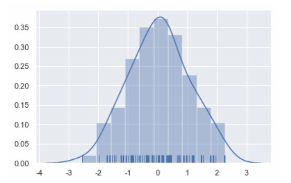

从上图中看出：

- 直方图共有10个条柱，每个条柱的颜色为蓝色，并且有核密度估计曲线。
- 根据条柱的高度可知，位于-1-1区间的随机数值偏多，小于-2的随机数值偏少。

通常，采用直方图可以比较直观地展现样本数据的分布情况，不过，直方图存在一些问题，它会因为条柱数量的不同导致直方图的效果有很大的差异。为了解决这个问题，可以绘制核密度估计曲线进行展现。

- 核密度估计是在概率论中用来估计未知的密度函数，属于非参数检验方法之一，可以比较直观地看出数据样本本身的分布特征。

通过 distplot()函数绘制核密度估计曲线的示例如下。

```python
# 创建包含500个位于[0，100]之间整数的随机数组
array_random = np.random.randint(0, 100, 500)
# 绘制核密度估计曲线
sns.distplot(array_random, hist=False, rug=True)
```

上述示例中，首先通过 random.randint()函数返回一个最小值不低于0、最大值低于100的500个随机整数数组然后调用 displot()函数绘制核密度估计曲线。

运行结果如图所示。

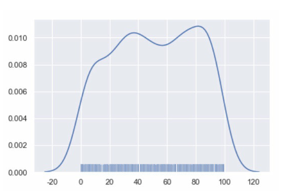

从上图中看出，图表中有一条核密度估计曲线，并且在x轴的上方生成了观测数值的小细条。


## 1.3 绘制双变量分布	jointplot

两个变量的二元分布可视化也很有用。在 Seaborn中最简单的方法是使用 jointplot()函数，该函数可以创建一个多面板图形，比如散点图、二维直方图、核密度估计等，以显示两个变量之间的双变量关系及每个变量在单坐标轴上的单变量分布。
jointplot()函数的语法格式如下。

```python
seaborn.jointplot(x, y, data=None, 
                  kind='scatter', stat_func=None, color=None, 
                  ratio=5, space=0.2, dropna=True)
```

上述函数中常用参数的含义如下：

- x, y:  数据中的列名
- data: 数据
- (1) kind：表示绘制图形的类型。
    - scatter:  散点图
    - kde:        等高线
    - hex:        六边形图
- (2) stat_func：用于计算有关关系的统计量并标注图。
- (3) color：表示绘图元素的颜色。
- (4) height：用于设置图的大小(正方形)。
- (5) ratio：表示中心图与侧边图的比例。该参数的值越大，则中心图的占比会越大。整数
- (6) space：用于设置中心图与侧边图的间隔大小。

下面以散点图、二维直方图、核密度估计曲线为例，为大家介绍如何使用 Seaborn绘制这些图形。

### 1.3.1 绘制散点图	scatter

调用 seaborn.jointplot()函数绘制散点图的示例如下。

```python
import numpy as np
import pandas as pd
import seaborn as sns
# 创建DataFrame对象
dataframe_obj = pd.DataFrame({"x": np.random.randn(500),"y": np.random.randn(500)})
# 绘制散布图
sns.jointplot(x="x", y="y", data=dataframe_obj)
```

上述示例中，首先创建了一个 DataFrame对象 dataframe_obj作为散点图的数据，其中x轴和y轴的数据均为500个随机数，接着调用 jointplot0 函数绘制一个散点图，散点图x轴的名称为“x”，y轴的名称为“y”。
运行结果如图所示。

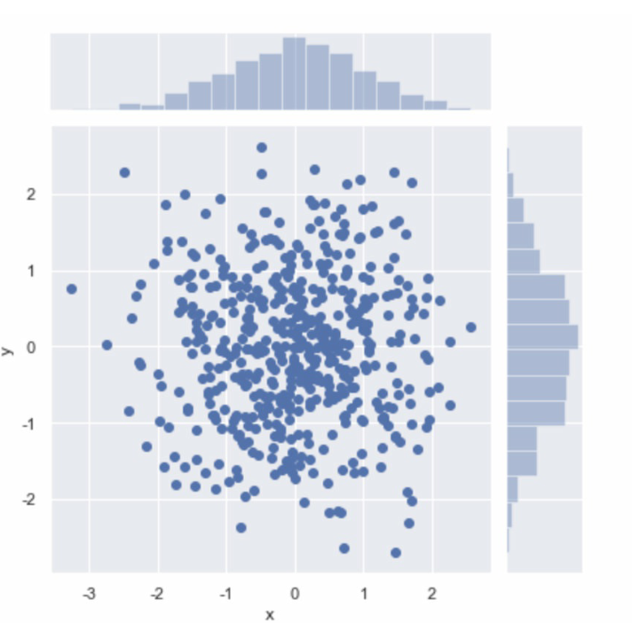

### 1.3.2 绘制二维直方图	hex
二维直方图类似于“六边形”图，主要是因为它显示了落在六角形区域内的观察值的计数，适用于较大的数据集。当调用 jointplot()函数时，只要传入kind="hex"，就可以绘制二维直方图，具体示例代码如下。

```python
# 绘制二维直方图
sns.jointplot(x="x", y="y", data=dataframe_obj, kind="hex")
```

运行结果如图所示。

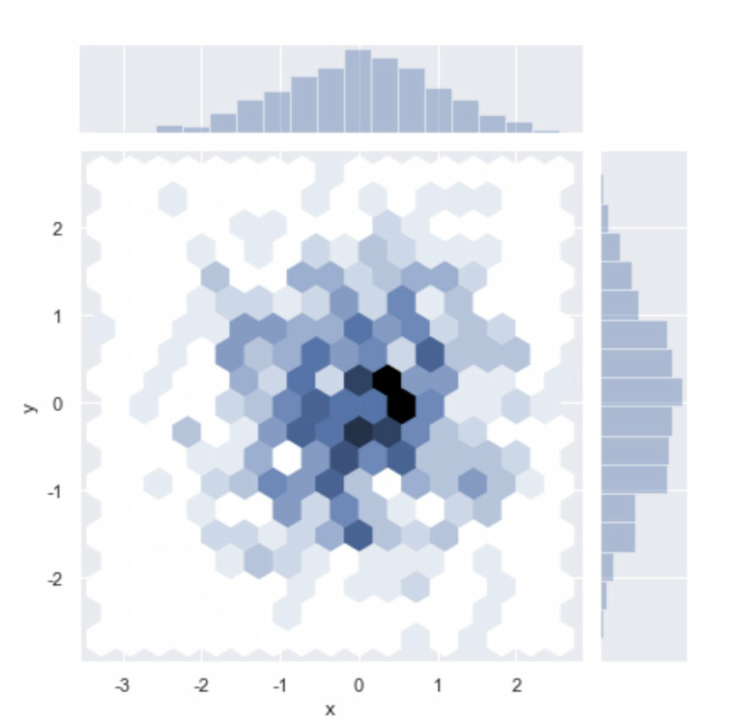

从六边形颜色的深浅，可以观察到数据密集的程度，另外，图形的上方和右侧仍然给出了直方图。注意，在绘制二维直方图时，最好使用白色背景。

### 1.3.3 绘制核密度估计图形	kde
利用核密度估计同样可以查看二元分布，其用等高线图来表示。当调用jointplot()函数时只要传入ind="kde"，就可以绘制核密度估计图形，具体示例代码如下。

```python
sns.jointplot(x="x", y="y", data=dataframe_obj, kind="kde")
```

上述示例中，绘制了核密度的等高线图，另外，在图形的上方和右侧给出了核密度曲线图。运行结果如图所示。

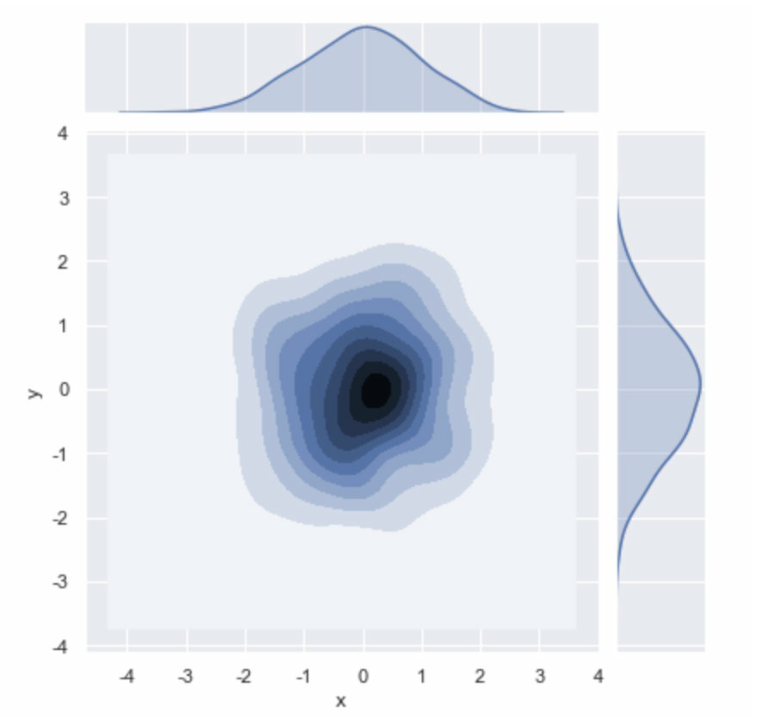

通过观等高线的颜色深浅，可以看出哪个范围的数值分布的最多，哪个范围的数值分布的最少

### 1.3.4 参数测试

```python
# stat_func：用于计算有关关系的统计量并标注图。
# color：表示绘图元素的颜色。
# size：用于设置图的大小(正方形)。
# ratio：表示中心图与侧边图的比例。该参数的值越大，则中心图的占比会越大。
# space：用于设置中心图与侧边图的间隔大小。
sns.jointplot(x='x', y='y', data= df, color='red', height=10, ratio=5, space=1)
```

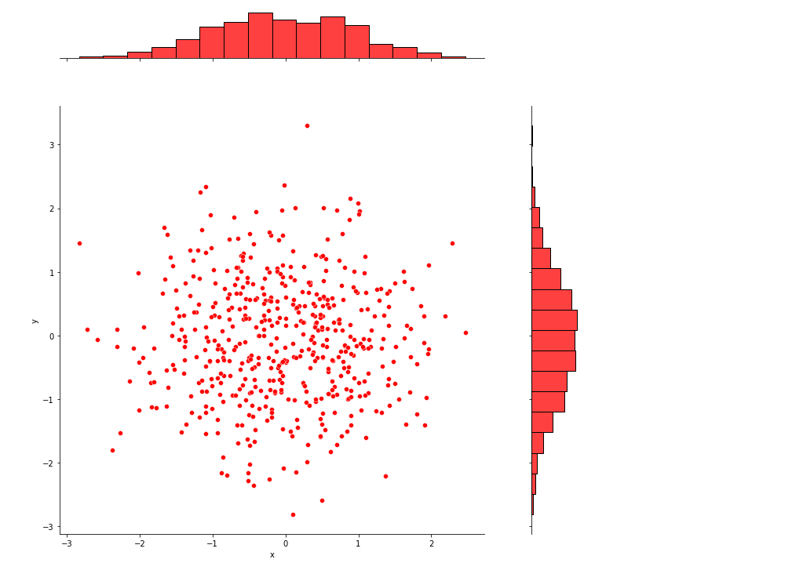


## 1.4 绘制成对的双变量(多变量)分布	pairplot

要想在数据集中绘制多个成对的双变量分布，则可以使用pairplot()函数实现，该函数会创建一个坐标轴矩阵，并且显示Datafram对象中每对变量的关系。另外，pairplot()函数也可以绘制每个变量在对角轴上的单变量分布。

接下来，通过 sns.pairplot()函数绘制数据集变量间关系的图形，示例代码如下

```python
# 加载seaborn中的数据集
dataset = sns.load_dataset("iris")
dataset.head()
```

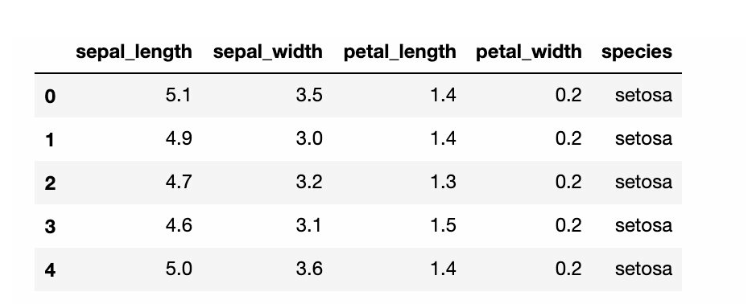

上述示例中，通过 load_dataset0函数加载了seaborn中内置的数据集，根据iris数据集绘制多个双变量分布。

```python
# 绘制多个成对的双变量分布
sns.pairplot(dataset)
```

结果如下图所示。

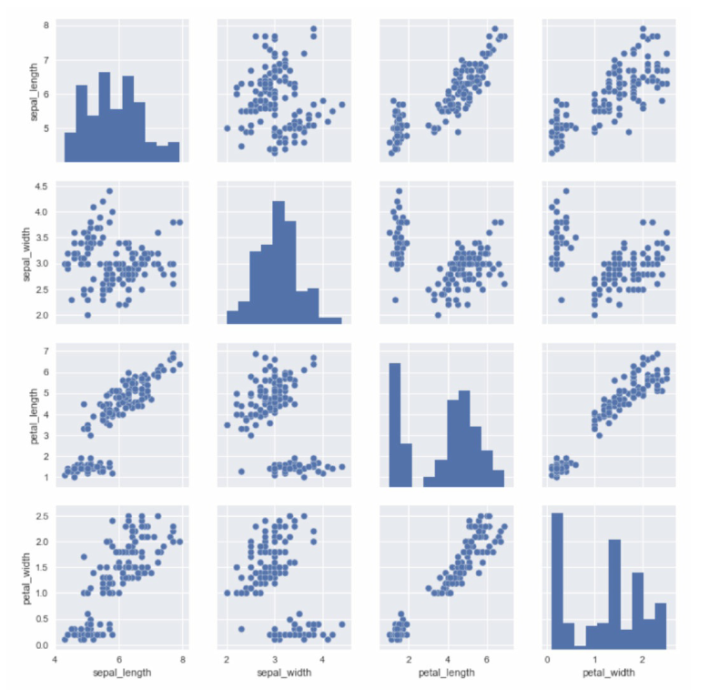


# 2 用分类数据绘图

数据集中的数据类型有很多种，除了连续的特征变量之外，最常见的就是类别型的数据了，比如人的性别、学历、爱好等，这些数据类型都不能用连续的变量来表示，而是用分类的数据来表示。
Seaborn针对分类数据提供了专门的可视化函数，这些函数大致可以分为如下三种:

- 分类数据散点图: stripplot()与swarmplot ()。
- 类数据的分布图: boxplot() 与 violinplot()。
- 分类数据的统计估算图:barplot() 与 pointplot()。

下面两节将针对分类数据可绘制的图形进行简单介绍，具体内容如下

## 2.1 类别散点图	

### 2.2.1 stripplot

通过 stripplot()函数可以画一个散点图， stripplot0函数的语法格式如下。

```python
seaborn.stripplot(x=None, y=None, hue=None, data=None, order=None, hue_order=None, jitter=False)
```

上述函数中常用参数的含义如下

- (1) x，y, hue:   data中的列名, x和y用来显示, hue用来改变颜色
- (2) data：用于绘制的数据集。如果x和y不存在，则它将作为宽格式，否则将作为长格式。
- (3) jitter：表示抖动的程度(仅沿类別轴)。当很多数据点重叠时，可以指定抖动的数量或者设为Tue使用默认值。

为了让大家更好地理解，接下来，通过 stripplot()函数绘制一个散点图，示例代码如下。

```python
# 获取tips数据
tips = sns.load_dataset("tips")
sns.stripplot(x="day", y="total_bill", data=tips)
```

运行结果如下图所示。

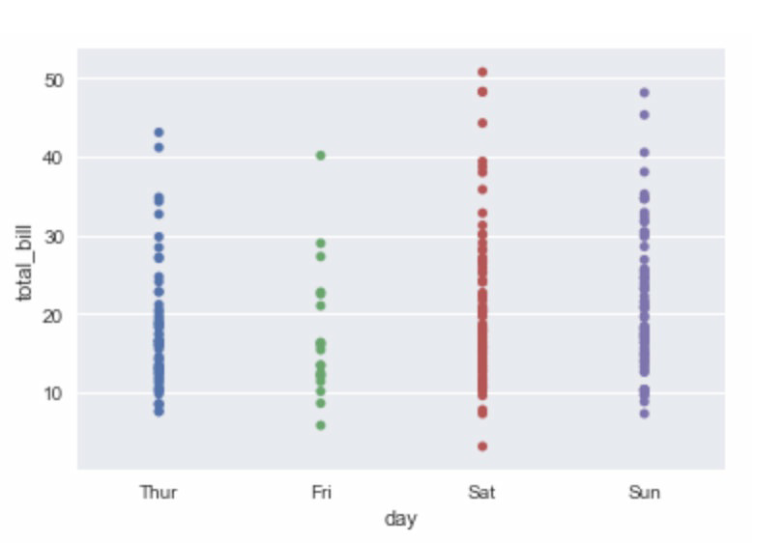

从上图中可以看出，图表中的横坐标是分类的数据，而且一些数据点会互相重叠，不易于观察。为了解决这个问题，可以在调用striplot()函数时传入jitter参数，以调整横坐标的位置，改后的示例代码如下。

```python
sns.stripplot(x="day", y="total_bill", data=tips, jitter=True)
```

运行结果如下图所示。

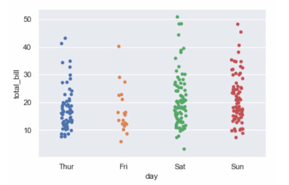


### 2.1.2 stripplot参数

上述函数中常用参数的含义如下

- (1) x，y, hue:   data中的列名, x和y用来显示, hue用来改变颜色
- (2) data：用于绘制的数据集。如果x和y不存在，则它将作为宽格式，否则将作为长格式。
- (3) jitter：表示抖动的程度(仅沿类別轴)。当很多数据点重叠时，可以指定抖动的数量或者设为Tue使用默认值。

```
# hue: 显示不同
# 数据抖动
sns.stripplot(x="day", y="total_bill", hue="time", data=tips, jitter=True)
```


### 2.1.3 swarmplot

除此之外，还可调用 swarmplot函数绘制散点图，该函数的好处是所有的数据点都不会重叠，可以很清晰地观察到数据的分布情况，示例代码如下。

- x，y, hue:   data中的列名, x和y用来显示, hue用来改变颜色

```python
sns.swarmplot(x="day", y="total_bill", data=tips)
```

运行结果如图所示。

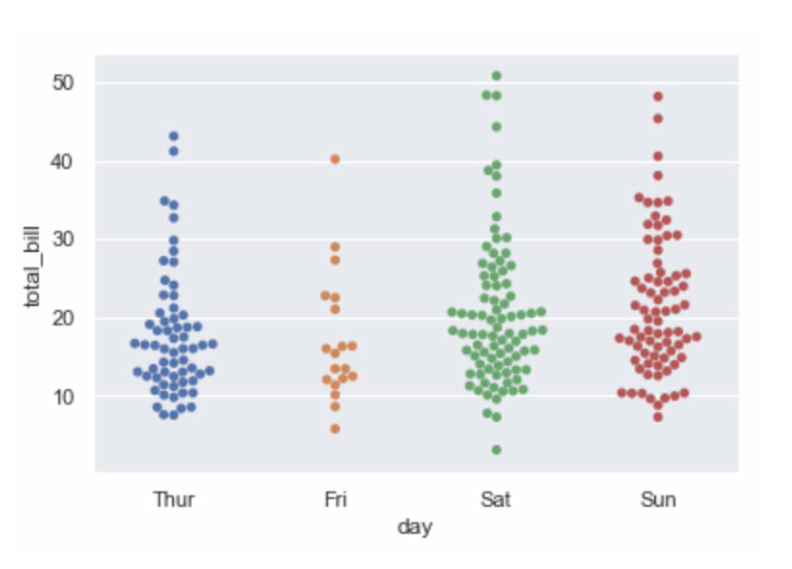


## 2.2 类别内的数据分布

要想查看各个分类中的数据分布，显而易见，散点图是不满足需求的，原因是它不够直观。针对这种情况，我们可以绘制如下两种图形进行查看:

- 箱形图:
    - 箱形图（Box-plot）又称为盒须图、盒式图或箱线图，是一种用作显示一组数据分散情况资料的统计图。因形状如箱子而得名。
    - 箱形图于1977年由美国著名统计学家约翰·图基（John Tukey）发明。它能显示出一组数据的最大值、最小值、中位数、及上下四分位数。

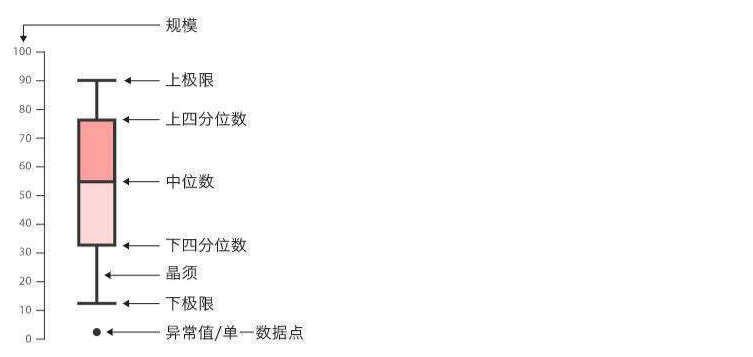

- 小提琴图:

    - 小提琴图 (Violin Plot) 用于显示数据分布及其概率密度。
    - 这种图表结合了箱形图和密度图的特征，主要用来显示数据的分布形状。
    - 中间的黑色粗条表示四分位数范围，从其延伸的幼细黑线代表 95% 置信区间，而白点则为中位数。

    - 箱形图在数据显示方面受到限制，简单的设计往往隐藏了有关数据分布的重要细节。例如使用箱形图时，我们不能了解数据分布。虽然小提琴图可以显示更多详情，但它们也可能包含较多干扰信息。

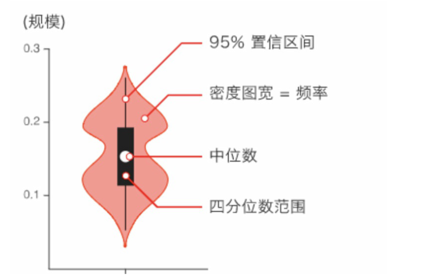

### 2.2.1 绘制箱形图	boxplot

seaborn中用于绘制箱形图的函数为 boxplot()，其语法格式如下:

```python
seaborn.boxplot(x=None, y=None, hue=None, data=None, orient=None, color=None,  saturation=0.75, width=0.8)
```

常用参数的含义如下:

- (1) x，y, hue:   data中的列名, x和y用来显示, hue用来改变颜色

- (2) palette：用于设置不同级别色相的颜色变量。---- palette=["r","g","b","y"]
- (3) saturation：用于设置数据显示的颜色饱和度。---- 使用小数表示

使用 boxplot()函数绘制箱形图的具体示例如下。

```python
sns.boxplot(x="day", y="total_bill", data=tips)
```

上述示例中，使用 seaborn中内置的数据集tips绘制了一个箱形图，图中x轴的名称为day，其刻度范围是 Thur~Sun(周四至周日)，y轴的名称为total_bill，刻度范围为10-50左右

运行结果如图所示。

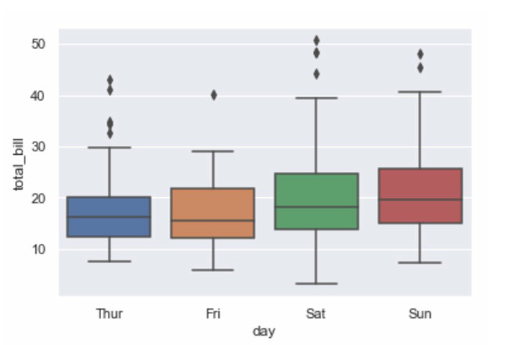

从图中可以看出，

- Thur列大部分数据都小于30，不过有5个大于30的异常值，
- Fri列中大部分数据都小于30，只有一个异常值大于40，
- Sat一列中有3个大于40的异常值，
- Sun列中有两个大于40的异常值

#### 参数

```python
# hue色调
sns.boxplot(x="day", y="total_bill", data=tips, hue='time')
```
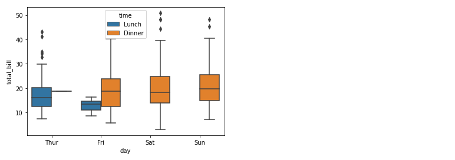


```python
# palette 颜色
sns.boxplot(x="day", y="total_bill", data=tips, palette=['green', 'blue', 'yellow', 'pink'])
```

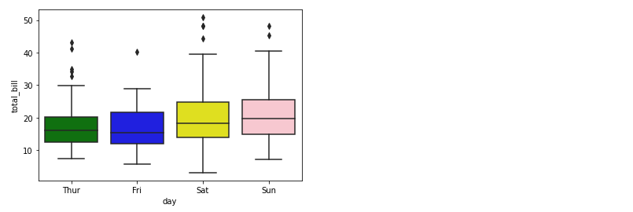


```python
# saturation 饱和度
sns.boxplot(x="day", y="total_bill", data=tips, saturation=0.8)
```

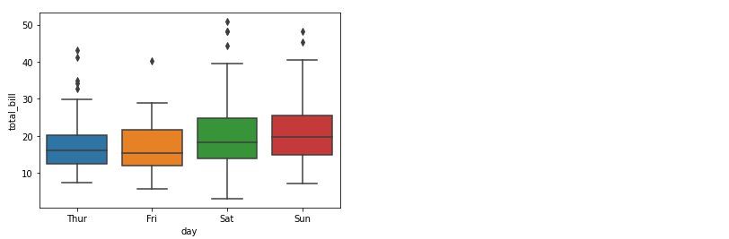


### 2.2.2 绘制提琴图    violinplot

seaborn中用于绘制提琴图的函数为violinplot()，其语法格式如下

```python
seaborn.violinplot(x=None, y=None, hue=None, data=None)
```

- x，y, hue:   data中的列名, x和y用来显示, hue用来改变颜色

通过violinplot()函数绘制提琴图的示例代码如下

```python
sns.violinplot(x="day", y="total_bill", data=tips)
```

上述示例中，使用seaborn中内置的数据集绘制了一个提琴图，图中x轴的名称为day，y轴的名称为total_bill
运行结果如图所示。

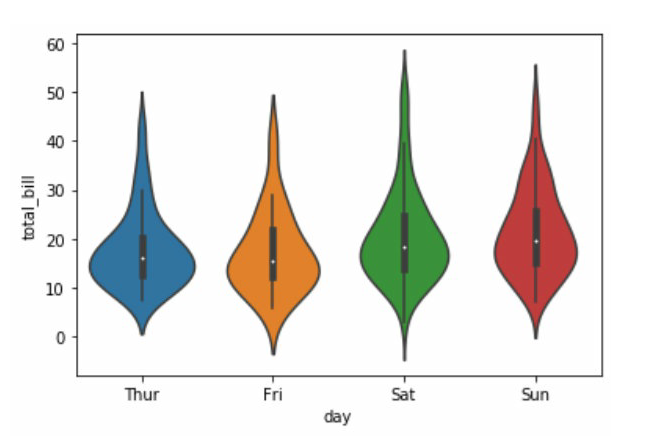

从图中可以看出，

- Thur一列中位于5~25之间的数值较多，
- Fri列中位于5-30之间的较多，
- Sat-列中位于5-35之间的数值较多，
- Sun一列中位于5-40之间的数值较多。


## 2.3 类别内的统计估计

要想查看每个分类的集中趋势，则可以使用条形图和点图进行展示。 Seaborn库中用于绘制这两种图表的具体函数如下

- barplot()函数：绘制条形图。
- pointplot()函数：绘制点图。

这些函数的API与上面那些函数都是一样的，这里只讲解函数的应用，不再过多对函数的语法进行讲解了。

### 2.3.1 绘制条形图	barplot
最常用的查看集中趋势的图形就是条形图。默认情况下， barplot函数会在整个数据集上使用均值进行估计。若每个类别中有多个类别时(使用了hue参数)，则条形图可以使用引导来计算估计的置信区间(是指由样本统计量所构造的总体参数的估计区间)，并使用误差条来表示置信区间。

使用 barplot()函数的示例如下

```python
sns.barplot(x="day", y="total_bill", data=tips)
```

- x，y, hue:   data中的列名, x和y用来显示, hue用来改变颜色

运行结果如图所示。

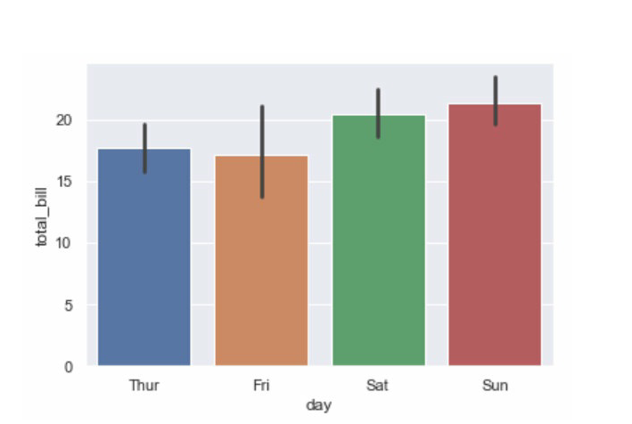

### 2.3.2 绘制点图	pointplot

另外一种用于估计的图形是点图，可以调用 pointplot()函数进行绘制，该函数会用高度低计值对数据进行描述，而不是显示完整的条形，它只会绘制点估计和置信区间。
通过 pointplot()函数绘制点图的示例如下。

```python
sns.pointplot(x="day", y="total_bill", data=tips)
```

- x，y, hue:   data中的列名, x和y用来显示, hue用来改变颜色

运行结果如图所示。

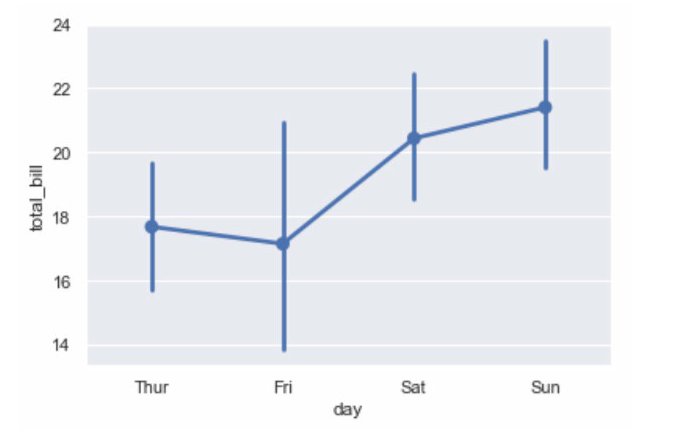


## 2.4 查看数据分布	lmplot()

**绘制二维散点图时，自动完成回归拟合**

通过创建一些图，以查看不同类别是如何通过特征来区分的。 在理想情况下，标签类将由一个或多个特征对完美分隔。 在现实世界中，这种理想情况很少会发生。

- seaborn.lmplot() 是一个非常有用的方法，它会在绘制二维散点图时，自动完成回归拟合
    - sns.lmplot() 里的 x, y 分别代表横纵坐标的列名,
    - data= 是关联到数据集,
    - hue=*代表按照 species即花的类别分类显示,
    - fit_reg=是否进行线性拟合

```python
%matplotlib inline  
# 内嵌绘图
from sklearn.datasets import load_iris
import seaborn as sns
import matplotlib.pyplot as plt
import pandas as pd

# 获取数据
iris = load_iris()

# 把数据转换成dataframe的格式
iris_d = pd.DataFrame(iris['data'], columns = ['Sepal_Length', 'Sepal_Width', 'Petal_Length', 'Petal_Width'])
# 目标值
iris_d['Species'] = iris.target

# 画图
def iris_plot(iris, col1, col2):
    # x,y轴名字,数据集,按照物种显示不同颜色,fit_reg=是否进行线性拟合
    sns.lmplot(x=col1, y=col2, data=iris, hue = "Species", fit_reg = False)
    # 2个标签和title
    plt.xlabel(col1)
    plt.ylabel(col2)
    plt.title('鸢尾花种类分布图')
    plt.show()


iris_plot(iris_d, 'Petal_Width', 'Sepal_Length')
```

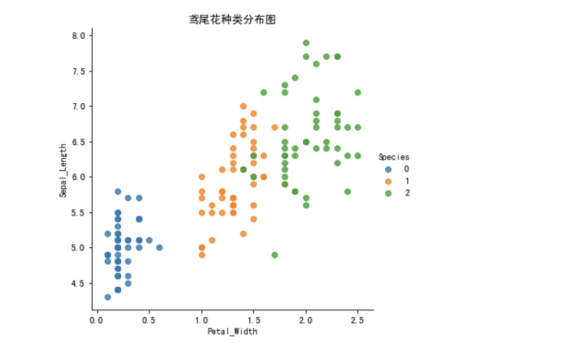


## 2.5 查看数据总数 countplot

```python
import numpy as np
import pandas as pd
import seaborn as sns
import matplotlib.pyplot as plt
```

### 1 一维数组可以

```python
arr = [1, 2, 3, 4, 5, 1, 2, 4, 2, 5, 3, 5, 7, 65]
# countplot 求总数
# 参数可以是一维数组
sns.countplot(arr)
```

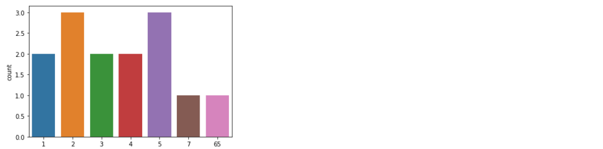

### 2 多维数组不行

```python
arr = [
    [1, 2, 3, 4, 5],
    [1, 2, 4, 2, 5],
    [3, 5, 7, 65, 15]]
# countplot 求总数
# 参数可以是一维数组
sns.countplot(arr)
# 报错
```

### 3 Series可以

```python
s1 = pd.Series([1, 2, 4, 6, 7, 5, 4, 3, 4, 5, 6, 7, 89, 9],
                index=[0, 1, 2, 3, 4, 5, 6, 7, 8, 9, 10, 11, 12, 13])
# countplot 求总数
# 参数可以是Sersies
sns.countplot(s1)
```

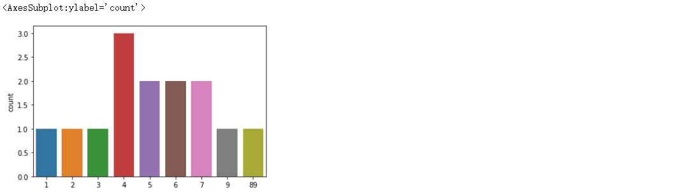

### 4 DataFrame不行，但是其中一列就可以

```python
df1 = pd.DataFrame(
    [1, 2, 4, 51, 3, 5, 7, 42, 3, 1, 3, 4, 6, 4, 2, 3, 124, 42, 1, 43])
# countplot 求总数
sns.countplot(df1)
# 报错
```

```python
# 参数是DataFrame中的一列
sns.countplot(df1[0])
```

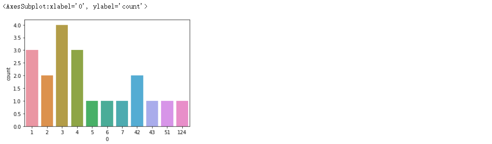


# 3 球员数据相关性分析

## 3.1 基本数据介绍
每个球迷心中都有一个属于自己的迈克尔·乔丹、科比·布莱恩特、勒布朗·詹姆斯。 本案例将用jupyter notebook完成NBA菜鸟数据分析初探。

案例中使用的数据是2017年NBA球员基本数据，数据字段见下表：

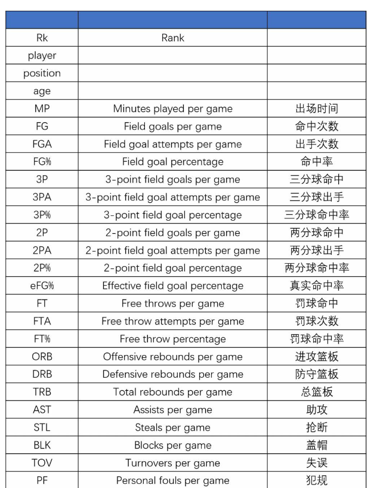

## 3.2 案例基本分析

### 3.2.1 获取数据	pd.read_csv

```python
# 获取数据
data = pd.read_csv('../data/nba_2017_nba_players_with_salary.csv')
data[:4]
```

### 3.2.2 形状	shape
```python
# 形状
data.shape
```

### 3.2.3 描述信息	describe

```python
# 描述信息
data.describe
```

### 3.2.4 数据相关性

```python
#data_cor = data.loc[:, ['RPM', 'AGE', 'SALARY_MILLIONS', 'ORB', 'DRB', 'TRB',
#                        'AST', 'STL', 'BLK', 'TOV', 'PF', 'POINTS', 'GP', 'MPG', 'ORPM', 'DRPM']]
data_cor = data[['RPM', 'AGE', 'SALARY_MILLIONS', 'ORB', 'DRB', 'TRB',
                        'AST', 'STL', 'BLK', 'TOV', 'PF', 'POINTS', 'GP', 'MPG', 'ORPM', 'DRPM']]
data_cor.head()
```

### 3.2.5 corr 获取相关性

```python
# 数据相关性 corr
corr = data_cor.corr()
```

### 3.2.6 热力图   heatmap

```python
# 显示热力图
# 让图片变大
plt.figure(figsize=(20, 8), dpi=100)

# square=True  正方形
# linewidths   线宽度
# annot=True   显示里面的值
sns.heatmap(corr, square=True, linewidths=0.1, annot=True)
```

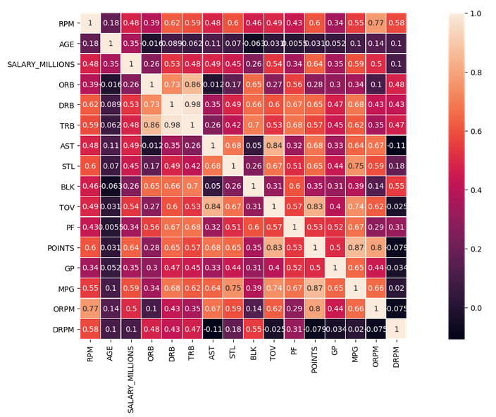

## 3.3 基本数据排名分析

### 3.3.1按照效率值排名

```python
# 按照效率值排名
# 获取所有行 降序
data.loc[:, ["PLAYER", "RPM", "AGE"]].sort_values(by="RPM", ascending=False).head()
```

### 3.3.2 按照球员薪资排名

```python
# 按照球员薪资排名
# 获取所有行 降序
data.loc[:, ["PLAYER", "RPM", "AGE", "SALARY_MILLIONS"]].sort_values(
    by="SALARY_MILLIONS", ascending=False).head()
```


## 3.4 常用的三个数据可视化方法

### 3.4.1 单变量

#### 3.4.1.1 设置图形基本样式 set_style

```python
sns.set_style('darkgrid')
```

#### 3.4.1.2 subplot画图

```python
plt.figure(figsize=(10, 10))

# 创建三幅图,三行一列,这是第一个
plt.subplot(3, 1, 1)
sns.distplot(data["SALARY_MILLIONS"])
plt.ylabel("salary")

plt.subplot(3, 1, 2)
sns.distplot(data["RPM"])
plt.ylabel("RPM")

plt.subplot(3, 1, 3)
sns.distplot(data["AGE"])
plt.ylabel("AGE")
```

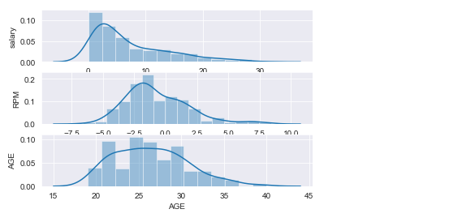

### 3.4.2 双变量

#### 3.4.2.1 直方图 hex

```python
sns.jointplot(data.AGE, data.SALARY_MILLIONS, kind="hex")
```

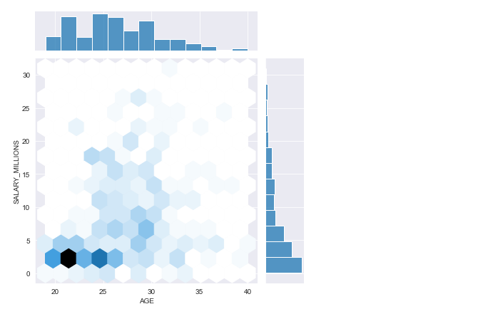


#### 3.4.2.2 核密度 kde

```python
sns.jointplot(data.AGE, data.SALARY_MILLIONS, kind="kde")
```

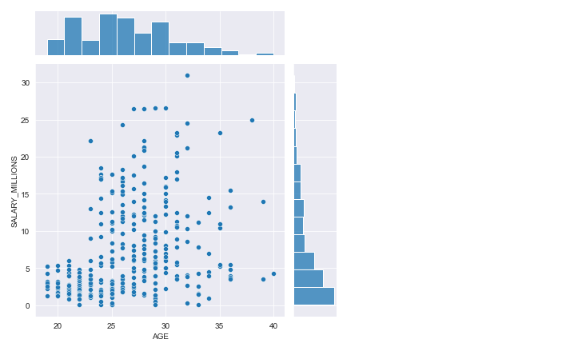


### 3.4.3 多变量 pairpolt

```python
multi_data = data.loc[:, ['RPM','SALARY_MILLIONS','AGE','POINTS']]
multi_data.head()
```

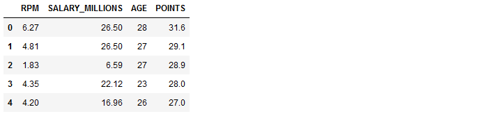

```python
sns.pairplot(multi_data)
```

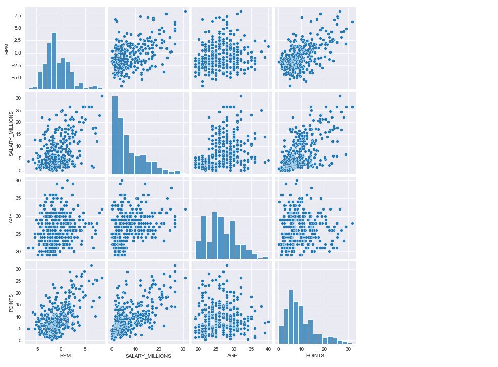


## 3.5 衍生变量的一些可视化实践-以年龄为例

### 3.5.1 按年龄分类

```python
# 定义分类年龄的函数
# 每一行都检测一遍
def age_cut(df):
    if df.AGE <= 24:
        return 'young'
    elif df.AGE >= 30:
        return 'old'
    else:
        return 'best'

# 对年龄进行划分
# axis=1 按照行检测
data['age_cut'] = data.apply(lambda x:age_cut(x), axis=1)

# 计数
data['cut'] = 1
```

### 3.5.2 测试

```python
# 通过 loc 判断,只要 age_cut 为best的
#data.loc[data.age_cut == "best"]

data[data.age_cut == "best"]
```

### 3.5.3 判断年龄最佳的人的薪水

```python
# 判断年龄最佳的人的薪水
data[data.age_cut == "best"].SALARY_MILLIONS.head()
```

### 3.5.4 基于年龄段对球员薪水和效率值进行分析

```python
# 设置风格
sns.set_style('darkgrid')
plt.figure(figsize=(10,10), dpi=100)
plt.title("RPM and Salary")
plt.xlabel('Salary')
plt.ylabel('RPM')

# 添加数据
x1 = data[data.age_cut == "young"].SALARY_MILLIONS
y1 = data[data.age_cut == "young"].RPM
plt.plot(x1, y1, "^", label="young")

x2 = data[data.age_cut == "best"].SALARY_MILLIONS
y2 = data[data.age_cut == "best"].RPM
plt.plot(x2, y2, "^", label="best")

x3 = data[data.age_cut == "old"].SALARY_MILLIONS
y3 = data[data.age_cut == "old"].RPM
plt.plot(x3, y3, "^", label="old")

# 显示图例
plt.legend(loc="best")

plt.show()
```

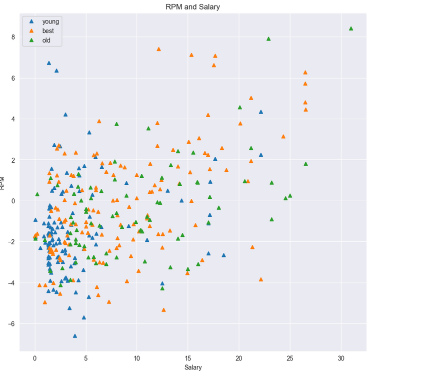

### 3.5.5 混合数据分析

```python
# 数据混合分析
data2 = data.loc[:, ['RPM','POINTS','TRB','AST','STL','BLK','age_cut']]
sns.pairplot(data2, hue="age_cut")
```

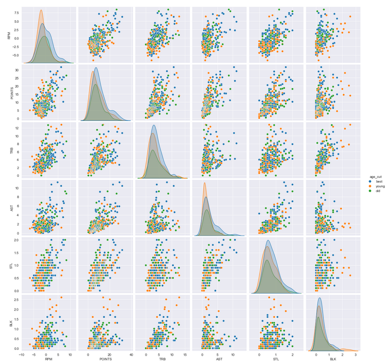


## 3.6 球队数据分析

### 3.6.1 agg 如何进行数据聚合

```python
# 显示里面的最高薪资
data.groupby(by='age_cut').agg({'SALARY_MILLIONS':np.max})
```


```python
# 显示里面的最低薪资
data.groupby(by='age_cut').agg({'SALARY_MILLIONS':np.min})
```


### 3.6.2 球队薪资平均值

```python
# 球队薪资平均值
data_team = data.groupby(by='TEAM').agg({'SALARY_MILLIONS':np.mean})
data_team.head()
```

```python
# 球队薪资水平排序
data_team.sort_values(by="SALARY_MILLIONS", ascending=False).head(10)
```

### 3.6.3 按照分球队分年龄段，上榜球员降序排列，如上榜球员数相同，则按效率值降序排列

```python
#                                               薪水平均值, 效率值, 球员数量
data_rpm = data.groupby(by=['TEAM', 'age_cut']).agg({"SALARY_MILLIONS": np.mean,
                                                     "RPM": np.mean,
                                                     "PLAYER": np.size})
data_rpm.head()
```

```python
# 球员数量和效率值降序排列
data_rpm.sort_values(by=['PLAYER', 'RPM'], ascending=False).head()
```

## 3.7 按照球队综合实力排名

### 3.7.1 按照队伍划分

```python
# 按照队伍划分
data_rpm2 = data.groupby(by=['TEAM'], as_index=False).agg({'SALARY_MILLIONS': np.mean,
                                                           'RPM': np.mean,
                                                           'PLAYER': np.size,
                                                           'POINTS': np.mean,
                                                           'eFG%': np.mean,
                                                           'MPG': np.mean,
                                                           'AGE': np.mean})
data_rpm2[:5]
```

### 3.7.2 按照球队效率值排列

```python
# 按照球队效率值排列
data_rpm2.sort_values(by='RPM', ascending=False).head()
```


## 3.8 利用箱线图和小提琴图进行数据分析

### 3.8.1 选择球队

```python
# 选择球队
data.TEAM.isin(['GS', 'CLE', 'SA', 'LAC', 'OKC', 'UTAH', 'CHA', 'TOR', 'NO', 'BOS']).head()
```

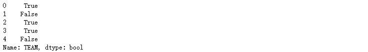

### 3.8.2 箱线图

```python
# 设置浅色
sns.set_style("whitegrid")

plt.figure(figsize=(20, 10))
# 获取需要的数据
data_team2 = data[data.TEAM.isin(['GS', 'CLE', 'SA', 'LAC', 'OKC', 'UTAH', 'CHA', 'TOR', 'NO', 'BOS'])]

# 进行相应的绘图
plt.subplot(311)
# x，y, hue:   data中的列名, x和y用来显示, hue用来改变颜色
sns.boxplot(x='TEAM', y='SALARY_MILLIONS', data= data_team2)


plt.subplot(312)
sns.boxplot(x='TEAM', y='AGE', data= data_team2)


plt.subplot(313)
sns.boxplot(x='TEAM', y='MPG', data= data_team2)
```

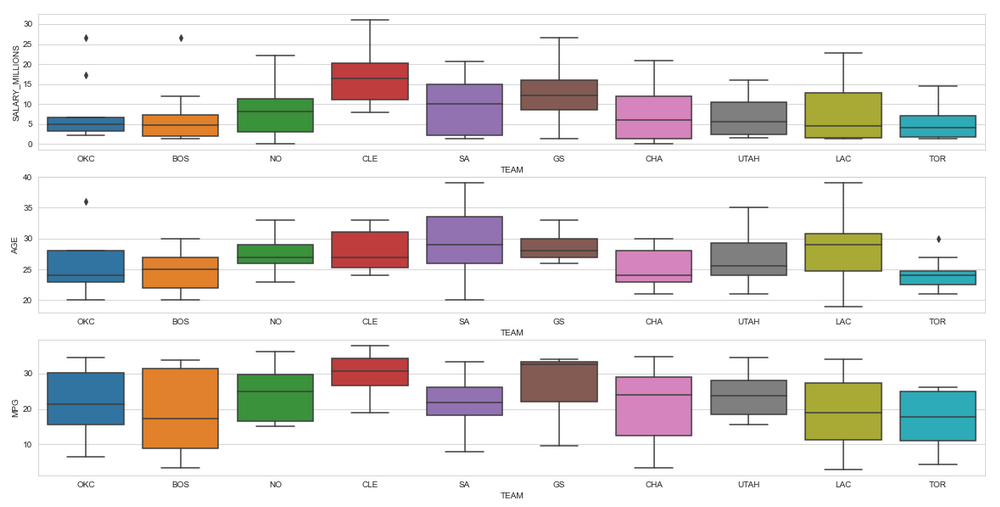

### 3.8.3 小提琴图

```python
plt.figure(figsize=(20, 10))
# 进行相应的绘图
plt.subplot(311)
# x，y, hue:   data中的列名, x和y用来显示, hue用来改变颜色
sns.violinplot(x='TEAM', y='3P%', data= data_team2)


plt.subplot(312)
sns.violinplot(x='TEAM', y='eFG%', data= data_team2)


plt.subplot(313)
sns.violinplot(x='TEAM', y='POINTS', data= data_team2)
```

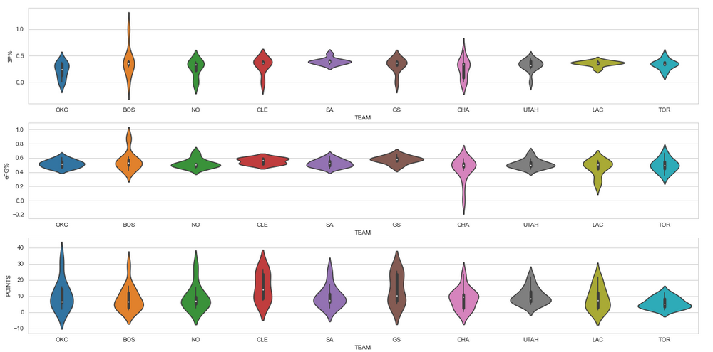


# 4 数据分析实战----北京租房数据统计分析

近年来随着经济的快速发展，一线城市的资源和就业机会吸引了很多外来人口，使其逐渐成为人口密集的城市之一。据统计，2017年北京市常住外来人口已经达到了2170.7万人，其中绝大多数人是以租房的形式解决居住问题。
本文将租房网站上北京地区的租房数据作为参考，运用前面所学到的数据分析知识，带领大家一起来分析真实数据，并以图表的形式得到以下
统计指标：

- (1)统计每个区域的房源总数量，并使用热力图分析房源位置分布情况。
- (2)使用条形图分析哪种户型的数量最多、更受欢迎。
- (3)统计每个区域的平均租金，并结合柱状图和折线图分析各区域的房源数量和租金情况。
- (4)统计面积区间的市场占有率，并使用饼图绘制各区间所占的比例。

## 4.1 数据基本介绍
目前网络上有很多的租房平台，比如自如、爱屋吉屋、房天下、链家等，其中，链家是目前市场占有率最高的公司，通过链家平台可以便捷且全面地提供可靠的房源信息。如下图所示:


通过网络爬虫技术，爬取链家网站中列出的租房信息(爬取结束时间为2018年9月10日)，具体包括所属区域、小区名称、房屋、价格、房屋面积、户型。需要说明的是，链家官网上并没有提供平谷、怀柔、密云、延庆等偏远地区的租房数据，所以本案例的分析不会涉及这四个地区。
将爬到的数据下载到本地，并保存在“链家北京租房数据.csv”文件中，打开该文件后可以看到里面有很多条（本案例爬取的数据共计8224条)信息，具体如下图所示。

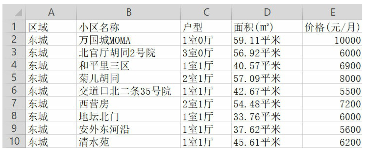


## 4.2 数据读取

准备好数据后，我们便可以使用 Pandas读取保存在CSV文件的数据，并将其转换成DataFrame对象展示，便于后续操作这些数据。

首先，读取数据：

```python
import pandas as pd
import numpy as np
# 读取链家北京租房信息
file_data = pd.read_csv('../data/链家北京租房数据.csv')
file_data.head()
```


## 4.3 数据预处理

尽管从链家官网上直接爬取下来的数据大部分是比较规整的，但或多或少还是会存在一些问题，不能直接用做数据分析。为此，在使用前需要对这些数据进行一系列的检测与处理，包括处理重复值和缺失值、统一数据类型等，以保证数据具有更高的可用性。

### 4.3.1重复值和空值处理	duplicated	drop_duplicates
预处理的前两步就是检查缺失值和重复值。如果希望检查准备的数据中是否存在重复的数据，则可以通过 Pandas中的 duplicated()方法完成。
接下来，通过 duplicated()方法对北京租房数据进行检测，只要有重复的数据就会映射为True，具体代码如下。

```python
# 重复数据检测
file_data.duplicated()
```

由于数据量相对较多，所以在 Jupyter NoteBook工具中有一部分数据会省略显示，但是从输出结果中仍然可以看到有多条返回结果为True的数据，这表明有重复的数据。这里，处理重复数据的方式是将其删除。接下来，使用 drop_duplicates()方法直接删除重复的数据，具体代码如下。

```python
# 删除重复数据
file_data = file_data.drop_duplicates()
```

与上一次输出的行数相比，可以很明显地看到减少了很多条数据，只剩下了5773条数据。
对数据重复检测完成之后，便可以检测数据中是否存在缺失值，我们可以直接使用 dropna()方法检测并删除缺失的数据，具体代码如下。

```python
# 删除缺失数据
file_data = file_data.dropna()
```

经过缺失数据检测之后，可以发现当前数据的总行数与之前相比没有发生任何变化。因此我们断定准备好的数据中并不存在缺失的数据。

### 4.3.2 数据转换类型

在这套租房数据中，“面积(m )”一列的数据里面有中文字符，说明这一列数据都是字符串类型的。为了方便后续对面积数据进行数学运算，所以需要将“面积(m)”一列的数据类型转换为float类型，具体代码如下。

```python
# 创建一个空数组
data_new = np.array([])

# 取出“面积”一列数据，将每个数据末尾的中文字符去除  fild_data.info()
data = file_data['面积(㎡)'].values
for i in data:
              data_new = np.append(data_new, np.array(i[:-2]))
        
# 通过astype()方法将str类型转换为float64类型
data = data_new.astype(np.float64)

# 用新的数据替换
#file_data.loc[:,'面积(㎡)']= data
file_data['面积(㎡)']=data
```

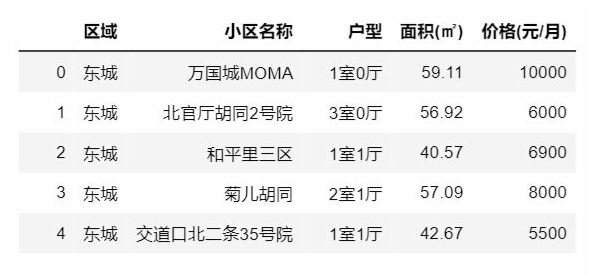

除此之外，在“户型”一列中，大部分数据显示的是“室厅”，只有个别数据显示的是"\房间*卫”(比如索引8219对应的一行)。为了方便后期的使用，需要将“房间"替换成"室"，以保证数据的一致性。
接下来，使用 Pandas的 replace(）方法完成替换数据的操作，具体代码如下。

```python
# 获取“户型”一列数据
housetype_data = file_data['户型']
temp_list = []
# 通过replace()方法进行替换
for i in housetype_data:
    new_info = i.replace('房间','室')
    temp_list.append(new_info)
    
#file_data.loc[:,'户型'] = temp_list
file_data['户型'] = temp_list
```

通过比较处理前与处理后的数据可以发现，索引为8219的户型数据已经由“4房间2卫”变成“4室2卫”，说明数据替换成功。

## 4.4 图表分析
数据经过预处理以后，便可以用它们来做分析了，为了能够更加直观地看到数据的变化，这里，我们采用图表的方式来辅助分析。

### 4.4.1房源数量、位置分布分析
如果希望统计各个区域的房源数量，以及查看这些房屋的分布情况，则需要先获取各个区的房源。为了实现这个需求，可以将整个数据按照“区域”一列进行分组。
为了能够准确地看到各区域的房源数量，这里只需要展示“区域”与“数量”这两列的数据即可。因此，先创建一个空的 DataFrame对象，然后再将各个区域计算的总数量作为该对象的数据进行展示，具体代码如下。

```python
# 创建一个DataFrame对象，该对象只有两列数据：区域和数量
new_df = pd.DataFrame({'区域':file_data['区域'].unique(),'数量':[0]*13})
```


接下来，通过 Pandas的 groupby()方法将 file data对象按照“区域”一列进行分组，并利用count()方法统计每个分组的数量，具体代码如下。

```python
# 按“区域”列将file_data进行分组，并统计每个分组的数量
groupy_area = file_data.groupby(by='区域').count()
new_df['数量'] = groupy_area.values
```

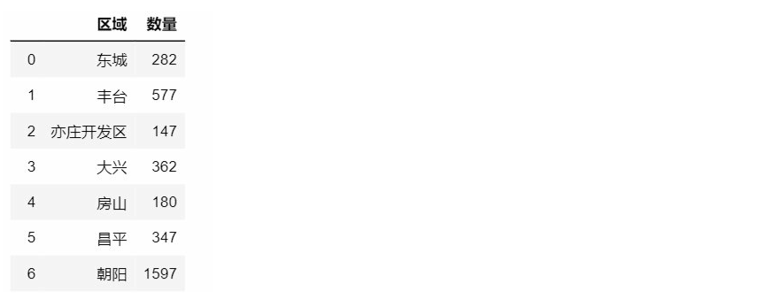

通过 sort_values()方法对new_df对象排序，按照从大到小的顺序进行排列，具体代码如下。

```python
# 按“数量”一列从大到小排列
new_df.sort_values(by=['数量'], ascending=False)
```

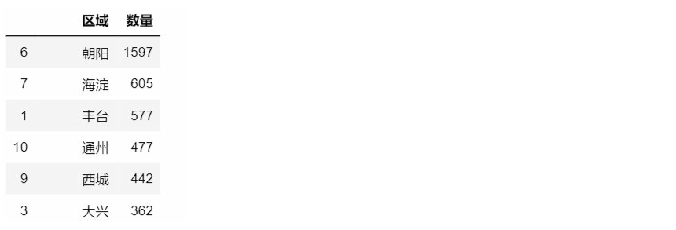

通过输出的排序结果可以看出，房源数量位于前的区域分别是朝阳区、海淀区、丰台区

### 4.4.2 户型数量分析

随着人们生活水平的提高，以及各住户的生活需求，开发商设计出了各种各样的户型供人们居住。接下来，我们来分析一下户型，统计租房市场中哪种户型的房源数量偏多，并筛选出数量大于50的户型。
首先，我们定义一个函数来计算各种户型的数量，具体代码如下。

```python
# 定义函数，用于计算各户型的数量
def all_house(arr):
    key = np.unique(arr)
    result = {}
    for k in key:
        # mask是一个 Series
        mask = (arr == k)
        print(mask)
        
        arr_new = arr[mask]
        v = arr_new.size
        result[k] = v
    return result
# 获取户型数据
house_array = file_data['户型']
house_info = all_house(house_array)
```

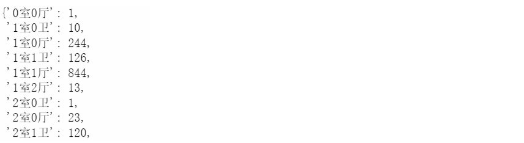

程序输出了一个字典，其中，字典的键表示户型的种类，值表示该户型的数量。
使用字典推导式将户型数量大于50的元素筛选出来，并将筛选后的结果转换成 DataFrame对象，具体代码如下。

```python
# 使用字典推导式                                                           户型多余50才显示
#house_type = dict((key, value) for key, value in house_info.items() if value > 50)
house_type = {key:value for key, value in house_info.items() if value > 50}
show_houses = pd.DataFrame({'户型':[x for x in  house_type.keys()],
                  			'数量':[x for x in house_type.values()]})
```

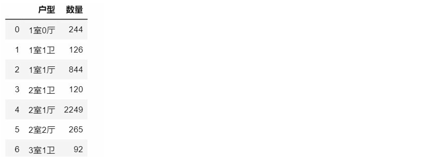

为了能够更直观地看到户型数量间的差异，我们可以使用条形图进行展示，其中，条形图纵轴坐标代表户型种类，横坐标代表数量体代码如下

```python
import matplotlib.pyplot as plt
house_type1 = show_houses['户型']
house_type_num = show_houses['数量']
plt.barh(range(house_type1), house_type_num, height=0.7, color='steelblue', alpha=0.8)     
plt.yticks(range(house_type1), house_type1)
plt.xlim(0,2500)  # 把x轴坐标延长到2500
plt.xlabel("数量")
plt.ylabel("户型种类")
plt.title("北京地区各户型房屋数量")
for x, y in enumerate(house_type_num):
    plt.text(y + 0.2, x - 0.1, '%s' % y)
    
    
# 解决中文显示问题
plt.rcParams['font.sans-serif'] = ['KaiTi']  # 指定默认字体
plt.rcParams['axes.unicode_minus'] = False  # 解决保存图像是负号'-'显示为方块的问题
plt.show()
```

运行结果如下图所示。

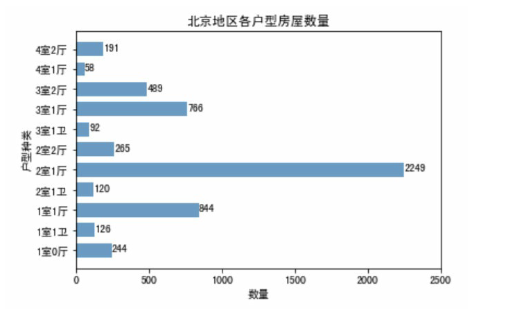

通过图可上以清晰地看出，整个租房市场中户型数量较多分别为“2室1厅”、“1室1厅”、“3室1厅”的房屋，其中，“2室1厅”户型的房屋在整个租房市场中是数量最多的。

### 4.4.3 平均租金分析

为了进一步剖析房屋的情况，接下来，我们来分析一下各地区目前的平均租金情况。计算各区域房租的平均价格与计算各区域户型数量的方法大同小异，首先创建一个 DataFrame对象，具体代码如下。

```python
# 新建一个DataFrame对象，设置房租总金额和总面积初始值为0
df_all = pd.DataFrame({'区域':file_data['区域'].unique(),
                         '房租总金额':[0]*13,
                         '总面积(㎡)':[0]*13}
```

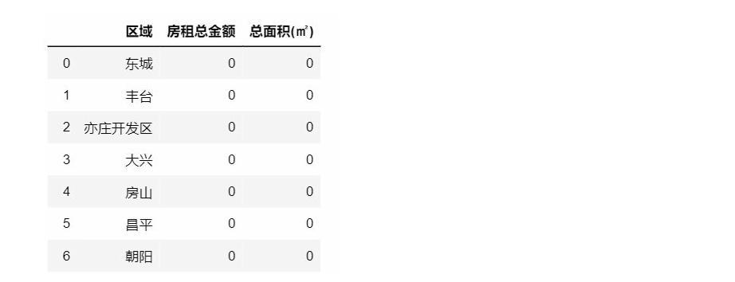

接下来，按照“区域”一列进行分组，然后调用sum()方法分别对房租金额和房屋面积执行求和计算，具体代码如下:

```python
# 求总金额和总面积                列名在前在后都可以
sum_price = file_data.groupby(file_data['区域'])['价格(元/月)'].sum()
sum_area = file_data['面积(㎡)'].groupby(file_data['区域']).sum()

df_all['房租总金额'] = sum_price.values
df_all['总面积(㎡)'] = sum_area.values
```

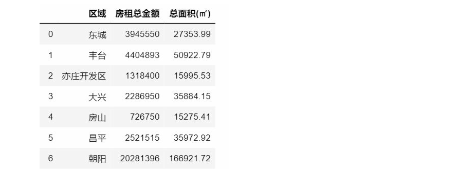

计算出各区域房租总金额和总面积之后，便可以对每平方米的租金进行计算。在df_all对象的基础上增加一列，该列的名称为“每平方米租金(元)”，数据为求得的每平方米的平均价格，具体代码如下。

```python
# 计算各区域每平米房租价格,并保留两位小数
df_all['每平米租金(元)'] = round(df_all['房租总金额'] / df_all ['总面积(㎡)'], 2)
```

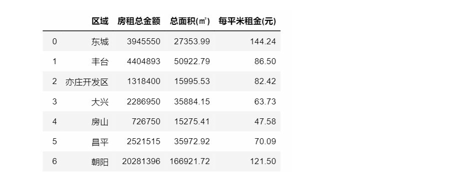

为了能更加全面地了解到各个区域的租房数量与平均租金，我们可以将之前创建的 new_df对象(各区域房源数量)与df_all对象进行合并展示，由于这两个对象中都包含“区域”一列，所以这里可以采用主键的方式进行合并，也就是说通过 merge()函数来实现，具体代码如下。

```python
# concat 是直接左右拼接,会有重复值
#df_merge = pd.concat([new_df, df_all], axis=1)

# new_df 与 df_all 进行合并   merge 默认内连接
df_merge = pd.merge(new_df, df_all)
df_merge
```


合并完数据以后，就可以借用图表来展示各地区房屋的信息，其中，房源的数量可以用柱状图中的条柱表示，每平方米租金可以用折线图中的点表示，具体代码如下。

```python
# l 是 x轴下标  lx 是x下标文字
# 画图
fig = plt.figure(figsize=(10, 8), dpi=100)

# 显示折线图
ax1 = fig.add_subplot(111)
ax1.plot(l, price, 'or-', label='价格')    # "or-" 显示那个小红圆点
for i, (_x, _y) in enumerate(zip(l, price)):
    plt.text(_x, _y, price[i])

# y轴数字显示
ax1.set_ylim([0, 200])
ax1.set_ylabel('价格')
# 标签位置
plt.legend(loc='upper left')


# 显示条形图
ax2 = ax1.twinx()  # 显示次坐标轴ax2=ax1.twinx()
plt.bar(l, num, alpha=0.3, color='green', label='数量')
ax2.set_ylabel('数量')
# 标签位置
plt.legend(loc="upper right")

# x轴坐标显示
plt.xticks(l, lx)

plt.show()
```

运行结果如下：

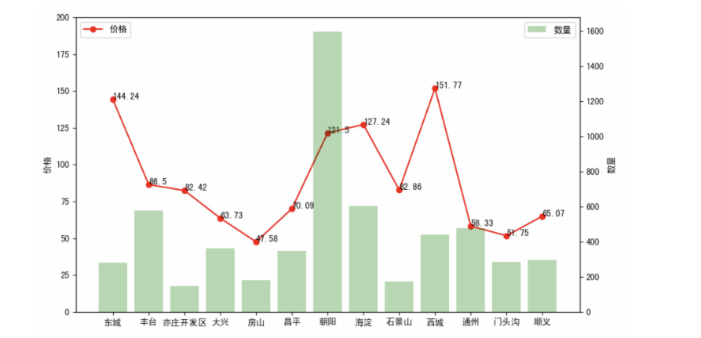

从图中可以看出，西城区、东城区、海淀区、朝阳区的房租价格相对较高，这主要是因为东城区和西城区作为北京市的中心区，租金相比其他几个区域自然偏高一些，而海淀区租金较高的原因推测可能是海淀区名校较多，也是学区房最火热的地带，朝阳区内的中央商务区聚集了大量的世界500强公司，因此这四个区域的房租相对其他区域较高。

### 4.4.4 面积区间分析

下面我们将房屋的面积数据按照一定的规则划分成多个区间，看一下各面积区间的上情况，便于分析租房市场中哪种房屋类型更好出租，哪个面积区间的相房人数最多
要想将数据划分为若干个区间，则可以使用Pame中的cut()函数来实现，首先，使用max()与min()方法分别计算出房屋面积的最大值和最小值，具体代码如下。

```python
# 查看房屋的最大面积和最小面积
print('房屋最大面积是%d平米'%(file_data['面积(㎡)'].max()))
print('房屋最小面积是%d平米'%(file_data['面积(㎡)'].min()))
# 查看房租的最高值和最小值
print('房租最高价格为每月%d元'%(file_data['价格(元/月)'].max()))
print('房屋最低价格为每月%d元'%(file_data['价格(元/月)'].min()))
```

在这里，我们参照链家网站的面积区间来定义，将房屋面积划分为8个区间。然后使用describe()方法显示各个区间出现的次数( counts表示)以及频率(freps表示)，具体代码如下。

```python
# 面积划分
area_divide = [1, 30, 50, 70, 90, 120, 140, 160, 1200]

# 要将 file_data['面积(㎡)'] 转换为list
area_cut = pd.cut(list(file_data['面积(㎡)']), area_divide)
area_cut_data = area_cut.describe()
```

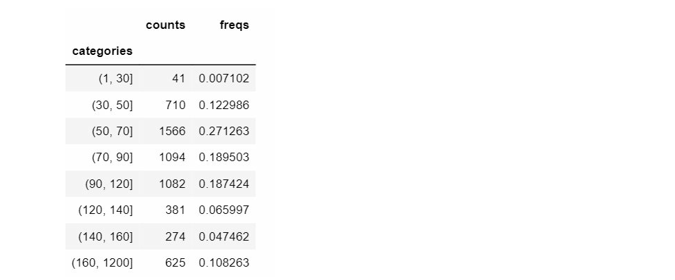

接着，使用饼图来展示各面积区间的分布情况，具体代码如下

```python
# 因为是百分比所以要乘100
area_percentage = (area_cut_data['freqs'].values) * 100

labels  = ['30平米以下', '30-50平米', '50-70平米', '70-90平米','90-120平米','120-140平米','140-160平米','160平米以上']

plt.figure(figsize=(20, 8), dpi=100)
#plt.axes(aspect=1)    # 显示的是圆形,如果不加,是椭圆形     autopct:占比显示指定%1.2f%%
plt.pie(area_percentage, labels=labels, autopct='%.2f %%', shadow=True)
plt.legend(loc='upper right')
plt.show()
```

运行结果如图所示：

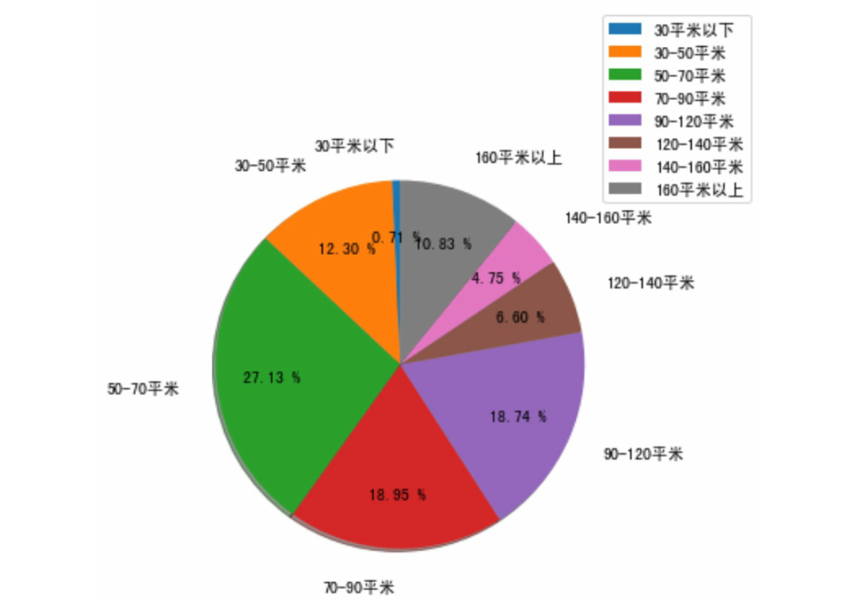

通过上图可以看出，50-70平方米的房屋在租房市场中占有率最大。总体看来，租户主要以120平方米以下的房屋为租住对象，其中50~70平方米以下的房屋为租户的首选对象。

