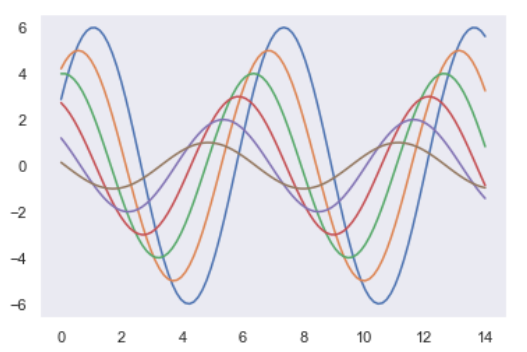
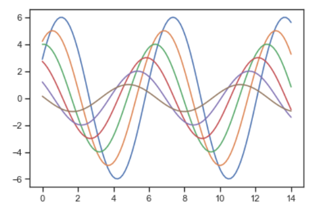

# 整体风格设置

```python
import numpy as np
import matplotlib.pyplot as plt
import seaborn as sns

def sinplot(flip=1):
    x = np.linspace(0, 14, 100) # 0~14 100个点
    # 画7条函数
    for i in range(1, 7):
        # 画点
        plt.plot(x, np.sin(x + i * 0.5) * (7 - i) * flip)
```

## plt画风

```python
sinplot()
```


## sns.set() seaborn默认风格

```python
sns.set()
sinplot()
```


## 5种风格

### darkgrid

```python
sns.set_style('darkgrid')
sinplot()
```


### whitegrid

```python
sns.set_style('whitegrid')
sinplot()
```


### dark

```python
sns.set_style('dark')
sinplot()
```



### white

```python
sns.set_style('white')
sinplot()
```


### ticks

```python
sns.set_style('ticks')
sinplot()
```



## despine 删除右上边框

```python
sinplot()
sns.despine()
```


# 调色板 color_palette

- color_palette() 能传入任何matplotlib所支持的颜色
- color_palette() 不写参数则设置为默认颜色
- set_palette() 设置所有图的颜色

## 多个默认的颜色循环主图: deep,muted,pastel,bright,dark,colorbind.

```python
current_palette = sns.color_palette()
sns.palplot(current_palette)
```


## color_palette(hls,12) 圆形画板

> 当有多个分类要区分时,最简单的方法是在一个圆形的空间中均匀间隔取颜色(色调会保持饱和度和明度不变)
>
> 最常用hls空间

```python
sns.palplot(sns.color_palette('hls', 12))# 12种颜色
```


```python
data = np.random.normal(size=(20, 12)) + np.arange(12) / 2
sns.boxplot(data=data, palette=sns.color_palette('hls', 12))
```


## hls_palette() 控制颜色亮度和饱和度

- l 亮度   lightness
- s 饱和度 saturation

```python
sns.palplot(sns.hls_palette(12, l=0.3, s=0.8))	# 12种颜色
```


```python
sns.boxplot(data=data, palette=sns.hls_palette(12, l=0.3, s=0.8))
```


## color_palette(Paired,12) 颜色成对出现

```python
sns.palplot(sns.color_palette('Paired', 12))# 12种颜色
```


```python
sns.boxplot(data=data, palette=sns.color_palette('Paired', 12))
```


## xkcd 调色板颜色设置

xkcd包含了一套针对随机RGB色的命名,产生了954个可以以随时通过xkcd_rgb字典调用的命名颜色

### xkcd_rgb

> 颜色实例 https://xkcd.com/color/rgb/

```python
sns.set_style('whitegrid')
plt.plot([0, 1], [0, 1], sns.xkcd_rgb['pale red'], lw=3)
plt.plot([0, 1], [0, 2], sns.xkcd_rgb['medium green'], lw=3)
plt.plot([0, 1], [0, 3], sns.xkcd_rgb['denim blue'], lw=3)
```


### xkcd_palette

```python
colors = ['windows blue', 'amber', 'greyish', 'faded green', 'dusty purple']
sns.palplot(sns.xkcd_palette(colors))
```


## 连续色板

色彩随着数据变化,比如数据越来越重要颜色越深

支持的字典:

```python
'Accent', 'Accent_r', 'Blues', 'Blues_r', 'BrBG', 'BrBG_r', 'BuGn', 'BuGn_r', 'BuPu', 'BuPu_r', 'CMRmap', 'CMRmap_r', 'Dark2', 'Dark2_r', 'GnBu', 'GnBu_r', 'Greens', 'Greens_r', 'Greys', 'Greys_r', 'OrRd', 'OrRd_r', 'Oranges', 'Oranges_r', 'PRGn', 'PRGn_r', 'Paired', 'Paired_r', 'Pastel1', 'Pastel1_r', 'Pastel2', 'Pastel2_r', 'PiYG', 'PiYG_r', 'PuBu', 'PuBuGn', 'PuBuGn_r', 'PuBu_r', 'PuOr', 'PuOr_r', 'PuRd', 'PuRd_r', 'Purples', 'Purples_r', 'RdBu', 'RdBu_r', 'RdGy', 'RdGy_r', 'RdPu', 'RdPu_r', 'RdYlBu', 'RdYlBu_r', 'RdYlGn', 'RdYlGn_r', 'Reds', 'Reds_r', 'Set1', 'Set1_r', 'Set2', 'Set2_r', 'Set3', 'Set3_r', 'Spectral', 'Spectral_r', 'Wistia', 'Wistia_r', 'YlGn', 'YlGnBu', 'YlGnBu_r', 'YlGn_r', 'YlOrBr', 'YlOrBr_r', 'YlOrRd', 'YlOrRd_r', 'afmhot', 'afmhot_r', 'autumn', 'autumn_r', 'binary', 'binary_r', 'bone', 'bone_r', 'brg', 'brg_r', 'bwr', 'bwr_r', 'cividis', 'cividis_r', 'cool', 'cool_r', 'coolwarm', 'coolwarm_r', 'copper', 'copper_r', 'crest', 'crest_r', 'cubehelix', 'cubehelix_r', 'flag', 'flag_r', 'flare', 'flare_r', 'gist_earth', 'gist_earth_r', 'gist_gray', 'gist_gray_r', 'gist_heat', 'gist_heat_r', 'gist_ncar', 'gist_ncar_r', 'gist_rainbow', 'gist_rainbow_r', 'gist_stern', 'gist_stern_r', 'gist_yarg', 'gist_yarg_r', 'gnuplot', 'gnuplot2', 'gnuplot2_r', 'gnuplot_r', 'gray', 'gray_r', 'hot', 'hot_r', 'hsv', 'hsv_r', 'icefire', 'icefire_r', 'inferno', 'inferno_r', 'jet', 'jet_r', 'magma', 'magma_r', 'mako', 'mako_r', 'nipy_spectral', 'nipy_spectral_r', 'ocean', 'ocean_r', 'pink', 'pink_r', 'plasma', 'plasma_r', 'prism', 'prism_r', 'rainbow', 'rainbow_r', 'rocket', 'rocket_r', 'seismic', 'seismic_r', 'spring', 'spring_r', 'summer', 'summer_r', 'tab10', 'tab10_r', 'tab20', 'tab20_r', 'tab20b', 'tab20b_r', 'tab20c', 'tab20c_r', 'terrain', 'terrain_r', 'turbo', 'turbo_r', 'twilight', 'twilight_r', 'twilight_shifted', 'twilight_shifted_r', 'viridis', 'viridis_r', 'vlag', 'vlag_r', 'winter', 'winter_r'
```


```python
sns.palplot(sns.color_palette('Blues'))
```


> 如果颜色翻转,在颜色后面加 `_r`

```python
sns.palplot(sns.color_palette('Blues_r', 12))
```


```python
sns.boxplot(data=data, palette=sns.color_palette('BuGn_r', 12))
```


## cubehelix_palette() 色调线性变化

```python
sns.palplot(sns.cubehelix_palette(8))
```


```python
sns.palplot(sns.cubehelix_palette(8, start=0.5, rot=0.75, reverse=True))
```


```python
sns.boxplot(data=data, palette=sns.cubehelix_palette(12, start=0.5, rot=0.150))
```


## light_palette() dark_palette() d调用指定连续调色板

```python
sns.palplot(sns.light_palette('yellow', 10))
```


```python
sns.palplot(sns.dark_palette('yellow', 10, reverse=True)) # 翻转顺序
```


```python
sns.boxplot(data=data, palette=sns.dark_palette('orange', 12))
```


```python
x, y = np.random.multivariate_normal([0,0], [[1, -0.5], [-0.5, 1]], size=300).T
pal = sns.dark_palette('green', as_cmap=True)
sns.kdeplot(x, y, cmap=pal)
```

