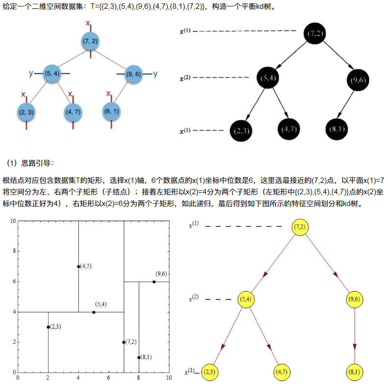
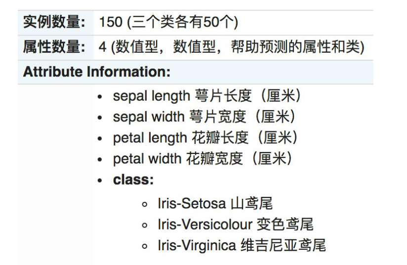

# 1 K-近邻算法(KNN)概念
K Nearest Neighbor算法又叫KNN算法，这个算法是机器学习里面一个比较经典的算法， 总体来说KNN算法是相对比较容易理解的算法

- 定义
    如果一个样本在特征空间中的k个最相似(即特征空间中最邻近)的样本中的大多数属于某一个类别，则该样本也属于这个类别。

    周围大多数是什么,你就是什么

    求出和所有数据的距离,最近的就是你
    
    > 来源：KNN算法最早是由Cover和Hart提出的一种分类算法 
    
- 距离公式
    两个样本的距离可以通过如下公式计算，又叫欧式距离 ，关于距离公式会在后面进行讨论


分别求唐人街探案到其他电影的距离,找距离最近的,k=5代表找5个最近的

## 1.1 KNN算法流程总结
1）计算已知类别数据集中的点与当前点之间的距离
2）按距离递增次序排序
3）选取与当前点距离最小的k个点
4）统计前k个点所在的类别出现的频率
5）返回前k个点出现频率最高的类别作为当前点的预测分类


# 2 k近邻算法api初步使用    KNeighborsClassifier

## 2.1 Scikit-learn工具介绍

### 2.1.1 安装
`pip3 install scikit-learn==0.19.1`

安装好之后可以通过以下命令查看是否安装成功

`import sklearn`

- 注：安装scikit-learn需要Numpy, Scipy等库

### 2.1.2 Scikit-learn包含的内容

- 分类、聚类、回归
- 特征工程
- 模型选择、调优

### 2.1.3 案例

#### 3.1 步骤分析

- 1.获取数据集
- 2.数据基本处理（该案例中省略）
- 3.特征工程（该案例中省略）
- 4.机器学习
- 5.模型评估（该案例中省略）

#### 3.2 代码过程    KNeighborsClassifier

- 导入模块

```python
from sklearn.neighbors import KNeighborsClassifier
```

- 构造数据集

```python
# x二维, y一维
x = [[0], [1], [2], [3]]
y = [0, 0, 1, 1]
```

- 机器学习 -- 模型训练

```python
# 实例化API						n_neighbors 就是k,参考几个类别
estimator = KNeighborsClassifier(n_neighbors=1)
# 使用fit方法进行训练
estimator.fit(x, y)

#             预测数据必须是二维的
estimator.predict([[1]])

# 检测结果评分             测试值
score = estimator.score(x_test, y_test)
```


# 3 距离度量

## 3.1 距离公式的基本性质
在机器学习过程中，对于函数 dist(.,.)，若它是一"距离度量" (distance measure)，则需满足一些基本性质:

- 非负性： dist(X ,X ) >= 0 ；
- 同一性：dist(x ,x ) = 0。当且仅当 X = X  ；
- 对称性： dist(x ,x ) = dist(x ,x )；
- 直递性： dist(x ,x ) <= dist(x ,x )+dist(x ,x )

>  直递性常被直接称为“三⻆不等式”。

## 3.2 常⻅的距离公式

### 2.1 欧式距离(Euclidean Distance)：

欧氏距离是最容易直观理解的距离度量方法，我们小学、初中和高中接触到的两个点在空间中的距离一般都是指欧氏距离。


```python
X=[[1,1],[2,2],[3,3],[4,4]];
经计算得:
d = 1.4142    2.8284    4.2426    1.4142    2.8284    1.4142
```


### 2.2 曼哈顿距离(Manhattan Distance)：

在曼哈顿街区要从一个十字路口开⻋到另一个十字路口，驾驶距离显然不是两点间的直线距离。这个实际驾驶距离就是“曼哈顿距离”。曼哈顿距离也称为“城市街区距离”(City Block distance)。


```python
X=[[1,1],[2,2],[3,3],[4,4]];
经计算得:
d =   2     4     6     2     4     2
```

### 2.3 切比雪夫距离 (Chebyshev Distance)：

国际象棋中，国王可以直行、横行、斜行，所以国王走一步可以移动到相邻8个方格中的任意一个。

国王从格子(x1,y1)走到格子(x2,y2)最少需要多少步？这个距离就叫切比雪夫距离

x,y两个方向中,两者中最大的距离就是切比雪夫距离


```python
X=[[1,1],[2,2],[3,3],[4,4]];
经计算得:
d =   1     2     3     1     2     1
```


### 2.4 闵可夫斯基距离(Minkowski Distance)：

闵氏距离不是一种距离，而是一组距离的定义，是对多个距离度量公式的概括性的表述。
两个n维变量a(x11,x12,...,x1n)与b(x21,x22,...,x2n)间的闵可夫斯基距离定义为：


根据p的不同，闵氏距离可以表示某一类/种的距离


# 4 k值的选择

## 4.1 K值选择说明


# 5 kd树

问题导入：
实现k近邻算法时，主要考虑的问题是如何对训练数据进行快速k近邻搜索。
这在特征空间的维数大及训练数据容量大时尤其必要。
k近邻法最简单的实现是线性扫描（穷举搜索），即要计算输入实例与每一个训练实例的距离。计算并存储好以后，再查找K近邻。当训练集很大时，计算非常耗时。
为了提高kNN搜索的效率，可以考虑使用特殊的结构存储训练数据，以减小计算距离的次数。

## 5.1 kd树简介
##1.1 什么是kd树
根据KNN每次需要预测一个点时，我们都需要计算训练数据集里每个点到这个点的距离，然后选出距离最近的k个点进行投票。当数据集很大时，这个计算成本非常高，针对N个样本，D个特征的数据集，其算法复杂度为O（DN）。
kd树：为了避免每次都重新计算一遍距离，算法会把距离信息保存在一棵树里，这样在计算之前从树里查询距离信息，尽量避免重新计算。其基本原理是，如果A和B距离很远，B和C距离很近，那么A和C的距离也很远。有了这个信息，就可以在合适的时候跳过距离远的点。
这样优化后的算法复杂度可降低到O（DNlog（N））。感兴趣的读者可参阅论文：Bentley，J.L.，Communications ofthe ACM（1975）。
1989年，另外一种称为Ball Tree的算法，在kd Tree的基础上对性能进一步进行了优化。感兴趣的读者可以搜索Five balltree construction algorithms来了解详细的算法信息。

### 原理

一次分成两部分,再接着分开


- 1.树的建立；
- 2.最近邻域搜索（Nearest-Neighbor Lookup）
    kd树(K-dimension tree)是**一种对k维空间中的实例点进行存储以便对其进行快速检索的树形数据结构**。kd树是一种二叉树，表示对k维空间的一个划分，**构造kd树相当于不断地用垂直于坐标轴的超平面将K维空间切分，构成一系列的K维超矩形区域**。kd树的每个结点对应于一个k维超矩形区域。**利用kd树可以省去对大部分数据点的搜索，从而减少搜索的计算量**。


## 5.2 构造方法

选择第一个,结构递归选择,知道子区域没有数据为止

- （1）**构造根结点，使根结点对应于K维空间中包含所有实例点的超矩形区域**；
    - **选择中位数作为根结点**

- （2）**通过递归的方法，不断地对k维空间进行切分，生成子结点**。在超矩形区域上选择一个坐标轴和在此坐标轴上的一个切分点，确定一个超平面，这个超平面通过选定的切分点并垂直于选定的坐标轴，将当前超矩形区域切分为左右两个子区域（子结点）；这时，实例被分到两个子区域。
- （3）**上述过程直到子区域内没有实例时终止（终止时的结点为叶结点）**。在此过程中，将实例保存在相应的结点上。
- （4）通常，循环的选择坐标轴对空间切分，选择训练实例点在坐标轴上的中位数为切分点，这样得到的kd树是平衡的（平衡二叉树：它是一棵空树，或其左子树和右子树的深度之差的绝对值不超过1，且它的左子树和右子树都是平衡二叉树）。

KD树中每个节点是一个向量，和二叉树按照数的大小划分不同的是，KD树每层需要选定向量中的某一维，然后根据这一维按左小右大的方式划分数据。在构建KD树时，关键需要解决2个问题：

- （1）**选择向量的哪一维进行划分；**

- （2）**如何划分数据；**

第一个问题简单的解决方法可以是随机选择某一维或按顺序选择，但是**更好的方法应该是在数据比较分散的那一维进行划分（分散的程度可以根据方差来衡量）。**
第二个问题中，好的划分方法可以使构建的树比较平衡，可以每次选择中位数来进行划分。

**多维度的话,看哪一个维度方差大,就选哪一个维度**


## 5.3 案例分析

### 5.3.1 树的建立



### 5.3.2 最近领域的搜索

假设标记为星星的点是 test point， 绿色的点是找到的近似点，在回溯过程中，需要用到一个队列，存储需要回溯的点，在判断其他子节点空间中是否有可能有距离查询点更近的数据点时，做法是以查询点为圆心，以当前的最近距离为半径画圆，这个圆称为候选超球（candidate hypersphere），如果圆与回溯点的轴相交，则需要将轴另一边的节点都放到回溯队列里面来。


#### 5.3.2.1 查找点(2.1,3.1)


在(7,2)点测试到达(5,4)，在(5,4)点测试到达(2,3)，然后search_path中的结点为<(7,2),(5,4), (2,3)>，从search_path中取出(2,3)作为当前最佳结点nearest, dist为0.141；
然后回溯至(5,4)，以(2.1,3.1)为圆心，以dist=0.141为半径画一个圆，并不和超平面y=4相交，如上图，所以不必跳到结点(5,4)的右子空间去搜索，因为右子空间中不可能有更近样本点了。于是再回溯至(7,2)，同理，以(2.1,3.1)为圆心，以dist=0.141为半径画一个圆并不和超平面x=7相交，所以也不用跳到结点(7,2)的右子空间去搜索。
至此，search_path为空，结束整个搜索，返回nearest(2,3)作为(2.1,3.1)的最近邻点，最近距离为0.141。

#### 5.3.2.2 查找点(2,4.5)


在(7,2)处测试到达(5,4)，在(5,4)处测试到达(4,7)【优先选择在本域搜索】，然后search_path中的结点为**<(7,2),(5,4),(4,7)>**，从search_path中取出(4,7)作为当前最佳结点nearest, dist为3.202；
然后回溯至(5,4)，以**(2,4.5)**为圆心，以dist=3.202为半径画一个圆与超平面y=4相交，所以需要跳到(5,4)的左子空间去搜索。所以要将(2,3)加入到search_path中，现在search_path中的结点为**<(7,2),(2, 3)>**；另外，(5,4)与(2,4.5)的距离为3.04 < dist = 3.202，所以将(5,4)赋给nearest，并且dist=3.04。
回溯至(2,3)，(2,3)是叶子节点，直接平判断(2,3)是否离(2,4.5)更近，计算得到距离为1.5，所以nearest更新为(2,3)，dist更新为(1.5)
回溯至(7,2)，同理，以**(2,4.5)**为圆心，以dist=1.5为半径画一个圆并不和超平面x=7相交, 所以不用跳到结点(7,2)的右子空间去搜索。
至此，**search_path**为空，结束整个搜索，返回nearest(2,3)作为(2,4.5)的最近邻点，最近距离为1.5。

**判断search_path中的数据之后就出栈**

**没有相交就向上回溯,有相交就先去上面一层节点,判断最小距离,再去另一个子节点,再更新距离,在向上递归**


# 6 案例：鸢尾花种类预测--数据集介绍

## 6.1 案例：鸢尾花种类预测

Iris数据集是常用的分类实验数据集，由Fisher, 1936收集整理。Iris也称鸢尾花卉数据集，是一类多重变量分析的数据集。关于数据集的具体介绍：


## 6.2 scikit-learn中数据集介绍

### 1 scikit-learn数据集API介绍

- sklearn.datasets
    - 加载获取流行数据集
    - datasets.load_*()
        - 获取小规模数据集，数据包含在datasets里
    - datasets.fetch_*(data_home=None)
        - data_home: 路径
        - 获取大规模数据集，需要从网络上下载，函数的第一个参数是data_home，表示数据集下载的目录,默认是 ~/scikit_learn_data/

### 1.1 sklearn小数据集    sklearn.datasets.load_*()

加载并返回鸢尾花数据集

| 名称           | 数量 |
| -------------- | ---- |
| 类别           | 3    |
| 特征           | 4    |
| 样本数量       | 150  |
| 每个类别的数量 | 50   |

### 1.2 sklearn大数据集    sklearn.datasets.fetch_*(data_home=None)
- sklearn.datasets.fetch_20newsgroups(data_home=None,subset=‘train’)
    - data_home: 路径
    - subset：'train'或者'test'，'all'，可选，选择要加载的数据集。
    - 训练集的“训练”，测试集的“测试”，两者的“全部”

## 6.3 sklearn数据集返回值介绍

- load和fetch返回的数据类型datasets.base.Bunch(字典格式)
    - data：特征数据数组，是 [n_samples * n_features] 的二维 numpy.ndarray 数组
    - target：标签数组，是 n_samples 的一维 numpy.ndarray 数组
    - DESCR：数据描述
    - feature_names：特征名,新闻数据，手写数字、回归数据集没有
    - target_names：标签名

```python
from sklearn.datasets import load_iris
# 获取鸢尾花数据集
iris = load_iris()
print("鸢尾花数据集的返回值：\n", iris)
# 返回值是一个继承自字典的Bench
print("鸢尾花的特征值:\n", iris["data"])
print("鸢尾花的目标值：\n", iris.target)
print("鸢尾花特征的名字：\n", iris.feature_names)
print("鸢尾花目标值的名字：\n", iris.target_names)
print("鸢尾花的描述：\n", iris.DESCR)
```

## 6.4 查看数据分布	seaborn.lmplot()

通过创建一些图，以查看不同类别是如何通过特征来区分的。 在理想情况下，标签类将由一个或多个特征对完美分隔。 在现实世界中，这种理想情况很少会发生。

- seaborn介绍
- Seaborn 是基于 Matplotlib 核心库进行了更高级的 API 封装，可以让你轻松地画出更漂亮的图形。而 Seaborn的漂亮主要体现在配色更加舒服、以及图形元素的样式更加细腻。
- 安装 pip3 install seaborn
- seaborn.lmplot() 是一个非常有用的方法，它会在绘制二维散点图时，自动完成回归拟合
    - sns.lmplot() 里的 x, y 分别代表横纵坐标的列名,
    - data= 是关联到数据集,
    - hue=*代表按照 species即花的类别分类显示,
    - fit_reg=是否进行线性拟合

```python
%matplotlib inline  
# 内嵌绘图
from sklearn.datasets import load_iris
import seaborn as sns
import matplotlib.pyplot as plt
import pandas as pd

# 获取数据
iris = load_iris()

# 把数据转换成dataframe的格式
iris_d = pd.DataFrame(iris['data'], columns = ['Sepal_Length', 'Sepal_Width', 'Petal_Length', 'Petal_Width'])
# 目标值
iris_d['Species'] = iris.target

# 画图
def iris_plot(iris, col1, col2):
    # x,y轴名字,数据集,按照物种显示不同颜色,fit_reg=是否进行线性拟合
    sns.lmplot(x=col1, y=col2, data=iris, hue = "Species", fit_reg = False)
    # 2个标签和title
    plt.xlabel(col1)
    plt.ylabel(col2)
    plt.title('鸢尾花种类分布图')
    plt.show()


iris_plot(iris_d, 'Petal_Width', 'Sepal_Length')
```


## 6.5 数据集的划分	model_selection.train_test_split()
机器学习一般的数据集会划分为两个部分：

- 训练数据：用于训练，构建模型
- 测试数据：在模型检验时使用，用于评估模型是否有效

划分比例：

- 训练集：70% 80% 75%
- 测试集：30% 20% 25%

数据集划分api

- sklearn.model_selection.train_test_split(x, y, test_size, random_state, *options)
    - 参数：
        - x 数据集的特征值
        - y 数据集的标签值
        - test_size 测试集的大小，一般为float
        - random_state 随机数种子,不同的种子会造成不同的随机采样结果。相同的种子采样结果相同。
    - return
        - x_train, x_test, y_train, y_test	训练集的特征值x_train 测试集的特征值x_test 训练集的目标值y_train 测试集的目标值y_test

```python
from sklearn.datasets import load_iris
from sklearn.model_selection import train_test_split

# 1、获取鸢尾花数据集
iris = load_iris()
# 对鸢尾花数据集进行分割
# 数据集的特征值,数据集标签值,测试集数量,随机数种子
x_train, x_test, y_train, y_test = train_test_split(iris.data, iris.target, test_size=0.2, random_state=22)
print("x_train:\n", x_train.shape)

# 随机数种子
x_train1, x_test1, y_train1, y_test1 = train_test_split(iris.data, iris.target, random_state=6)
x_train2, x_test2, y_train2, y_test2 = train_test_split(iris.data, iris.target, random_state=6)
print("如果随机数种子不一致：\n", x_train == x_train1)
print("如果随机数种子一致：\n", x_train1 == x_train2)
```

## 6.6 总结
- 获取数据集【知道】
    - 小数据:
        - sklearn.datasets.load_*
    - 大数据集:
        - sklearn.datasets.fetch_*
- 数据集返回值介绍【知道】
    - 返回值类型是bunch--是一个字典类型
    - 返回值的属性:
        - data：特征数据数组
        - target：标签(目标)数组
        - DESCR：数据描述
        - feature_names：特征名,
        - target_names：标签(目标值)名
- 数据集的划分【掌握】
    - sklearn.model_selection.train_test_split(x, y, test_size, random_state, *options)
    - 参数:
        - x -- 特征值
        - y -- 目标值
        - test_size -- 测试集大小
        - random_state -- 随机数种子
    - 返回值:
        - x_train, x_test, y_train, y_test


# 7 特征预处理	特征值处理,目标值不处理

## 1 什么是特征预处理 


### 1.1 特征预处理定义

通过一些**转换函数**将特征数据**转换成更加适合算法模型**的特征数据过程


为什么我们要进行归一化/标准化？
特征的单位或者大小相差较大，或者某特征的方差相比其他的特征要大出几个数量级，容易影响（支配）目标
结果，使得一些算法无法学习到其它的特征

### 1.2 包含内容(数值型数据的无量纲化)

- 归一化
- 标准化

### 1.3 特征预处理API	sklearn.preprocessing

```python
sklearn.preprocessing
```


## 2 归一化	[0,1]

### 2.1 定义
通过对原始数据进行变换把数据映射到(默认为[0,1])之间

### 2.2 公式


### 2.3 API	preprocessing.MinMaxScaler ()
- sklearn.preprocessing.MinMaxScaler (feature_range=(0,1)... )
    - feature_range=(0,1)    指的是归一化的数字范围,随便写
    - MinMaxScalar.fit_transform(X)
        - X 指的是要转换的列名
        - X:numpy array格式的数据[n_samples,n_features]
    - 返回值：转换后的形状相同的array


### 2.4 数据计算

我们对以下数据进行运算，在dating.txt中。保存的就是之前的约会对象数据

```python
#公里数,冰淇淋消耗数,游戏时间,目标数(目标不能转换)
milage,Liters,Consumtime,target
40920,8.326976,0.953952,3
14488,7.153469,1.673904,2
26052,1.441871,0.805124,1
75136,13.147394,0.428964,1
38344,1.669788,0.134296,1
```

- 分析

1、实例化MinMaxScalar

2、通过fit_transform转换

```python
import pandas as pd
from sklearn.preprocessing import MinMaxScaler
def minmax_demo():
    """
    归一化演示
    :return: None
    """
    data = pd.read_csv('../data/dating.txt')
    print(data)
    # 1.实例化一个转换器类               归一化的数值范围
    transfer = MinMaxScaler(feature_range=(2, 3))
    # 2.调用fit_transform             范围是特征值,不是目标值	pandas是先列后行
    data = transfer.fit_transform(data[['milage', 'Liters', 'Consumtime']])
    print("最小值最大值归一化处理的结果：\n", data)
    return None
```

返回结果：

```python
     milage     Liters  Consumtime  target
0     40920   8.326976    0.953952       3
1     14488   7.153469    1.673904       2
2     26052   1.441871    0.805124       1
3     75136  13.147394    0.428964       1
..      ...        ...         ...     ...
998   48111   9.134528    0.728045       3
999   43757   7.882601    1.332446       3
[1000 rows x 4 columns]
最小值最大值归一化处理的结果：
 [[ 2.44832535  2.39805139  2.56233353]
 [ 2.15873259  2.34195467  2.98724416]
 [ 2.28542943  2.06892523  2.47449629]
 ..., 
 [ 2.29115949  2.50910294  2.51079493]
 [ 2.52711097  2.43665451  2.4290048 ]
 [ 2.47940793  2.3768091   2.78571804]]
```

### 2.5 归一化总结

注意最大值最小值是变化的，另外，最大值与最小值非常容易受异常点影响，所以这种方法鲁棒性较差，只适合传统精确小数据场景。


## 3 标准化	均值为0,标准差为1范围

### 3.1 定义
通过对原始数据进行变换把数据变换到均值为0,标准差为1范围内

### 3.2 公式


对于归一化来说：如果出现异常点，影响了最大值和最小值，那么结果显然会发生改变
对于标准化来说：如果出现异常点，由于具有一定数据量，少量的异常点对于平均值的影响并不大，从而方差改变
较小。

### 3.3 API preprocessing.StandardScaler( )
- sklearn.preprocessing.StandardScaler( )
    - 处理之后每列来说所有数据都聚集在均值0附近标准差差为1
    - StandardScaler.fit_transform(X)
        - X:numpy array格式的数据[n_samples,n_features]
    - 返回值：转换后的形状相同的array

### 3.4 数据计算
同样对上面的数据进行处理

- 分析

1、实例化StandardScaler
2、通过fit_transform转换

```python
import pandas as pd
from sklearn.preprocessing import StandardScaler
def stand_demo():
    """
    标准化演示
    :return: None
    """
    data = pd.read_csv("../data/dating.txt")
    print(data)
    # 1、实例化一个转换器类
    transfer = StandardScaler()
    # 2、调用fit_transform				范围是特征值,不是目标值	pandas是先列后行
    data = transfer.fit_transform(data[['milage','Liters','Consumtime']])
    print("标准化的结果:\n", data)
    print("每一列特征的平均值：\n", transfer.mean_)
    print("每一列特征的方差：\n", transfer.var_)
    return None
```

返回结果：

```python
     milage     Liters  Consumtime  target
0     40920   8.326976    0.953952       3
1     14488   7.153469    1.673904       2
2     26052   1.441871    0.805124       1
..      ...        ...         ...     ...
997   26575  10.650102    0.866627       3
998   48111   9.134528    0.728045       3
999   43757   7.882601    1.332446       3
[1000 rows x 4 columns]
标准化的结果:
 [[ 0.33193158  0.41660188  0.24523407]
 [-0.87247784  0.13992897  1.69385734]
 [-0.34554872 -1.20667094 -0.05422437]
 ..., 
 [-0.32171752  0.96431572  0.06952649]
 [ 0.65959911  0.60699509 -0.20931587]
 [ 0.46120328  0.31183342  1.00680598]]
每一列特征的平均值：
 [  3.36354210e+04   6.55996083e+00   8.32072997e-01]
每一列特征的方差：
 [  4.81628039e+08   1.79902874e+01   2.46999554e-01]
```


### 3.5 标准化总结

在已有样本足够多的情况下比较稳定，适合现代嘈杂大数据场景。


## 4 总结
- 什么是特征工程【知道】

    - 定义
        - 通过一些转换函数将特征数据转换成更加适合算法模型的特征数据过程
    - 包含内容:
        - 归一化
        - 标准化
    - 归一化【知道】
        - 定义:
            - 对原始数据进行变换把数据映射到(默认为[0,1])之间
        - api:
            - sklearn.preprocessing.MinMaxScaler (feature_range=(0,1)... )
            - 参数:feature_range -- 自己指定范围,默认0-1
        - 总结:
            - 鲁棒性比较差(容易受到异常点的影响)
            - 只适合传统精确小数据场景(以后不会用你了)

    - 标准化【掌握】
        - 定义:
            - 对原始数据进行变换把数据变换到均值为0,标准差为1范围内
        - api:
            - sklearn.preprocessing.StandardScaler( )
        - 总结:
            - 异常值对我影响小
            - 适合现代嘈杂大数据场景(以后就是用你了)


# 8 案例：鸢尾花种类预测—流程实现

## 8.1 再识K-近邻算法API

- sklearn.neighbors.KNeighborsClassifier(n_neighbors=5,algorithm='auto')
    - n_neighbors：
        - int,可选（默认= 5），k_neighbors查询默认使用的邻居数
    - algorithm：{‘auto’，‘ball_tree’，‘kd_tree’，‘brute’}
        - 快速k近邻搜索算法，默认参数为auto，可以理解为算法自己决定合适的搜索算法。除此之外，用户也可以自己指定搜索算法ball_tree、kd_tree、brute方法进行搜索，
            - brute是蛮力搜索，也就是线性扫描，当训练集很大时，计算非常耗时。
            - kd_tree，构造kd树存储数据以便对其进行快速检索的树形数据结构，kd树也就是数据结构中的二叉树。以中值切分构造的树，每个结点是一个超矩形，在维数小于20时效率高。
            - ball tree是为了克服kd树高维失效而发明的，其构造过程是以质心C和半径r分割样本空间，每个节点是一个超球体。

## 8.2 案例：鸢尾花种类预测

### 2.1 数据集介绍
Iris数据集是常用的分类实验数据集，由Fisher, 1936收集整理。Iris也称鸢尾花卉数据集，是一类多重变量分析的数据集。关于数据集的具体介绍：



### 2.2 步骤分析
- 1.获取数据集
- 2.数据基本处理
- 3.特征工程
- 4.机器学习(模型训练)
- 5.模型评估


### 2.3 代码过程

- 导入模块

```python
# 引入文件
from sklearn.datasets import load_iris
# 划分训练测试
from sklearn.model_selection import train_test_split
# 标准化处理
from sklearn.preprocessing import StandardScaler
# 邻居
from sklearn.neighbors import KNeighborsClassifier
```

- 先从sklearn当中获取数据集，然后进行数据集的分割

```python
# 1.获取数据集
iris = load_iris()
# 2.数据基本处理
# x_train,x_test,y_train,y_test为训练集特征值、测试集特征值、训练集目标值、测试集目标值
x_train, x_test, y_train, y_test = train_test_split(iris.data, iris.target, test_size=0.2, random_state=22)
```

- 进行数据标准化
    - 特征值的标准化

```python
# 3、特征工程：标准化
transfer = StandardScaler()
# x轴的训练和测试都标准化; y是目标值,不能标准化
x_train = transfer.fit_transform(x_train)
x_test = transfer.transform(x_test)
```

- 模型进行训练预测

```python
# 4、机器学习(模型训练)				 判断邻居的数量
estimator = KNeighborsClassifier(n_neighbors=9)
estimator.fit(x_train, y_train)
# 5、模型评估
# 方法1：比对真实值和预测值
y_predict = estimator.predict(x_test)
print("预测结果为:\n", y_predict)
print("比对真实值和预测值：\n", y_predict == y_test)
# 方法2：直接计算准确率
score = estimator.score(x_test, y_test)
print("准确率为：\n", score)
```


# 9 KNN算法总结

k近邻算法优缺点汇总

- 优点：
    - 简单有效
    - 重新训练的代价低
    - 适合类域交叉样本
        - KNN方法主要靠周围有限的邻近的样本,而不是靠判别类域的方法来确定所属类别的，因此对于类域的交叉或重叠较多的待分样本集来说，KNN方法较其他方法更为适合。
    - 适合大样本自动分类
        - 该算法比较适用于样本容量比较大的类域的自动分类，而那些样本容量较小的类域采用这种算法比较容易产生误分。

- 缺点：
    - 惰性学习
        - KNN算法是懒散学习方法（lazy learning,基本上不学习），一些积极学习的算法要快很多
    - 类别评分不是规格化
        - 不像一些通过概率评分的分类
    - 输出可解释性不强
        - 例如决策树的输出可解释性就较强
    - 对不均衡的样本不擅⻓
    - 当样本不平衡时，如一个类的样本容量很大，而其他类样本容量很小时，有可能导致当输入一个新样本
        时，该样本的K个邻居中大容量类的样本占多数。该算法只计算“最近的”邻居样本，某一类的样本数量很
        大，那么或者这类样本并不接近目标样本，或者这类样本很靠近目标样本。无论怎样，数量并不能影响运
        行结果。可以采用权值的方法（和该样本距离小的邻居权值大）来改进。
- 计算量较大
    - 目前常用的解决方法是事先对已知样本点进行剪辑，事先去除对分类作用不大的样本。


# 10 交叉验证，网格搜索    GridSearchCV

## 10.1 什么是交叉验证(cross validation)
交叉验证：将拿到的训练数据，分为训练和验证集。以下图为例：将数据分成4份，其中一份作为验证集。然后经过4次(组)的测试，每次都更换不同的验证集。即得到4组模型的结果，取平均值作为最终结果。又称4折交叉验证。

**训练集分成n份,就当做n折交叉验证;测试集不发生变化**

### 1.1 分析
我们之前知道数据分为训练集和测试集，但是为了让从训练得到模型结果更加准确。做以下处理

**训练集分成n份,就当做n折交叉验证;测试集不发生变化**

- **训练集：训练集+验证集**
- **测试集：测试集**


### 1.2 为什么需要交叉验证

交叉验证目的：为了让被评估的模型更加准确可信
问题：**这个只是让被评估的模型更加准确可信**，那么怎么选择或者调优参数呢？


## 10.2 什么是网格搜索(Grid Search)

### 超参数: 需要手动指定的参数

通常情况下，有**很多参数是需要手动指定的（如k-近邻算法中的K值），这种叫超参数**。但是手动过程繁杂，所以需要对模型预设几种超参数组合。每组超参数都采用交叉验证来进行评估。最后选出最优参数组合建立模型。

| K值  | k=3   | k=5   | k=7   |
| ---- | ----- | ----- | ----- |
| 模型 | 模型1 | 模型2 | 模型3 |

## 10.3 交叉验证，网格搜索（模型选择与调优）API：	model_selection.GridSearchCV()

- sklearn.model_selection.GridSearchCV(estimator, param_grid=None,cv=None)
    - 对估计器的指定参数值进行详尽搜索
        - estimator：估计器对象
        - param_grid：估计器参数(dict){“n_neighbors”:[1,3,5]}
        - cv：指定几折交叉验证
        - n_jobs:  几个处理器运行,-1为全部运行
    - 方法
        - fit：输入训练数据
        - predict: 预测数据
        - score：准确率
    - 结果分析：
        - best_score_:在交叉验证中验证的最好结果
        - best_estimator_：最好的参数模型
        - cv_results_:每次交叉验证后的验证集准确率结果和训练集准确率结果

## 10.4 鸢尾花案例增加K值调优

- 使用GridSearchCV构建估计器

```python
# 引入文件
from sklearn.datasets import load_iris
# 划分训练测试
from sklearn.model_selection import train_test_split
# 标准化处理
from sklearn.preprocessing import StandardScaler
# 邻居
from sklearn.neighbors import KNeighborsClassifier
# 交叉
from sklearn.model_selection import GridSearchCV


# 1、获取数据集
iris = load_iris()
# 2、数据基本处理 -- 划分数据集
x_train, x_test, y_train, y_test = train_test_split(iris.data, iris.target, random_state=22)
# 3、特征工程：标准化
# 实例化一个转换器类
transfer = StandardScaler()
# 调用fit_transform
x_train = transfer.fit_transform(x_train)
x_test = transfer.transform(x_test)
# 4、KNN预估器流程
#  4.1 实例化预估器类
estimator = KNeighborsClassifier()
# 4.2 模型选择与调优——网格搜索和交叉验证
# 准备要调的超参数
param_dict = {"n_neighbors": [1, 3, 5]}
estimator = GridSearchCV(estimator, param_grid=param_dict, cv=3)
# 4.3 fit数据进行训练
estimator.fit(x_train, y_train)
# 5、评估模型效果
# 方法a：比对预测结果和真实值
y_predict = estimator.predict(x_test)
print("比对预测结果和真实值：\n", y_predict == y_test)
# 方法b：直接计算准确率
score = estimator.score(x_test, y_test)
print("直接计算准确率：\n", score)
```

- 然后进行评估查看最终选择的结果和交叉验证的结果

```python
print("在交叉验证中验证的最好结果：\n", estimator.best_score_)
print("最好的参数模型：\n", estimator.best_estimator_)
print("每次交叉验证后的准确率结果：\n", estimator.cv_results_)
```

- 最终结果

```python
比对预测结果和真实值：
 [ True  True  True  True  True  True  True False  True  True  True  True
  True  True  True  True  True  True False  True  True  True  True  True
  True  True  True  True  True  True  True  True  True  True  True  True
  True  True]
直接计算准确率：
 0.947368421053
在交叉验证中验证的最好结果：
 0.973214285714
最好的参数模型：
 KNeighborsClassifier(algorithm='auto', leaf_size=30, metric='minkowski',
           metric_params=None, n_jobs=1, n_neighbors=5, p=2,weights='uniform')
每次交叉验证后的准确率结果：
 {'mean_fit_time': array([ 0.00114751,  0.00027037,  0.00024462]), 'std_fit_time': array([  1.13901511e-03,   1
.25300249e-05,   1.11011951e-05]), 'mean_score_time': array([ 0.00085751,  0.00048693,  0.00045625]), 'std_scor
e_time': array([  3.52785082e-04,   2.87650037e-05,   5.29673344e-06]), 'param_n_neighbors': masked_array(data 
= [1 3 5],
             mask = [False False False],
       fill_value = ?)
, 'params': [{'n_neighbors': 1}, {'n_neighbors': 3}, {'n_neighbors': 5}], 'split0_test_score': array([ 0.973684
21,  0.97368421,  0.97368421]), 'split1_test_score': array([ 0.97297297,  0.97297297,  0.97297297]), 'split2_te
st_score': array([ 0.94594595,  0.89189189,  0.97297297]), 'mean_test_score': array([ 0.96428571,  0.94642857, 
 0.97321429]), 'std_test_score': array([ 0.01288472,  0.03830641,  0.00033675]), 'rank_test_score': array([2, 3
, 1], dtype=int32), 'split0_train_score': array([ 1.        ,  0.95945946,  0.97297297]), 'split1_train_score':
 array([ 1.        ,  0.96      ,  0.97333333]), 'split2_train_score': array([ 1.  ,  0.96,  0.96]), 'mean_trai
n_score': array([ 1.        ,  0.95981982,  0.96876877]), 'std_train_score': array([ 0.        ,  0.00025481,  
0.0062022 ])}
```

## 10.5 总结
- 交叉验证【知道】
    - 定义：
        - 将拿到的训练数据，分为训练和验证集
        - n折交叉验证
    - 分割方式：
        - 训练集：训练集+验证集
        - 测试集：测试集
    - 为什么需要交叉验证
        - 为了让被评估的模型更加准确可信
        - 注意：交叉验证不能提高模型的准确率
- 网格搜索【知道】
    - 超参数:
        - sklearn中,需要手动指定的参数,叫做超参数
    - 网格搜索就是把这些超参数的值,通过字典的形式传递进去,然后进行选择最优值
- api【知道】
    - sklearn.model_selection.GridSearchCV(estimator, param_grid=None,cv=None)
        - estimator -- 选择了哪个训练模型
        - param_grid -- 需要传递的超参数
        - cv -- 几折交叉验证


# 11 案例2：预测facebook签到位置

## 11.1 项目描述


## 11.2 数据集介绍


```python
文件说明 train.csv, test.csv
  row id：签入事件的id
  x y：坐标
  accuracy: 准确度，定位精度
  time: 时间戳
  place_id: 签到的位置，这也是你需要预测的内容
```

> [官网](https://www.kaggle.com/c/facebook-v-predicting-check-ins)

## 11.3 步骤分析
- 对于数据做一些基本处理（这里所做的一些处理不一定达到很好的效果，我们只是简单尝试，有些特征我们可以根据一些特征选择的方式去做处理）
    - 1 缩小数据集范围 DataFrame.query()
    - 2 选取有用的时间特征
    - 3 将签到位置少于n个用户的删除
- 分割数据集
- 标准化处理
- k-近邻预测

```python
具体步骤：
# 1.获取数据集
# 2.基本数据处理
# 2.1 缩小数据范围
# 2.2 选择时间特征
# 2.3 去掉签到较少的地方
# 2.4 确定特征值和目标值
# 2.5 分割数据集
# 3.特征工程 -- 特征预处理(标准化)
# 4.机器学习 -- knn+cv
# 5.模型评估
```

## 11.4 代码实现

- 1.获取数据集

```python
# 1、获取数据集
facebook = pd.read_csv("../data/FBlocation/train.csv")
```

- 2.基本数据处理

```python
# 2.基本数据处理
# 2.1 缩小数据范围
facebook_data = facebook.query("x>2.0 & x<2.5 & y>2.0 & y<2.5")

# 2.2 选择时间特征					unit="s" 单位是秒
time = pd.to_datetime(facebook_data["time"], unit="s")
# 转换为DataFrame,让其可以读取日期和时间
time = pd.DatetimeIndex(time)
# 添加日期
facebook_data.loc[:,"day"] = time.day
facebook_data.loc[:,"hour"] = time.hour
facebook_data.loc[:,"weekday"] = time.weekday

# 2.3 去掉签到较少的地方
# 按照分类获取总数
place_count = facebook_data.groupby("place_id").count()
# 根据row_id 去掉少的值
place_count = place_count[place_count["row_id"]>3]
# place_count的index就是facebook_data的place_id,就是说如果face的id在count中,说明去的次数多
facebook_data =facebook_data[facebook_data['place_id'].isin(place_count.index)]

# 2.4 确定特征值和目标值
x = facebook_data[["x", "y", "accuracy", "day", "hour", "weekday"]]
y = facebook_data["place_id"]

# 2.5 分割数据集
x_train, x_test, y_train, y_test = train_test_split(x, y, random_state=22)
```

- 3.特征工程--特征预处理(标准化)

```python
# 3.特征工程--特征预处理(标准化)
# 3.1 实例化一个转换器
transfer = StandardScaler()

# 3.2 调用fit_transform
# 只处理特征值,不处理目标值
x_train = transfer.fit_transform(x_train)
x_test = transfer.transform(x_test)
```

- 4.机器学习--knn+cv

```python
# 4.机器学习--knn+cv
# 4.1 实例化一个估计器
estimator = KNeighborsClassifier()

# 4.2 调用GridSearchCV
param_grid = {"n_neighbors": [1, 3, 5, 7, 9]}
# 估计器对象,估计器参数,指定几折交叉验证,n_jobs: 几个处理器运行,-1为全部运行
estimator = GridSearchCV(estimator, param_grid=param_grid, cv=5, n_jobs=-1)

# 4.3 模型训练
estimator.fit(x_train, y_train)
```

- 5.模型评估

```python
# 5.模型评估
# 5.1 基本评估方式
score = estimator.score(x_test, y_test)
print("最后预测的准确率为:\n", score)
y_predict = estimator.predict(x_test)
print("最后的预测值为:\n", y_predict)
print("预测值和真实值的对比情况:\n", y_predict == y_test)

# 5.2 使用交叉验证后的评估方式
print("在交叉验证中验证的最好结果:\n", estimator.best_score_)
print("最好的参数模型:\n", estimator.best_estimator_)
print("每次交叉验证后的验证集准确率结果和训练集准确率结果:\n",estimator.cv_results_)
```


# 12 数据分割

## 12.1 留一法	LeaveOneOut

`from sklearn.model_selection import LeaveOneOut`

留下其中一个数据作为测试

适用于小数据量

```python
from sklearn.model_selection import LeaveOneOut
# 留一法
# 留下其中一个数据作为测试
# 适用于小数据量
data = [1, 2, 3, 4]
loo = LeaveOneOut()

for train, test in loo.split(data):
    print("%s %s" %(train, test))

# [1 2 3] [0]
# [0 2 3] [1]
# [0 1 3] [2]
# [0 1 2] [3]
```


## 12.2 交叉验证法 	GridSearchCV	KFold 	StratifiedKFold

### StratifiedKFold	封层采样

**优先使用 StratifiedKFold**

`from sklearn. model selection import KFold, StratifiedKFold`

- 用法:
    - 将训练/测试数据集划分 n_splits 个互斥子集,每次用其中一个子集当作验证集,剩下的 n_splits-1 个作为训练集,进行 n_splits 次谢练和测试,得到 n_splits 个结果
    - StratifiedKFold 的用法和 KFod 的区别是 SKFold 是分层采样,确保训练集,测试集中,各类别样本的比例是和原始数据集中的一致
- 注意点对于不能均等分数据集,其前n_ samples%n_spits子集拥有 n_samples // n_spits+1 个样本,其余子集都只有 n_samples // n_splits 样本
- 参数说明
    - n_splits:表示划分几等份(几列数据就划为几等分)
    - shuffle:在每次划分时,是否进行洗牌
        - ①若为 Falses时.具效果等于 random state等于整数,每次划分的结果相
        - ②若为Tue时,每次划分的结果都不一样,表示经过洗牌,随机取样的
- 属性
    - ① split(X, y=None, groups=None):将数据集划分成训练集和测试集,返回索引生成器

```python
import numpy as np
from sklearn.model_selection import GridSearchCV, KFold, StratifiedKFold

# 训练集
x = np.array([
    [1, 2, 3, 4],
    [11, 12, 13, 14],
    [21, 22, 23, 24],
    [31, 32, 33, 34],
    [41, 42, 43, 44],
    [51, 52, 53, 54],
    [61, 62, 63, 64],
    [71, 72, 73, 74],
    [81, 82, 83, 84],
])

# 测试集
y = np.array([1, 1, 0, 0, 1, 1, 0, 0, 1])


# n_splits=4 划分为4等分
k_fold = KFold(n_splits=4)
stratified_k_fold = StratifiedKFold(n_splits=4)


for train, test in k_fold.split(x, y):
    print('trains:%s, test:%s' %(train, test))
print('*' * 50)
# trains:[3 4 5 6 7 8], test:[0 1 2]
# trains:[0 1 2 5 6 7 8], test:[3 4]
# trains:[0 1 2 3 4 7 8], test:[5 6]
# trains:[0 1 2 3 4 5 6], test:[7 8]


for train, test in stratified_k_fold.split(x, y):
    print('trains:%s, test:%s' %(train, test))
# trains:[3 4 5 6 7 8], test:[0 1 2]
# trains:[0 1 2 5 6 7 8], test:[3 4]
# trains:[0 1 2 3 4 7 8], test:[5 6]
# trains:[0 1 2 3 4 5 6], test:[7 8]
```


## 12.3 自助法


