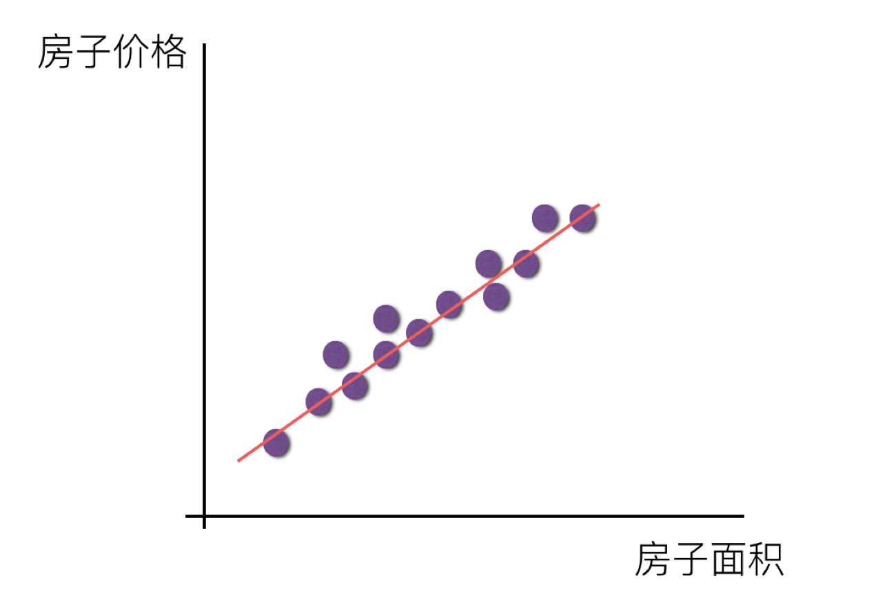
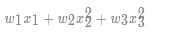
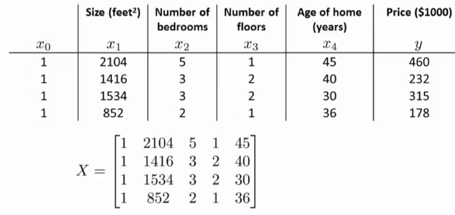
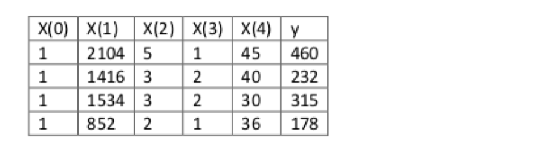
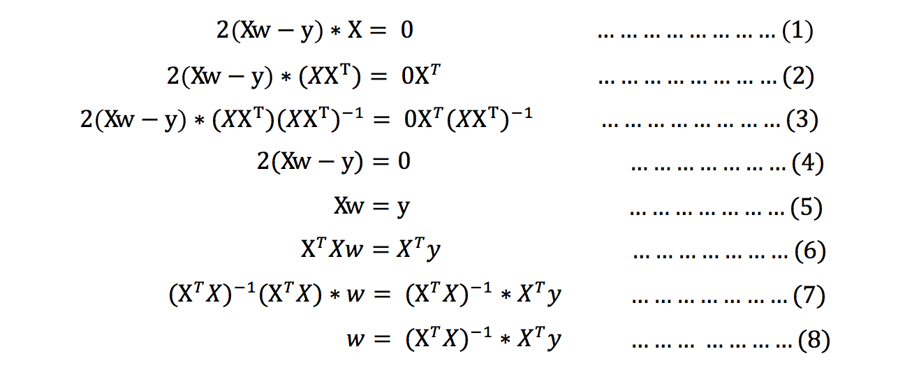
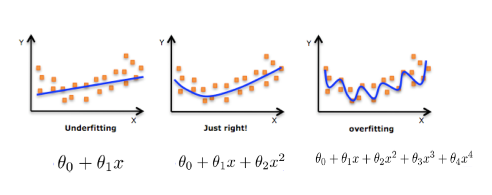

# 1 线性回归简介

## 学习目标

- 了解线性回归的应用场景
- 知道线性回归的定义

------

## 1.1 线性回归应用场景

- 房价预测
- 销售额度预测
- 贷款额度预测

举例：


## 1.2 什么是线性回归

### 1.2.1 定义与公式

线性回归(Linear regression)是利用**回归方程(函数)**对**一个或多个自变量(特征值)和因变量(目标值)之间**关系进行建模的一种分析方式。

- 特点：只有一个自变量的情况称为单变量回归，多于一个自变量情况的叫做多元回归


- 线性回归用矩阵表示举例


那么怎么理解呢？我们来看几个例子

- 期末成绩：0.7×考试成绩+0.3×平时成绩
- 房子价格 = 0.02×中心区域的距离 + 0.04×城市一氧化氮浓度 + (-0.12×自住房平均房价) + 0.254×城镇犯罪率

上面两个例子，**我们看到特征值与目标值之间建立了一个关系，这个关系可以理解为线性模型**。

### 1.2.2 线性回归的特征与目标的关系分析

线性回归当中主要有两种模型，**一种是线性关系，另一种是非线性关系。**在这里我们只能画一个平面更好去理解，所以都用单个特征或两个特征举例子。

- 线性关系 1

    - 单变量线性关系：

    

    - 多变量线性关系

        

> 注释：单特征与目标值的关系呈直线关系，或者两个特征与目标值呈现平面的关系
>
> 更高维度的我们不用自己去想，记住这种关系即可

- 非线性关系

    

> 注释：为什么会这样的关系呢？原因是什么？
>
> 如果是非线性关系，那么回归方程可以理解为：



## 1.3 小结

- 线性回归的定义【了解】
    - 利用**回归方程(函数)**对**一个或多个自变量(特征值)和因变量(目标值)之间**关系进行建模的一种分析方式
- 线性回归的分类【知道】
    - 线性关系
    - 非线性关系


# 2 线性回归api初步使用

## 学习目标

- 知道线性回归api的简单使用

------

## 2.1 线性回归API	linear_model.LinearRegression()

- sklearn.linear_model.LinearRegression()
    - LinearRegression.coef_：回归系数

## 2.2 举例


### 2.2.1 步骤分析

- 1.获取数据集
- 2.数据基本处理（该案例中省略）
- 3.特征工程（该案例中省略）
- 4.机器学习
- 5.模型评估（该案例中省略）

### 2.2.2 代码过程

- 导入模块

```python
from sklearn.linear_model import LinearRegression
```

- 构造数据集

```python
# 特征值
x = [[80, 86],
	 [82, 80],
	 [85, 78],
	 [90, 90],
	 [86, 82],
	 [82, 90],
	 [78, 80],
	 [92, 94]]
# 目标值
y = [84.2, 80.6, 80.1, 90, 83.2, 87.6, 79.4, 93.4]
```

- 机器学习-- 模型训练

```python
# 实例化API
regression = LinearRegression()
# 使用fit方法进行训练
regression.fit(x,y)

# 系数
print(regression.coef_)                 # [0.3 0.7]

# 二维参数
print(regression.predict([[100, 80]]))  # [86.]
```

## 2.3 小结

- sklearn.linear_model.LinearRegression()
    - LinearRegression.coef_：回归系数


# 3 数学:求导

## 学习目标

- 知道常见的求导方法
- 知道导数的四则运算

------

## 3.1 一阶导数和二阶导数

一阶导表示该原函数的图像的单调性：在某区间里，一阶导>0表示单调递增，图像是向上的，反之同理。通俗点说就是斜率了。

二阶导表示原函数的图像的凹凸性，二阶导>0表示图像是凸的，<0表示图像是凹的。


## 3.2 常见函数的导数


## 3.3 导数的四则运算


## 3.4 练习


答案：

- 1.
- 2.


- 3.


- 4.


- 5.


## 3.5 矩阵（向量）求导 [了解]


参考链接：https://en.wikipedia.org/wiki/Matrix_calculus#Scalar-by-vector_identities

## 3.6 小结

- 常见函数的求导方式和导数的四则运算


# 4 线性回归的损失和优化

## 学习目标

- 知道线性回归中损失函数
- 知道使用正规方程对损失函数优化的过程
- 知道使用梯度下降法对损失函数优化的过程

------

假设刚才的房子例子，真实的数据之间存在这样的关系：

```python
真实关系：真实房子价格 = 0.02×中心区域的距离 + 0.04×城市一氧化氮浓度 + (-0.12×自住房平均房价) + 0.254×城镇犯罪率
```

那么现在呢，我们随意指定一个关系（猜测）

```python
随机指定关系：预测房子价格 = 0.25×中心区域的距离 + 0.14×城市一氧化氮浓度 + 0.42×自住房平均房价 + 0.34×城镇犯罪率
```

请问这样的话，会发生什么？真实结果与我们预测的结果之间是不是存在一定的误差呢？类似这样样子


既然存在这个误差，那我们就将这个误差给衡量出来

## 4.1 损失函数	最小二乘法

总损失定义为：


- yi为第i个训练样本的真实值
- h(xi)为第i个训练样本特征值组合预测函数
- 又称最小二乘法

如何去减少这个损失，使我们预测的更加准确些？既然存在了这个损失，我们一直说机器学习有自动学习的功能，在线性回归这里更是能够体现。这里可以通过一些优化方法去优化（其实是数学当中的求导功能）回归的总损失！！！

## 4.2 优化算法

**如何去求模型当中的W，使得损失最小？（目的是找到最小损失对应的W值）**

- 线性回归经常使用的两种优化算法
    - 正规方程
    - 梯度下降法

​    

### 4.2.1 正规方程

#### 4.2.1.1 什么是正规方程


> **-1指的是逆矩阵**
>
> 理解：X为特征值矩阵，y为目标值矩阵。直接求到最好的结果
>
> 缺点：当特征过多过复杂时，求解速度太慢并且得不到结果


#### 4.2.1.2 正规方程求解举例

以下表示数据为例：



即：



运用正规方程方法求解参数(求w)： 


#### 4.2.1.3 正规方程的推导

- **推导方式一：**

把该损失函数转换成矩阵写法：


其中y是真实值矩阵，X是特征值矩阵，w是权重矩阵

对其求解关于w的最小值，起止y,X 均已知二次函数直接求导，导数为零的位置，即为最小值。

求导：



注：式(1)到式(2)推导过程中, X是一个m行n列的矩阵，并不能保证其有逆矩阵，但是右乘X^T把其变成一个方阵，保证其有逆矩阵。

式（5）到式（6）推导过程中，和上类似。

- **推导方式二【拓展】：**

[正规方程的另一种推导方式](file:///D:/AI/AI/01/机器学习（算法篇1）/ReadingExtension/正规方程的另一种推导方式.html)

### 4.2.2  梯度下降(Gradient Descent)

#### 4.2.2.1 什么是梯度下降

梯度下降法的基本思想可以类比为一个下山的过程。

假设这样一个场景：

一个人**被困在山上，需要从山上下来**(i.e. 找到山的最低点，也就是山谷)。但此时山上的浓雾很大，导致可视度很低。

因此，下山的路径就无法确定，他必须利用自己周围的信息去找到下山的路径。这个时候，他就可以利用梯度下降算法来帮助自己下山。

具体来说就是，以他当前的所处的位置为基准，**(试一圈,找最陡峭的地方)寻找这个位置最陡峭的地方，然后朝着山的高度下降的地方走**，（同理，如果我们的目标是上山，也就是爬到山顶，那么此时应该是朝着最陡峭的方向往上走）。然后每走一段距离，都反复采用同一个方法，最后就能成功的抵达山谷。


梯度下降的基本过程就和下山的场景很类似。

首先，我们有一个**可微分的函数**。这个函数就代表着一座山。

我们的目标就是找到**这个函数的最小值**，也就是山底。

根据之前的场景假设，最快的下山的方式就是找到当前位置最陡峭的方向，然后沿着此方向向下走，对应到函数中，就是**找到给定点的梯度** ，然后朝着梯度相反的方向，就能让函数值下降的最快！因为梯度的方向就是函数值变化最快的方向。 所以，我们重复利用这个方法，反复求取梯度，最后就能到达局部的最小值，这就类似于我们下山的过程。而求取梯度就确定了最陡峭的方向，也就是场景中测量方向的手段。

#### 4.2.2.2 梯度的概念

梯度是微积分中一个很重要的概念

​    **在单变量的函数中，梯度其实就是函数的微分，代表着函数在某个给定点的切线的斜率；**

​    **在多变量函数中，梯度是一个向量，向量有方向，梯度的方向就指出了函数在给定点的上升最快的方向；**

这也就说明了为什么我们需要千方百计的求取梯度！我们需要到达山底，就需要在每一步观测到此时最陡峭的地方，梯度就恰巧告诉了我们这个方向。梯度的方向是函数在给定点上升最快的方向，那么梯度的反方向就是函数在给定点下降最快的方向，这正是我们所需要的。所以我们只要沿着梯度的反方向一直走，就能走到局部的最低点！

#### 4.2.2.3 梯度下降举例

- **1. 单变量函数的梯度下降**


我们开始进行梯度下降的迭代计算过程:


如图，经过四次的运算，也就是走了四步，基本就抵达了函数的最低点，也就是山底


- **2.多变量函数的梯度下降** 


进行多次迭代:


我们发现，已经基本靠近函数的最小值点


#### 4.2.2.4 梯度下降（Gradient Descent）公式


- **1) α是什么含义？**

    α在梯度下降算法中被称作为**学习率**或者**步长**，意味着我们可以通过α来控制每一步走的距离，以保证不要步子跨的太大扯着蛋，哈哈，其实就是不要走太快，错过了最低点。同时也要保证不要走的太慢，导致太阳下山了，还没有走到山下。所以α的选择在梯度下降法中往往是很重要的！α不能太大也不能太小，太小的话，可能导致迟迟走不到最低点，太大的话，会导致错过最低点！


- **2) 为什么梯度要乘以一个负号**？

梯度前加一个负号，就意味着朝着梯度相反的方向前进！我们在前文提到，梯度的方向实际就是函数在此点上升最快的方向！而我们需要朝着下降最快的方向走，自然就是负的梯度的方向，所以此处需要加上负号

我们通过两个图更好理解梯度下降的过程


**所以有了梯度下降这样一个优化算法，回归就有了"自动学习"的能力**

- ##### **优化动态图演示**


## 4.3 梯度下降和正规方程的对比

| 梯度下降             | 正规方程                        |
| -------------------- | ------------------------------- |
| 需要选择学习率       | 不需要                          |
| 需要迭代求解         | 一次运算得出                    |
| 特征数量较大可以使用 | 需要计算方程，时间复杂度高O(n3) |

### 4.3.1 算法选择依据：	LinearRegression	SGDRegressor

- 小规模数据：
    - 正规方程：**LinearRegression(不能解决拟合问题)**
    - 岭回归
- 大规模数据：
    - 梯度下降法：**SGDRegressor**

## 4.4 小结

- 损失函数【知道】
    - 最小二乘法
- 线性回归优化方法【知道】
    - 正规方程
    - 梯度下降法
- 正规方程 -- 一蹴而就【知道】
    - 利用矩阵的逆,转置进行一步求解
    - 只是适合样本和特征比较少的情况
- 梯度下降法 — 循序渐进【知道】
    - 梯度的概念
        - 单变量 -- 切线
        - 多变量 -- 向量
    - 梯度下降法中关注的两个参数
        - α  -- 就是步长
            - 步长太小 -- 下山太慢
            - 步长太大 -- 容易跳过极小值点(*****)
        - 为什么梯度要加一个负号
            - 梯度方向是上升最快方向,负号就是下降最快方向
- 梯度下降法和正规方程选择依据【知道】
    - 小规模数据：
        - 正规方程：**LinearRegression(不能解决拟合问题)**
        - 岭回归
    - 大规模数据：
        - 梯度下降法：**SGDRegressor**


# 5 梯度下降法介绍

## 学习目标

- 知道全梯度下降算法的原理
- 知道随机梯度下降算法的原理
- 知道随机平均梯度下降算法的原理
- 知道小批量梯度下降算法的原理

------

上一节中给大家介绍了最基本的梯度下降法实现流程，常见的梯度下降算法有：

- 全梯度下降算法(Full gradient descent）,
- 随机梯度下降算法（Stochastic gradient descent）,
- 小批量梯度下降算法（Mini-batch gradient descent）,
- 随机平均梯度下降算法（Stochastic average gradient descent）

它们都是为了正确地调节权重向量，通过为每个权重计算一个梯度，从而更新权值，使目标函数尽可能最小化。其差别在于样本的使用方式不同。

## 5.1 全梯度下降算法（FG） 全部数据

**计算训练集所有样本误差**，**对其求和再取平均值作为目标函数**。

权重向量沿其梯度相反的方向移动，从而使当前目标函数减少得最多。

因为在执行每次更新时，我们需要在整个数据集上计算所有的梯度，所以批梯度下降法的速度会很慢，同时，批梯度下降法无法处理超出内存容量限制的数据集。

**批梯度下降法同样也不能在线更新模型，即在运行的过程中，不能增加新的样本**。

其是在整个训练数据集上计算损失函数关于参数θ的梯度：


## 5.2 随机梯度下降算法（SG） 随机样本

由于FG每迭代更新一次权重都需要计算所有样本误差，而实际问题中经常有上亿的训练样本，故效率偏低，且容易陷入局部最优解，因此提出了随机梯度下降算法。

其每轮计算的目标函数不再是全体样本误差，而仅是单个样本误差，即**每次只代入计算一个样本目标函数的梯度来更新权重，再取下一个样本重复此过程，直到损失函数值停止下降或损失函数值小于某个可以容忍的阈值。**

此过程简单，高效，通常可以较好地避免更新迭代收敛到局部最优解。其迭代形式为


> 其中，x(i)表示一条训练样本的特征值，y(i)表示一条训练样本的标签值

但是由于，SG每次只使用一个样本迭代，若遇上噪声则容易陷入局部最优解。

## 5.3 小批量梯度下降算法（mini-batch）

小批量梯度下降算法是FG和SG的折中方案,在一定程度上兼顾了以上两种方法的优点。

**每次从训练样本集上随机抽取一个小样本集，在抽出来的小样本集上采用FG迭代更新权重。**

被抽出的小样本集所含样本点的个数称为batch_size，通常设置为2的幂次方，更有利于GPU加速处理。

特别的，若batch_size=1，则变成了SG；若batch_size=n，则变成了FG.其迭代形式为


## 5.4 随机平均梯度下降算法（SAG）

在SG方法中，虽然避开了运算成本大的问题，但对于大数据训练而言，SG效果常不尽如人意，因为每一轮梯度更新都完全与上一轮的数据和梯度无关。

**随机平均梯度算法克服了这个问题，在内存中为每一个样本都维护一个旧的梯度，随机选择第i个样本来更新此样本的梯度，其他样本的梯度保持不变，然后求得所有梯度的平均值，进而更新了参数。**

如此，每一轮更新仅需计算一个样本的梯度，计算成本等同于SG，但收敛速度快得多。

- 拓展阅读：

[梯度下降法算法比较和进一步优化](file:///D:/AI/AI/01/机器学习（算法篇1）/ReadingExtension/梯度下降法算法比较和进一步优化.html)

## 5.5 小结

- 全梯度下降算法（FG）【知道】
    - 在进行计算的时候,计算所有样本的误差平均值,作为我的目标函数
- 随机梯度下降算法（SG）【知道】
    - 每次只选择一个样本进行考核
- 小批量梯度下降算法（mini-batch）【知道】
    - 选择一部分样本进行考核
- 随机平均梯度下降算法（SAG）【知道】
    - 会给每个样本都维持一个平均值,后期计算的时候,参考这个平均值


# 6 线性回归api再介绍	

## 学习目标

- 了解正规方程的api及常用参数
- 了解梯度下降法api及常用参数

------

### sklearn.linear_model.LinearRegression(fit_intercept=True)

- 通过正规方程优化
- 参数
    - fit_intercept：是否计算偏置
- 属性
    - LinearRegression.coef_：回归系数
    - LinearRegression.intercept_：偏置

### sklearn.linear_model.SGDRegressor(loss="squared_loss", fit_intercept=True, learning_rate ='invscaling', eta0=0.01)

- SGDRegressor类实现了随机梯度下降学习，它支持不同的**loss函数和正则化惩罚项**来拟合线性回归模型。
- 参数：
    - loss:损失类型
        - **loss=”squared_loss”: 普通最小二乘法**
    - fit_intercept：是否计算偏置
    - learning_rate : string, optional    学习率填充
        - **'constant': eta = eta0**
        - **'optimal': eta = 1.0 / (alpha \* (t + t0)) [default]**
        - 'invscaling': eta = eta0 / pow(t, power_t)
            - **power_t=0.25:存在父类当中**
        - **对于一个常数值的学习率来说，可以使用learning_rate=’constant’ ，并使用eta0来指定学习率。**
    - max_iter:   最大迭代次数
- 属性：可以获取的属性
    - SGDRegressor.coef_：回归系数
    - SGDRegressor.intercept_：偏置

> sklearn提供给我们两种实现的API， 可以根据选择使用

## 小结

- 正规方程
    - sklearn.linear_model.LinearRegression()
- 梯度下降法
    - sklearn.linear_model.SGDRegressor(）


# 7 案例：波士顿房价预测

## 学习目标

- 通过案例掌握正规方程和梯度下降法api的使用

------

## 1 案例背景介绍

- 数据介绍


> 给定的这些特征，是专家们得出的影响房价的结果属性。我们此阶段不需要自己去探究特征是否有用，只需要使用这些特征。到后面量化很多特征需要我们自己去寻找

## 2 案例分析

回归当中的数据大小不一致，是否会导致结果影响较大。所以需要做标准化处理。

- 数据分割与标准化处理
- 回归预测
- 线性回归的算法效果评估

## 3 回归性能评估    sklearn.metrics.mean_squared_error(y_true, y_pred)

均方误差(Mean Squared Error)MSE)评价机制：


注：yi为预测值，y‾\overline{y}y 平均值为真实值

> 思考：MSE和最小二乘法的区别是？

- sklearn.metrics.mean_squared_error(y_true, y_pred)
    - 均方误差回归损失
    - y_true:真实值
    - y_pred:预测值
    - return:浮点数结果

## 4 代码实现

### 4.1 正规方程	LinearRegression

```python
# 数据引入
from sklearn.datasets import load_boston
# 数据分隔
from sklearn.model_selection import train_test_split
# 标准化
from sklearn.preprocessing import StandardScaler
# 机器学习 线性回归api  正规方程
from sklearn.linear_model import LinearRegression
# 模型评估
from sklearn.metrics import mean_squared_error

# 1.获取数据
data = load_boston()


# 2.数据集划分
x_train,x_test,y_train,y_test = train_test_split(data.data, data.target, random_state=52)


# 3.特征值标准化
scaler = StandardScaler()
x_train = scaler.fit_transform(x_train)
x_test = scaler.fit_transform(x_test)


# 4.机器学习-线性回归(正规方程)
estimator = LinearRegression()
estimator.fit(x_train, y_train)


# 5.模型评估
# 5.1 获取系数等值
y_predict = estimator.predict(x_test)
print("预测值为:\n", y_predict)
print("模型中的系数为:\n", estimator.coef_)
#  [-0.54655649  0.77094493  0.18244665  0.11087585 -1.72530197  2.6973101
#  -0.12441575 -2.76733141  2.45295106 -2.35967833 -2.06244717  0.98753132
#  -3.43798865]
print("模型中的偏置为:\n", estimator.intercept_)    # 22.23693931398419


# 5.2 评价
# 均方误差  越小越好
error = mean_squared_error(y_test, y_predict)
print("误差为:\n", error)                          # 27.24969899861506


```

### 4.2 梯度下降法	SGDRegressor

```python
# 数据引入
from sklearn.datasets import load_boston
# 数据分隔
from sklearn.model_selection import train_test_split
# 标准化
from sklearn.preprocessing import StandardScaler
# 机器学习 线性回归api  梯度下降法
from sklearn.linear_model import SGDRegressor
# 模型评估
from sklearn.metrics import mean_squared_error

# 1.获取数据
data = load_boston()


# 2.数据集划分
x_train, x_test, y_train, y_test = train_test_split(data.data, data.target, random_state=52)


# 3.特征值标准化
scaler = StandardScaler()
x_train = scaler.fit_transform(x_train)
x_test = scaler.fit_transform(x_test)


# 4.机器学习-线性回归(正规方程)
# max_iter: 最大迭代次数
# learning_rate: 学习率
#
estimator = SGDRegressor(max_iter=1000, learning_rate="constant", eta0=0.1)
estimator.fit(x_train, y_train)


# 5.模型评估
# 5.1 获取系数等值
y_predict = estimator.predict(x_test)
print("预测值为:\n", y_predict)
print("模型中的系数为:\n", estimator.coef_)
#   [-0.46389469  0.62076913 -0.19766076  0.14329037 -1.53721429  2.78382621
#  -0.20137282 -2.65579028  1.52957487 -1.37806051 -2.02648793  1.02678473
#  -3.40689681]
print("模型中的偏置为:\n", estimator.intercept_)  # [22.23592909]


# 5.2 评价
# 均方误差  越小越好
error = mean_squared_error(y_test, y_predict)
print("误差为:\n", error)  # 27.607668158723875

```

我们也可以尝试去修改学习率

```python
estimator = SGDRegressor(max_iter=1000,learning_rate="constant",eta0=0.1)
```

此时我们可以通过调参数，找到学习率效果更好的值。

## 5 小结

- 正规方程和梯度下降法api在真实案例中的使用【知道】
- 线性回归性能评估【知道】
    - 均方误差


# 8 欠拟合和过拟合

## 学习目标

- 掌握过拟合、欠拟合的概念
- 掌握过拟合、欠拟合产生的原因
- 知道什么是正则化，以及正则化的分类

------

## 8.1 定义

- 过拟合：一个假设**在训练数据上能够获得比其他假设更好的拟合， 但是在测试数据集上却不能很好地拟合数据**，此时认为这个假设出现了过拟合的现象。(模型过于复杂)
- 欠拟合：一个假设**在训练数据上不能获得更好的拟合，并且在测试数据集上也不能很好地拟合数据**，此时认为这个假设出现了欠拟合的现象。(模型过于简单)


那么是什么原因导致模型复杂？线性回归进行训练学习的时候变成模型会变得复杂，这里就对应前面再说的线性回归的两种关系，非线性关系的数据，也就是存在很多无用的特征或者现实中的事物特征跟目标值的关系并不是简单的线性关系。

## 8.2 原因以及解决办法

- 欠拟合原因以及解决办法
    - 原因：学习到数据的特征过少
    - 解决办法：
        - **1）添加其他特征项，**有时候我们模型出现欠拟合的时候是因为特征项不够导致的，可以添加其他特征项来很好地解决。例如，“组合”、“泛化”、“相关性”三类特征是特征添加的重要手段，无论在什么场景，都可以照葫芦画瓢，总会得到意想不到的效果。除上面的特征之外，“上下文特征”、“平台特征”等等，都可以作为特征添加的首选项。
        - **2）添加多项式特征**，这个在机器学习算法里面用的很普遍，例如将线性模型通过添加二次项或者三次项使模型泛化能力更强。
- 过拟合原因以及解决办法
    - 原因：原始特征过多，存在一些嘈杂特征， 模型过于复杂是因为模型尝试去兼顾各个测试数据点
    - 解决办法：
        - 1）重新清洗数据，导致过拟合的一个原因也有可能是数据不纯导致的，如果出现了过拟合就需要我们重新清洗数据。
        - 2）增大数据的训练量，还有一个原因就是我们用于训练的数据量太小导致的，训练数据占总数据的比例过小。
        - **3）正则化**
        - 4）减少特征维度，防止**维灾难**

## 8.3 正则化

### 8.3.1 什么是正则化

在解决回归过拟合中，我们选择正则化。但是对于其他机器学习算法如分类算法来说也会出现这样的问题，除了一些算法本身作用之外（决策树、神经网络），我们更多的也是去自己做特征选择，包括之前说的删除、合并一些特征



**如何解决？**


**在学习的时候，数据提供的特征有些影响模型复杂度或者这个特征的数据点异常较多，所以算法在学习的时候尽量减少这个特征的影响（甚至删除某个特征的影响），这就是正则化**

注：调整时候，算法并不知道某个特征影响，而是去调整参数得出优化的结果

### 8.3.2 正则化类别

- L2正则化
    - 作用：可以使得其中一些W的都很小，都接近于0，削弱某个特征的影响
    - 优点：越小的参数说明模型越简单，越简单的模型则越不容易产生过拟合现象
    - Ridge回归
- L1正则化
    - 作用：可以使得其中一些W的值直接为0，删除这个特征的影响
    - LASSO回归

------

- 拓展阅读：
    - [维灾难](file:///D:/AI/AI/01/机器学习（算法篇1）/ReadingExtension/维灾难.html)

------

## 8.4 小结

- 欠拟合【掌握】
    - 在训练集上表现不好，在测试集上表现不好
    - 解决方法：
        - 继续学习
            - 1.添加其他特征项
            - 2.添加多项式特征
- 过拟合【掌握】
    - 在训练集上表现好，在测试集上表现不好
    - 解决方法：
        - 1.重新清洗数据集
        - 2.增大数据的训练量
        - 3.正则化
        - 4.减少特征维度
- 正则化【掌握】
    - 通过限制高次项的系数进行防止过拟合
    - L1正则化
        - 理解：直接把高次项前面的系数变为0
        - Lasso回归
    - L2正则化
        - 理解：把高次项前面的系数变成特别小的值
        - 岭回归


# 9 正则化线性模型

## 学习目标

- 知道正则化中岭回归的线性模型
- 知道正则化中lasso回归的线性模型
- 知道正则化中弹性网络的线性模型
- 了解正则化中early stopping的线性模型

------

- Ridge Regression 岭回归 
- Lasso 回归
- Elastic Net 弹性网络 
- Early stopping

## 9.1 Ridge Regression (岭回归，又名 Tikhonov regularization)

岭回归是线性回归的正则化版本，即在原来的线性回归的 cost function 中添加正则项（regularization term）: 

以达到在拟合数据的同时，使模型权重尽可能小的目的,岭回归代价函数:


- α=0：岭回归退化为线性回归

## 9.2 Lasso Regression(Lasso 回归)

Lasso 回归是线性回归的另一种正则化版本，正则项为权值向量的ℓ1范数。

Lasso回归的代价函数 ：


【注意 】

- Lasso Regression 的代价函数在 θi=0处是不可导的. 
- 解决方法：在θi=0处用一个次梯度向量(subgradient vector)代替梯度，如下式
- Lasso Regression 的次梯度向量 


Lasso Regression 有一个很重要的性质是：倾向于完全消除不重要的权重。

例如：当α 取值相对较大时，高阶多项式退化为二次甚至是线性：高阶多项式特征的权重被置为0。

也就是说，Lasso Regression 能够自动进行特征选择，并输出一个稀疏模型（只有少数特征的权重是非零的）。

## 9.3 Elastic Net (弹性网络)

弹性网络在岭回归和Lasso回归中进行了折中，通过 **混合比(mix ratio) r** 进行控制：

- r=0：弹性网络变为岭回归
- r=1：弹性网络便为Lasso回归

弹性网络的代价函数 ：


一般来说，我们应避免使用**朴素线性回归**，而应对模型进行一定的正则化处理，那如何选择正则化方法呢？

**小结：**

- 常用：岭回归

- 假设只有少部分特征是有用的：

    - 弹性网络
    - Lasso 
    - 一般来说，弹性网络的使用更为广泛。因为在特征维度高于训练样本数，或者特征是强相关的情况下，Lasso回归的表现不太稳定。

- api:

    - ```python
        from sklearn.linear_model import Ridge, ElasticNet, Lasso
        ```

## 9.4 Early Stopping [了解]

Early Stopping 也是正则化迭代学习的方法之一。

其做法为：在验证错误率达到最小值的时候停止训练。

## 9.5 小结

- Ridge Regression 岭回归
    - 就是把系数添加平方项
    - 然后限制系数值的大小
    - α值越小，系数值越大，α越大，系数值越小
- Lasso 回归
    - 对系数值进行绝对值处理
    - 由于绝对值在顶点处不可导，所以进行计算的过程中产生很多0，最后得到结果为：稀疏矩阵
- Elastic Net 弹性网络
    - 是前两个内容的综合
    - 设置了一个r,如果r=0--岭回归；r=1--Lasso回归
- Early stopping
    - 通过限制错误率的阈值，进行停止


# 10 线性回归的改进-岭回归

## 学习目标

- 知道岭回归api的具体使用

------

## 10.1 API	linear_model.Ridge()

- sklearn.linear_model.Ridge(alpha=1.0, fit_intercept=True,solver="auto", normalize=False)
    - 具有l2正则化的线性回归
    - alpha:正则化力度，也叫 λ
        - **λ取值：0~1 1~10**
    - solver:会根据数据自动选择优化方法
        - **sag:如果数据集、特征都比较大，选择该随机梯度下降优化**
    - normalize:数据是否进行标准化
        - normalize=False:可以在fit之前调用preprocessing.StandardScaler标准化数据
    - Ridge.coef_: 回归权重
    - Ridge.intercept_: 回归偏置

**Ridge方法相当于SGDRegressor(penalty='l2', loss="squared_loss"),只不过SGDRegressor实现了一个普通的随机梯度下降学习，推荐使用Ridge(实现了SAG)**

- sklearn.linear_model.RidgeCV(_BaseRidgeCV, RegressorMixin)
    - 具有l2正则化的线性回归，可以进行交叉验证
    - coef_:回归系数

```python
class _BaseRidgeCV(LinearModel):
    def __init__(self, alphas=(0.1, 1.0, 10.0),
                 fit_intercept=True, normalize=False,scoring=None,
                 cv=None, gcv_mode=None,
                 store_cv_values=False):
```

## 10.2 观察正则化程度的变化，对结果的影响？

- 正则化力度越大，权重系数会越小
- 正则化力度越小，权重系数会越大


## 10.3 波士顿房价预测

```python
# 数据引入
from sklearn.datasets import load_boston
# 数据分隔
from sklearn.model_selection import train_test_split
# 标准化
from sklearn.preprocessing import StandardScaler
# 机器学习 线性回归api  岭回归
from sklearn.linear_model import Ridge
from sklearn.linear_model import RidgeCV

# 模型评估
from sklearn.metrics import mean_squared_error

# 1.获取数据
data = load_boston()


# 2.数据集划分
x_train, x_test, y_train, y_test = train_test_split(data.data, data.target, test_size=0.2)


# 3.特征值标准化
scaler = StandardScaler()
x_train = scaler.fit_transform(x_train)
x_test = scaler.fit_transform(x_test)


# 4.机器学习-线性回归(正规方程)
# alpha: 正则化力度
#estimator = Ridge(alpha=1)

estimator = RidgeCV(alphas=(0.001, 0.01, 0.1, 1, 10))
estimator.fit(x_train, y_train)


# 5.模型评估
# 5.1 获取系数等值
y_predict = estimator.predict(x_test)
print("预测值为:\n", y_predict)
print("模型中的系数为:\n", estimator.coef_)
#   [-0.53782282  0.75275911  0.14874627  0.1135628  -1.69363856  2.70595671
#  -0.13069087 -2.7364033   2.35848648 -2.26750395 -2.05249462  0.98584826
#  -3.42164338]
print("模型中的偏置为:\n", estimator.intercept_)  # 22.23693931398419


# 5.2 评价
# 均方误差  越小越好
error = mean_squared_error(y_test, y_predict)
print("误差为:\n", error)  # 18.150788844939925
```

## 10.4 小结

- sklearn.linear_model.Ridge(alpha=1.0, fit_intercept=True,solver="auto", normalize=False)【知道】
    - 具有l2正则化的线性回归
    - alpha -- 正则化
        - 正则化力度越大，权重系数会越小
        - 正则化力度越小，权重系数会越大
    - normalize
        - 默认封装了，对数据进行标准化处理


# 11 模型的保存和加载

## 学习目标

- 知道sklearn中模型的保存和加载

------

## 11.1 sklearn模型的保存和加载API	joblib.dump	joblib.load

- import joblib
    - 保存：joblib.dump(estimator, 'test.pkl')
    - 加载：estimator = joblib.load('test.pkl')
- **可以将训练分为多次,训练一会儿就保存一次,再加载训练**

## 11.2 线性回归的模型保存加载案例

## joblib.dump(estimator, 'test.pkl')

```python
'''
import joblib
    保存：joblib.dump(estimator, 'test.pkl')
    加载：estimator = joblib.load('test.pkl')
'''

# 数据保存
import joblib

# 数据引入
from sklearn.datasets import load_boston
# 数据分隔
from sklearn.model_selection import train_test_split
# 标准化
from sklearn.preprocessing import StandardScaler
# 机器学习 线性回归api  岭回归
from sklearn.linear_model import Ridge
from sklearn.linear_model import RidgeCV

# 模型评估
from sklearn.metrics import mean_squared_error

# 1.获取数据
data = load_boston()


# 2.数据集划分
x_train, x_test, y_train, y_test = train_test_split(data.data, data.target, test_size=0.2, random_state=25)


# 3.特征值标准化
scaler = StandardScaler()
x_train = scaler.fit_transform(x_train)
x_test = scaler.fit_transform(x_test)


# 4.机器学习-线性回归(正规方程)
# alpha: 正则化力度
#estimator = Ridge(alpha=1)

estimator = RidgeCV(alphas=(0.001, 0.01, 0.1, 1, 10))
estimator.fit(x_train, y_train)


# 5.保存模型
joblib.dump(estimator, './data/boston.pkl')


# 6.模型评估
# 6.1 获取系数等值
y_predict = estimator.predict(x_test)
print("预测值为:\n", y_predict)
print("模型中的系数为:\n", estimator.coef_)
#   [-0.53782282  0.75275911  0.14874627  0.1135628  -1.69363856  2.70595671
#  -0.13069087 -2.7364033   2.35848648 -2.26750395 -2.05249462  0.98584826
#  -3.42164338]
print("模型中的偏置为:\n", estimator.intercept_)  # 22.23693931398419


# 6.2 评价
# 均方误差  越小越好
error = mean_squared_error(y_test, y_predict)
print("误差为:\n", error)  # 18.150788844939925

```

## estimator = joblib.load('test.pkl')

```python
'''
import joblib
    保存：joblib.dump(estimator, 'test.pkl')
    加载：estimator = joblib.load('test.pkl')
'''

# 数据保存
import joblib

# 数据引入
from sklearn.datasets import load_boston
# 数据分隔
from sklearn.model_selection import train_test_split
# 标准化
from sklearn.preprocessing import StandardScaler
# 机器学习 线性回归api  岭回归
from sklearn.linear_model import Ridge
from sklearn.linear_model import RidgeCV

# 模型评估
from sklearn.metrics import mean_squared_error


# 1.获取数据
data = load_boston()


# 2.数据集划分
x_train, x_test, y_train, y_test = train_test_split(data.data, data.target, test_size=0.2, random_state=25)


# 3.特征值标准化
scaler = StandardScaler()
x_train = scaler.fit_transform(x_train)
x_test = scaler.fit_transform(x_test)


# 4.模型加载
estimator = joblib.load('./data/boston.pkl')


# 5.模型评估
# 5.1 获取系数等值
y_predict = estimator.predict(x_test)
print("预测值为:\n", y_predict)
print("模型中的系数为:\n", estimator.coef_)
#   [-0.53782282  0.75275911  0.14874627  0.1135628  -1.69363856  2.70595671
#  -0.13069087 -2.7364033   2.35848648 -2.26750395 -2.05249462  0.98584826
#  -3.42164338]
print("模型中的偏置为:\n", estimator.intercept_)  # 22.23693931398419


# 5.2 评价
# 均方误差  越小越好
error = mean_squared_error(y_test, y_predict)
print("误差为:\n", error)  # 18.150788844939925
```


## 11.3 小结

- sklearn.externals import joblib【知道】
    - 保存：joblib.dump(estimator, 'test.pkl')
    - 加载：estimator = joblib.load('test.pkl')
    - 注意：
        - 1.保存文件，后缀名是**.pkl
        - 2.加载模型是需要通过一个变量进行承接召回
