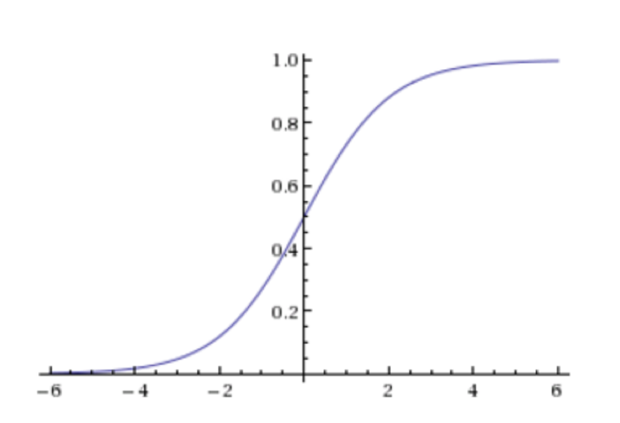
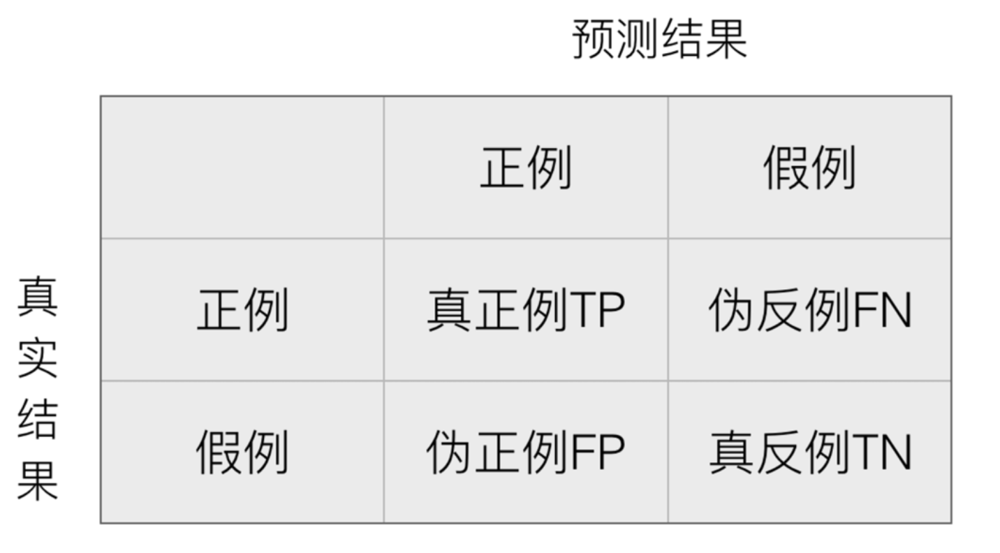
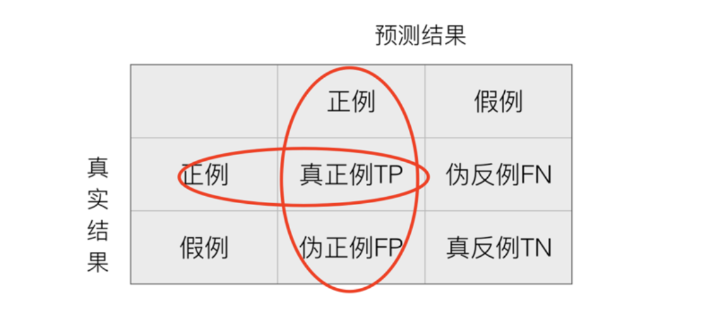

# 1 逻辑回归介绍

## 学习目标

- 了解逻辑回归的应用场景
- 知道逻辑回归的原理
- 掌握逻辑回归的损失函数和优化方案

------

逻辑回归（Logistic Regression）是机器学习中的**一种分类模型**，逻辑回归是一种分类算法，虽然名字中带有回归。由于算法的简单和高效，在实际中应用非常广泛。

## 1.1 逻辑回归的应用场景    是与不是

- 广告点击率
- 是否为垃圾邮件
- 是否患病
- 金融诈骗
- 虚假账号

看到上面的例子，我们可以发现其中的特点，那就是都属于两个类别之间的判断。逻辑回归就是解决二分类问题的利器

## 1.2 逻辑回归的原理

要想掌握逻辑回归，必须掌握两点：

- 逻辑回归中，其输入值是什么
- 如何判断逻辑回归的输出

### 1.2.1 输入    逻辑回归的输入就是一个线性回归的结果


逻辑回归的输入就是一个线性回归的结果。

### 1.2.2 激活函数    sigmoid


- 判断标准
    - 回归的结果输入到sigmoid函数当中
    - 输出结果：[0, 1]区间中的一个概率值，默认为0.5为阈值



> 逻辑回归最终的分类是通过属于某个类别的概率值来判断是否属于某个类别，并且这个类别默认标记为1(正例),另外的一个类别会标记为0(反例)。（方便损失计算）

输出结果解释(重要)：假设有两个类别A，B，并且假设我们的概率值为属于A(1)这个类别的概率值。现在有一个样本的输入到逻辑回归输出结果0.55，那么这个概率值超过0.5，意味着我们训练或者预测的结果就是A(1)类别。那么反之，如果得出结果为0.3那么，训练或者预测结果就为B(0)类别。

关于**逻辑回归的阈值是可以进行改变的**，比如上面举例中，如果你把阈值设置为0.6，那么输出的结果0.55，就属于B类。

**在之前，我们用最小二乘法衡量线性回归的损失**

**在逻辑回归中，当预测结果不对的时候，我们该怎么衡量其损失呢？**

我们来看下图(下图中，设置阈值为0.6)，


那么如何去衡量逻辑回归的预测结果与真实结果的差异呢？

## 1.3 损失以及优化

### 1.3.1 损失	对数似然损失

逻辑回归的损失，称之为**对数似然损失**，公式如下：

- 分开类别：


> 其中y为真实值，$hθ(x)h_\theta(x)hθ(x)$为预测值

怎么理解单个的式子呢？这个要根据log的函数图像来理解


无论何时，我们都希望**损失函数值，越小越好**

分情况讨论，对应的损失函数值：


- 综合完整损失函数


接下来我们呢就带入上面那个例子来计算一遍，就能理解意义了。


> 我们已经知道，log(P), P值越大，结果越小，所以我们可以对着这个损失的式子去分析

### 1.3.2 优化

同样使用梯度下降优化算法，去减少损失函数的值。这样去更新逻辑回归前面对应算法的权重参数，**提升原本属于1类别的概率，降低原本是0类别的概率。**

------

## 1.4 小结

- 逻辑回归概念【知道】
    - 解决的是一个二分类问题
    - 逻辑回归的输入是线性回归的输出
- 逻辑回归的原理【掌握】
    - 输入：
        - 线性回归的输出
    - 激活函数
        - sigmoid函数
        - 把整体的值映射到[0,1]
        - 再设置一个阈值，进行分类判断
- 逻辑回归的损失和优化【掌握】
    - 损失
        - 对数似然损失
        - 借助了log思想，进行完成
        - 真实值等于0，等于1两种情况进行划分
    - 优化
        - 提升原本属于1类别的概率，降低原本是0类别的概率。


# 2 逻辑回归api介绍	linear_model.LogisticRegression

## 学习目标

- 知道逻辑回归api的用法

------

## linear_model.LogisticRegression()

- solver可选参数:{'liblinear', 'sag', 'saga','newton-cg', 'lbfgs'}，
    - 默认: 'liblinear'；用于优化问题的算法。
    - 对于小数据集来说，“liblinear”是个不错的选择，而“sag”和'saga'对于大型数据集会更快。
    - 对于多类问题，只有'newton-cg'， 'sag'， 'saga'和'lbfgs'可以处理多项损失;“liblinear”仅限于“one-versus-rest”分类。
- penalty：正则化的种类
- C：正则化力度

> **默认将类别数量少的当做正例**

**LogisticRegression方法相当于 SGDClassifier(loss="log", penalty=" "),SGDClassifier实现了一个普通的随机梯度下降学习。而使用LogisticRegression(实现了SAG)**


# 3 案例：癌症分类预测-良／恶性乳腺癌肿瘤预测

## 学习目标

- 通过肿瘤预测案例，学会如何使用逻辑回归对模型进行训练

------

## 3.1 背景介绍

- 数据介绍


原始数据的下载地址：[https://archive.ics.uci.edu/ml/machine-learning-databases/](https://archive.ics.uci.edu/ml/machine-learning-databases/breast-cancer-wisconsin/)

> 数据描述
>
> （1）699条样本，共11列数据，第一列用语检索的id，后9列分别是与肿瘤
>
> 相关的医学特征，最后一列表示肿瘤类型的数值。
>
> （2）包含16个缺失值，用”?”标出。

## 3.2 案例分析

```
1.获取数据
2.基本数据处理
2.1 缺失值处理
2.2 确定特征值,目标值
2.3 分割数据
3.特征工程(标准化)
4.机器学习(逻辑回归)
5.模型评估
```

## 3.3 代码实现

#### 引入包名

```python
import pandas as pd
import numpy as np
# 数据划分
from sklearn.model_selection import train_test_split
# 数据标准化
from sklearn.preprocessing import StandardScaler
# 逻辑回归
from sklearn.linear_model import LogisticRegression
```

#### 联网获取数据

```python
import ssl
ssl._create_default_https_context = ssl._create_unverified_context
# 1.获取数据
names = ['Sample code number', 'Clump Thickness', 'Uniformity of Cell Size', 'Uniformity of Cell Shape',
         'Marginal Adhesion', 'Single Epithelial Cell Size', 'Bare Nuclei', 'Bland Chromatin',
         'Normal Nucleoli', 'Mitoses', 'Class']

data = pd.read_csv("https://archive.ics.uci.edu/ml/machine-learning-databases/breast-cancer-wisconsin/breast-cancer-wisconsin.data", names=names)
data.head()
```

#### or本地获取数据

```python
# 1.获取数据
names = ['Sample code number', 'Clump Thickness', 'Uniformity of Cell Size', 'Uniformity of Cell Shape',
         'Marginal Adhesion', 'Single Epithelial Cell Size', 'Bare Nuclei', 'Bland Chromatin',
         'Normal Nucleoli', 'Mitoses', 'Class']
# 下载地址 https://archive.ics.uci.edu/ml/machine-learning-databases/breast-cancer-wisconsin/breast-cancer-wisconsin.data
# names = name 添加列名 或者后期添加都可以
#data = pd.read_csv('../data/breast-cancer-wisconsin.data', names = names)
data = pd.read_csv('../data/breast-cancer-wisconsin.data')
data.columns = names
data.head()
```

#### 基本数据处理

```python
# 2.基本数据处理
# 2.1 缺失值处理
# replace和dropna 都不修改原值
data = data.replace(to_replace="?", value=np.NaN)
data = data.dropna()

# 2.2 确定特征值,目标值
# 所有行,1~10列
x = data.iloc[:, 1:10]
x.head()
# 目标值
y = data["Class"]
y.head()

# 2.3 分割数据
x_train, x_test, y_train, y_test = train_test_split(x, y, random_state=22)
```

#### 特征工程(标准化)
```python
# 3.特征工程(标准化)
transfer = StandardScaler()
x_train = transfer.fit_transform(x_train)
x_test = transfer.transform(x_test)
```

#### 机器学习(逻辑回归)

```python
# 4.机器学习(逻辑回归)
estimator = LogisticRegression()
estimator.fit(x_train, y_train)
```

#### 模型评估

```python
# 5.模型评估
y_predict = estimator.predict(x_test)
y_predict
# array([2, 2, 2, 2, 2, 4, 4, 4, 4, 2, 2, 2, 2, 4, 2, 2, 2, 2, 4, 2, 4, 2,
#        2, 2, 4, 4, 4, 2, 2, 2, 4, 4, 2, 2, 2, 4, 4, 2, 2, 2, 4, 2, 2, 2,
#        4, 4, 2, 2, 4, 2, 4, 4, 2, 4, 2, 2, 4, 4, 4, 2, 2, 2, 4, 4, 4, 2,
#        2, 2, 2, 4, 2, 2, 2, 2, 2, 2, 2, 4, 2, 2, 2, 2, 2, 4, 2, 2, 2, 4,
#        4, 2, 4, 4, 4, 2, 4, 4, 2, 2, 4, 2, 2, 2, 2, 4, 4, 4, 4, 2, 2, 2,
#        4, 4, 4, 4, 2, 2, 4, 2, 2, 4, 4, 2, 2, 2, 2, 2, 4, 4, 2, 2, 2, 2,
#        4, 2, 2, 2, 4], dtype=int64)

estimator.score(x_test, y_test)		# 0.9781021897810219
```

在很多分类场景当中我们不一定只关注预测的准确率！！！！！

比如以这个癌症举例子！！！**我们并不关注预测的准确率，而是关注在所有的样本当中，癌症患者有没有被全部预测（检测）出来。**

------

## 3.4 小结

- 肿瘤预测案例实现【知道】
    - 如果数据中有缺失值，一定要对其进行处理
    - 准确率并不是衡量分类正确的唯一标准


# 4 分类评估方法

## 学习目标

- 了解什么是混淆矩阵
- 知道分类评估中的精确率和召回率
- 知道roc曲线和auc指标

------

## 4.1.分类评估方法

### 4.1.1 准确率,精确率与召回率

#### 4.1.1.1 混淆矩阵

T:   Ture	P:  Positive	F:  False	N:  Negative

在分类任务下，预测结果(Predicted Condition)与正确标记(True Condition)之间存在四种不同的组合，构成混淆矩阵(适用于多分类)



#### 4.1.1.3 准确率

(TP+TN) / (TP+TN+FP+FN)     查的对不对


#### 4.1.1.3 精确率(Precision)与召回率(Recall)

- 精确率：预测结果为正例样本中真实为正例的比例（了解）



- 召回率：真实为正例的样本中预测结果为正例的比例（查得全，对正样本的区分能力）


### 4.1.2 F1-score

还有其他的评估标准，F1-score，反映了模型的稳健型


------

### 4.1.3 分类评估报告api  metrics.classification_report(y_true, y_pred, labels=[], target_names=None )

- sklearn.metrics.classification_report(y_true, y_pred, labels=[], target_names=None )
  -  y_true：真实目标值
  - y_pred：估计器预测目标值
  - labels:指定类别对应的数字
  - target_names：目标类别名称
  - return：每个类别精确率与召回率

```python
# 分类评估报告api
from sklearn.metrics import classification_report

# 精确率 全部查出的人多少个是正确的
# 召回率 全部的癌症的人中查出来了多少个
# labels=(2,4) 数据中2代表良性,4代表恶性
ret = classification_report(y_test, y_predict, labels=(2,4), target_names=("良性", "恶性"))
print(ret)
```

**假设这样一个情况，如果99个样本癌症，1个样本非癌症，不管怎样我全都预测正例(默认癌症为正例),准确率就为99%但是这样效果并不好，这就是样本不均衡下的评估问题**

问题：**如何衡量样本不均衡下的评估**？

### 4.1.4 样本比例超过 4:1 就认为是样本不均衡

## 4.2 ROC曲线与AUC指标

### 4.2.1 TPR与FPR

- TPR = TP / (TP + FN)	召回率
    - 所有真实类别为1的样本中，预测类别为1的比例
    - **所有真的被找出来的的比例**
- FPR = FP / (FP + TN)    不是上面的
    - 所有真实类别为0的样本中，预测类别为1的比例
    - **所有假的被找出来的为真的比例**

### 4.2.2 ROC曲线

- ROC曲线的横轴就是FPRate，纵轴就是TPRate，当二者相等时，表示的意义则是：对于不论真实类别是1还是0的样本，分类器预测为1的概率是相等的，此时AUC为0.5


### 4.2.3 AUC指标

- AUC的概率意义是随机取一对正负样本，正样本得分大于负样本得分的概率
- AUC的范围在[0, 1]之间，并且越接近1越好，越接近0.5属于乱猜
- **AUC=1，完美分类器，采用这个预测模型时，不管设定什么阈值都能得出完美预测。绝大多数预测的场合，不存在完美分类器。**
- **0.5<AUC<1，优于随机猜测。这个分类器（模型）妥善设定阈值的话，能有预测价值。**

### 4.2.4 AUC计算API    metrics.roc_auc_score(y_true, y_score)

- from sklearn.metrics import roc_auc_score
    - sklearn.metrics.roc_auc_score(y_true, y_score)
        - 计算ROC曲线面积，即AUC值
        - y_true：每个样本的真实类别，必须为0(反例),1(正例)标记
        - y_score：预测得分，可以是正类的估计概率、置信值或者分类器方法的返回值

```python
# 导入aucscore
from sklearn.metrics import roc_auc_score

# 将y_test中的 2 和 4 转换成 1 和 0
y_test = np.where(y_test > 3, 1, 0)

print("AUC指标：", roc_auc_score(y_test, y_predict)
```

- AUC只能用来评价二分类
- AUC非常适合评价样本不平衡中的分类器性能

------

## 4.3 小结

- 混淆矩阵【了解】
    - 真正例（TP）
    - 伪反例（FN）
    - 伪正例（FP）
    - 真反例（TN）
- 精确率(Precision)与召回率(Recall)【知道】
    - 准确率：（对不对）
        - （TP+TN）/(TP+TN+FN+FP)
    - 精确率 -- 查的准不准
        - TP/(TP+FP)
    - 召回率 -- 查的全不全
        - TP/(TP+FN)
    - F1-score
        - 反映模型的稳健性
- roc曲线和auc指标【知道】
    - roc曲线
        - 通过tpr和fpr来进行图形绘制，然后绘制之后，行成一个指标auc
    - auc
        - 越接近1，效果越好
        - 越接近0，效果越差
        - 越接近0.5，效果就是胡说
    - 注意：
        - 这个指标主要用于评价不平衡的二分类问题


# 5 ROC曲线的绘制

## 学习目标

- 知道ROC曲线的绘制

------

关于ROC曲线的绘制过程，通过以下举例进行说明

假设有6次展示记录，有两次被点击了，得到一个展示序列（1:1,2:0,3:1,4:0,5:0,6:0），前面的表示序号，后面的表示点击（1）或没有点击（0）。

然后在这6次展示的时候都通过model算出了点击的概率序列。

下面看三种情况。

## 5.1 曲线绘制

### 5.1.1 如果概率的序列是（1:0.9,2:0.7,3:0.8,4:0.6,5:0.5,6:0.4）。

与原来的序列一起，得到序列（从概率从高到低排）

| 1    | 1    | 0    | 0    | 0    | 0    |
| ---- | ---- | ---- | ---- | ---- | ---- |
| 0.9  | 0.8  | 0.7  | 0.6  | 0.5  | 0.4  |

绘制的步骤是：

1）把概率序列从高到低排序，得到顺序（1:0.9,3:0.8,2:0.7,4:0.6,5:0.5,6:0.4）；

2）从概率最大开始取一个点作为正类，取到点1，计算得到TPR=0.5，FPR=0.0；

3）从概率最大开始，再取一个点作为正类，取到点3，计算得到TPR=1.0，FPR=0.0；

4）再从最大开始取一个点作为正类，取到点2，计算得到TPR=1.0，FPR=0.25;

5）以此类推，得到6对TPR和FPR。

然后把这6对数据组成6个点(0,0.5),(0,1.0),(0.25,1),(0.5,1),(0.75,1),(1.0,1.0)。

这6个点在二维坐标系中能绘出来。


看看图中，那个就是ROC曲线。

### 5.1.2 如果概率的序列是（1:0.9,2:0.8,3:0.7,4:0.6,5:0.5,6:0.4）

与原来的序列一起，得到序列（从概率从高到低排）

| 1    | 0    | 1    | 0    | 0    | 0    |
| ---- | ---- | ---- | ---- | ---- | ---- |
| 0.9  | 0.8  | 0.7  | 0.6  | 0.5  | 0.4  |

绘制的步骤是：

6）把概率序列从高到低排序，得到顺序（1:0.9,2:0.8,3:0.7,4:0.6,5:0.5,6:0.4）；

7）从概率最大开始取一个点作为正类，取到点1，计算得到TPR=0.5，FPR=0.0；

8）从概率最大开始，再取一个点作为正类，取到点2，计算得到TPR=0.5，FPR=0.25；

9）再从最大开始取一个点作为正类，取到点3，计算得到TPR=1.0，FPR=0.25;

10）以此类推，得到6对TPR和FPR。

然后把这6对数据组成6个点(0,0.5),(0.25,0.5),(0.25,1),(0.5,1),(0.75,1),(1.0,1.0)。

这6个点在二维坐标系中能绘出来。


看看图中，那个就是ROC曲线。

### 5.1.3 如果概率的序列是（1:0.4,2:0.6,3:0.5,4:0.7,5:0.8,6:0.9）

与原来的序列一起，得到序列（从概率从高到低排）

| 0    | 0    | 0    | 0    | 1    | 1    |
| ---- | ---- | ---- | ---- | ---- | ---- |
| 0.9  | 0.8  | 0.7  | 0.6  | 0.5  | 0.4  |

绘制的步骤是：

11）把概率序列从高到低排序，得到顺序（6:0.9,5:0.8,4:0.7,2:0.6,3:0.5,1:0.4）；

12）从概率最大开始取一个点作为正类，取到点6，计算得到TPR=0.0，FPR=0.25；

13）从概率最大开始，再取一个点作为正类，取到点5，计算得到TPR=0.0，FPR=0.5；

14）再从最大开始取一个点作为正类，取到点4，计算得到TPR=0.0，FPR=0.75;

15）以此类推，得到6对TPR和FPR。

然后把这6对数据组成6个点(0.25,0.0),(0.5,0.0),(0.75,0.0),(1.0,0.0),(1.0,0.5),(1.0,1.0)。

这6个点在二维坐标系中能绘出来。


看看图中，那个就是ROC曲线。

## 5.2 意义解释

如上图的例子，总共6个点，2个正样本，4个负样本，取一个正样本和一个负样本的情况总共有8种。

上面的第一种情况，从上往下取，无论怎么取，正样本的概率总在负样本之上，所以分对的概率为1，AUC=1。再看那个ROC曲线，它的积分是什么？也是1，ROC曲线的积分与AUC相等。

上面第二种情况，如果取到了样本2和3，那就分错了，其他情况都分对了；所以分对的概率是0.875，AUC=0.875。再看那个ROC曲线，它的积分也是0.875，ROC曲线的积分与AUC相等。

上面的第三种情况，无论怎么取，都是分错的，所以分对的概率是0，AUC=0.0。再看ROC曲线，它的积分也是0.0，ROC曲线的积分与AUC相等。

很牛吧，其实AUC的意思是——Area Under roc Curve，就是ROC曲线的积分，也是ROC曲线下面的面积。

绘制ROC曲线的意义很明显，不断地把可能分错的情况扣除掉，从概率最高往下取的点，每有一个是负样本，就会导致分错排在它下面的所有正样本，所以要把它下面的正样本数扣除掉（1-TPR，剩下的正样本的比例）。总的ROC曲线绘制出来了，AUC就定了，分对的概率也能求出来了。

------

## 5.3 小结

- ROC曲线的绘制【知道】
    - 1.构建模型，把模型的概率值从大到小进行排序
    - 2.从概率最大的点开始取值，一直进行tpr和fpr的计算，然后构建整体模型，得到结果
    - 3.其实就是在求解积分（面积）


# 6 数据不均衡

## 6.1 imbalanced-learn

`pip install imbalanced-learn`


针对类别不平衡问题(样本比例超过 4:1 就认为是样本不均衡),主要由两种处理方式

- 过采样方法:
    - 减少数量较多的哪一类样本的数量,使得正负样本比例均衡
- 欠采样方法: 
    - 增加数量较少那一类样本的数量,使得正负样本比例均衡

## 6.2 过采样

### 6.2.1 随机过采样	over_sampling.RandomOverSampler


### 6.2.2 SMOTE算法


## 6.3 欠采样方法 用的不多

### 6.3.1 随机欠采样    RandomUnderSampler


缺点: 舍弃样本集


## 6.4 代码


### 引入包

```python
from sklearn.datasets import make_classification
import matplotlib.pyplot as plt
from collections import Counter
# 随机过采样
from imblearn.over_sampling import RandomOverSampler
# SMOTE算法
from imblearn.over_sampling import SMOTE
# 欠采样方法
from imblearn.under_sampling import RandomUnderSampler
```

### 1 准备类别不平衡数据	make_classification

```python
# n_samples: 样本数
# n_features: 特征数   = n_informative + n_redundant + n_repeated
# n_informative: 多信息特征的个数
# n_redundant: 冗余信息,informative特征的随机线性组合
# n_repeated: 重复信息,随机提取n_informative和n_redundant特征
# n_class 分类类别
# n_clusters_per_class 某一个类别是由几个cluster组成的
# weights 列表类型,权重比
# random_state 随机
x,y = make_classification(n_samples=5000, n_features=2, n_informative=2, n_redundant=0, 
                          n_repeated=0, n_classes=3, n_clusters_per_class=1, weights=[0.01, 0.05, 0.94], random_state=0)
x, x.shape
```


```python
y, y.shape
```


```python
# y有两种类别,不同类别的数量
Counter(y)
```


```python
# 数据可视化
# x[:, 0] 所有行,第0列
# c=y 基于y分成不同类别
plt.scatter(x[:, 0], x[:, 1], c=y)
```


### 2 处理不平衡数据

#### 2.1 过采样

减少数量较多的哪一类样本的数量,使得正负样本比例均衡

##### 2.1.1 随机过采样 RandomOverSampler

```python
ros = RandomOverSampler(random_state=0)
# x, y是特征值和目标值
x_resmapled, y_resampled = ros.fit_resample(x, y)
x_resmapled, y_resampled
```


```python
Counter(y_resampled)  # 数据量相等了
```


```python
plt.scatter(x_resmapled[:, 0], x_resmapled[:, 1], c=y_resampled)
```


##### 2.1.2 SMOTE算法

```python
smote = SMOTE()
# x, y是特征值和目标值
x_resmapled, y_resampled = smote.fit_resample(x, y)
x_resmapled, y_resampled
```


```python
Counter(y_resampled)  # 数据量相等了
```


```python
plt.scatter(x_resmapled[:, 0], x_resmapled[:, 1], c=y_resampled)
```


#### 2.2 欠采样

增加数量较少那一类样本的数量,使得正负样本比例均衡

##### 2.2.1 随机欠采样 RandomUnderSampler

```python
under = RandomUnderSampler()
# x, y是特征值和目标值
x_resmapled, y_resampled = under.fit_resample(x, y)
x_resmapled, y_resampled
```


```python
Counter(y_resampled)    # 数据都减少了
```


```python
plt.scatter(x_resmapled[:, 0], x_resmapled[:, 1], c=y_resampled)
```

