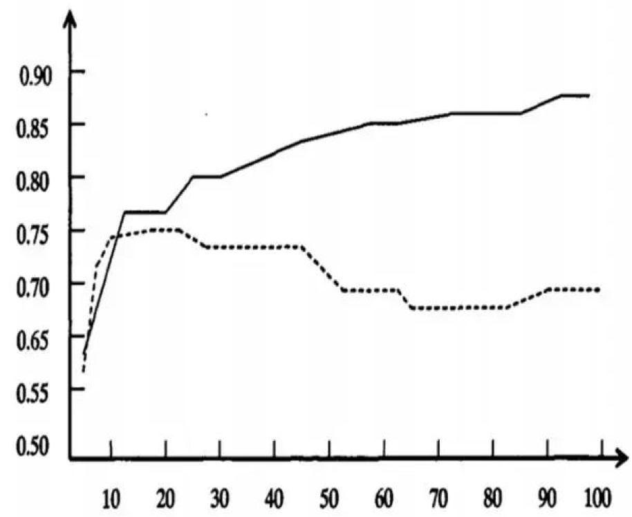
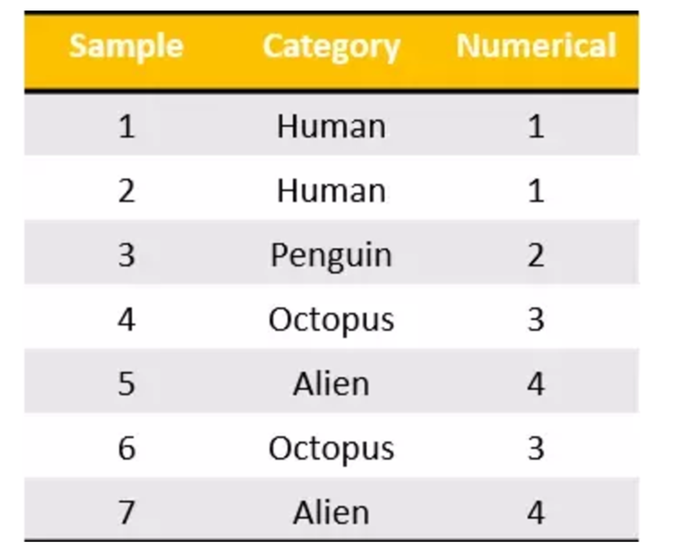
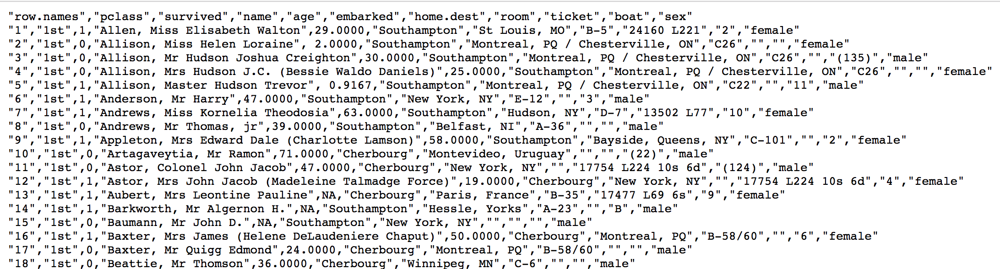
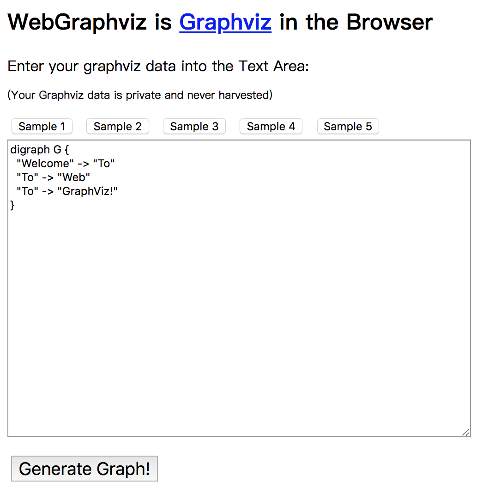

# 1 决策树算法简介

## 学习目标

- 知道什么是决策树

------

决策树思想的来源非常朴素，程序设计中的条件分支结构就是if-else结构，最早的决策树就是利用这类结构分割数据的一种分类学习方法

**决策树：是一种树形结构，其中每个内部节点表示一个属性上的判断，每个分支代表一个判断结果的输出，最后每个叶节点代表一种分类结果，本质是一颗由多个判断节点组成的树**。

怎么理解这句话？通过一个对话例子99


想一想这个女生为什么把年龄放在最上面判断！！！！！！！！！

上面案例是女生通过定性的主观意识，把年龄放到最上面，那么如果需要对这一过程进行量化，该如何处理呢？

此时需要用到信息论中的知识：信息熵，信息增益

------

## 小结

- 决策树定义：
    - 是**一种树形结构**，
    - 本质是**一颗由多个判断节点组成的树**


# 2 决策树分类原理

## 学习目标

- 知道如何求解信息熵
- 知道信息增益的求解过程
- 知道信息增益率的求解过程
- 知道基尼系数的求解过程
- 知道信息增益、信息增益率和基尼系数三者之间的区别、联系

------

## 2.1 熵

### 2.1.1 概念

物理学上，**熵 Entropy** 是“混乱”程度的量度。


**系统越有序，熵值越低；系统越混乱或者分散，熵值越高**。

1948年香农提出了**信息熵**（Entropy）的概念。

- **信息理论**：

1、**从信息的完整性上进行的描述:**

当**系统的有序状态一致时，数据越集中的地方熵值越小，数据越分散的地方熵值越大。**

2、**从信息的有序性上进行的描述:**

当**数据量一致时，系统越有序，熵值越低；系统越混乱或者分散，熵值越高**。

"信息熵" (information entropy)是度量样本集合纯度最常用的一种指标。


即10个人,5个男生  D就是10, Ck就是5  

则 D的信息熵定义为(（log是以2为底，lg是以10为底）:


### 2.1.2 案例

```
课堂案例：
假设我们没有看世界杯的比赛，但是想知道哪支球队会是冠军，
我们只能猜测某支球队是或不是冠军，然后观众用对或不对来回答，
我们想要猜测次数尽可能少，你会用什么方法？

答案：
二分法：
假如有 16 支球队，分别编号，先问是否在 1-8 之间，如果是就继续问是否在 1-4 之间，
以此类推，直到最后判断出冠军球队是哪支。
如果球队数量是 16，我们需要问 4 次来得到最后的答案。那么世界冠军这条消息的信息熵就是 4。

那么信息熵等于4，是如何进行计算的呢？
Ent(D) = -（p1 * logp1 + p2 * logp2 + ... + p16 * logp16），
其中 p1, ..., p16 分别是这 16 支球队夺冠的概率。
当每支球队夺冠概率相等都是 1/16 的时：Ent(D) = -（16 * 1/16 * log1/16） = 4
每个事件概率相同时，熵最大，这件事越不确定。
```

随堂练习：
篮球比赛里，有4个球队 {A,B,C,D} ，获胜概率分别为{1/2, 1/4, 1/8, 1/8}
求Ent(D)

答案：


## 2.2 决策树的划分依据一----信息增益

### 2.2.1 概念

**信息增益：**以某特征划分数据集前后的熵的差值。熵可以表示样本集合的不确定性，熵越大，样本的不确定性就越大。因此可以**使用划分前后集合熵的差值来衡量使用当前特征对于样本集合D划分效果的好坏**。

#### 信息增益 =  entroy(前) - entroy(后)    值越大越好

> 注：信息增益表示得知特征X的信息而使得类Y的信息熵减少的程度

- 定义与公式

假定离散属性a有 V 个可能的取值:


> 假设离散属性性别有2（男，女）个可能的取值


其中：

特征a对训练数据集D的信息增益Gain(D,a),定义为**集合D的信息熵Ent(D)**与**给定特征a条件下D的信息条件熵Ent(D∣a)**之差，即公式为：


公式的详细解释：

信息熵的计算：


条件熵的计算：


其中：

D 表示所有样本  Dv表示a属性的样本数


一般而言，信息增益越大，则意味着**使用属性 a 来进行划分所获得的"纯度提升"越大**。因此，我们可用信息增益来进行决策树的划分属性选择，著名的 ID3 决策树学习算法 [Quinlan， 1986] 就是以信息增益为准则来选择划分属性。

> 其中，ID3 名字中的 ID 是 Iterative Dichotomiser (迭代二分器)的简称

### 2.2.2 案例：

如下图，第一列为论坛号码，第二列为性别，第三列为活跃度，最后一列用户是否流失。

我们要解决一个问题：**性别和活跃度两个特征，哪个对用户流失影响更大**？


通过计算信息增益可以解决这个问题，统计上右表信息

其中Positive为正样本（已流失），Negative为负样本（未流失），下面的数值为不同划分下对应的人数。

可得到三个熵：

**a.计算类别信息熵**

整体熵：


**b.计算性别属性的信息熵(a="性别")**


**c.计算性别的信息增益(a="性别")**


**b.计算活跃度属性的信息熵(a="活跃度")**


**c.计算活跃度的信息增益(a="活跃度")**


**活跃度的信息增益比性别的信息增益大，也就是说，活跃度对用户流失的影响比性别大。**在做特征选择或者数据分析的时候，我们应该重点考察活跃度这个指标。

## 2.3 决策树的划分依据二----信息增益率    C4.5

### 2.3.1 概念    值越大越好

在上面的介绍中，我们有意忽略了"编号"这一列.若把"编号"也作为一个候选划分属性，则根据信息增益公式可计算出它的信息增益为 0.9182，远大于其他候选划分属性。

> 计算每个属性的信息熵过程中,我们发现,该属性的值为0, 也就是其信息增益为0.9182. 但是很明显这么分类,最后出现的结果不具有泛化效果.无法对新样本进行有效预测.

实际上，**信息增益准则对可取值数目较多的属性有所偏好**，为减少这种偏好可能带来的不利影响，著名的 **C4.5 决策树算法 [Quinlan， 1993J 不直接使用信息增益，而是使用"增益率" (gain ratio) 来选择最优划分属性.** 

**增益率：**增益率是用前面的信息增益Gain(D, a)和属性a对应的"固有值"(intrinsic value) [Quinlan , 1993J的比值来共同定义的。


> 属性 a 的可能取值数目越多(即 V 越大)，则 IV(a) 的值通常会越大.

### 2.3.2 案例

#### 2.3.2.1 案例一

> **a.计算类别信息熵**
>
> **b.计算性别属性的信息熵(性别、活跃度)**
>
> **c.计算活跃度的信息增益(性别、活跃度)**

**d.计算属性分裂信息度量**

用分裂信息度量来考虑某种属性进行分裂时分支的数量信息和尺寸信息，我们把这些信息称为属性的内在信息（instrisic information）。信息增益率用信息增益/内在信息，会导致属性的重要性随着内在信息的增大而减小**（也就是说，如果这个属性本身不确定性就很大，那我就越不倾向于选取它）**，这样算是对单纯用信息增益有所补偿。


**e.计算信息增益率**


活跃度的信息增益率更高一些，所以在构建决策树的时候，优先选择

通过这种方式，在选取节点的过程中，我们可以降低取值较多的属性的选取偏好。

#### 2.3.2.2 案例二

如下图，第一列为天气，第二列为温度，第三列为湿度，第四列为风速，最后一列该活动是否进行。

我们要解决：**根据下面表格数据，判断在对应天气下，活动是否会进行**？


该数据集有四个属性，属性集合A={ 天气，温度，湿度，风速}， 类别标签有两个，类别集合L={进行，取消}。

**a.计算类别信息熵**

类别信息熵表示的是所有样本中各种类别出现的不确定性之和。根据熵的概念，熵越大，不确定性就越大，把事情搞清楚所需要的信息量就越多。 


**b.计算每个属性的信息熵**

每个属性的信息熵相当于一种条件熵。他表示的是在某种属性的条件下，各种类别出现的不确定性之和。属性的信息熵越大，表示这个属性中拥有的样本类别越不“纯”。

**c.计算信息增益**

信息增益的 = 熵 - 条件熵，在这里就是 类别信息熵 - 属性信息熵，它表示的是信息不确定性减少的程度。如果一个属性的信息增益越大，就表示用这个属性进行样本划分可以更好的减少划分后样本的不确定性，当然，选择该属性就可以更快更好地完成我们的分类目标。

**信息增益就是ID3算法的特征选择指标。**


> 假设我们把上面表格1的数据前面添加一列为"编号",取值(1--14). 若把"编号"也作为一个候选划分属性,则根据前面步骤: 计算每个属性的信息熵过程中,我们发现,该属性的值为0, 也就是其信息增益为0.940.  但是很明显这么分类,最后出现的结果不具有泛化效果.此时根据信息增益就无法选择出有效分类特征。所以，C4.5选择使用信息增益率对ID3进行改进。

**d.计算属性分裂信息度量**

用分裂信息度量来考虑某种属性进行分裂时分支的数量信息和尺寸信息，我们把这些信息称为属性的内在信息（instrisic information）。信息增益率用信息增益/内在信息，会导致属性的重要性随着内在信息的增大而减小**（也就是说，如果这个属性本身不确定性就很大，那我就越不倾向于选取它）**，这样算是对单纯用信息增益有所补偿。


**e.计算信息增益率**


天气的信息增益率最高，选择天气为分裂属性。发现分裂了之后，天气是“阴”的条件下，类别是”纯“的，所以把它定义为叶子节点，选择不“纯”的结点继续分裂。


在子结点当中重复过程1~5，直到所有的叶子结点足够"纯"。

现在我们来总结一下C4.5的算法流程

```
while(当前节点"不纯")：
    1.计算当前节点的类别熵(以类别取值计算)
    2.计算当前阶段的属性熵(按照属性取值吓得类别取值计算)
    3.计算信息增益
    4.计算各个属性的分裂信息度量
    5.计算各个属性的信息增益率
end while
当前阶段设置为叶子节点
```

### 2.3.3 为什么使用C4.5要好

**1.用信息增益率来选择属性**

克服了用信息增益来选择属性时偏向选择值多的属性的不足。

**2.采用了一种后剪枝方法**

避免树的高度无节制的增长，避免过度拟合数据

**3.对于缺失值的处理**

在某些情况下，可供使用的数据可能缺少某些属性的值。假如〈x，c(x)〉是样本集S中的一个训练实例，但是其属性A的值A(x)未知。

处理缺少属性值的一种策略是赋给它结点n所对应的训练实例中该属性的最常见值；

另外一种更复杂的策略是为A的每个可能值赋予一个概率。

例如，给定一个布尔属性A，如果结点n包含6个已知A=1和4个A=0的实例，那么A(x)=1的概率是0.6，而A(x)=0的概率是0.4。于是，实例x的60%被分配到A=1的分支，40%被分配到另一个分支。

C4.5就是使用这种方法处理缺少的属性值。

## 2.4 决策树的划分依据三----基尼值和基尼指数    CART 决策树

### 2.4.1 概念    值最小的好

CART 决策树 [Breiman et al., 1984] 使用"基尼指数" (Gini index)来选择划分属性.

> CART 是Classification and Regression Tree的简称，这是一种著名的决策树学习算法,分类和回归任务都可用

**基尼值Gini（D）：**从数据集D中随机抽取两个样本，其类别标记不一致的概率。**故，Gini（D）值越小，数据集D的纯度越高。**

数据集 D 的纯度可用基尼值来度量:


**pk  =  (ck / d) ^ 2**


**基尼指数Gini_index（D）：**一般，选择使划分后基尼系数最小的属性作为最优化分属性。


### 2.4.2 案例    基尼值只有两种分类    

请根据下图列表，按照基尼指数的划分依据，做出决策树。

| 序号 | 是否有房 | 婚姻状况 | 年收入 | 是否拖欠贷款 |
| ---- | -------- | -------- | ------ | ------------ |
| 1    | yes      | single   | 125k   | no           |
| 2    | no       | married  | 100k   | no           |
| 3    | no       | single   | 70k    | no           |
| 4    | yes      | married  | 120k   | no           |
| 5    | no       | divorced | 95k    | yes          |
| 6    | no       | married  | 60k    | no           |
| 7    | yes      | divorced | 220k   | no           |
| 8    | no       | single   | 85k    | yes          |
| 9    | no       | married  | 75k    | no           |
| 10   | No       | Single   | 90k    | Yes          |

1，对数据集非序列标号属性{是否有房，婚姻状况，年收入}分别计算它们的Gini指数，**取Gini指数最小的属性作为决策树的根节点属性。**

> 第一次大循环

2，根节点的Gini值为：


3，当根据是否有房来进行划分时，Gini指数计算过程为：

左子节点:   有房

右子节点:   没房


4，若按婚姻状况属性来划分，属性婚姻状况有三个可能的取值{married，single，divorced}，分别计算划分后的Gini系数增益。

**基尼值只有两种分类**

​    **{married} | {single,divorced}**

​    **{single} | {married,divorced}**

​    **{divorced} | {single,married}**


对比计算结果，根据婚姻状况属性来划分根节点时取Gini指数最小的分组作为划分结果，即:

**{married} | {single,divorced}    值越小越好**

5，同理可得年收入Gini：

对于年收入属性为数值型属性，首先需要对数据按升序排序，然后从小到大依次用相邻值的中间值作为分隔将样本划分为两组。例如当面对年收入为60和70这两个值时，我们算得其中间值为65。以中间值65作为分割点求出Gini指数。


根据计算知道，三个属性划分根节点的指数最小的有两个：年收入属性和婚姻状况，他们的指数都为0.3。此时，选取首先出现的属性【married】作为第一次划分。

> 第二次大循环

6，接下来，采用同样的方法，分别计算剩下属性，其中根节点的Gini系数为（此时是否拖欠贷款的各有3个records）


7，对于是否有房属性，可得：


8，对于年收入属性则有：


经过如上流程，构建的决策树，如下图：


现在我们来总结一下CART的算法流程

```
while(当前节点"不纯")：
    1.遍历每个变量的每一种分割方式，找到最好的分割点
    2.分割成两个节点N1和N2
end while
每个节点足够“纯”为止
```

------

## 2.5 小结

### 2.5.1 常见决策树的启发函数比较


| 名称 | 提出时间 | 分支方式   | 备注                                                     |
| ---- | -------- | ---------- | -------------------------------------------------------- |
| ID3  | 1975     | 信息增益   | ID3只能对离散属性的数据集构成决策树                      |
| C4.5 | 1993     | 信息增益率 | 优化后解决了ID3分支过程中总喜欢偏向选择值较多的 属性     |
| CART | 1984     | Gini系数   | 可以进行分类和回归，可以处理离散属性，也可以处理连续属性 |

#### 2.5.1.1 ID3 算法

**存在的缺点**

​    (1) ID3算法在选择根节点和各内部节点中的分支属性时，**采用信息增益作为评价标准**。信息增益的缺点是倾向于选择取值较多的属性，在有些情况下这类属性可能不会提供太多有价值的信息.

​    (2) ID3算法**只能对描述属性为离散型属性的数据集构造决策树**。

#### 2.5.1.2     C4.5算法

**做出的改进(为什么使用C4.5要好)**

​    (1) 用信息增益率来选择属性

​    (2) 可以处理连续数值型属性    

​    (3)采用了一种后剪枝方法

​    (4)对于缺失值的处理

**C4.5算法的优缺点**

​    优点：

​        产生的分类规则易于理解，准确率较高。

​    缺点：

​        在构造树的过程中，需要对数据集进行多次的顺序扫描和排序，因而导致算法的低效。

​        此外，C4.5只适合于能够驻留于内存的数据集，当训练集大得无法在内存容纳时程序无法运行。

#### 2.5.1.3 CART算法

CART算法相比C4.5算法的分类方法，采用了简化的二叉树模型，同时特征选择采用了近似的基尼系数来简化计算。

**C4.5不一定是二叉树，但CART一定是二叉树。**

#### 2.5.1.4 多变量决策树(multi-variate decision tree)

同时，无论是ID3, C4.5还是CART,在做特征选择的时候都是选择最优的一个特征来做分类决策，但是大多数，**分类决策不应该是由某一个特征决定的，而是应该由一组特征决定的。**这样决策得到的决策树更加准确。这个决策树叫做多变量决策树(multi-variate decision tree)。在选择最优特征的时候，多变量决策树不是选择某一个最优特征，而是选择最优的一个特征线性组合来做决策。这个算法的代表是OC1，这里不多介绍。

如果样本发生一点点的改动，就会导致树结构的剧烈改变。这个可以通过集成学习里面的随机森林之类的方法解决。

### 2.5.2 决策树变量的两种类型：

1. 数字型（Numeric）：变量类型是整数或浮点数，如前面例子中的“年收入”。用“>=”，“>”,“<”或“<=”作为分割条件（排序后，利用已有的分割情况，可以优化分割算法的时间复杂度）。
2. 名称型（Nominal）：类似编程语言中的枚举类型，变量只能从有限的选项中选取，比如前面例子中的“婚姻情况”，只能是“单身”，“已婚”或“离婚”，使用“=”来分割。

### 2.5.3 如何评估分割点的好坏？

如果一个分割点可以将当前的所有节点分为两类，使得每一类都很“纯”，也就是同一类的记录较多，那么就是一个好分割点。

比如上面的例子，“拥有房产”，可以将记录分成了两类，“是”的节点全部都可以偿还债务，非常“纯”；“否”的节点，可以偿还贷款和无法偿还贷款的人都有，不是很“纯”，但是两个节点加起来的纯度之和与原始节点的纯度之差最大，所以按照这种方法分割。

构建决策树采用贪心算法，只考虑当前纯度差最大的情况作为分割点。


# 3 cart剪枝

## 学习目标

- 了解为什么要进行cart剪枝
- 知道常用的cart剪枝方法

------

## 3.1 为什么要剪枝



- **图形描述**
    - 横轴表示在决策树创建过程中树的结点总数，纵轴表示决策树的预测精度。
    - 实线显示的是决策树在训练集上的精度，虚线显示的则是在一个独立的测试集上测量出来的精度。
    - 随着树的增长，在训练样集上的精度是单调上升的， 然而在独立的测试样例上测出的精度先上升后下降。
- **出现这种情况的原因：**
    - 原因1：噪声、样本冲突，即错误的样本数据。
    - 原因2：特征即属性不能完全作为分类标准。
    - 原因3：巧合的规律性，数据量不够大。

## 3.2 常用的减枝方法

### 3.2.1 预剪枝    从上到下

（1）每一个结点所包含的最小样本数目，例如10，则该结点总样本数小于10时，则不再分；

（2）指定树的高度或者深度，例如树的最大深度为4；

（3）指定结点的熵小于某个值，不再划分。随着树的增长， 在训练样集上的精度是单调上升的， 然而在独立的测试样例上测出的精度先上升后下降**。**

### 3.2.2  后剪枝    从下到上    保留更多分支    开销大

后剪枝，在已生成过拟合决策树上进行剪枝，可以得到简化版的剪枝决策树。

------

## 3.3 小结

- 剪枝原因【了解】
    - 噪声、样本冲突，即错误的样本数据
    - 特征即属性不能完全作为分类标准
    - 巧合的规律性，数据量不够大。
- 常用剪枝方法【知道】
    - 预剪枝
        - 在构建树的过程中，同时剪枝
            - 限制节点最小样本数
            - 指定数据高度
            - 指定熵值的最小值
    - 后剪枝
        - 把一棵树，构建完成之后，再进行从下往上的剪枝


# 4 特征工程-特征提取

## 学习目标

- 了解什么是特征提取
- 知道字典特征提取操作流程
- 知道文本特征提取操作流程
- 知道tfidf的实现思想

------

什么是特征提取呢？


## 4.1 特征提取

### 4.1.0 用法和 特征值标准化 类似	StandardScaler	DictVectorizer

- 特征值标准化

```python
from sklearn.preprocessing import StandardScaler

scaler = StandardScaler()
x_train = scaler.fit_transform(x_train)
x_test = scaler.fit_transform(x_test)
```

- 特征提取

```python
from sklearn.feature_extraction import DictVectorizer

# 1、实例化一个转换器类
transfer = DictVectorizer(sparse=False)
# 2、调用fit_transform
data = transfer.fit_transform(data)
```


### 4.1.1 定义    

**将任意数据（如文本或图像）转换为可用于机器学习的数字特征**

> 注：特征值化是为了计算机更好的去理解数据

- 特征提取分类:
    - 字典特征提取(特征离散化)
    - 文本特征提取
    - 图像特征提取（深度学习将介绍）

### 4.1.2 特征提取API    sklearn.feature_extraction

```python
sklearn.feature_extraction
```

## 4.2 字典特征提取    feature_extraction.DictVectorizer()

**作用：对字典数据进行特征值化**

- sklearn.feature_extraction.DictVectorizer(sparse=True,…)
    - DictVectorizer.fit_transform(X) 
        - X:字典或者包含字典的迭代器返回值
        - sparse=True    返回sparse矩阵    可以提高效率和节省内存
        - sparse=False    不返回sparse矩阵    
    - DictVectorizer.get_feature_names() 返回类别名称

### 4.2.1 应用

我们对以下数据进行特征提取

```python
[{'city': '北京','temperature':100},
{'city': '上海','temperature':60},
{'city': '深圳','temperature':30}]
```


### 4.2.2 流程分析

- 实例化类DictVectorizer
- 调用fit_transform方法输入数据并转换（注意返回格式）

```python
'''
用法和 特征值标准化 类似

sklearn.feature_extraction.DictVectorizer(sparse=True,…)
    DictVectorizer.fit_transform(X)
        X:字典或者包含字典的迭代器返回值
        sparse=True  返回sparse矩阵
        sparse=False 返回非sparse矩阵

    DictVectorizer.get_feature_names() 返回类别名称
'''

from sklearn.feature_extraction import DictVectorizer


def dict_demo():
    """
    对字典类型的数据进行特征抽取
    :return: None
    """

    data = [
        {'city': '北京', 'temperature': 100},
        {'city': '上海', 'temperature': 60},
        {'city': '深圳', 'temperature': 30}]

    # 1、实例化一个转换器类
    transfer = DictVectorizer(sparse=False)
    # 2、调用fit_transform
    data = transfer.fit_transform(data)

    print("返回的结果\n", data)
    #  [[  0.   1.   0. 100.]
    #  [  1.   0.   0.  60.]
    #  [  0.   0.   1.  30.]]
    
    # 打印特征名字
    print("特征名字：\n", transfer.get_feature_names())
    # ['city=上海', 'city=北京', 'city=深圳', 'temperature']
    
    return None


if __name__ == '__main__':
    dict_demo()
```

注意观察没有加上sparse=False参数的结果

```python
返回的结果:
   (0, 1)    1.0
  (0, 3)    100.0
  (1, 0)    1.0
  (1, 3)    60.0
  (2, 2)    1.0
  (2, 3)    30.0
特征名字：
 ['city=上海', 'city=北京', 'city=深圳', 'temperature']
```

这个结果并不是我们想要看到的，所以加上参数，得到想要的结果：

```python
返回的结果:
 [[   0.    1.    0.  100.]
 [   1.    0.    0.   60.]
 [   0.    0.    1.   30.]]
特征名字：
 ['city=上海', 'city=北京', 'city=深圳', 'temperature']
```

之前在学习pandas中的离散化的时候，也实现了类似的效果。

我们把这个处理数据的技巧叫做”one-hot“编码：



转化为：


### 4.2.3 总结

**对于特征当中存在类别信息的我们都会做one-hot编码处理**

## 4.3 文本特征提取    feature_extraction.text.CountVectorizer()

**作用：对文本数据进行特征值化**

- **sklearn.feature_extraction.text.CountVectorizer(stop_words=[])**
    - 返回词频矩阵
    - stop_words 结束词,填写之后这个词不会被计数
    - 不返回单个字母的词和标点符号
    - CountVectorizer.fit_transform(X) 
        - X:文本或者包含文本字符串的可迭代对象 
        - 返回值:返回sparse矩阵
    - CountVectorizer.get_feature_names() 返回值:单词列表
- **sklearn.feature_extraction.text.TfidfVectorizer**

### 4.3.1 应用 中英文

我们对以下数据进行特征提取

```python
["life is short,i like python",
"life is too long,i dislike python"]
```


### 4.3.2 流程分析

- 实例化类CountVectorizer
- 调用fit_transform方法输入数据并转换 （注意返回格式，利用toarray()进行sparse矩阵转换array数组）

```python
def text_count_demo():
    """
    对文本进行特征抽取，countvetorizer
    :return: None
    """
    data = ["life is short,i like like python", "life is too long,i dislike python"]

    # 1、实例化一个转换器类
    transfer = CountVectorizer()    # 注意,没有sparse这个参数

    # 2、调用fit_transform
    data = transfer.fit_transform(data)

    # 3.打印数据
    print('文本特征抽取的结果:\n', data)
    print('文本特征抽取的结果(转换为数组):\n', data.toarray())

    print("返回特征名字：\n", transfer.get_feature_names())

    return None


if __name__ == '__main__':
    text_count_demo()
```

返回结果：

```python
文本特征抽取的结果:
   (0, 2)	1
  (0, 1)	1
  (0, 6)	1
  (0, 3)	2
  (0, 5)	1
  (1, 2)	1
  (1, 1)	1
  (1, 5)	1
  (1, 7)	1
  (1, 4)	1
  (1, 0)	1
文本特征抽取的结果:
 [[0 1 1 2 0 1 1 0]
 [1 1 1 0 1 1 0 1]]
返回特征名字：
 ['dislike', 'is', 'life', 'like', 'long', 'python', 'short', 'too']
```

**问题:如果我们将数据替换成中文？**

```python
"人生苦短，我喜欢Python","生活太长久，我不喜欢Python"
```

那么最终得到的结果是


为什么会得到这样的结果呢，**仔细分析之后会发现英文默认是以空格分开的。其实就达到了一个分词的效果**，所以我们要对中文进行分词处理

### 4.3.3 jieba分词处理

- jieba.cut()
    - 返回词语组成的生成器

需要安装下jieba库

```python
pip3 install jieba
```

### 4.3.4 案例分析

对以下三句话进行特征值化

```python
今天很残酷，明天更残酷，后天很美好，
但绝对大部分是死在明天晚上，所以每个人不要放弃今天。

我们看到的从很远星系来的光是在几百万年之前发出的，
这样当我们看到宇宙时，我们是在看它的过去。

如果只用一种方式了解某样事物，你就不会真正了解它。
了解事物真正含义的秘密取决于如何将其与我们所了解的事物相联系。
```

- 分析
    - 准备句子，利用jieba.cut进行分词
    - 实例化CountVectorizer
    - 将分词结果变成字符串当作fit_transform的输入值


```python
from sklearn.feature_extraction.text import CountVectorizer
import jieba


def cut_word(text):
    """
    对中文进行分词
    "我爱北京天安门"————>"我 爱 北京 天安门"
    :param text:
    :return: text
    """

    # jieba返回对象,使用list转换    使用空格分开字词
    text = " ".join(list(jieba.cut(text)))

    return text


def text_chinese_count_demo():
    """
    对中文进行特征抽取
    :return: None
    """
    data = ["一种还是一种今天很残酷，明天更残酷，后天很美好，但绝对大部分是死在明天晚上，所以每个人不要放弃今天。",
            "我们看到的从很远星系来的光是在几百万年之前发出的，这样当我们看到宇宙时，我们是在看它的过去。",
            "如果只用一种方式了解某样事物，你就不会真正了解它。了解事物真正含义的秘密取决于如何将其与我们所了解的事物相联系。"]

    # 将原始数据转换成分好词的形式
    text_list = []
    for sent in data:
        # 返回来的加了空格的字符串,再放进列表中
        text_list.append(cut_word(sent))

    print(text_list)

    # 1、实例化一个转换器类
    transfer = CountVectorizer()
    # 2、调用fit_transform
    data = transfer.fit_transform(text_list)

    print("文本特征抽取的结果：\n", data.toarray())
    print("返回特征名字：\n", transfer.get_feature_names())

    return None


if __name__ == '__main__':
    print(cut_word('我爱你python,人生苦短,我用python'))
    # 分成功了,用空格分开了
    # 我爱你 python , 人生 苦短 , 我用 python

    text_chinese_count_demo()
```

返回结果：

```python
我爱你 python , 人生 苦短 , 我用 python

[
    '一种 还是 一种 今天 很 残酷 ， 明天 更 残酷 ， 后天 很 美好 ， 但 绝对 大部分 是 死 在 明天 晚上 ， 所以 每个 人 不要 放弃 今天 。', 
    '我们 看到 的 从 很 远 星系 来 的 光是在 几百万年 之前 发出 的 ， 这样 当 我们 看到 宇宙 时 ， 我们 是 在 看 它 的 过去 。', 
    '如果 只用 一种 方式 了解 某样 事物 ， 你 就 不会 真正 了解 它 。 了解 事物 真正 含义 的 秘密 取决于 如何 将 其 与 我们 所 了解 的 事物 相 联系 。'
]
文本特征抽取的结果：
 [[2 0 1 0 0 0 2 0 0 0 0 0 1 0 1 0 0 0 0 1 1 0 2 0 1 0 2 1 0 0 0 1 1 0 0 1
  0]
 [0 0 0 1 0 0 0 1 1 1 0 0 0 0 0 0 0 1 3 0 0 0 0 1 0 0 0 0 2 0 0 0 0 0 1 0
  1]
 [1 1 0 0 4 3 0 0 0 0 1 1 0 1 0 1 1 0 1 0 0 1 0 0 0 1 0 0 0 2 1 0 0 1 0 0
  0]]
返回特征名字：
 [
     '一种', '不会', '不要', '之前', '了解', '事物', '今天', '光是在', '几百万年', '发出', '取决于', '只用', 
  '后天', '含义', '大部分', '如何', '如果', '宇宙', '我们', '所以', '放弃', '方式', '明天', '星系', '晚上', 
  '某样', '残酷', '每个', '看到', '真正', '秘密', '绝对', '美好', '联系', '过去', '还是', '这样'
 ]

进程已结束，退出代码为 0

```

**但如果把这样的词语特征用于分类，会出现什么问题？**

请看问题：


**该如何处理某个词或短语在多篇文章中出现的次数高这种情况**

### 4.3.5 Tf-idf文本特征提取	TfidfVectorizer

- TF-IDF的主要思想是：如果**某个词或短语在一篇文章中出现的概率高，并且在其他文章中很少出现**，则认为此词或者短语具有很好的类别区分能力，适合用来分类。
- **TF-IDF作用：用以评估一字词对于一个文件集或一个语料库中的其中一份文件的重要程度。**

#### 4.3.5.1 公式

- 词频（term frequency，tf）指的是某一个给定的词语在该文件中出现的频率
- 逆向文档频率（inverse document frequency，idf）是一个词语普遍重要性的度量。某一特定词语的idf，可以**由总文件数目除以包含该词语之文件的数目，再将得到的商取以10为底的对数得到**


最终得出结果可以理解为重要程度。

```
举例：
假如一篇文章的总词语数是100个，而词语"非常"出现了5次，那么"非常"一词在该文件中的词频就是5/100=0.05。
而计算文件频率（IDF）的方法是以文件集的文件总数，除以出现"非常"一词的文件数。
所以，如果"非常"一词在1,0000份文件出现过，而文件总数是10,000,000份的话，
其逆向文件频率就是lg（10,000,000 / 1,0000）=3。
最后"非常"对于这篇文档的tf-idf的分数为0.05 * 3=0.15
```

#### 4.3.5.2 案例

```python
from sklearn.feature_extraction.text import TfidfVectorizer
import jieba


def cut_word(text):
    """
    对中文进行分词
    "我爱北京天安门"————>"我 爱 北京 天安门"
    :param text:
    :return: text
    """

    # jieba返回对象,使用list转换    使用空格分开字词
    text = " ".join(list(jieba.cut(text)))

    return text


def text_chinese_count_demo():
    """
    对中文进行特征抽取
    :return: None
    """
    data = ["一种还是一种今天很残酷，明天更残酷，后天很美好，但绝对大部分是死在明天晚上，所以每个人不要放弃今天。",
            "我们看到的从很远星系来的光是在几百万年之前发出的，这样当我们看到宇宙时，我们是在看它的过去。",
            "如果只用一种方式了解某样事物，你就不会真正了解它。了解事物真正含义的秘密取决于如何将其与我们所了解的事物相联系。"]

    # 将原始数据转换成分好词的形式
    text_list = []
    for sent in data:
        # 返回来的加了空格的字符串,再放进列表中
        text_list.append(cut_word(sent))

    print(text_list)

    # 1、实例化一个转换器类
    # stop_words 停止词
    transfer = TfidfVectorizer(stop_words=['一种', '不会', '不要'])
    # 2、调用fit_transform
    data = transfer.fit_transform(text_list)

    print("文本特征抽取的结果：\n", data.toarray())
    print("返回特征名字：\n", transfer.get_feature_names())

    return None


if __name__ == '__main__':
    print(cut_word('我爱你python,人生苦短,我用python'))
    # 分成功了,用空格分开了
    # 我爱你 python , 人生 苦短 , 我用 python

    text_chinese_count_demo()
```

返回结果：

```python
Building prefix dict from the default dictionary ...
Loading model from cache /var/folders/mz/tzf2l3sx4rgg6qpglfb035_r0000gn/T/jieba.cache
Loading model cost 0.856 seconds.
Prefix dict has been built succesfully.
['一种 还是 一种 今天 很 残酷 ， 明天 更 残酷 ， 后天 很 美好 ， 但 绝对 大部分 是 死 在 明天 晚上 ， 所以 每个 人 不要 放弃 今天 。', '我们 看到 的 从 很 远 星系 来 的 光是在 几百万年 之前 发出 的 ， 这样 当 我们 看到 宇宙 时 ， 我们 是 在 看 它 的 过去 。', '如果 只用 一种 方式 了解 某样 事物 ， 你 就 不会 真正 了解 它 。 了解 事物 真正 含义 的 秘密 取决于 如何 将 其 与 我们 所 了解 的 事物 相 联系 。']
文本特征抽取的结果：
 [[ 0.          0.          0.          0.43643578  0.          0.          0.
   0.          0.          0.21821789  0.          0.21821789  0.          0.
   0.          0.          0.21821789  0.21821789  0.          0.43643578
   0.          0.21821789  0.          0.43643578  0.21821789  0.          0.
   0.          0.21821789  0.21821789  0.          0.          0.21821789
   0.        ]
 [ 0.2410822   0.          0.          0.          0.2410822   0.2410822
   0.2410822   0.          0.          0.          0.          0.          0.
   0.          0.2410822   0.55004769  0.          0.          0.          0.
   0.2410822   0.          0.          0.          0.          0.48216441
   0.          0.          0.          0.          0.          0.2410822
   0.          0.2410822 ]
 [ 0.          0.644003    0.48300225  0.          0.          0.          0.
   0.16100075  0.16100075  0.          0.16100075  0.          0.16100075
   0.16100075  0.          0.12244522  0.          0.          0.16100075
   0.          0.          0.          0.16100075  0.          0.          0.
   0.3220015   0.16100075  0.          0.          0.16100075  0.          0.
   0.        ]]
返回特征名字：
 ['之前', '了解', '事物', '今天', '光是在', '几百万年', '发出', '取决于', '只用', '后天', '含义', '大部分', '如何', '如果', '宇宙', '我们', '所以', '放弃', '方式', '明天', '星系', '晚上', '某样', '残酷', '每个', '看到', '真正', '秘密', '绝对', '美好', '联系', '过去', '还是', '这样']
```

### 4.3.6 Tf-idf的重要性

**分类机器学习算法进行文章分类中前期数据处理方式**

------

## 4.4 小结

- 特征提取【了解】
    - 将任意数据（如文本或图像）转换为可用于机器学习的数字特征
- 特征提取分类:【了解】
    - 字典特征提取(特征离散化)
    - 文本特征提取
    - 图像特征提取
- 字典特征提取【知道】
    - 字典特征提取就是对类别型数据进行转换
    - api:sklearn.feature_extraction.DictVectorizer(sparse=True,…)
        - aparse矩阵
            - 1.节省内容
            - 2.提高读取效率
        - 注意：
            - 对于特征当中存在类别信息的我们都会做one-hot编码处理
- 文本特征提取（英文）【知道】
    - api:sklearn.feature_extraction.text.CountVectorizer(stop_words=[])
        - stop_words -- 停用词
        - 注意：没有sparse这个参数
        - 单个字母，标点符号不做统计
- 文本特征提取（中文）【知道】
    - 注意：
        - 1.在中文文本特征提取之前，需要对句子（文章）进行分词（jieba）
        - 2.里面依旧可以使用停用词，进行词语的限制
- tfidf【知道】
    - 主要思想：
        - 如果某个词或短语在一篇文章中出现的概率高，并且在其他文章中很少出现，则认为此词或者短语具有很好的
        - 类别区分能力，适合用来分类
    - tfidf
        - tf -- 词频
        - idf -- 逆向文档频率
    - api:sklearn.feature_extraction.text.TfidfVectorizer
    - 注意：
        - 分类机器学习算法进行文章分类中前期数据处理方式


# 5 决策树算法api    tree.DecisionTreeClassifier()

## 学习目标

- 知道决策树算法api的具体使用

------

- class sklearn.tree.DecisionTreeClassifier(criterion=’gini’, max_depth=None,random_state=None)
    - criterion
        - 特征选择标准
        - "gini"或者"entropy"，前者代表基尼系数，后者代表信息增益。一默认"gini"，即CART算法。
    - min_samples_split
        - 内部节点再划分所需最小样本数
        - 这个值限制了子树继续划分的条件，如果某节点的样本数少于min_samples_split，则不会继续再尝试选择最优特征来进行划分。 默认是2.如果样本量不大，不需要管这个值。如果样本量数量级非常大，则推荐增大这个值。我之前的一个项目例子，有大概10万样本，建立决策树时，我选择了min_samples_split=10。可以作为参考。
    - min_samples_leaf
        - 叶子节点最少样本数
        - 这个值限制了叶子节点最少的样本数，如果某叶子节点数目小于样本数，则会和兄弟节点一起被剪枝。 默认是1,可以输入最少的样本数的整数，或者最少样本数占样本总数的百分比。如果样本量不大，不需要管这个值。如果样本量数量级非常大，则推荐增大这个值。之前的10万样本项目使用min_samples_leaf的值为5，仅供参考。
    - max_depth
        - 决策树最大深度
        - 决策树的最大深度，默认可以不输入，如果不输入的话，决策树在建立子树的时候不会限制子树的深度。一般来说，数据少或者特征少的时候可以不管这个值。如果模型样本量多，特征也多的情况下，推荐限制这个最大深度，具体的取值取决于数据的分布。常用的可以取值10-100之间
    - random_state
        - 随机数种子


# 6 案例：泰坦尼克号乘客生存预测

## 学习目标

- 通过案例进一步掌握决策树算法api的具体使用

------

## 6.1 案例背景

泰坦尼克号沉没是历史上最臭名昭着的沉船之一。1912年4月15日，在她的处女航中，泰坦尼克号在与冰山相撞后沉没，在2224名乘客和机组人员中造成1502人死亡。这场耸人听闻的悲剧震惊了国际社会，并为船舶制定了更好的安全规定。 造成海难失事的原因之一是乘客和机组人员没有足够的救生艇。尽管幸存下沉有一些运气因素，但有些人比其他人更容易生存，例如妇女，儿童和上流社会。 在这个案例中，我们要求您完成对哪些人可能存活的分析。特别是，我们要求您运用机器学习工具来预测哪些乘客幸免于悲剧。

> 案例：https://www.kaggle.com/c/titanic/overview

我们提取到的数据集中的特征包括票的类别，是否存活，乘坐班次，年龄，登陆home.dest，房间，船和性别等。

> 数据：http://biostat.mc.vanderbilt.edu/wiki/pub/Main/DataSets/titanic.txt



经过观察数据得到:

- **1 乘坐班是指乘客班（1，2，3），是社会经济阶层的代表。**
- **2 其中age数据存在缺失。**

## 6.2 步骤分析

- 1.获取数据
- 2.数据基本处理
    - 2.1 确定特征值,目标值
    - 2.2 缺失值处理
    - 2.3 数据集划分
- 3.特征工程(字典特征抽取)
- 4.机器学习(决策树)
- 5.模型评估

## 6.3 代码实现

- 导入需要的模块

```python
import pandas as pd
import numpy as np
# 数据分隔
from sklearn.model_selection import train_test_split
# 字典特征提取
from sklearn.feature_extraction import DictVectorizer
# 决策树api,决策树可视化
from sklearn.tree import DecisionTreeClassifier, export_graphviz
```

- 1.获取数据

```python
# 乘客数据
titanic = pd.read_csv('../data/titanic/test.csv')
titanic.head()

# 幸存数据
survive = pd.read_csv('../data/titanic/gender_submission.csv')
survive
```

- 2.数据基本处理

    - 2.1 确定特征值,目标值

    ```python
    # 特征值
    x = titanic[["Pclass", "Age", "Sex"]]
    # 目标值
    y = survive['Survived']
    ```

    - 2.2 缺失值处理

    ```python
    np.any(x['Age'].isnull())
    # 缺失值需要处理，将特征当中有类别的这些特征进行字典特征抽取
    # inplace=True 会修改原值
    x['Age'].fillna(x['Age'].mean(), inplace=True)
    np.any(x['Age'].isnull())
    ```

    - 2.3 数据集划分

    ```python
    x_train, x_test, y_train, y_test = train_test_split(x, y, random_state=22)
    ```

- 3.特征工程(字典特征抽取)

特征中出现类别符号，需要进行one-hot编码处理(DictVectorizer)

x.to_dict(orient="records") 需要将数组特征转换成字典数据

```python
# x_train格式不对,
x_train 
```


```python
# 对于x转换成字典数据x.to_dict(orient="records")
# [{"pclass": "1st", "age": 29.00, "sex": "female"}, {}]

# x_train格式不对,
# 转换成字典格式
x_train1 = x_train.to_dict(orient="records")
x_test1 = x_test.to_dict(orient="records")
```


- 4.训练数据

```python
transfer = DictVectorizer(sparse=False)

x_train2 = transfer.fit_transform(x_train1)
x_test2 = transfer.fit_transform(x_test1)
```

- 5.决策树模型训练和模型评估

决策树API当中，如果没有指定max_depth那么会根据信息熵的条件直到最终结束。这里我们可以指定树的深度来进行限制树的大小

```python
# 4.机器学习(决策树)
estimator = DecisionTreeClassifier(criterion="entropy", max_depth=5)
estimator.fit(x_train2, y_train)

# 5.模型评估
estimator.score(x_test, y_test)

estimator.predict(x_test)
```

决策树的结构是可以直接显示

## 6.4 决策树可视化

### 6.4.1 保存树的结构到dot文件	export_graphviz

- sklearn.tree.export_graphviz() 该函数能够导出DOT格式
    - tree.export_graphviz(estimator,out_file='tree.dot’,feature_names=[‘’,’’])

```python
export_graphviz(estimator, out_file="./data/tree.dot", feature_names=['age', 'pclass=1st', 'pclass=2nd', 'pclass=3rd', '女性', '男性'])
```

dot文件当中的内容如下

```python
digraph Tree {
node [shape=box] ;
0 [label="petal length (cm) <= 2.45\nentropy = 1.584\nsamples = 112\nvalue = [39, 37, 36]"] ;
1 [label="entropy = 0.0\nsamples = 39\nvalue = [39, 0, 0]"] ;
0 -> 1 [labeldistance=2.5, labelangle=45, headlabel="True"] ;
2 [label="petal width (cm) <= 1.75\nentropy = 1.0\nsamples = 73\nvalue = [0, 37, 36]"] ;
0 -> 2 [labeldistance=2.5, labelangle=-45, headlabel="False"] ;
3 [label="petal length (cm) <= 5.05\nentropy = 0.391\nsamples = 39\nvalue = [0, 36, 3]"] ;
2 -> 3 ;
4 [label="sepal length (cm) <= 4.95\nentropy = 0.183\nsamples = 36\nvalue = [0, 35, 1]"] ;
3 -> 4 ;
5 [label="petal length (cm) <= 3.9\nentropy = 1.0\nsamples = 2\nvalue = [0, 1, 1]"] ;
4 -> 5 ;
6 [label="entropy = 0.0\nsamples = 1\nvalue = [0, 1, 0]"] ;
5 -> 6 ;
7 [label="entropy = 0.0\nsamples = 1\nvalue = [0, 0, 1]"] ;
5 -> 7 ;
8 [label="entropy = 0.0\nsamples = 34\nvalue = [0, 34, 0]"] ;
4 -> 8 ;
9 [label="petal width (cm) <= 1.55\nentropy = 0.918\nsamples = 3\nvalue = [0, 1, 2]"] ;
3 -> 9 ;
10 [label="entropy = 0.0\nsamples = 2\nvalue = [0, 0, 2]"] ;
9 -> 10 ;
11 [label="entropy = 0.0\nsamples = 1\nvalue = [0, 1, 0]"] ;
9 -> 11 ;
12 [label="petal length (cm) <= 4.85\nentropy = 0.191\nsamples = 34\nvalue = [0, 1, 33]"] ;
2 -> 12 ;
13 [label="entropy = 0.0\nsamples = 1\nvalue = [0, 1, 0]"] ;
12 -> 13 ;
14 [label="entropy = 0.0\nsamples = 33\nvalue = [0, 0, 33]"] ;
12 -> 14 ;
}
```

那么这个结构不能看清结构，所以可以在一个网站上显示

### 6.4.2 网站显示结构

- http://webgraphviz.com/



将dot文件内容复制到该网站当中显示


## 6.5 决策树总结

- 优点：
    - 简单的理解和解释，树木可视化。
- 缺点：
    - **决策树学习者可以创建不能很好地推广数据的过于复杂的树,容易发生过拟合。**
- 改进：
    - 减枝cart算法
    - **随机森林**（集成学习的一种）

**注：企业重要决策，由于决策树很好的分析能力，在决策过程应用较多， 可以选择特征**

------

## 6.6 小结

- 案例流程分析【了解】
    - 1.获取数据
    - 2.数据基本处理
        - 2.1 确定特征值,目标值
        - 2.2 缺失值处理
        - 2.3 数据集划分
    - 3.特征工程(字典特征抽取)
    - 4.机器学习(决策树)
    - 5.模型评估
- 决策树可视化【了解】
    - sklearn.tree.export_graphviz()
- 决策树优缺点总结【知道】
    - 优点：
        - 简单的理解和解释，树木可视化。
    - 缺点：
        - 决策树学习者可以创建不能很好地推广数据的过于复杂的树,容易发生过拟合。
    - 改进：
        - 减枝cart算法
        - 随机森林（集成学习的一种）


# 7 回归决策树	tree.DecisionTreeRegressor

## 学习目标

知道回归决策树的实现原理
前面已经讲到，关于数据类型，我们主要可以把其分为两类，连续型数据和离散型数据。在面对不同数据时，决策树也可以分为两大类型：

- **分类决策树和回归决策树。**
- **前者主要用于处理离散型数据，后者主要用于处理连续型数据。**

## 7.1 原理概述    处理连续型数据

不管是回归决策树还是分类决策树，都会存在两个核心问题：

- 如何选择划分点？
- 如何决定叶节点的输出值？

一个回归树对应着输入空间（即特征空间）的一个划分以及在划分单元上的输出值。分类树中，我们采用信息论中的方法，通过计算选择最佳划分点。
而在回归树中，采用的是启发式的方法。**假如我们有n个特征，每个特征有s (i ∈ (1,n))个取值，那我们遍历所有特征，尝试该特征所有取值，对空间进行划分，直到取到特征 j 的取值 s，使得损失函数最小，这样就得到了一个划分点。**描述该过程的公式如下：


> 举例：
> 如下图，假如我们想要对楼内居⺠的年龄进行回归，将楼划分为3个区域R ,R ,R （红线），
> 那么R1 的输出就是第一列四个居⺠年龄的平均值，
> R2 的输出就是第二列四个居⺠年龄的平均值，
> R3 的输出就是第三、四列八个居⺠年龄的平均值。


## 7.2 算法描述
- 输入：训练数据集D:
- 输出：回归树f(x).
- 在训练数据集所在的输入空间中，递归的将每个区域划分为两个子区域并决定每个子区域上的输出值，构建二叉决策树：
    - （1）选择最优切分特征j与切分点s，求解


- 遍历特征j,对固定的切分特征j扫描切分点s,选择使得上式达到最小值的对(j,s).
    - （2）用选定的对(j,s)划分区域并决定相应的输出值：


- （3）继续对两个子区域调用步骤（1）和（2），直至满足停止条件。
- （4）将输入空间划分为M个区域R ,R ,...,R , 生成决策树：


## 7.3 简单实例
为了易于理解，接下来通过一个简单实例加深对回归决策树的理解。
训练数据⻅下表，目标是得到一棵最小二乘回归树。

| x    | 1    | 2    | 3    | 4    | 5    | 6    | 7    | 8    | 9    | 10   |
| ---- | ---- | ---- | ---- | ---- | ---- | ---- | ---- | ---- | ---- | ---- |
| y    | 5.56 | 5.7  | 5.91 | 6.4  | 6.8  | 7.05 | 8.9  | 8.7  | 9    | 9.05 |

### 7.3.1 实例计算过程

#### (1）选择最优的切分特征j与最优切分点s：

- 确定第一个问题：选择最优切分特征：
    - 在本数据集中，只有一个特征，因此最优切分特征自然是x。
- 确定第二个问题：我们考虑9个切分点 [1.5,2.5,3.5,4.5,5.5,6.5,7.5,8.5,9.5] 。


**a、计算子区域输出值：**
例如，取 s=1.5。此时R1 = 1,R2 = 2,3,4,5,6,7,8,9,10，这两个区域的输出值分别为：

- c1 = 5.56
- c2 = (5.7+5.91+6.4+6.8+7.05+8.9+8.7+9+9.05)/9 = 7.50。

同理，得到其他各切分点的子区域输出值，如下表：

| s    | 1.5  | 2.5  | 3.5  | 4.5  | 5.5  | 6.5  | 7.5  | 8.5  | 9.5  |
| ---- | ---- | ---- | ---- | ---- | ---- | ---- | ---- | ---- | ---- |
| c1   | 5.56 | 5.63 | 5.72 | 5.89 | 6.07 | 6.24 | 6.62 | 6.88 | 7.11 |
| c2   | 7.5  | 7.73 | 7.99 | 8.25 | 8.54 | 8.91 | 8.92 | 9.03 | 9.05 |

**b、计算损失函数值，找到最优切分点：**


同理，计算得到其他各切分点的损失函数值，可获得下表：

| s    | 1.5   | 2.5   | 3.5  | 4.5  | 5.5  | 6.5  | 7.5  | 8.5   | 9.5   |
| ---- | ----- | ----- | ---- | ---- | ---- | ---- | ---- | ----- | ----- |
| m(s) | 15.72 | 12.07 | 8.36 | 5.78 | 3.91 | 1.93 | 8.01 | 11.73 | 15.74 |

显然取 s=6.5时，m(s)最小。因此，第一个划分变量【j=x,s=6.5】

#### （2）用选定的(j,s)划分区域，并决定输出值;

两个区域分别是：R1 = {1,2,3,4,5,6},R2 = {7,8,9,10}
输出值c = avg(yi∣xi ∈ Rm),c1 = 6.24,c2 = 8.91

#### （3）调用步骤 (1)、(2)，继续划分：

对R1继续进行划分:

| x    | 1    | 2    | 3    | 4    | 5    | 6    |
| ---- | ---- | ---- | ---- | ---- | ---- | ---- |
| y    | 5.56 | 5.7  | 5.91 | 6.4  | 6.8  | 7.05 |

取切分点[1.5,2.5,3.5,4.5,5.5]，则各区域的输出值c如下表：

| s    | 1.5  | 2.5  | 3.5  | 4.5  | 5.5  |
| ---- | ---- | ---- | ---- | ---- | ---- |
| c1   | 5.56 | 5.63 | 5.72 | 5.89 | 6.07 |
| c2   | 6.37 | 6.54 | 6.75 | 6.93 | 7.05 |

计算损失函数值m(s)：

| s    | 1.5    | 2.5   | 3.5    | 4.5    | 5.5    |
| ---- | ------ | ----- | ------ | ------ | ------ |
| m(s) | 1.3087 | 0.754 | 0.2771 | 0.4368 | 1.0644 |

s=3.5时，m(s)最小。
#### （4）生成回归树
假设在生成3个区域之后停止划分，那么最终生成的回归树形式如下：


### 7.3.2 回归决策树和线性回归对比	DecisionTreeRegressor

#### 1 导入包

```python
import numpy as np
import matplotlib.pyplot as plt
# 回归决策树
from sklearn.tree import DecisionTreeRegressor
# 线性回归
from sklearn.linear_model import LinearRegression
```

#### 2 生成数据

```python
# 使用list列表生成
x = np.array(list(range(1, 11)))
x
```


```python
# 转换成一列 
# reshape(-1, 1) -1 代表不知道多少行, 1代表一列
x = x.reshape(-1, 1)
y = np.array([5.56, 5.70, 5.91, 6.40, 6.80, 7.05, 8.90, 8.70, 9.00, 9.05])
x
```


#### 3 训练模型

```python
# 回归决策树
model1 = DecisionTreeRegressor(max_depth=1)
model2 = DecisionTreeRegressor(max_depth=3)
# 线性回归
model3 = LinearRegression()

model1.fit(x, y)
model2.fit(x, y)
model3.fit(x, y)
```

#### 4 模型预测

```python
# 生成1000个数,用于预测模型
# 等距离等差数列
x_test = np.arange(0.0, 10.0, 0.01)
x_test
```


```python
# 测试集特征值要改为二维数据 
# reshape(-1, 1) -1 代表不知道多少行, 1代表一列
x_test = x_test.reshape(-1, 1)
x_test.shape
```


```python
y_1 = model1.predict(x_test)
y_2 = model2.predict(x_test)
y_3 = model3.predict(x_test)
```

#### 5 结果可视化

```python
plt.figure(figsize=(10, 6), dpi=100)
# x,y代表原始值
# 点图
plt.scatter(x, y, label='data')
# 折线图
plt.plot(x_test, y_1, label='max_depth=1')
plt.plot(x_test, y_2, label='max_depth=3')
plt.plot(x_test, y_3, label='线性回归')

plt.xlabel('data')
plt.ylabel('target')
plt.title('回归决策树和线性回归对比')
plt.grid()


# 解决中文显示问题
plt.rcParams['font.sans-serif'] = ['KaiTi']  # 指定默认字体
plt.rcParams['axes.unicode_minus'] = False  # 解决保存图像是负号'-'显示为方块的问题
# 3.显示图像
plt.show()
```


## 7.4 小结
- 回归决策树算法总结【指导】

    - 输入：训练数据集D:

    - 输出：回归树f(x).

    - **流程：在训练数据集所在的输入空间中，递归的将每个区域划分为两个子区域并决定每个子区域上的输出值，构建二叉决策树：**

        - （1）选择最优切分特征j与切分点s，求解

        

        ​	遍历特征j,对固定的切分特征j扫描切分点s,选择使得上式达到最小值的对(j,s).

        - （2）用选定的对(j,s)划分区域并决定相应的输出值：

        

        - （3）继续对两个子区域调用步骤（1）和（2），直至满足停止条件。

        - （4）将输入空间划分为M个区域R ,R ,...,R , 生成决策树：1 2 M

            

