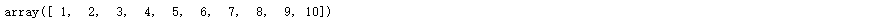
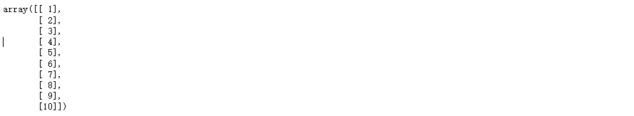
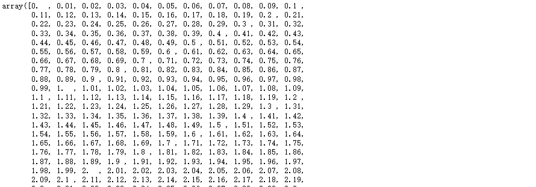
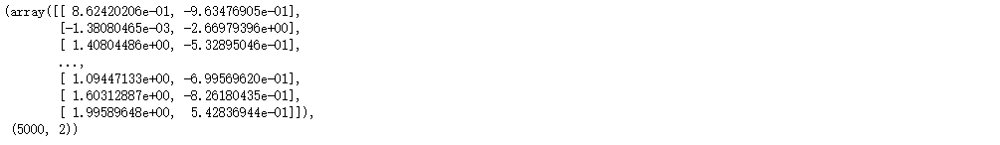
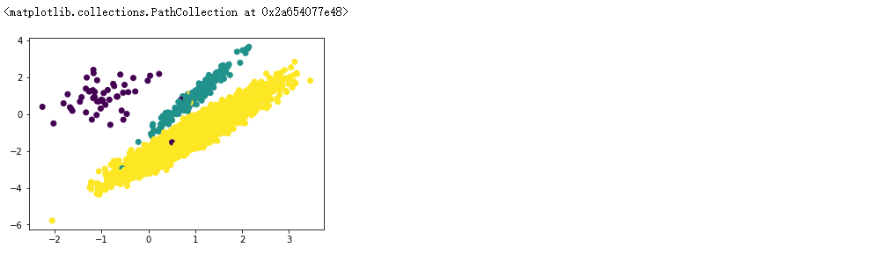
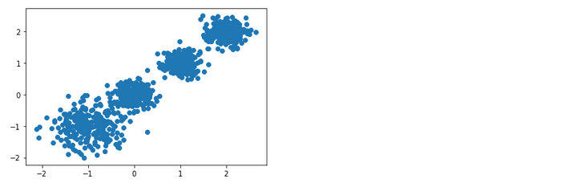

#  使用list列表生成np.array

```python
import numpy as np

# 使用list列表生成
x = np.array(list(range(1, 11)))
x
```



```python
# 转换成一列 
# reshape(-1, 1) -1 代表不知道多少行, 1代表一列
x = x.reshape(-1, 1)
y = np.array([5.56, 5.70, 5.91, 6.40, 6.80, 7.05, 8.90, 8.70, 9.00, 9.05])
x
```




# np.arange,linspace ,logspace

```python
# 生成1000个数,用于预测模型
# 等距离等差数列
x_test = np.arange(0.0, 10.0, 0.01)
x_test
```




# 准备类别不平衡数据	make_classification

```python
# n_samples: 样本数
# n_features: 特征数   = n_informative + n_redundant + n_repeated
# n_informative: 多信息特征的个数
# n_redundant: 冗余信息,informative特征的随机线性组合
# n_repeated: 重复信息,随机提取n_informative和n_redundant特征
# n_class 分类类别
# n_clusters_per_class 某一个类别是由几个cluster组成的
# weights 列表类型,权重比
# random_state 随机
x,y = make_classification(n_samples=5000, n_features=2, n_informative=2, n_redundant=0, 
                          n_repeated=0, n_classes=3, n_clusters_per_class=1, weights=[0.01, 0.05, 0.94], random_state=0)
x, x.shape
```



```python
y, y.shape
```


```python
# y有两种类别,不同类别的数量
Counter(y)
```


```python
# 数据可视化
# x[:, 0] 所有行,第0列
# c=y 基于y分成不同类别
plt.scatter(x[:, 0], x[:, 1], c=y)
```




# make_blobs

```python
# 生成数据集
from sklearn.datasets._samples_generator import make_blobs

# 创建数据集
# X为样本特征，Y为样本簇类别， 共1000个样本，每个样本4个特征，共4个簇，
# 簇中心在[-1,-1], [0,0],[1,1], [2,2]， 簇方差分别为[0.4, 0.2, 0.2, 0.2]
X, y = make_blobs(n_samples=1000, 
                  n_features=2, 
                  centers=[[-1, -1], [0, 0], [1, 1], [2, 2]],
                  cluster_std=[0.4, 0.2, 0.2, 0.2],
                  random_state=9)

# 数据集可视化
plt.scatter(X[:, 0], X[:, 1], marker='o')
plt.show()
```



