# 简单方法

## 1 直接截取

```python
new_1_data = data[:1000]
```

## 2 通过sample方法

xx.sample(数据量)

```python
# sample(数据量)
df_sample = train3.sample(100000)
```


# 数据不均衡

# 1 imbalanced-learn

`pip install imbalanced-learn`

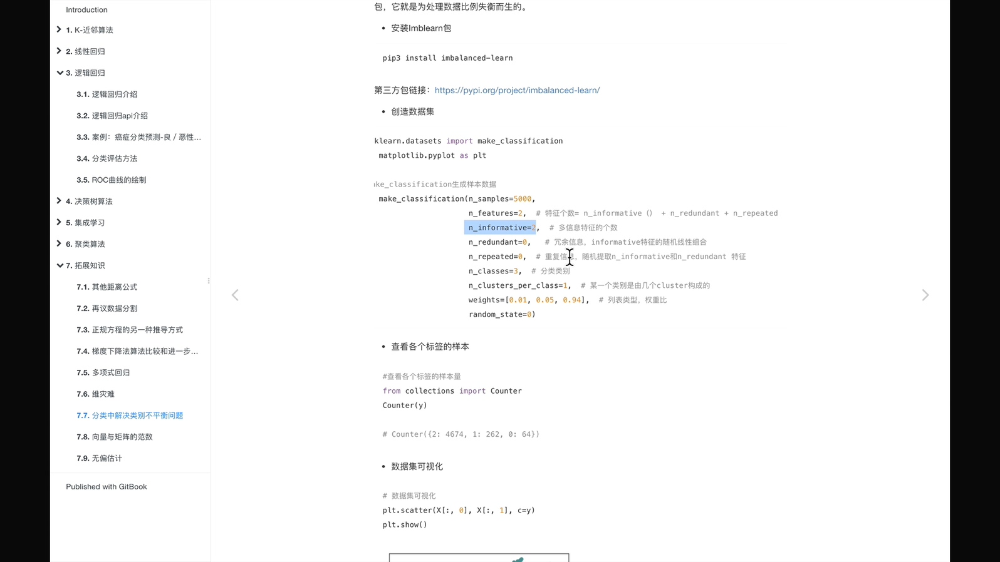

针对类别不平衡问题(样本比例超过 4:1 就认为是样本不均衡),主要由两种处理方式

- 过采样方法:
  - 减少数量较多的哪一类样本的数量,使得正负样本比例均衡
- 欠采样方法: 
  - 增加数量较少那一类样本的数量,使得正负样本比例均衡

# 2 过采样

## 2.1 随机过采样	over_sampling.RandomOverSampler


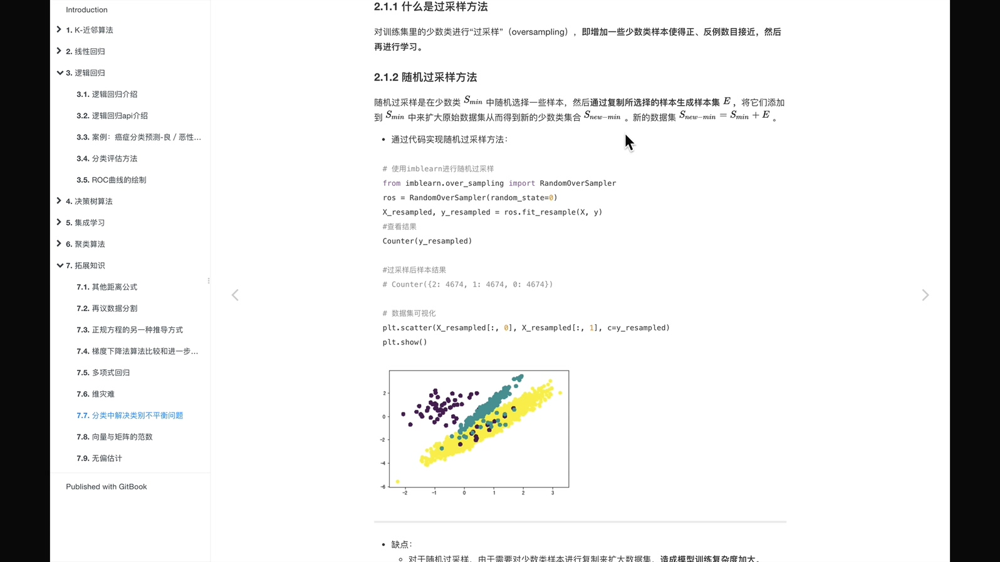


## 2.2 SMOTE算法


# 3 欠采样方法 用的不多

## 3.1 随机欠采样    RandomUnderSampler

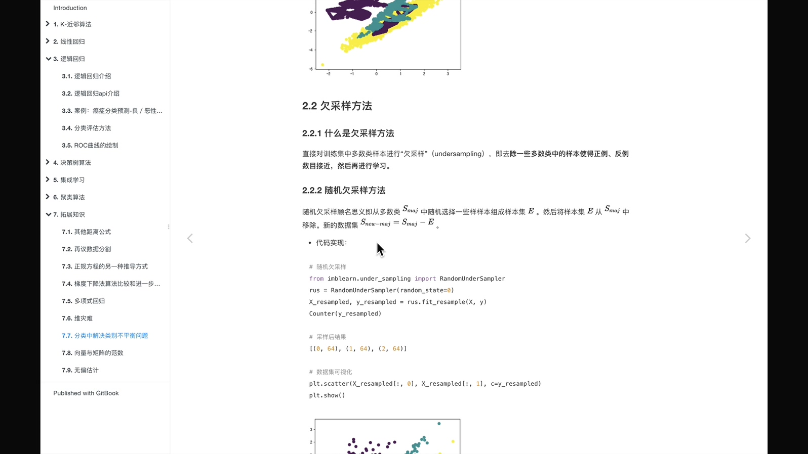

缺点: 舍弃样本集


# 4 代码


## 引入包

```python
from sklearn.datasets import make_classification
import matplotlib.pyplot as plt
from collections import Counter
# 随机过采样
from imblearn.over_sampling import RandomOverSampler
# SMOTE算法
from imblearn.over_sampling import SMOTE
# 欠采样方法
from imblearn.under_sampling import RandomUnderSampler
```

## 1 准备类别不平衡数据	make_classification

```python
# n_samples: 样本数
# n_features: 特征数   = n_informative + n_redundant + n_repeated
# n_informative: 多信息特征的个数
# n_redundant: 冗余信息,informative特征的随机线性组合
# n_repeated: 重复信息,随机提取n_informative和n_redundant特征
# n_class 分类类别
# n_clusters_per_class 某一个类别是由几个cluster组成的
# weights 列表类型,权重比
# random_state 随机
x,y = make_classification(n_samples=5000, n_features=2, n_informative=2, n_redundant=0, 
                          n_repeated=0, n_classes=3, n_clusters_per_class=1, weights=[0.01, 0.05, 0.94], random_state=0)
x, x.shape
```

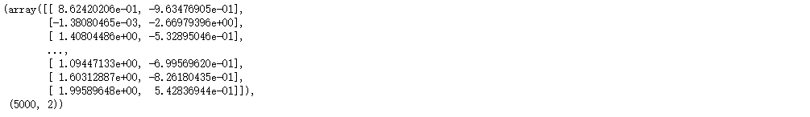

```python
y, y.shape
```


```python
# y有两种类别,不同类别的数量
Counter(y)
```


```python
# 数据可视化
# x[:, 0] 所有行,第0列
# c=y 基于y分成不同类别
plt.scatter(x[:, 0], x[:, 1], c=y)
```


## 2 处理不平衡数据

### 2.1 过采样

减少数量较多的哪一类样本的数量,使得正负样本比例均衡

#### 2.1.1 随机过采样 RandomOverSampler

```python
ros = RandomOverSampler(random_state=0)
# x, y是特征值和目标值
x_resmapled, y_resampled = ros.fit_resample(x, y)
x_resmapled, y_resampled
```

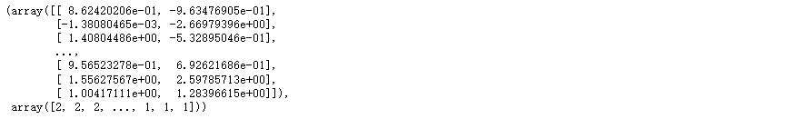

```python
Counter(y_resampled)  # 数据量相等了
```

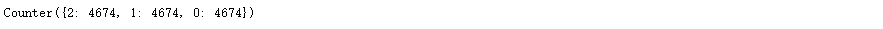

```python
plt.scatter(x_resmapled[:, 0], x_resmapled[:, 1], c=y_resampled)
```


#### 2.1.2 SMOTE算法

```python
smote = SMOTE()
# x, y是特征值和目标值
x_resmapled, y_resampled = smote.fit_resample(x, y)
x_resmapled, y_resampled
```

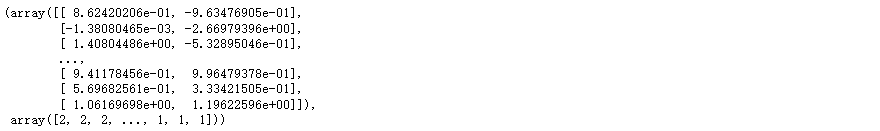

```python
Counter(y_resampled)  # 数据量相等了
```

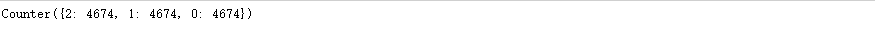

```python
plt.scatter(x_resmapled[:, 0], x_resmapled[:, 1], c=y_resampled)
```

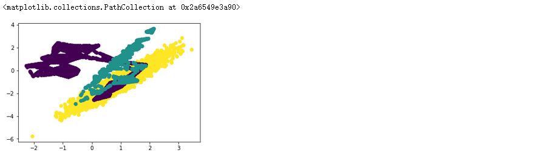

### 2.2 欠采样

增加数量较少那一类样本的数量,使得正负样本比例均衡

#### 2.2.1 随机欠采样 RandomUnderSampler

```python
under = RandomUnderSampler()
# x, y是特征值和目标值
x_resmapled, y_resampled = under.fit_resample(x, y)
x_resmapled, y_resampled
```

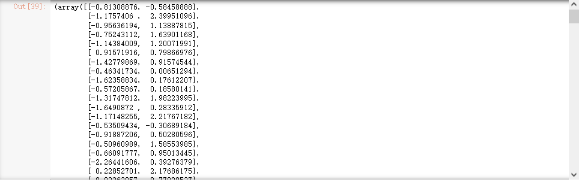

```python
Counter(y_resampled)    # 数据都减少了
```

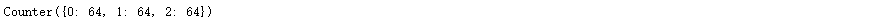

```python
plt.scatter(x_resmapled[:, 0], x_resmapled[:, 1], c=y_resampled)
```

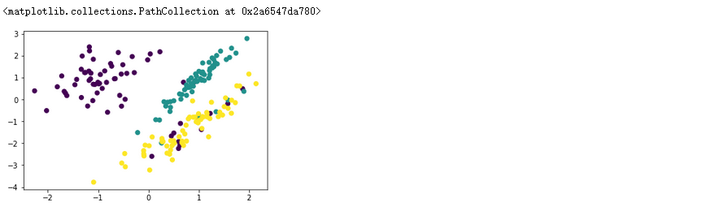

