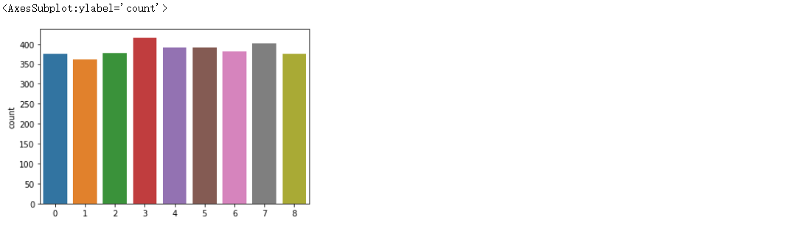
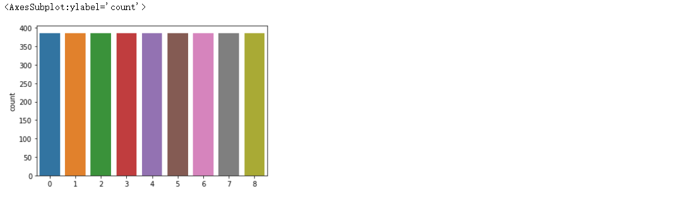

day12 otto

# train_test_split

```python
# train_test_split 分隔数据 
from sklearn.model_selection import train_test_split
# 特征值,目标值
x_train, x_test, y_train, y_test = train_test_split(x_resampled, y_resampled, test_size=0.2, random_state=0)
```

```python
# 图形可视化
import seaborn as sns
sns.countplot(y_test)
# 数据没有严格1: 1
```



# StratifiedShuffleSplit

参数:

- **n_splits**是将训练数据分成train/test对的组数，可根据需要进行设置，默认为10

```python
# StratifiedShuffleSplit 数据分隔
from sklearn.model_selection import StratifiedShuffleSplit

sss = StratifiedShuffleSplit(n_splits=1, test_size=0.2, random_state=0)
# 特征值,目标值
for train_index, test_index in sss.split(x_resampled, y_resampled):
    # 测试能不能正常使用
    #print(len(train_index))
    #print(len(test_index))
    
    # x,y的训练和测试要一一对应
    # 获取验证集和测试集
    x_train1= x_resampled.values[train_index]
    x_test1 = x_resampled.values[test_index]
    
    # y只有一列数据,因此不用values,直接取下标即可
    y_train1= y_resampled[train_index]
    y_test1 = y_resampled[test_index]
    
# 形状
x_train1.shape, y_test1.shape
# ((13888, 93), (3473,))
```

```python
sns.countplot(y_test1)
# 数据严格分隔了
```

