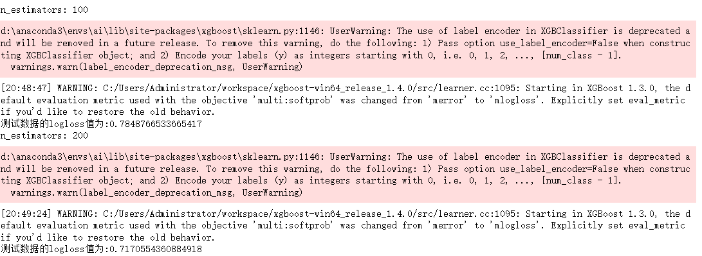

# log_loss


## log_loss模型评估,越小越好

```python
from sklearn.metrics import log_loss
```

```python
# normalize=True 标准化
log_loss(y_test, y_predict, eps=1e-15, normalize=True)
# 报错原因:log_loss使用过程中必须要求输出使用one-hot表示, 需要将这个多类别问题的输出结果通过OneHotEncoder修改为如下:
```


```python
y_test, y_predict
```


**上面报错原因:log_loss使用过程中必须要求输出使用one-hot表示, 需要将这个多类别问题的输出结果通过OneHotEncoder修改为如下:**

## 将数据修改为OneHot格式

```python
from sklearn.preprocessing import OneHotEncoder
one_hot = OneHotEncoder(sparse=False)
```

```python
y_test1 = one_hot.fit_transform(y_test.reshape(-1, 1))
y_predict1 = one_hot.fit_transform(y_predict.reshape(-1, 1))
y_test1, y_predict1
# 0 1 表示为是否为这个类型
```


```python
# normalize=True 标准化
log_loss(y_test1, y_predict1, eps=1e-15, normalize=True)
# 数据太大了
```


## 改变预测值的输出模式,让输出结果为百分占比,降低log_loss值

```python
y_pre_proba = rf.predict_proba(x_test)
# 结果全是百分比,并且类型是二维数组,就是onehot模式,直接使用即可
y_pre_proba
```


```python
rf.oob_score_
```


```python
# normalize=True 标准化
log_loss(y_test1, y_pre_proba, eps=1e-15, normalize=True)
# 变小了,
```


## day12 otto案例

```python
scores_ne = []
n_estimators = [100, 200, 400, 450, 500, 550, 600, 700]
for nes in n_estimators:
    print("n_estimators:", nes)
    xgb = XGBClassifier(learning_rate=0.1, 
                        n_estimators=nes,
                        max_depth=3, 
                        min_child_weight=1,
                        subsample=1,
                        colsample_bytree=1,
                        objective="multi:softprob", 
                        n_jobs=-1, 
                        nthread=4, 
                        seed=42)
    xgb.fit(x_train_pca, y_train1)
    y_pre = xgb.predict_proba(x_test_pca)
    score = log_loss(y_test1, y_pre, eps=1e-15, normalize=True)
    scores_ne.append(score)
    print("测试数据的logloss值为:{}".format(score))
scores_ne
```




```python
# 数据变化可视化
plt.plot(n_estimators, scores_ne, "o-")
plt.grid()
plt.ylabel("log_loss")
plt.xlabel("n_estimators")
# np.argmin(???) 返回最小值下标
print("n_estimators的最优值为:{}".format(n_estimators[np.argmin(scores_ne)]))
```


# mean_absolute_error

```python
from sklearn.metrics import mean_absolute_error
```

## 值越小越好

## day13 pubg

```python
scores = []
param = [100, 300, 500, 800]
for i in param:
    lgbm = lgb.LGBMRegressor(n_estimators=i,
                      max_depth=5,
                      num_leaves=31, 
                      learning_rate=0.1, 
                      min_child_samples=20, 
                      boosting_type='gbdt', 
                      n_jobs=-1)
    # eval_set 按照哪一个来返回数据进行测试
    # eval_metric 通过什么来回测
    lgbm.fit(x_train2, y_train2, eval_set=[(x_test2, y_test2)], eval_metric='l1', early_stopping_rounds=5)
    
    y_pre4 = lgbm.predict(x_test2)
    mae = mean_absolute_error(y_test2, y_pre4)

    scores.append(mae)
    print('本次结果输出的mae值是:\n', mae)
    
scores
```


```python
# np.argmin(scores) 返回最小值下标
best_n_estimators = param[np.argmin(scores)]
print("n_estimators的最优值为:{}".format(best_n_estimators))
# n_estimators的最优值为:300

plt.plot(param, scores)
plt.grid()
plt.show()
```


