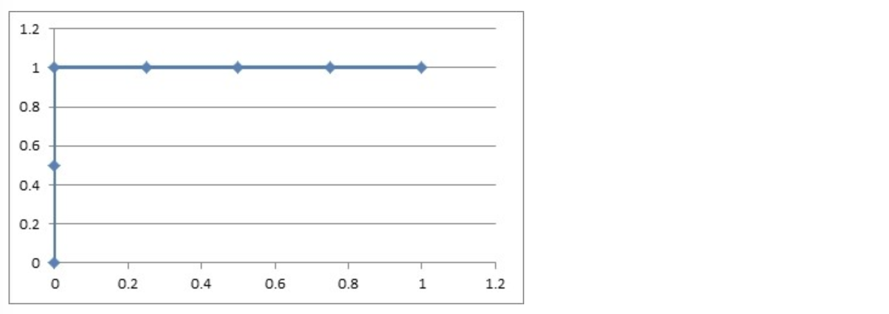
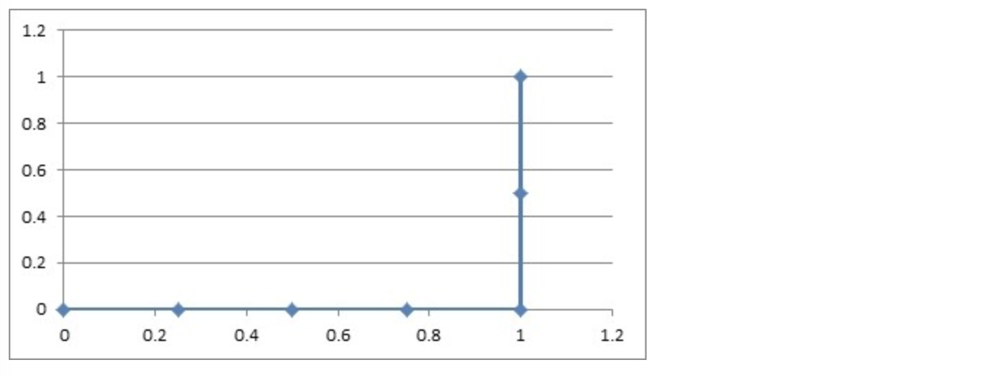

# 1 分类评估方法

## 学习目标

- 了解什么是混淆矩阵
- 知道分类评估中的精确率和召回率
- 知道roc曲线和auc指标

------


## 1.1.分类评估方法

### 1.1.1 准确率,精确率与召回率

#### 1.1.1.1 混淆矩阵

T:   Ture	P:  Positive	F:  False	N:  Negative

在分类任务下，预测结果(Predicted Condition)与正确标记(True Condition)之间存在四种不同的组合，构成混淆矩阵(适用于多分类)


#### 1.1.1.3 准确率

(TP+TN) / (TP+TN+FP+FN)     查的对不对


#### 4.1.1.3 精确率(Precision)与召回率(Recall)

> **在某些情况下精确率越高,召回率越低**

- 精确率：预测结果为正例样本中真实为正例的比例（了解）


- 召回率：真实为正例的样本中预测结果为正例的比例（查得全，对正样本的区分能力）


### 4.1.2 F1-score

还有其他的评估标准，F1-score，反映了模型的稳健型


------

### 4.1.3 分类评估报告api    metrics.classification_report(y_true, y_pred, labels=[], target_names=None )

- sklearn.metrics.classification_report(y_true, y_pred, labels=[], target_names=None )
    -  y_true：真实目标值
    -  y_pred：估计器预测目标值
    -  labels:指定类别对应的数字
    -  target_names：目标类别名称
    -  return：每个类别精确率与召回率

```python
# 分类评估报告api
from sklearn.metrics import classification_report

# 精确率 全部查出的人多少个是正确的
# 召回率 全部的癌症的人中查出来了多少个
# labels=(2,4) 数据中2代表良性,4代表恶性
ret = classification_report(y_test, y_predict, labels=(2,4), target_names=("良性", "恶性"))
print(ret)
```

**假设这样一个情况，如果99个样本癌症，1个样本非癌症，不管怎样我全都预测正例(默认癌症为正例),准确率就为99%但是这样效果并不好，这就是样本不均衡下的评估问题**

问题：**如何衡量样本不均衡下的评估**？

### 4.1.4 样本比例超过 4:1 就认为是样本不均衡

## 4.2 ROC曲线与AUC指标

### 4.2.1 TPR与FPR

- TPR = TP / (TP + FN)	召回率
    - 所有真实类别为1的样本中，预测类别为1的比例
    - **所有真的被找出来的的比例**
- FPR = FP / (FP + TN)    不是上面的
    - 所有真实类别为0的样本中，预测类别为1的比例
    - **所有假的被找出来的为真的比例**

### 4.2.2 ROC曲线

- ROC曲线的横轴就是FPRate，纵轴就是TPRate，当二者相等时，表示的意义则是：对于不论真实类别是1还是0的样本，分类器预测为1的概率是相等的，此时AUC为0.5


### 4.2.3 AUC指标

- AUC的概率意义是随机取一对正负样本，正样本得分大于负样本得分的概率
- AUC的范围在[0, 1]之间，并且越接近1越好，越接近0.5属于乱猜
- **AUC=1，完美分类器，采用这个预测模型时，不管设定什么阈值都能得出完美预测。绝大多数预测的场合，不存在完美分类器。**
- **0.5<AUC<1，优于随机猜测。这个分类器（模型）妥善设定阈值的话，能有预测价值。**

### 4.2.4 AUC计算API    metrics.roc_auc_score(y_true, y_score)

- from sklearn.metrics import roc_auc_score
    - sklearn.metrics.roc_auc_score(y_true, y_score)
        - 计算ROC曲线面积，即AUC值
        - y_true：每个样本的真实类别，必须为0(反例),1(正例)标记
        - y_score：预测得分，可以是正类的估计概率、置信值或者分类器方法的返回值

```python
# 导入aucscore
from sklearn.metrics import roc_auc_score

# 将y_test中的 2 和 4 转换成 1 和 0
y_test = np.where(y_test > 3, 1, 0)

print("AUC指标：", roc_auc_score(y_test, y_predict)
```

- AUC只能用来评价二分类
- AUC非常适合评价样本不平衡中的分类器性能

------

## 4.3 小结

- 混淆矩阵【了解】
    - 真正例（TP）
    - 伪反例（FN）
    - 伪正例（FP）
    - 真反例（TN）
- 精确率(Precision)与召回率(Recall)【知道】
    - 准确率：（对不对）
        - （TP+TN）/(TP+TN+FN+FP)
    - 精确率 -- 查的准不准
        - TP/(TP+FP)
    - 召回率 -- 查的全不全
        - TP/(TP+FN)
    - F1-score
        - 反映模型的稳健性
- roc曲线和auc指标【知道】
    - roc曲线
        - 通过tpr和fpr来进行图形绘制，然后绘制之后，行成一个指标auc
    - auc
        - 越接近1，效果越好
        - 越接近0，效果越差
        - 越接近0.5，效果就是胡说
    - 注意：
        - 这个指标主要用于评价不平衡的二分类问题


# 5 ROC曲线的绘制

## 学习目标

- 知道ROC曲线的绘制

------

关于ROC曲线的绘制过程，通过以下举例进行说明

假设有6次展示记录，有两次被点击了，得到一个展示序列（1:1,2:0,3:1,4:0,5:0,6:0），前面的表示序号，后面的表示点击（1）或没有点击（0）。

然后在这6次展示的时候都通过model算出了点击的概率序列。

下面看三种情况。

## 5.1 曲线绘制

### 5.1.1 如果概率的序列是（1:0.9,2:0.7,3:0.8,4:0.6,5:0.5,6:0.4）。

与原来的序列一起，得到序列（从概率从高到低排）

| 1    | 1    | 0    | 0    | 0    | 0    |
| ---- | ---- | ---- | ---- | ---- | ---- |
| 0.9  | 0.8  | 0.7  | 0.6  | 0.5  | 0.4  |

绘制的步骤是：

1）把概率序列从高到低排序，得到顺序（1:0.9,3:0.8,2:0.7,4:0.6,5:0.5,6:0.4）；

2）从概率最大开始取一个点作为正类，取到点1，计算得到TPR=0.5，FPR=0.0；

3）从概率最大开始，再取一个点作为正类，取到点3，计算得到TPR=1.0，FPR=0.0；

4）再从最大开始取一个点作为正类，取到点2，计算得到TPR=1.0，FPR=0.25;

5）以此类推，得到6对TPR和FPR。

然后把这6对数据组成6个点(0,0.5),(0,1.0),(0.25,1),(0.5,1),(0.75,1),(1.0,1.0)。

这6个点在二维坐标系中能绘出来。



看看图中，那个就是ROC曲线。

### 5.1.2 如果概率的序列是（1:0.9,2:0.8,3:0.7,4:0.6,5:0.5,6:0.4）

与原来的序列一起，得到序列（从概率从高到低排）

| 1    | 0    | 1    | 0    | 0    | 0    |
| ---- | ---- | ---- | ---- | ---- | ---- |
| 0.9  | 0.8  | 0.7  | 0.6  | 0.5  | 0.4  |

绘制的步骤是：

6）把概率序列从高到低排序，得到顺序（1:0.9,2:0.8,3:0.7,4:0.6,5:0.5,6:0.4）；

7）从概率最大开始取一个点作为正类，取到点1，计算得到TPR=0.5，FPR=0.0；

8）从概率最大开始，再取一个点作为正类，取到点2，计算得到TPR=0.5，FPR=0.25；

9）再从最大开始取一个点作为正类，取到点3，计算得到TPR=1.0，FPR=0.25;

10）以此类推，得到6对TPR和FPR。

然后把这6对数据组成6个点(0,0.5),(0.25,0.5),(0.25,1),(0.5,1),(0.75,1),(1.0,1.0)。

这6个点在二维坐标系中能绘出来。


看看图中，那个就是ROC曲线。

### 5.1.3 如果概率的序列是（1:0.4,2:0.6,3:0.5,4:0.7,5:0.8,6:0.9）

与原来的序列一起，得到序列（从概率从高到低排）

| 0    | 0    | 0    | 0    | 1    | 1    |
| ---- | ---- | ---- | ---- | ---- | ---- |
| 0.9  | 0.8  | 0.7  | 0.6  | 0.5  | 0.4  |

绘制的步骤是：

11）把概率序列从高到低排序，得到顺序（6:0.9,5:0.8,4:0.7,2:0.6,3:0.5,1:0.4）；

12）从概率最大开始取一个点作为正类，取到点6，计算得到TPR=0.0，FPR=0.25；

13）从概率最大开始，再取一个点作为正类，取到点5，计算得到TPR=0.0，FPR=0.5；

14）再从最大开始取一个点作为正类，取到点4，计算得到TPR=0.0，FPR=0.75;

15）以此类推，得到6对TPR和FPR。

然后把这6对数据组成6个点(0.25,0.0),(0.5,0.0),(0.75,0.0),(1.0,0.0),(1.0,0.5),(1.0,1.0)。

这6个点在二维坐标系中能绘出来。



看看图中，那个就是ROC曲线。

## 5.2 意义解释

如上图的例子，总共6个点，2个正样本，4个负样本，取一个正样本和一个负样本的情况总共有8种。

上面的第一种情况，从上往下取，无论怎么取，正样本的概率总在负样本之上，所以分对的概率为1，AUC=1。再看那个ROC曲线，它的积分是什么？也是1，ROC曲线的积分与AUC相等。

上面第二种情况，如果取到了样本2和3，那就分错了，其他情况都分对了；所以分对的概率是0.875，AUC=0.875。再看那个ROC曲线，它的积分也是0.875，ROC曲线的积分与AUC相等。

上面的第三种情况，无论怎么取，都是分错的，所以分对的概率是0，AUC=0.0。再看ROC曲线，它的积分也是0.0，ROC曲线的积分与AUC相等。

很牛吧，其实AUC的意思是——Area Under roc Curve，就是ROC曲线的积分，也是ROC曲线下面的面积。

绘制ROC曲线的意义很明显，不断地把可能分错的情况扣除掉，从概率最高往下取的点，每有一个是负样本，就会导致分错排在它下面的所有正样本，所以要把它下面的正样本数扣除掉（1-TPR，剩下的正样本的比例）。总的ROC曲线绘制出来了，AUC就定了，分对的概率也能求出来了。

------

## 5.3 小结

- ROC曲线的绘制【知道】
    - 1.构建模型，把模型的概率值从大到小进行排序
    - 2.从概率最大的点开始取值，一直进行tpr和fpr的计算，然后构建整体模型，得到结果
    - 3.其实就是在求解积分（面积）

