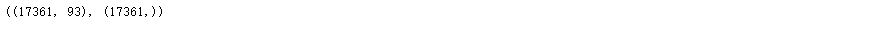
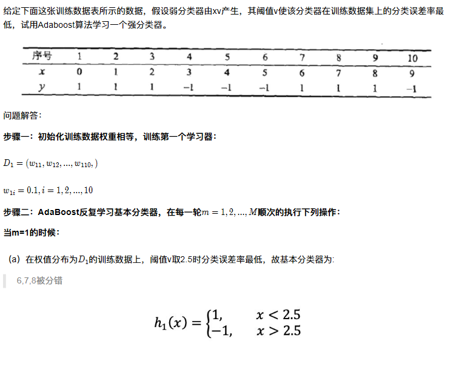

**RandomForestClassifier和XGBClassifier支持predict_proba(), 返回可能性**

- RandomForestClassifier 处理分类问题
- RandomForestRegressor 处理回归问题

# 1 集成学习算法简介


------

## 1.1 什么是集成学习


集成学习通过**建立几个模型来解决单一预测问题**。它的工作原理是**生成多个分类器/模型**，各自独立地学习和作出预测。**这些预测最后结合成组合预测，因此优于任何一个单分类的做出预测。**

## 1.2 复习：机器学习的两个核心任务

- 任务一：**如何优化训练数据** —> 主要用于**解决欠拟合问题**
- 任务二：**如何提升泛化性能** —> 主要用于**解决过拟合问题**

## 1.3 集成学习中boosting和Bagging


**只要单分类器的表现不太差，集成学习的结果总是要好于单分类器的**

------

## 1.4 小结

- 什么是集成学习【了解】
    - 通过建立几个模型来解决单一预测问题
- 机器学习两个核心任务【知道】
    - 1.解决欠拟合问题
        - 弱弱组合变强
        - boosting
    - 2.解决过拟合问题
        - 互相遏制变壮
        - Bagging


# 2 Bagging

## 学习目标

- 知道Bagging集成原理
- 知道随机森林构造过程
- 知道RandomForestClassifier的使用
- 了解baggind集成的优点

------

## 2.1 Bagging集成原理

目标：把下面的圈和方块进行分类


实现过程：

1.采样不同数据集


2.训练分类器


3.平权投票，获取最终结果


4.主要实现过程小结


## 2.2 随机森林构造过程

在机器学习中，**随机森林是一个包含多个决策树的分类器**，并且其输出的类别是由个别树输出的类别的众数而定。

**随机森林**     **=    Bagging    +**     **决策树**


例如, 如果你训练了5个树, 其中有4个树的结果是True, 1个树的结果是False, 那么最终投票结果就是True

**随机森林够造过程中的关键步骤**（M表示特征数目）：

​    **1）一次随机选出一个样本，有放回的抽样，重复N次（有可能出现重复的样本）**

​    **2） 随机去选出m个特征, m <<M，建立决策树**

- **思考**
    - 1.为什么要随机抽样训练集？　　
        - 如果不进行随机抽样，每棵树的训练集都一样，那么最终训练出的树分类结果也是完全一样的
    - 2.为什么要有放回地抽样？
        - 如果不是有放回的抽样，那么每棵树的训练样本都是不同的，都是没有交集的，这样每棵树都是“有偏的”，都是绝对“片面的”（当然这样说可能不对），也就是说每棵树训练出来都是有很大的差异的；而随机森林最后分类取决于多棵树（弱分类器）的投票表决。

## 2.3 随机森林api介绍 ensemble.RandomForestClassifier

- sklearn.ensemble.RandomForestClassifier(n_estimators=10,  criterion=’gini’, max_depth=None, bootstrap=True, random_state=None,  min_samples_split=2)
    - n_estimators：integer，optional（default = 10）
    
        - 在利用最大投票数或平均值来预测之前，你想要建立子树的数量。 森林里的树木数量120,200,300,500,800,1200
    
    - Criterion：string，可选（default =“gini”） 
    
        - 分割特征的测量方法,默认gini基尼指数
    
    - max_depth：integer或None，可选（默认=无）
    
        - 树的最大深度 5,8,15,25,30
    
    - max_features="auto”,每个决策树的最大特征数量
        - If "auto", then `max_features=sqrt(n_features)`.
        - If "sqrt", then `max_features=sqrt(n_features)`(same as "auto").
        - If "log2", then `max_features=log2(n_features)`.
        - If None, then `max_features=n_features`.
        
    - bootstrap：boolean，optional（default = True）
    
        - 是否在构建树时使用放回抽样
    
    - min_samples_split:节点划分最少样本数
    
        - 这个值限制了子树继续划分的条件，如果某节点的样本数少于min_samples_split，则不会继续再尝试选择最优特征来进行划分，默认是2。
        - 如果样本量不大，不需要管这个值。如果样本量数量级非常大，则推荐增大这个值。
    
    - min_samples_leaf:叶子节点的最小样本数
    
        - 这个值限制了叶子节点最少的样本数，如果某叶子节点数目小于样本数，则会和兄弟节点一起被剪枝，默认是1
    
        - 叶是决策树的末端节点。 较小的叶子使模型更容易捕捉训练数据中的噪声。
    
        - > 一般来说，我更偏向于将最小叶子节点数目设置为大于50。
    
    - min_impurity_split: 节点划分最小不纯度
    
        - 这个值限制了决策树的增⻓，如果某节点的不纯度(基于基尼系数，均方差)小于这个阈值，则该节点不再生成子节点。即为叶子节点 。
    
        - > 一般不推荐改动默认值1e-7。
    
- 上面决策树参数中最重要的包括

    - 最大特征数max_features，
    - 最大深度max_depth，
    - 内部节点再划分所需最小样本数min_samples_split
    - 叶子节点最少样本数min_samples_leaf

    

## 2.4 随机森林预测案例

- 导入包

```python
# 随机森林
from sklearn.ensemble import RandomForestClassifier
# 交叉验证
from sklearn.model_selection import GridSearchCV
```

- 实例化随机森林

```python
# 随机森林去进行预测
rf = RandomForestClassifier()
```

- 定义超参数的选择列表

```python
param = {"n_estimators": [120,200,300,500,800,1200], "max_depth": [5, 8, 15, 25, 30]}
```

- 使用GridSearchCV进行网格搜索

```python
# 交叉验证,网格搜索,超参数调优 K-临近算法中有介绍
gc = GridSearchCV(rf, param_grid=param, cv=2, n_jobs=4)

gc.fit(x_train, y_train)

print("随机森林预测的准确率为：", gc.score(x_test, y_test))
# 随机森林预测的准确率为： 1.0
```

> 注意
>
> - 随机森林的建立过程
> - 树的深度、树的个数等需要进行超参数调优

## 2.5 bagging集成优点

​    **Bagging + 决策树/线性回归/逻辑回归/深度学习… = bagging集成学习方法**

经过上面方式组成的集成学习方法:

1. **均可在原有算法上提高约2%左右的泛化正确率**
2. **简单, 方便, 通用**

------

## 2.6 小结

- bagging集成过程【知道】
    - 1.采样 — 从所有样本里面，采样一部分
    - 2.学习 — 训练弱学习器
    - 3.集成 — 使用平权投票
- 随机森林介绍【知道】
    - 随机森林定义
        - 随机森林 = Bagging + 决策树
    - 流程：
        - 1.随机选取m条数据
        - 2.随机选取k个特征
        - 3.训练决策树
        - 4.重复1-3
        - 5.对上面的若决策树进行平权投票
    - 注意：
        - 1.随机选取样本，且是有放回的抽取
        - 2.选取特征的时候吗，选择m<<M
        - M是所有的特征数
    - api
        - sklearn.ensemble.RandomForestClassifier()
- Bagging + 决策树/线性回归/逻辑回归/深度学习… = bagging集成学习方法【了解】
- bagging的优点【了解】
    - 1.均可在原有算法上提高约2%左右的泛化正确率
    - 2.简单, 方便, 通用


# 3 oob

## 3.1 什么是oob

首先简单说一下什么是袋外样本oob (Out of bag)：在随机森林中，m个训练样本会通过bootstrap (有放回的随机抽样) 的抽样方式进行T次抽样每次抽样产生样本数为m的采样集，进入到并行的T个决策树中。这样有放回的抽样方式会导致有部分训练集中的样本(约36.8%)未进入决策树的采样集中，而这部分未被采集的的样本就是袋外数据oob。

而这个袋外数据就可以用来检测模型的泛化能力，和交叉验证类似。可以理解成从train datasets 中分出来的validation datasets。

## 3.2 什么是oob_score

对于单棵用采样集训练完成的决策树Ti，用袋外数据运行后会产生一个oob_score (返回的是R square来判断)，对每一棵决策树都重复上述操作，最终会得到T个oob_score，把这T和oob_score平均，最终得到的就是整个随机森林的oob_score


# 4 otto案例介绍 -- Otto Group Product Classification Challenge

## 4.1 背景介绍
奥托集团是世界上最大的电子商务公司之一，在20多个国家设有子公司。该公司每天都在世界各地销售数百万种产品,所以对其产品根据性能合理的分类非常重要。
不过,在实际工作中,工作人员发现,许多相同的产品得到了不同的分类。本案例要求,你对奥拓集团的产品进行正确的分类。尽可能的提供分类的准确性。

链接：https://www.kaggle.com/c/otto-group-product-classification-challenge/overview


## 4.2 数据集介绍
- 本案例中，数据集包含大约200,000种产品的93个特征。
- 其目的是建立一个能够区分otto公司主要产品类别的预测模型。
- 所有产品共被分成九个类别（例如时装，电子产品等）。


## 4.3 评分标准
本案例中，最后结果使用多分类对数损失进行评估。
具体公式：


上公式中，

- i表示样本，j表示类别。Pij代表第i个样本属于类别j的概率，
- 如果第i个样本真的属于类别j，则yij等于1，否则为0。
- 根据上公式，假如你将所有的测试样本都正确分类，所有pij都是1，那每个log(pij)都是0，最终的logloss也是0。
- 假如第1个样本本来是属于1类别的，但是你给它的类别概率pij=0.1，那logloss就会累加上log(0.1)这一项。我们知道这一项是负数，而且pij越小，负得越多，如果pij=0，将是无穷。这会导致这种情况：你分错了一个，logloss就是无穷。这当然不合理，为了避免这一情况，我们对非常小的值做如下处理：


- 也就是说最小不会小于10^-15。

## 4.4 实现过程

### 4.4.1 流程分析

- 获取数据
- 数据基本处理
    - 数据量比较大，尝试是否可以进行数据分割
    - 转换目标值表示方式
- 模型训练
- 模型基本训练

### 4.4.2 代码实现

#### 1 引入包

```python
import numpy as np
import pandas as pd
import matplotlib.pyplot as plt
import seaborn as sns
```

#### 2 读取文件

```python
data = pd.read_csv('../data/otto/train.csv')
data.head()
```


```python
data.shape
```


```python
data.describe()
```


#### 3 seaborn图形可视化查看数据分布

```python
# countplot 求总数
sns.countplot(data.target)
plt.show()
```


**上图可以看出,该数据类别不均衡,所以需要后期处理**

#### 4 数据基本处理

**数据已经经过脱敏,不需要特殊处理**

##### 4.1 截取部分数据

```python
new_1_data = data[:1000]
new_1_data.shape
```


```python
# 展示效果并不好
sns.countplot(new_1_data.target)
plt.show()
```


###### 4.1.2 使用随机欠采样获取数据

```python
# 首先确定特征值/目标值
y = data['target']
# 删除 id 和 target, axis=1 按列删除
x = data.drop(['id','target'], axis=1)
x.head()
```


```python
y.head()
```


```python
# 欠采样获取数据
from  imblearn.under_sampling import RandomUnderSampler
# 欠采样获取数据
under = RandomUnderSampler(random_state=0)

x_resampled, y_resampled = under.fit_resample(x, y)

x_resampled.shape, y_resampled.shape
# 特征值和目标值的数量相等了
```



```python
# 展示效果很好
sns.countplot(y_resampled)
plt.show()
```


##### 4.2 目标标签值转换成数字    LabelEncoder

```python
y_resampled.head()
```


```python
# 标签转换为数字
from sklearn.preprocessing import LabelEncoder

le = LabelEncoder()
y_resampled = le.fit_transform(y_resampled)
# 变成数字了 
y_resampled
```

##### 4.3 分隔数据

```
# 分隔数据
from sklearn.model_selection import train_test_split
x_train, x_test, y_train, y_test = train_test_split(x_resampled, y_resampled,test_size=0.2)
x_train.shape,y_train.shape
```


```python
x_test.shape,y_test.shape
```


#### 5 模型训练

##### 5.1 基本模型训练

```python
# 随机森林
from sklearn.ensemble import RandomForestClassifier
# oob_score 
rf = RandomForestClassifier(oob_score=True)
rf.fit(x_train, y_train)

y_predict =rf.predict(x_test)
# 表示的是数据哪一个类别
y_predict
```


```python
rf.score(x_test, y_test)
```


```python
rf.oob_score_
```


#### 6 数据可视化

##### 6.1 展示效果不是很好

```python
sns.countplot(y_predict)
plt.show()
```


#### 7 log_loss模型评估,越小越好

```python
from sklearn.metrics import log_loss
```

```python
# normalize=True 标准化
log_loss(y_test, y_predict, eps=1e-15, normalize=True)
# 报错原因:log_loss使用过程中必须要求输出使用one-hot表示, 需要将这个多类别问题的输出结果通过OneHotEncoder修改为如下:
```


```python
y_test, y_predict
```


**上面报错原因:log_loss使用过程中必须要求输出使用one-hot表示, 需要将这个多类别问题的输出结果通过OneHotEncoder修改为如下:**

#### 8 将数据修改为OneHot格式

```python
from sklearn.preprocessing import OneHotEncoder
one_hot = OneHotEncoder(sparse=False)
```

```python
y_test1 = one_hot.fit_transform(y_test.reshape(-1, 1))
y_predict1 = one_hot.fit_transform(y_predict.reshape(-1, 1))
y_test1, y_predict1
# 0 1 表示为是否为这个类型
```


```python
# normalize=True 标准化
log_loss(y_test1, y_predict1, eps=1e-15, normalize=True)
# 数据太大了
```


#### 9 改变预测值的输出模式,让输出结果为百分占比,降低log_loss值

```python
y_pre_proba = rf.predict_proba(x_test)
# 结果全是百分比,并且类型是二维数组,就是onehot模式,直接使用即可
y_pre_proba
```


```python
rf.oob_score_
```


```python
# normalize=True 标准化
log_loss(y_test1, y_pre_proba, eps=1e-15, normalize=True)
# 变小了,
```


#### 10 模型调优

**n_estimators:     子树的数量 max_features:     每个决策树的最大特征数量 max_depth:        树的最大深度  min_samples_leaf: 叶子节点的最小样本数**

##### 10.1 确定最优的n_estimators

- n_estimators：integer，optional（default = 10）
    - 在利用最大投票数或平均值来预测之前，你想要建立子树的数量。 森林里的树木数量120,200,300,500,800,1200

```python
# 确定n_estimators取值范围
truned_param = range(10, 200, 10)

# 创建新的accuracy的一个numpy
accuracy_t = np.zeros(len(truned_param))

# 创建添加error的numpy
error_t = np.zeros(len(truned_param))

# 调优过程
for j, one_param in enumerate(truned_param):
    # 首先测试 n_estimators
    rf2 = RandomForestClassifier(n_estimators=one_param, 
                                 max_features=10,
                                 max_depth=10, 
                                 min_samples_leaf=10, 
                                 oob_score=True, 
                                 random_state=0, 
                                 n_jobs=4)
    rf2.fit(x_train, y_train)
    
    # 输出accuracy
    accuracy_t[j] = rf2.oob_score_
    
    # 输出log_los
    y_pre = rf2.predict_proba(x_test)
    
    error_t[j] = log_loss(y_test, y_pre, eps=1e-15, normalize=True)

    print(error_t)
```

```python
# 优化结果过程可视化
fig, axes = plt.subplots(nrows=1, ncols=2, figsize=(20, 4), dpi=100)


axes[0].plot(truned_param, error_t)
axes[0].set_xlabel('n_estimators')
axes[0].set_ylabel('error_t')

axes[1].plot(truned_param, accuracy_t)
axes[1].set_xlabel('n_estimators')
axes[1].set_ylabel('accuracy_t')

axes[0].grid(True)
axes[1].grid(True)

plt.show()
```


**经过图像显示,n_estimators=175 的时候表现效果不错**

##### 10.2 确定最优的max_features

```python
# 确定max_features取值范围
truned_param = range(5, 40, 5)

# 创建新的accuracy的一个numpy
accuracy_t = np.zeros(len(truned_param))

# 创建添加error的numpy
error_t = np.zeros(len(truned_param))

# 调优过程
for j, one_param in enumerate(truned_param):
    # n_estimators上面确定 175 最好
    rf2 = RandomForestClassifier(n_estimators=175, 
                                 max_features=one_param,
                                 max_depth=10, 
                                 min_samples_leaf=10, 
                                 oob_score=True, 
                                 random_state=0, 
                                 n_jobs=4)
    rf2.fit(x_train, y_train)
    
    # 输出accuracy
    accuracy_t[j] = rf2.oob_score_
    
    # 输出log_los
    y_pre = rf2.predict_proba(x_test)
    
    error_t[j] = log_loss(y_test, y_pre, eps=1e-15, normalize=True)

    print(error_t)
```

```python
# 优化结果过程可视化
fig, axes = plt.subplots(nrows=1, ncols=2, figsize=(20, 4), dpi=100)


axes[0].plot(truned_param, error_t)
axes[0].set_xlabel('max_features')
axes[0].set_ylabel('error_t')

axes[1].plot(truned_param, accuracy_t)
axes[1].set_xlabel('max_features')
axes[1].set_ylabel('accuracy_t')

axes[0].grid(True)
axes[1].grid(True)

plt.show()
```


**max_features=15 时效果不错**

##### 10.3 确定最优max_depth

```python
# 确定n_estimators取值范围
truned_param = range(10, 100, 10)

# 创建新的accuracy的一个numpy
accuracy_t = np.zeros(len(truned_param))

# 创建添加error的numpy
error_t = np.zeros(len(truned_param))

# 调优过程
for j, one_param in enumerate(truned_param):
    # n_estimators上面确定 175 最好
    # max_features 确定 15 最好
    rf2 = RandomForestClassifier(n_estimators=175, 
                                 max_features=15,
                                 max_depth=one_param, 
                                 min_samples_leaf=10, 
                                 oob_score=True, 
                                 random_state=0, 
                                 n_jobs=4)
    rf2.fit(x_train, y_train)
    
    # 输出accuracy
    accuracy_t[j] = rf2.oob_score_
    
    # 输出log_los
    y_pre = rf2.predict_proba(x_test)
    
    error_t[j] = log_loss(y_test, y_pre, eps=1e-15, normalize=True)

    print(error_t)
```

```python
# 优化结果过程可视化
fig, axes = plt.subplots(nrows=1, ncols=2, figsize=(20, 4), dpi=100)


axes[0].plot(truned_param, error_t)
axes[0].set_xlabel('max_depth')
axes[0].set_ylabel('error_t')

axes[1].plot(truned_param, accuracy_t)
axes[1].set_xlabel('max_depth')
axes[1].set_ylabel('accuracy_t')

axes[0].grid(True)
axes[1].grid(True)

plt.show()
```


**max_depth=30 最优**

##### 10.4 确定最优的min_samples_leaf

```python
# 确定min_samples_leaf取值范围
truned_param = range(1, 10, 2)

# 创建新的accuracy的一个numpy
accuracy_t = np.zeros(len(truned_param))

# 创建添加error的numpy
error_t = np.zeros(len(truned_param))

# 调优过程
for j, one_param in enumerate(truned_param):
    # n_estimators上面确定 175 最好
    # max_features 确定 15 最好
    rf2 = RandomForestClassifier(n_estimators=175, 
                                 max_features=15,
                                 max_depth=30, 
                                 min_samples_leaf=one_param, 
                                 oob_score=True, 
                                 random_state=0, 
                                 n_jobs=4)
    rf2.fit(x_train, y_train)
    
    # 输出accuracy
    accuracy_t[j] = rf2.oob_score_
    
    # 输出log_los
    y_pre = rf2.predict_proba(x_test)
    
    error_t[j] = log_loss(y_test, y_pre, eps=1e-15, normalize=True)

    print(error_t)
```

```python
# 优化结果过程可视化
fig, axes = plt.subplots(nrows=1, ncols=2, figsize=(20, 4), dpi=100)


axes[0].plot(truned_param, error_t)
axes[0].set_xlabel('min_samples_leaf')
axes[0].set_ylabel('error_t')

axes[1].plot(truned_param, accuracy_t)
axes[1].set_xlabel('min_samples_leaf')
axes[1].set_ylabel('accuracy_t')

axes[0].grid(True)
axes[1].grid(True)

plt.show()
```


**min_samples_leaf=1 时最好**

##### 10.5 确定最优模型

- n_estimators=175 
- max_features=15 
- max_depth=30 
- min_samples_leaf=1 

```python
rf3 = RandomForestClassifier(n_estimators=175, 
                             max_features=15,
                             max_depth=30, 
                             min_samples_leaf=1, 
                             oob_score=True, 
                             random_state=0, 
                             n_jobs=4)
rf3.fit(x_train, y_train)
rf3.score(x_test, y_test)
```


```python
rf3.oob_score_
```


```python
# 输出log_los
y_pre = rf3.predict_proba(x_test)

error_t[j] = log_loss(y_test, y_pre, eps=1e-15, normalize=True)

print(error_t)
```


#### 11 生成提交数据

```python
# 得到测试数据
test_data = pd.read_csv('../data/otto/test.csv')
test_data.head()
```


```python
# 去掉id列
test_data_drop_id = test_data.drop('id', axis=1)
test_data_drop_id[:5]
```


```python
# 预测数据
y_pre_test = rf3.predict_proba(test_data_drop_id)
y_pre_test
```


```python
# 数据格式改为DataFrame,列名改为Class_?
result_data = pd.DataFrame(y_pre_test, columns=["Class_"+str(i) for i in range(1, 10)])
result_data.head()
```


```python
# 添加id列
# column 列名
# value列值
result_data.insert(loc=0, column="id", value=test_data.id)
result_data.head()
```


```python
# 保存文件
result_data.to_csv('submit.csv', index=False)
```


# 5 Boosting

## 学习目标

- 知道boosting集成原理和实现过程
- 了解GBDT实现流程
- 了解XGBoost实现流程

------

## 5.1.boosting集成原理

## 5.2 什么是boosting


**随着学习的积累从弱到强**

**简而言之：每新加入一个弱学习器，整体能力就会得到提升**

**错误数据变大,正确数据变小(专注错误数据)**

代表算法：Adaboost，GBDT，XGBoost

## 5.3 实现过程：

### 1.训练第一个学习器


### 2.调整数据分布

**错误数据变大,正确数据变小(专注错误数据)**


### 3.训练第二个学习器


### 4.再次调整数据分布


### 5.依次训练学习器，调整数据分布


### 6.整体过程实现


**关键点：**

**如何确认投票权重？**

**如何调整数据分布？**


**AdaBoost的构造过程小结**


## 5.4 bagging集成与boosting集成的区别：

区别一:数据方面

Bagging：对数据进行采样训练；

Boosting：根据前一轮学习结果调整数据的重要性。

区别二:投票方面

Bagging：所有学习器平权投票；

Boosting：对学习器进行加权投票。

区别三:学习顺序

Bagging的学习是并行的，每个学习器没有依赖关系；

Boosting学习是串行，学习有先后顺序。

区别四:主要作用

Bagging主要用于提高泛化性能（解决过拟合，也可以说降低方差）

Boosting主要用于提高训练精度 （解决欠拟合，也可以说降低偏差）


## 5.5 AdaBoost介绍

### 5.5.1 构造过程细节


### 5.5.2 关键点剖析

如何确认投票权重？
如何调整数据分布


### 5.5.3 案例：
给定下面这张训练数据表所示的数据，假设弱分类器由xv产生，其阈值v使该分类器在训练数据集上的分类误差率最低，试用Adaboost算法学习一个强分类器。




### 5.5.4 api介绍	AdaBoostClassifier

- from sklearn.ensemble import AdaBoostClassifier
    - [链接](https://scikit-learn.org/stable/modules/generated/sklearn.ensemble.AdaBoostClassifier.html#sklearn.ensemble.AdaBoostClassifier)


## 5.6 小结

- 什么是Boosting 【知道】

    - 随着学习的积累从弱到强
    - 代表算法：Adaboost，GBDT，XGBoost，LightGBM

- bagging和boosting的区别【知道】

    - 区别一:数据方面
        - Bagging：对数据进行采样训练；
        - Boosting：根据前一轮学习结果调整数据的重要性。
    - 区别二:投票方面
        - Bagging：所有学习器平权投票；
        - Boosting：对学习器进行加权投票。
    - 区别三:学习顺序
        - Bagging的学习是并行的，每个学习器没有依赖关系；
        - Boosting学习是串行，学习有先后顺序。

    - 区别四:主要作用
        - Bagging主要用于提高泛化性能（解决过拟合，也可以说降低方差）
        - Boosting主要用于提高训练精度 （解决欠拟合，也可以说降低偏差）

- AdaBoost构造过程【知道】
    - 步骤一：初始化训练数据权重相等，训练第一个学习器;
    - 步骤二：AdaBoost反复学习基本分类器;
    - 步骤三：对m个学习器进行加权投票


# 6 GBDT(了解)    梯度提升决策树

梯度提升决策树(GBDT Gradient Boosting Decision Tree) **是一种迭代的决策树算法**，**该算法由多棵决策树组成，所有树的结论累加起来做最终答案。**它在被提出之初就被认为是泛化能力（generalization)较强的算法。近些年更因为被用于搜索排序的机器学习模型而引起大家关注。

**GBDT = 梯度下降 + Boosting + 决策树**

## 6.1 梯度的概念(复习)


## 6.2 GBDT执行流程


如果上式中的hi(x)=决策树模型,则上式就变为:

**GBDT = 梯度下降 + Boosting + 决策树**

## 6.3 案例

预测编号5的身高:

| 编号 | 年龄(岁) | 体重(KG) | 身高(M) |
| ---- | -------- | -------- | ------- |
| 1    | 5        | 20       | 1.1     |
| 2    | 7        | 30       | 1.3     |
| 3    | 21       | 70       | 1.7     |
| 4    | 30       | 60       | 1.8     |
| 5    | 25       | 65       | ?       |

第一步:计算损失函数,并求出第一个预测值:


第二步:求解划分点


得出:年龄21为划分点的方差=0.01+0.0025=0.0125

第三步:通过调整后目标值,求解得出h1(x)


第四步:求解h2(x)


… … 

得出结果:


编号5身高  =   1.475 + 0.03 + 0.275  = 1.78

## 6.4 GBDT主要执行思想

1.使用梯度下降法优化代价函数；

2.使用一层决策树作为弱学习器，负梯度作为目标值；

3.利用boosting思想进行集成。


# 7 XGBoost【了解】

**XGBoost= 二阶泰勒展开+boosting+决策树+正则化**

- **面试题：了解XGBoost么，请详细说说它的原理**

回答要点：二阶泰勒展开，boosting，决策树，正则化

**Boosting**：XGBoost使用Boosting提升思想对多个弱学习器进行迭代式学习

**二阶泰勒展开**：每一轮学习中，XGBoost对损失函数进行二阶泰勒展开，使用一阶和二阶梯度进行优化。

**决策树**：在每一轮学习中，XGBoost使用决策树算法作为弱学习进行优化。

**正则化**：在优化过程中XGBoost为防止过拟合，在损失函数中加入惩罚项，限制决策树的叶子节点个数以及决策树叶子节点的值。


# 8 什么是泰勒展开式【拓展】


泰勒展开越多，计算结果越精确


