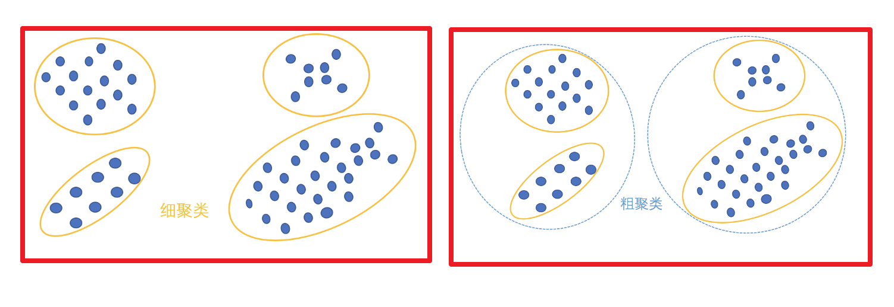
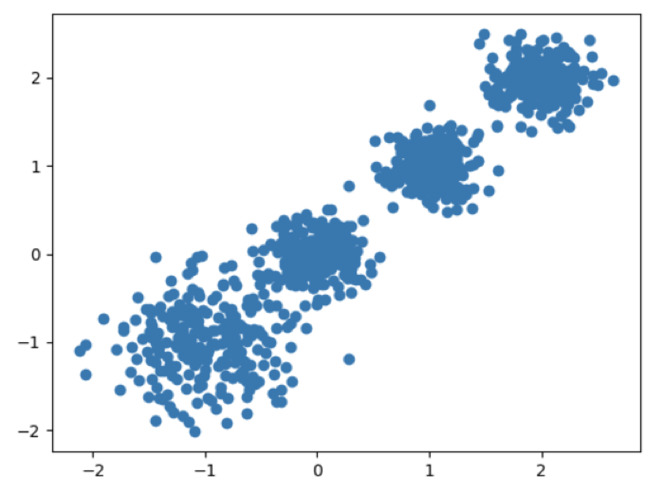
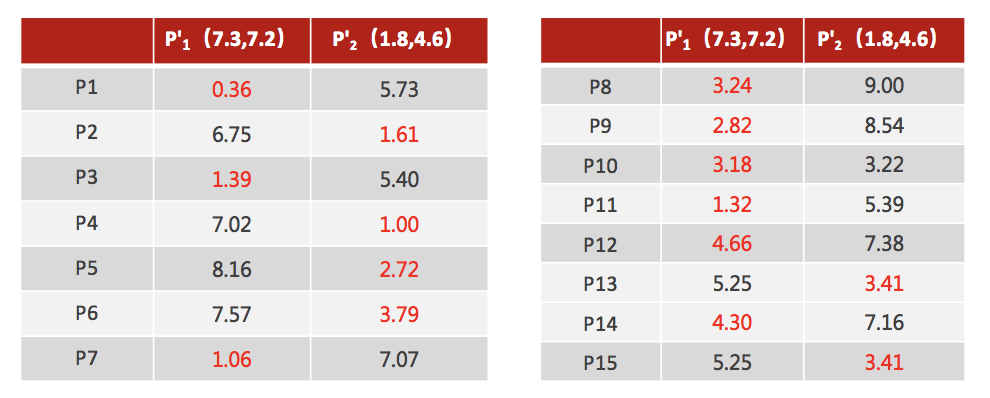
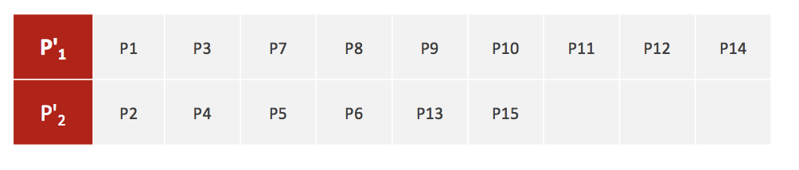
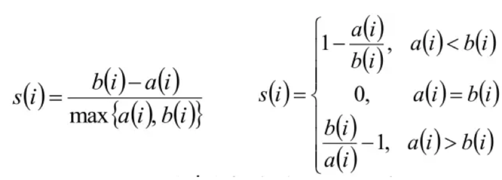
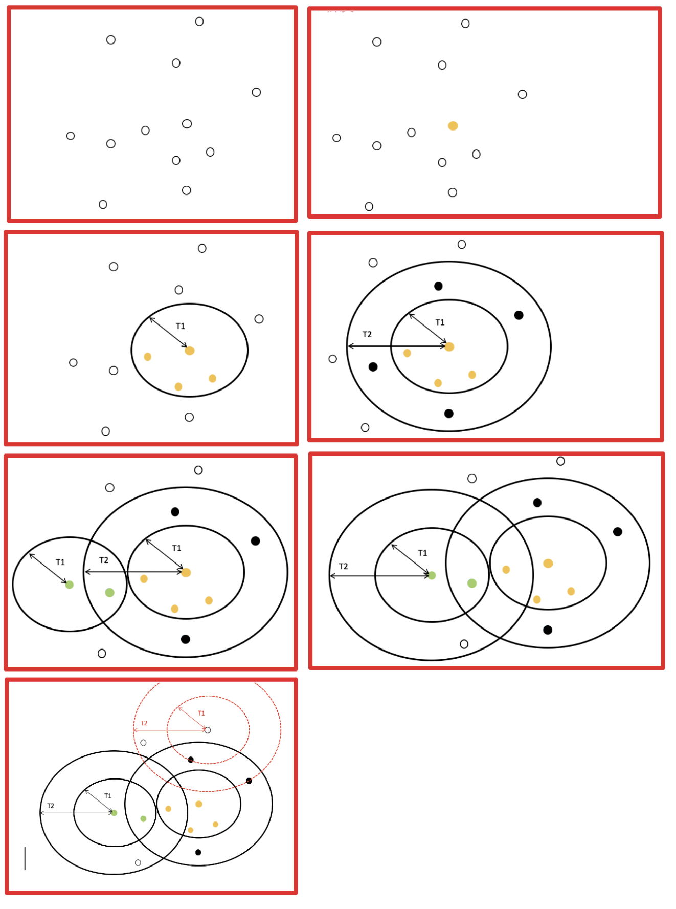
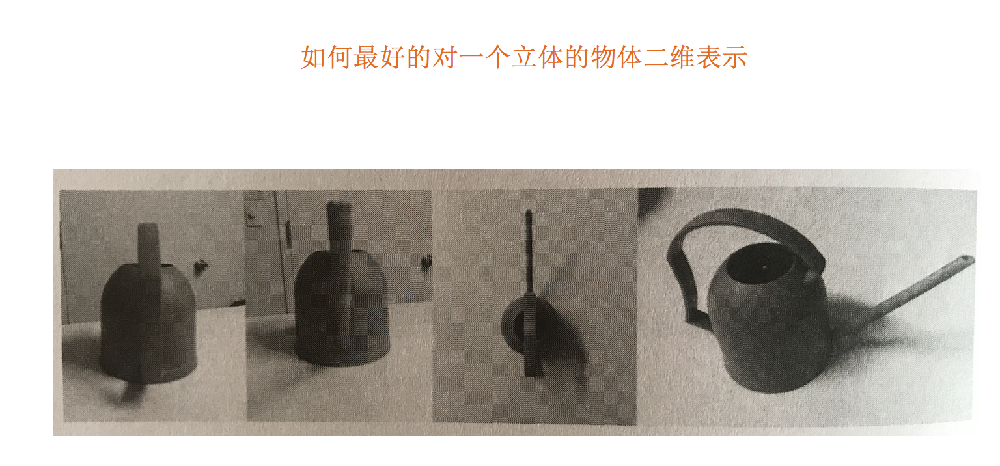
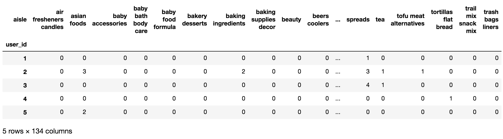

# 1 聚类算法简介

## 学习目标

- 知道聚类算法的概念
- 了解聚类算法和分类算法的最大区别

------

## 1.1 认识聚类算法


**使用不同的聚类准则，产生的聚类结果不同**。

### 1.1.1 聚类算法在现实中的应用

- 用户画像，广告推荐，Data Segmentation，搜索引擎的流量推荐，恶意流量识别
- 基于位置信息的商业推送，新闻聚类，筛选排序
- 图像分割，降维，识别；离群点检测；信用卡异常消费；发掘相同功能的基因片段



### 1.1.2 聚类算法的概念

**聚类算法**：

一种典型的**无监督**学习算法，主要用于将相似的样本自动归到一个类别中。

在聚类算法中根据样本之间的相似性，将样本划分到不同的类别中，对于不同的相似度计算方法，会得到不同的聚类结果，常用的相似度计算方法有欧式距离法。

### 1.1.3 聚类算法与分类算法最大的区别

聚类算法是无监督的学习算法，而分类算法属于监督的学习算法。

------

## 1.2 小结

- 聚类算法分类【了解】
    - 粗聚类
    - 细聚类
- 聚类的定义【了解】
    - 一种典型的无监督学习算法，
    - 主要用于将相似的样本自动归到一个类别中
    - 计算样本和样本之间的相似性，一般使用欧式距离


# 2 聚类算法api初步使用

## 学习目标

- 知道聚类算法API的使用

------

## 2.1 api介绍	cluster.KMeans()

- sklearn.cluster.KMeans(n_clusters=8)
    - 参数:
        - n_clusters:开始的聚类中心数量
            - 整型，缺省值=8，生成的聚类数，即产生的质心（centroids）数。
    - 方法:
        - estimator.fit(x)
        - estimator.predict(x)
        - estimator.fit_predict(x)
            - 计算聚类中心并预测每个样本属于哪个类别,相当于先调用fit(x),然后再调用predict(x)

## 2.2 案例

随机创建不同二维数据集作为训练集，并结合k-means算法将其聚类，你可以尝试分别聚类不同数量的簇，并观察聚类效果：



聚类参数n_cluster传值不同，得到的聚类结果不同


### 2.2.1流程分析


### 2.2.2 代码实现

1.创建数据集

```python
import matplotlib.pyplot as plt
# 生成数据集
from sklearn.datasets._samples_generator import make_blobs
# 聚类算法
from sklearn.cluster import KMeans
# 评价结果,结果越大,评估越好
from sklearn.metrics import calinski_harabasz_score
```

```python
# 创建数据集
# X为样本特征，Y为样本簇类别， 共1000个样本，每个样本4个特征，共4个簇，
# 簇中心在[-1,-1], [0,0],[1,1], [2,2]， 簇方差分别为[0.4, 0.2, 0.2, 0.2]
X, y = make_blobs(n_samples=1000, 
                  n_features=2, 
                  centers=[[-1, -1], [0, 0], [1, 1], [2, 2]],
                  cluster_std=[0.4, 0.2, 0.2, 0.2],
                  random_state=9)

# 数据集可视化
plt.scatter(X[:, 0], X[:, 1], marker='o')
plt.show()
```


2.使用k-means进行聚类,并使用CH方法评估

```python
# KMeans训练 n_clusters=2
y_pred = KMeans(n_clusters=2, random_state=9).fit_predict(x)
# 分别尝试n_cluses=2\3\4,然后查看聚类效果
# c=y_pred 按照y_pred分类
plt.scatter(x[:, 0], x[:, 1], c=y_pred)
plt.show()
```


```python
# 用calinski_harabasz_score评估的聚类分数
print(calinski_harabasz_score(x, y_pred))
```


```python
# KMeans训练 n_clusters=3
y_pred = KMeans(n_clusters=3, random_state=9).fit_predict(x)
# 分别尝试n_cluses=2\3\4,然后查看聚类效果
# c=y_pred 按照y_pred分类
plt.scatter(x[:, 0], x[:, 1], c=y_pred)
plt.show()
```


```python
# 用calinski_harabasz_score评估的聚类分数
print(calinski_harabasz_score(x, y_pred))
```


```python
# KMeans训练 n_clusters=4
y_pred = KMeans(n_clusters=4, random_state=9).fit_predict(x)
# 分别尝试n_cluses=2\3\4,然后查看聚类效果
# c=y_pred 按照y_pred分类
plt.scatter(x[:, 0], x[:, 1], c=y_pred)
plt.show()
```


```python
# 用calinski_harabasz_score评估的聚类分数
print(calinski_harabasz_score(x, y_pred))
# 数字最大,效果最好
```


## 2.3 小结

- api：sklearn.cluster.KMeans(n_clusters=8)【知道】
    - 参数:
        - n_clusters:开始的聚类中心数量
    - 方法：
        - estimator.fit_predict(x)
            - 计算聚类中心并预测每个样本属于哪个类别,相当于先调用fit(x),然后再调用predict(x)


# 3 聚类算法实现流程

## 学习目标

- 掌握K-means聚类的实现步骤

------

- k-means其实包含两层内容：
    - ​    K : 初始中心点个数（计划聚类数）
    - ​    means：求中心点到其他数据点距离的平均值

## 3.1 k-means聚类步骤

- 1、随机设置K个特征空间内的点作为初始的聚类中心
- 2、对于其他每个点计算到K个中心的距离，未知的点选择最近的一个聚类中心点作为标记类别
- 3、接着对着标记的聚类中心之后，重新计算出每个聚类的新中心点（平均值）
- 4、如果计算得出的新中心点与原中心点一样（质心不再移动），那么结束，否则重新进行第二步过程(重新计算所有点到中心点的距离)

通过下图解释实现流程：


k聚类动态效果图


## 3.2 案例练习

- 案例：


- 1、随机设置K个特征空间内的点作为初始的聚类中心（本案例中设置p1和p2）


2、对于其他每个点计算到K个中心的距离，未知的点选择最近的一个聚类中心点作为标记类别


3、接着对着标记的聚类中心之后，重新计算出每个聚类的新中心点（平均值）


4、如果计算得出的新中心点与原中心点一样（质心不再移动），那么结束，否则重新进行第二步过程【经过判断，需要重复上述步骤，开始新一轮迭代】





5、当每次迭代结果不变时，认为算法收敛，聚类完成，**K-Means一定会停下，不可能陷入一直选质心的过程。**


------

## 3.3 小结

- K-means聚类实现流程

    【掌握】

    - 事先**确定常数K**，常数K意味着最终的聚类类别数;

    - 随机**选定初始点为质心**，并通过计算每一个样本与质心之间的相似度(这里为欧式距离)，将样本点归到最相似的类中，

    - 接着，**重新计算**每个类的质心(即为类中心)，重复这样的过程，直到**质心不再改变**，

    - 最终就确定了每个样本所属的类别以及每个类的质心。

    - 注意

        :

        - 由于每次都要计算所有的样本与每一个质心之间的相似度，故在大规模的数据集上，K-Means算法的收敛速度比较慢。


# 4 模型评估

## 学习目标

- 知道模型评估中的SSE、“肘”部法、SC系数和CH系数的实现原理

------

## 4.1 误差平方和(SSE)    值越小越好

举例:(下图中数据-0.2, 0.4, -0.8, 1.3, -0.7, 均为真实值和预测值的差)


在k-means中的应用:


公式各部分内容:


上图中: k=2

- **SSE图最终的结果,对图松散度的衡量.**(eg: **SSE(左图)<SSE(右图)**)

- SSE随着聚类迭代,其值会越来越小,直到最后趋于稳定:


​																															**x轴是迭代次数**

- 如果质心的初始值选择不好,SSE只会达到一个不怎么好的局部最优解.


​																															**x轴是迭代次数**

## 4.2 “肘”方法 (Elbow method) — K值确定    拐点好


​																															**x轴是聚成几个类别**

（1）对于n个点的数据集，迭代计算k from 1 to n，每次聚类完成后计算每个点到其所属的簇中心的距离的平方和；

（2）平方和是会逐渐变小的，直到k==n时平方和为0，因为每个点都是它所在的簇中心本身。

（3）在这个平方和变化过程中，会出现一个拐点也即“肘”点，**下降率突然变缓时即认为是最佳的k值**。

在决定什么时候停止训练时，肘形判据同样有效，数据通常有更多的噪音，在**增加分类无法带来更多回报时，我们停止增加类别**。

## 4.3 轮廓系数法（Silhouette Coefficient）    越接近1越好,-1越差

结合了聚类的凝聚度（Cohesion）和分离度（Separation），用于评估聚类的效果：


b(组间距离)特别大, a(组内距离)特别小,  (b-a)=b, max(a,b)=b  商约等于1

b(组间距离)特别小, a(组内距离)特别大,  (b-a)=-a, max(a,b)=a  商约等于-1

**目的：**

​    内部距离最小化，外部距离最大化



计算样本i到同簇其他样本的平均距离ai，ai 越小样本i的簇内不相似度越小，说明样本i越应该被聚类到该簇。

计算样本i到最近簇Cj 的所有样本的平均距离bij，称样本i与最近簇Cj 的不相似度，定义为样本i的簇间不相似度：bi =min{bi1, bi2, ..., bik}，bi越大，说明样本i越不属于其他簇。

求出所有样本的轮廓系数后再求平均值就得到了**平均轮廓系数**。

平均轮廓系数的取值范围为[-1,1]，系数越大，聚类效果越好。

簇内样本的距离越近，簇间样本距离越远

**案例：**

下图是500个样本含有2个feature的数据分布情况，我们对它进行SC系数效果衡量：


**n_clusters = 2 The average silhouette_score is : 0.7049787496083262**

n_clusters = 3 The average silhouette_score is : 0.5882004012129721

**n_clusters = 4 The average silhouette_score is : 0.6505186632729437**

n_clusters = 5 The average silhouette_score is : 0.56376469026194

n_clusters = 6 The average silhouette_score is : 0.4504666294372765

n_clusters 分别为 2，3，4，5，6时，SC系数如下，是介于[-1,1]之间的度量指标：

**每次聚类后，每个样本都会得到一个轮廓系数，当它为1时，说明这个点与周围簇距离较远，结果非常好，当它为0，说明这个点可能处在两个簇的边界上，当值为负时，暗含该点可能被误分了。**

从平均SC系数结果来看，K取3，5，6是不好的，那么2和4呢？

k=2的情况：


k=4的情况：


n_clusters = 2时，第0簇的宽度远宽于第1簇；

n_clusters = 4时，所聚的簇宽度相差不大，因此选择K=4，作为最终聚类个数。

## 4.4 CH系数（Calinski-Harabasz Index）    内部距离平方和越小越好,外部的越大越好

**Calinski-Harabasz：**

类别内部数据的协方差越小越好，类别之间的协方差越大越好（换句话说：类别内部数据的距离平方和越小越好，类别之间的距离平方和越大越好），

这样的Calinski-Harabasz分数s会高，分数s高则聚类效果越好。


tr为**矩阵的迹**, Bk为类别之间的协方差矩阵，Wk为类别内部数据的协方差矩阵;

m为训练集样本数，k为类别数。


使用矩阵的迹进行求解的理解：

矩阵的对角线可以表示一个物体的相似性

在机器学习里，主要为了获取数据的特征值，那么就是说，在任何一个矩阵计算出来之后，都可以简单化，只要获取矩阵的迹，就可以表示这一块数据的最重要的特征了，这样就可以把很多无关紧要的数据删除掉，达到简化数据，提高处理速度。

CH需要达到的目的：

​    **用尽量少的类别聚类尽量多的样本，同时获得较好的聚类效果。**

------

## 4.5 小结

- sse【知道】
    - 误差平方和的值越小越好
- 肘部法【知道】
    - 下降率突然变缓时即认为是最佳的k值
- SC系数【知道】
    - 取值为[-1, 1]，其值越大越好
- CH系数【知道】
    - 分数s高则聚类效果越好
    - CH需要达到的目的：**用尽量少的类别聚类尽量多的样本，同时获得较好的聚类效果。**


# 5 算法优化

## 学习目标

- 知道k-means算法的优缺点
- 知道canopy、K-means++、二分K-means、K-medoids的优化原理
- 了解kernel K-means、ISODATA、Mini-batch K-means的优化原理

------

**k-means算法小结**

**优点：**

​    1.原理简单（靠近中心点），实现容易

​    2.聚类效果中上（依赖K的选择）

​    3.空间复杂度o(N)，时间复杂度o(I*K*N)

```
N为样本点个数，K为中心点个数，I为迭代次数
```

**缺点：**

​    1.对离群点，噪声敏感 （中心点易偏移）

​    2.很难发现大小差别很大的簇及进行增量计算

​    3.结果不一定是全局最优，只能保证局部最优（与K的个数及初值选取有关）

## 5.1 Canopy算法配合初始聚类

### 5.1.1 Canopy算法配合初始聚类实现流程



### 5.1.2 Canopy算法的优缺点

优点：

​    1.Kmeans对噪声抗干扰较弱，通过Canopy对比，将较小的NumPoint的Cluster直接去掉有利于抗干扰。    

​    2.Canopy选择出来的每个Canopy的centerPoint作为K会更精确。    

​    3.只是针对每个Canopy的内做Kmeans聚类，减少相似计算的数量。

缺点：

​    1.算法中 T1、T2的确定问题 ，依旧可能落入局部最优解 

## 5.2 K-means++


其中：


为方便后面表示，把其记为A


kmeans++目的，让选择的质心尽可能的分散

如下图中，如果第一个质心选择在圆心，那么最优可能选择到的下一个点在P(A)这个区域（根据颜色进行划分）


## 5.3 二分k-means

实现流程:

- 1.所有点作为一个簇
- 2.将该簇一分为二
- 3.选择能最大限度降低聚类代价函数（也就是误差平方和）的簇划分为两个簇。
- 4.以此进行下去，直到簇的数目等于用户给定的数目k为止。


**隐含的一个原则**

因为聚类的误差平方和能够衡量聚类性能，该值越小表示数据点越接近于他们的质心，聚类效果就越好。所以需要对误差平方和最大的簇进行再一次划分，因为误差平方和越大，表示该簇聚类效果越不好，越有可能是多个簇被当成了一个簇，所以我们首先需要对这个簇进行划分。

二分K均值算法可以加速K-means算法的执行速度，因为它的相似度计算少了并且不受初始化问题的影响，因为这里不存在随机点的选取，且每一步都保证了误差最小

## 5.4 k-medoids（k-中心聚类算法）

K-medoids和K-means是有区别的，**不一样的地方在于中心点的选取**

- K-means中，将中心点取为当前cluster中所有数据点的平均值，对异常点很敏感!

- K-medoids中，将从当前cluster 中选取到其他所有（当前cluster中的）点的距离之和最小的点作为中心点。

    

算法流程：

　　 ( 1 )总体n个样本点中任意选取k个点作为medoids

　　 ( 2 )按照与medoids最近的原则，将剩余的n-k个点分配到当前最佳的medoids代表的类中

　　 ( 3 )对于第i个类中除对应medoids点外的所有其他点，按顺序计算当其为新的medoids时，代价函数的值，遍历所有可能，选取代价函数最小时对应的点作为新的medoids

　　 ( 4 )重复2-3的过程，直到所有的medoids点不再发生变化或已达到设定的最大迭代次数

　　 ( 5 )产出最终确定的k个类

**k-medoids对噪声鲁棒性好。**

例：当一个cluster样本点只有少数几个，如（1,1）（1,2）（2,1）（1000,1000）。其中（1000,1000）是噪声。如果按照k-means质心大致会处在（1,1）（1000,1000）中间，这显然不是我们想要的。这时k-medoids就可以避免这种情况，他会在（1,1）（1,2）（2,1）（1000,1000）中选出一个样本点使cluster的绝对误差最小，计算可知一定会在前三个点中选取。

k-medoids只能对小样本起作用，样本大，速度就太慢了，当样本多的时候，少数几个噪音对k-means的质心影响也没有想象中的那么重，所以k-means的应用明显比k-medoids多。

## 5.5 Kernel k-means（了解）

kernel k-means实际上，就是将每个样本进行一个投射到高维空间的处理，然后再将处理后的数据使用普通的k-means算法思想进行聚类。


###  

## 5.6 ISODATA（了解）

类别数目随着聚类过程而变化；

对类别数会进行合并，分裂，

“合并”：（当聚类结果某一类中样本数太少，或两个类间的距离太近时）

“分裂”：（当聚类结果中某一类的类内方差太大，将该类进行分裂）

## 5.7 Mini Batch K-Means（了解）

适合大数据的聚类算法

大数据量是什么量级？通常当样本量大于1万做聚类时，就需要考虑选用Mini Batch K-Means算法。

Mini Batch KMeans使用了Mini Batch（分批处理）的方法对数据点之间的距离进行计算。

Mini Batch计算过程中不必使用所有的数据样本，而是从不同类别的样本中抽取一部分样本来代表各自类型进行计算。由于计算样本量少，所以会相应的减少运行时间，但另一方面抽样也必然会带来准确度的下降。

该算法的迭代步骤有两步：

(1)从数据集中随机抽取一些数据形成小批量，把他们分配给最近的质心

(2)更新质心

​        与Kmeans相比，数据的更新在每一个小的样本集上。对于每一个小批量，通过计算平均值得到更新质心，并把小批量里的数据分配给该质心，随着迭代次数的增加，这些质心的变化是逐渐减小的，直到质心稳定或者达到指定的迭代次数，停止计算。

------

## 5.8 小结

- k-means算法优缺点总结

    【知道】

    - 优点：
        - ​    1.原理简单（靠近中心点），实现容易
        - ​    2.聚类效果中上（依赖K的选择）
        - ​    3.空间复杂度o(N)，时间复杂度o(I*K*N)
    - 缺点：
        - ​    1.对离群点，噪声敏感 （中心点易偏移）
        - ​    2.很难发现大小差别很大的簇及进行增量计算
        - ​    3.结果不一定是全局最优，只能保证局部最优（与K的个数及初值选取有关）

- 优化方法【知道】

| **优化方法**         | **思路**                     |
| -------------------- | ---------------------------- |
| Canopy+kmeans        | Canopy粗聚类配合kmeans       |
| kmeans++             | 距离越远越容易成为新的质心   |
| 二分k-means          | 拆除SSE最大的簇              |
| k-medoids            | 和kmeans选取中心点的方式不同 |
| kernel kmeans        | 映射到高维空间               |
| ISODATA              | 动态聚类，可以更改K值大小    |
| Mini-batch   K-Means | 大数据集分批聚类             |


# 6 特征降维

## 学习目标

- 了解降维的定义
- 知道通过低方差过滤实现降维过程
- 知道相关系数实现降维的过程
- 知道主成分分析法实现过程

------

## 6.0 特征降维和特征标准化,特征提取用法相同 fit_transform


## 6.1 降维

### 6.1.1 定义

**降维**是指在某些限定条件下，**降低随机变量(特征)个数**，得到**一组“不相关”主变量**的过程

- 降低随机变量的个数


- 相关特征(correlated feature)
    - 相对湿度与降雨量之间的相关
    - 等等

> 正是因为在进行训练的时候，我们都是使用特征进行学习。如果特征本身存在问题或者特征之间相关性较强，对于算法学习预测会影响较大

### 6.1.2 降维的两种方式

- **特征选择**
- **主成分分析（可以理解一种特征提取的方式）**

## 6.2 特征选择

### 6.2.1 定义

数据中包含**冗余或无关变量（或称特征、属性、指标等）**，旨在从**原有特征中找出主要特征**。


### 6.2.2 方法	Filter	Embedded 

- Filter(过滤式)：主要探究特征本身特点、特征与特征和目标值之间关联
    - **方差选择法：低方差特征过滤**
    - **相关系数**
- Embedded (嵌入式)：算法自动选择特征（特征与目标值之间的关联）
    - **决策树:信息熵、信息增益**
    - **正则化：L1、L2**
    - **深度学习：卷积等**

### 6.2.3 低方差特征过滤

删除低方差的一些特征，前面讲过方差的意义。再结合方差的大小来考虑这个方式的角度。

- 特征方差小：某个特征大多样本的值比较相近
- 特征方差大：某个特征很多样本的值都有差别

#### 6.2.3.1 API    feature_selection.VarianceThreshold()

- sklearn.feature_selection.VarianceThreshold(threshold = 0.0)
    - 删除所有低方差特征
    - Variance.fit_transform(X)
        - X:numpy array格式的数据[n_samples,n_features]
        - 返回值：训练集差异低于threshold的特征将被删除。默认值是保留所有非零方差特征，即删除所有样本中具有相同值的特征。

#### 6.2.3.2 数据计算

我们对**某些股票的指标特征之间进行一个筛选**，除去'index,'date','return'列不考虑**（这些类型不匹配，也不是所需要指标）**

一共这些特征

```
pe_ratio,pb_ratio,market_cap,return_on_asset_net_profit,du_return_on_equity,ev,earnings_per_share,revenue,total_expense
index,pe_ratio,pb_ratio,market_cap,return_on_asset_net_profit,du_return_on_equity,ev,earnings_per_share,revenue,total_expense,date,return
0,000001.XSHE,5.9572,1.1818,85252550922.0,0.8008,14.9403,1211444855670.0,2.01,20701401000.0,10882540000.0,2012-01-31,0.027657228229937388
1,000002.XSHE,7.0289,1.588,84113358168.0,1.6463,7.8656,300252061695.0,0.326,29308369223.2,23783476901.2,2012-01-31,0.08235182370820669
2,000008.XSHE,-262.7461,7.0003,517045520.0,-0.5678,-0.5943,770517752.56,-0.006,11679829.03,12030080.04,2012-01-31,0.09978900335112327
3,000060.XSHE,16.476,3.7146,19680455995.0,5.6036,14.617,28009159184.6,0.35,9189386877.65,7935542726.05,2012-01-31,0.12159482758620697
4,000069.XSHE,12.5878,2.5616,41727214853.0,2.8729,10.9097,81247380359.0,0.271,8951453490.28,7091397989.13,2012-01-31,-0.0026808154146886697
```

- 分析

1、初始化VarianceThreshold,指定阀值方差

2、调用fit_transform

```python
def variance_demo():
    """
    删除低方差特征——特征选择
    :return: None
    """
    data = pd.read_csv("../data/factor_returns.csv")
    print(data)
    
    # 1、实例化一个转换器类
    transfer = VarianceThreshold(threshold=1)
    
    # 2、调用fit_transform
    transfer_data = transfer.fit_transform(data.iloc[:, 1:10])
    print("删除低方差特征的结果：\n", transfer_data)
    
    # 通过形状查看数据是否相同
    print(data.iloc[:, 1:10].shape)     # (2318, 9)
    print(transfer_data.shape)          # (2318, 8)

    return None
```

返回结果：

```python
            index  pe_ratio  pb_ratio    market_cap  \
0     000001.XSHE    5.9572    1.1818  8.525255e+10   
1     000002.XSHE    7.0289    1.5880  8.411336e+10    
...           ...       ...       ...           ...   
2316  601958.XSHG   52.5408    2.4646  3.287910e+10   
2317  601989.XSHG   14.2203    1.4103  5.911086e+10   

      return_on_asset_net_profit  du_return_on_equity            ev  \
0                         0.8008              14.9403  1.211445e+12   
1                         1.6463               7.8656  3.002521e+11    
...                          ...                  ...           ...   
2316                      2.7444               2.9202  3.883803e+10   
2317                      2.0383               8.6179  2.020661e+11   

      earnings_per_share       revenue  total_expense        date    return  
0                 2.0100  2.070140e+10   1.088254e+10  2012-01-31  0.027657  
1                 0.3260  2.930837e+10   2.378348e+10  2012-01-31  0.082352  
2                -0.0060  1.167983e+07   1.203008e+07  2012-01-31  0.099789   
...                  ...           ...            ...         ...       ...  
2315              0.2200  1.789082e+10   1.749295e+10  2012-11-30  0.137134  
2316              0.1210  6.465392e+09   6.009007e+09  2012-11-30  0.149167  
2317              0.2470  4.509872e+10   4.132842e+10  2012-11-30  0.183629  

[2318 rows x 12 columns]
删除低方差特征的结果：
 [[  5.95720000e+00   1.18180000e+00   8.52525509e+10 ...,   1.21144486e+12
    2.07014010e+10   1.08825400e+10]
 [  7.02890000e+00   1.58800000e+00   8.41133582e+10 ...,   3.00252062e+11
    2.93083692e+10   2.37834769e+10]
 [ -2.62746100e+02   7.00030000e+00   5.17045520e+08 ...,   7.70517753e+08
    1.16798290e+07   1.20300800e+07]
 ..., 
 [  3.95523000e+01   4.00520000e+00   1.70243430e+10 ...,   2.42081699e+10
    1.78908166e+10   1.74929478e+10]
 [  5.25408000e+01   2.46460000e+00   3.28790988e+10 ...,   3.88380258e+10
    6.46539204e+09   6.00900728e+09]
 [  1.42203000e+01   1.41030000e+00   5.91108572e+10 ...,   2.02066110e+11
    4.50987171e+10   4.13284212e+10]]
形状：
 (2318, 8)
```

### 6.2.4 相关系数

- 主要实现方式：
    - 皮尔逊相关系数
    - 斯皮尔曼相关系数

#### 6.2.4.1 皮尔逊相关系数(Pearson Correlation Coefficient)

##### 1.作用

反映变量之间相关关系密切程度的统计指标

##### 2.公式计算案例(了解，不用记忆)

公式


举例

- 比如说我们计算年广告费投入与月均销售额


那么之间的相关系数怎么计算


最终计算：


= 0.9942

**所以我们最终得出结论是广告投入费与月平均销售额之间有高度的正相关关系。** 

##### 3.特点

**相关系数的值介于–1与+1之间，即–1≤ r ≤+1**。其性质如下：

- **当r>0时，表示两变量正相关，r<0时，两变量为负相关**
- 当|r|=1时，表示两变量为完全相关，当r=0时，表示两变量间无相关关系
- **当0<|r|<1时，表示两变量存在一定程度的相关。且|r|越接近1，两变量间线性关系越密切；|r|越接近于0，表示两变量的线性相关越弱**
- **一般可按三级划分：|r|<0.4为低度相关；0.4≤|r|<0.7为显著性相关；0.7≤|r|<1为高度线性相关**

##### 4.api    scipy.stats.pearsonr

- from scipy.stats import pearsonr
    - x : (N,) array_like
    - y : (N,) array_like Returns: (Pearson’s correlation coefficient, p-value)

##### 5.案例

```python
from scipy.stats import pearsonr

x1 = [12.5, 15.3, 23.2, 26.4, 33.5, 34.4, 39.4, 45.2, 55.4, 60.9]
x2 = [21.2, 23.9, 32.9, 34.1, 42.5, 43.2, 49.0, 52.8, 59.4, 63.5]

pearsonr(x1, x2)
```

结果

```
(0.9941983762371883, 4.9220899554573455e-09)
```

#### 6.2.4.2 斯皮尔曼相关系数(Rank IC)    优先使用

##### 1.作用：

反映变量之间相关关系密切程度的统计指标

##### 2.公式计算案例(了解，不用记忆)

公式:


> n为等级个数，d为二列成对变量的等级差数

举例:


##### 3.特点

- 斯皮尔曼相关系数表明 X (自变量) 和 Y (因变量)的相关方向。 如果当X增加时， Y 趋向于增加, 斯皮尔曼相关系数则为正
- 与之前的皮尔逊相关系数大小性质一样，取值 [-1, 1]之间

> 斯皮尔曼相关系数比皮尔逊相关系数应用更加广泛

##### 4.api

- from scipy.stats import spearmanr

#### 5.案例

```python
from scipy.stats import spearmanr

x1 = [12.5, 15.3, 23.2, 26.4, 33.5, 34.4, 39.4, 45.2, 55.4, 60.9]
x2 = [21.2, 23.9, 32.9, 34.1, 42.5, 43.2, 49.0, 52.8, 59.4, 63.5]

spearmanr(x1, x2)
```

结果

```
SpearmanrResult(correlation=0.9999999999999999, pvalue=6.646897422032013e-64)
```

## 6.3 主成分分析 PCA

### 6.3.1 什么是主成分分析(PCA)

- 定义：**高维数据转化为低维数据的过程**，在此过程中**可能会舍弃原有数据、创造新的变量**
- 作用：**是数据维数压缩，尽可能降低原数据的维数（复杂度），损失少量信息。**
- 应用：回归分析或者聚类分析当中

> 对于信息一词，在决策树中会进行介绍

那么更好的理解这个过程呢？我们来看一张图



### 6.3.2 API    decomposition.PCA

- sklearn.decomposition.PCA(n_components=None)
    - 将数据分解为较低维数空间
    - n_components:
        - **小数：表示保留百分之多少的信息**
        - **整数：减少到多少特征**
    - PCA.fit_transform(X) X:numpy array格式的数据[n_samples,n_features]
    - 返回值：转换后指定维度的array

### 6.3.3 数据计算

先拿个简单的数据计算一下

```python
[[2,8,4,5],
[6,3,0,8],
[5,4,9,1]]
from sklearn.decomposition import PCA

def pca_demo():
    """
    对数据进行PCA降维
    :return: None
    """
    data = [[2,8,4,5], [6,3,0,8], [5,4,9,1]]

    # 1、实例化PCA, 小数——保留多少信息
    transfer = PCA(n_components=0.9)
    # 2、调用fit_transform
    data1 = transfer.fit_transform(data)

    print("保留90%的信息，降维结果为：\n", data1)

    # 1、实例化PCA, 整数——指定降维到的维数
    transfer2 = PCA(n_components=3)
    # 2、调用fit_transform
    data2 = transfer2.fit_transform(data)
    print("降维到3维的结果：\n", data2)

    return None
```

返回结果：

```python
保留90%的信息，降维结果为：
 [[ -3.13587302e-16   3.82970843e+00]
 [ -5.74456265e+00  -1.91485422e+00]
 [  5.74456265e+00  -1.91485422e+00]]
降维到3维的结果：
 [[ -3.13587302e-16   3.82970843e+00   4.59544715e-16]
 [ -5.74456265e+00  -1.91485422e+00   4.59544715e-16]
 [  5.74456265e+00  -1.91485422e+00   4.59544715e-16]]
```

### 6.3.4  fit transform fit_trainsform

fit和transform可以分开也可以一起使用,分开使用的情况是针对多个数据进行相同的处理

day10 数字识别器

```python
pca = PCA(n_components=0.80)
pca.fit(x_train)
# 显示训练后的特征值
pca.n_components_
# 剩余43列

# 修改特征值
x_train_pca = pca.transform(x_train)
x_val_pca = pca.transform(x_val)
x_train_pca.shape, x_val_pca.shape
# 都只剩余43列了
```


## 6.4 小结

- 降维的定义【了解】
    - 就是改变特征值，选择哪列保留，哪列删除
    - 目标是得到一组”不相关“的主变量
- 降维的两种方式【了解】
    - 特征选择
    - 主成分分析（可以理解一种特征提取的方式）
- 特征选择【知道】
    - 定义：提出数据中的冗余变量
    - 方法：
        - Filter(过滤式)：主要探究特征本身特点、特征与特征和目标值之间关联
            - 方差选择法：低方差特征过滤
            - 相关系数
        - Embedded (嵌入式)：算法自动选择特征（特征与目标值之间的关联）
            - 决策树:信息熵、信息增益
            - 正则化：L1、L2
- 低方差特征过滤【知道】
    - 把方差比较小的某一列进行剔除
    - api:sklearn.feature_selection.VarianceThreshold(threshold = 0.0)
        - 删除所有低方差特征
        - 注意，参数threshold一定要进行值的指定
- 相关系数【掌握】
    - 主要实现方式：
        - 皮尔逊相关系数
        - 斯皮尔曼相关系数
    - 皮尔逊相关系数
        - 通过具体值的大小进行计算
        - 相对复杂
        - api:from scipy.stats import pearsonr
            - 返回值，越接近|1|，相关性越强；越接近0，相关性越弱
    - 斯皮尔曼相关系数
        - 通过等级差进行计算
        - 比上一个简单
        - api:from scipy.stats import spearmanr
        - 返回值，越接近|1|，相关性越强；越接近0，相关性越弱
- pca【知道】
    - 定义：高维数据转换为低维数据，然后产生了新的变量
    - api:sklearn.decomposition.PCA(n_components=None)
        - n_components
            - 整数 -- 表示降低到几维
            - 小数 -- 保留百分之多少的信息


# 7 案例：探究用户对物品类别的喜好细分类

## 学习目标

- 应用pca和K-means实现用户对物品类别的喜好细分划分

------


数据如下：

- order_products__prior.csv：订单与商品信息
    - 字段：**order_id**, **product_id**, add_to_cart_order, reordered
- products.csv：商品信息
    - 字段：**product_id**, product_name, **aisle_id**, department_id
- orders.csv：用户的订单信息
    - 字段：**order_id**,**user_id**,eval_set,order_number,….
- aisles.csv：商品所属具体物品类别
    - 字段： **aisle_id**, **aisle**

## 7.1 需求




## 7.2 分析

- 1.获取数据
- 2.数据基本处理
    - 2.1 合并表格
    - 2.2 交叉表合并
    - 2.3 数据截取
- 3.特征工程 — pca
- 4.机器学习（k-means）
- 5.模型评估
    - sklearn.metrics.silhouette_score(X, labels)
        - 计算所有样本的平均轮廓系数
        - X：特征值
        - labels：被聚类标记的目标值

## 7.3 完整代码

```python
# 导入包
import pandas as pd
# 主成分分析
from sklearn.decomposition import PCA
# KMeans聚类算法
from sklearn.cluster import KMeans
```

- 1.获取数据

```python
order_product = pd.read_csv("../data/instacart/order_products__prior.csv")
products = pd.read_csv("../data/instacart/products.csv")
orders = pd.read_csv("../data/instacart/orders.csv")
aisles = pd.read_csv("../data/instacart/aisles.csv")
```

- 2.数据基本处理

    - 2.1 合并表格

    ```python
    table1 = pd.merge(order_product, products, on=["product_id", "product_id"])
    table2 = pd.merge(table1, orders, on=["order_id", "order_id"])
    table = pd.merge(table2, aisles, on=["aisle_id", "aisle_id"])
    ```

    - 2.2 交叉表合并

    ```python
    table = pd.crosstab(table["user_id"], table["aisle"])
    table.shape
    # 数据量很大
    ```

    

    - 2.3 数据截取

    ```python
    table = table[:1000]
    ```

- 3.特征工程 — pca

    ```python
    transfer = PCA(n_components=0.9)
    data = transfer.fit_transform(table)
    data.shape
    ```

    

- 4.机器学习（k-means）

    ```python
    estimator = KMeans(n_clusters=8, random_state=22)
    y_predict = estimator.fit_predict(data)
    ```

- 5.模型评估

    ```python
    # 模型评估
    from sklearn.metrics import silhouette_score
    
    #越接近1越好,越接近0越差
    silhouette_score(data, y_predict)
    ```
    
    


# 8 算法选择指导

- #### **关于在计算的过程中，如何选择合适的算法进行计算，可以参考scikit learn官方给的指导意见：**

