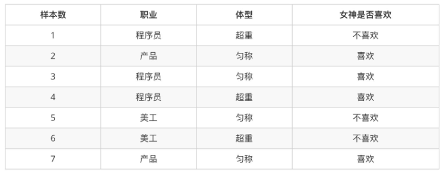

# 朴素⻉叶斯 

## 学习⽬标 

- 说明条件概率与联合概率 

- 说明⻉叶斯公式、以及特征独⽴的关系 

- 记忆⻉叶斯公式 

- 知道拉普拉斯平滑系数 

- 应⽤⻉叶斯公式实现概率的计算 

- 会使⽤朴素⻉叶斯对商品评论进⾏情感分析

# 1 朴素⻉叶斯算法简介


# 2 概率基础复习

学习目标

- 了解联合概率、条件概率和相关独立的概念
- 知道⻉叶斯公式
- 知道拉普拉斯平滑系数

## 1.概率定义

- 概率定义为一件事情发生的可能性
    - 扔出一个硬币，结果头像朝上
- P(X) : 取值在[0, 1]

## 2.案例：判断女神对你的喜欢情况

在讲这两个概率之前我们通过一个例子，来计算一些结果：



问题如下：

- 女神喜欢的概率？
- 职业是程序员并且体型匀称的概率？
- 在女神喜欢的条件下，职业是程序员的概率？
- 在女神喜欢的条件下，职业是程序员、体重超重的概率？

计算结果为：

```python
P(喜欢) = 4/7
P(程序员, 匀称) = 1/7(联合概率)
P(程序员|喜欢) = 2/4 = 1/2(条件概率)
P(程序员, 超重|喜欢) = 1/4
```

思考题：在小明是产品经理并且体重超重的情况下，如何计算小明被女神喜欢的概率？

即P(喜欢|产品, 超重) = ？
此时我们需要用到朴素⻉叶斯进行求解，在讲解⻉叶斯公式之前，首先复习一下联合概率、条件概率和相互独立的概念。


## 3.联合概率、条件概率与相互独立

- 联合概率：包含多个条件，且所有条件同时成立的概率
    - 记作：P(A, B)
- 条件概率：就是事件A在另外一个事件B已经发生条件下的发生概率
    - 记作：P(A|B)
- 相互独立：如果P(A, B) = P(A)P(B)，则称事件A与事件B相互独立。

## 4.⻉叶斯公式

### 4.1 公式介绍


### 4.2 案例计算

那么思考题就可以套用⻉叶斯公式这样来解决：

```python
P(喜欢|产品, 超重) = P(产品, 超重|喜欢)P(喜欢) / P(产品, 超重)
```

上式中，

- P(产品, 超重|喜欢)和P(产品, 超重)的结果均为0，导致无法计算结果。这是因为我们的样本量太少了，不具有代表性。
- 本来现实生活中，肯定是存在职业是产品经理并且体重超重的人的，P(产品, 超重)不可能为0；
- 而且事件“职业是产品经理”和事件“体重超重”通常被认为是相互独立的事件，但是，根据我们有限的7个样本计算 “P(产品, 超重) = P(产品)P(超重)”不成立。

而朴素⻉叶斯可以帮助我们解决这个问题。

- 朴素⻉叶斯，简单理解，就是假定了特征与特征之间相互独立的⻉叶斯公式。
- 也就是说，朴素⻉叶斯，之所以朴素，就在于假定了特征与特征相互独立。

所以，思考题如果按照朴素⻉叶斯的思路来解决，就可以是

```python
P(产品, 超重) = P(产品) * P(超重) = 2/7 * 3/7 = 6/49
p(产品, 超重|喜欢) = P(产品|喜欢) * P(超重|喜欢) = 1/2 * 1/4 = 1/8
P(喜欢|产品, 超重) = P(产品, 超重|喜欢)P(喜欢)/P(产品, 超重) = 1/8 * 4/7 / 6/49 = 7/12
```

那么这个公式如果应用在文章分类的场景当中，我们可以这样看：


公式分为三个部分：

- P(C)：每个文档类别的概率(某文档类别数／总文档数量)
- P(W│C)：给定类别下特征（被预测文档中出现的词）的概率
    - 计算方法：P(F1│C)=Ni/N （训练文档中去计算）
        - Ni为该F1词在C类别所有文档中出现的次数
        - N为所属类别C下的文档所有词出现的次数和
- P(F1,F2,...) 预测文档中每个词的概率

如果计算两个类别概率比较：

**所以我们只要比较前面的大小就可以，得出谁的概率大**

### 4.3 文章分类计算

需求：通过前四个训练样本（文章），判断第五篇文章，是否属于China类


- 计算结果

```python
P(C|Chinese, Chinese, Chinese, Tokyo, Japan) -->
P(Chinese, Chinese, Chinese, Tokyo, Japan|C) * P(C) / P(Chinese, Chinese, Chinese, Tokyo, Japan) 
=
P(Chinese|C)^3 * P(Tokyo|C) * P(Japan|C) * P(C) / [P(Chinese)^3 * P(Tokyo) * P(Japan)]
# 这个文章是需要计算是不是China类，是或者不是最后的分母值都相同:
# 首先计算是China类的概率: 
P(Chinese|C) = 5/8
P(Tokyo|C) = 0/8
P(Japan|C) = 0/8
# 接着计算不是China类的概率:
P(Chinese|C) = 1/3
P(Tokyo|C) = 1/3
P(Japan|C) = 1/3
```


```python
# 这个文章是需要计算是不是China类:
首先计算是China类的概率:  0.0003
    P(Chinese|C) = 5/8 --> 6/14
    P(Tokyo|C) = 0/8 --> 1/14
    P(Japan|C) = 0/8 --> 1/14
接着计算不是China类的概率: 0.0001
    P(Chinese|C) = 1/3 -->(经过拉普拉斯平滑系数处理) 2/9
    P(Tokyo|C) = 1/3 --> 2/9
    P(Japan|C) = 1/3 --> 2/9
```

## P(Tokyo|C) = 0/8

````python
P(Japan|C) = 0/8
# 接着计算不是China类的概率:
P(Chinese|C) = 1/3
P(Tokyo|C) = 1/3
P(Japan|C) = 1/3
# 这个文章是需要计算是不是China类:
首先计算是China类的概率:  0.0003
    P(Chinese|C) = 5/8 --> 6/14
    P(Tokyo|C) = 0/8 --> 1/14
    P(Japan|C) = 0/8 --> 1/14
接着计算不是China类的概率: 0.0001
    P(Chinese|C) = 1/3 -->(经过拉普拉斯平滑系数处理) 2/9
    P(Tokyo|C) = 1/3 --> 2/9
    P(Japan|C) = 1/3 --> 2/9
````


5 小结

- 概率【了解】

    - 一件事情发生的可能性

- 联合概率【知道】

    - 包含多个条件，且所有条件同时成立的概率

- 条件概率【知道】

    - 事件A在另外一个事件B已经发生条件下的发生概率

- ⻉叶斯公式【掌握】

  ​    

# 3 案例：商品评论情感分析    naive_bayes.MultinomialNB

## 学习目标

应用朴素⻉叶斯API实现商品评论情感分析

## 1.api介绍    naive_bayes.MultinomialNB

- sklearn.naive_bayes.MultinomialNB(alpha = 1.0)
    - 朴素⻉叶斯分类
    - alpha：拉普拉斯平滑系数

## 2.商品评论情感分析


### 2.1 步骤分析

- 1）获取数据
- 2）数据基本处理
    - 2.1） 取出内容列，对数据进行分析
    - 2.2） 判定评判标准
    - 2.3） 选择停用词
    - 2.4） 把内容处理，转化成标准格式
    - 2.5） 统计词的个数
    - 2.6）准备训练集和测试集
- 3）模型训练
- 4）模型评估

### 2.2 代码实现

```python
import pandas as pd
import numpy as np
import jieba
import matplotlib.pyplot as plt
from sklearn.feature_extraction.text import CountVectorizer
from sklearn.naive_bayes import MultinomialNB
```

- 1）获取数据

```python
# 加载数据
data = pd.read_csv("../data/书籍评价.csv", encoding="gbk")
data
```

- 2）数据基本处理

```python
# 2.1） 取出内容列，对数据进行分析
content = data["内容"]
content.head()
```


```python
data.loc[:, '评价'] == '好评'
```


```python
# 2.2） 判定评判标准 -- 1好评;0差评
# 增加一列表示好评和差评,下面没有使用,直接使用的好评和差评
data.loc[data.loc[:, '评价'] == '好评', '评论称号'] = 1
data.loc[data.loc[:, '评价'] == '差评', '评论称号'] = 0
data.head()
```


```python
good_or_bad = data['评价'].values  # 获取数据
good_or_bad
```


```python
# 加载停用词
stopwords = []
with open('../data/stopwords.txt', 'r', encoding='utf-8') as f:
    # 取出所有行
    lines = f.readlines()
    #print(lines)
    for temp in lines:
        # 取出换行
        line = temp.strip()
        #print(line)
        stopwords.append(line)
# set去重
stopwords = list(set(stopwords))
stopwords
```


```python
# 2.4） 把“内容”处理，转化成标准格式
comment_list = []
for temp in content:
    # 对文本数据进行切割
    # cut_all 参数默认为 False, 不一次性切割所有, 所有使用 cut 方法时默认为精确模式 
    seg_list = jieba.cut(temp, cut_all=False)
    #print(seg_list)    # 返回对象 <generator object Tokenizer.cut at 0x0000000007CF7DB0>
    # 使用逗号分隔成字符串
    seg_str = ','.join(seg_list)
    #print(seg_str)
    # 转化成列表形式
    comment_list.append(seg_str)
comment_list 
```


```python
# 2.5） 统计词的个数
# 实例化对象
# CountVectorizer 类会将文本中的词语转换为词频矩阵
con = CountVectorizer(stop_words=stopwords)
# 进行词数统计
# 它通过 fit_transform 函数计算各个词语出现的次数
x = con.fit_transform(comment_list)
# 0 1 是一句话包含哪一些词
x.toarray()
```


```python
# 通过 get_feature_names()可获取词袋中所有文本的关键字
name = con.get_feature_names()  
name
```


```python
# 2.6）准备训练集和测试集
# 准备训练集   这里将文本前10行当做训练集  后3行当做测试集
x_train = x.toarray()[:10, :]
y_train = data['评价'][:10]

# 准备测试集
x_test = x.toarray()[10:, :]
y_test = data['评价'][10:]
y_train, y_test
```


- 3）模型训练

```python
# 构建⻉叶斯算法分类器
mb = MultinomialNB(alpha=1)  # alpha 为可选项，默认 1.0，添加拉普拉修/Lidstone 平滑参数
# 训练数据
mb.fit(x_train, y_train)
# 预测数据
y_predict = mb.predict(x_test)
# 预测值与真实值展示
print('预测值：', y_predict)
print('真实值：', y_test)
```


- 4）模型评估

```python
mb.score(x_text, y_text)
```


## 3 总结

- API：sklearn.naive_bayes.MultinomialNB(alpha = 1.0)

    - 朴素⻉叶斯分类

        - alpha：拉普拉斯平滑系数

        


# 4 朴素⻉叶斯算法总结

## 1.朴素⻉叶斯优缺点

- 优点：
    - 朴素⻉叶斯模型发源于古典数学理论，有稳定的分类效率
    - 对缺失数据不太敏感，算法也比较简单，常用于文本分类
    - 分类准确度高，速度快
- 缺点：
    - 由于使用了样本属性独立性的假设，所以如果特征属性有关联时其效果不好
    - 需要计算先验概率，而先验概率很多时候取决于假设，假设的模型可以有很多种，因此在某些时候会由于假设的先验模型的原因导致预测效果不佳；

## 2.朴素⻉叶斯内容汇总
### 2.1 NB的原理
朴素⻉叶斯法是基于⻉叶斯定理与特征条件独立假设的分类方法。

- 对于给定的待分类项x，通过学习到的模型计算后验概率分布，
- 即：在此项出现的条件下各个目标类别出现的概率，将后验概率最大的类作为x所属的类别。

### 2.2 朴素⻉叶斯朴素在哪里？
在计算条件概率分布$P(X=x∣Y=c_k)$时，NB引入了一个很强的条件独立假设，即，当Y确定时，X的各个特征分量取值之
间相互独立。

### 2.3 为什么引入条件独立性假设？
为了避免⻉叶斯定理求解时面临的组合爆炸、样本稀疏问题。
假设条件概率分为


### 2.4 在估计条件概率P(X∣Y)时出现概率为0的情况怎么办？
解决这一问题的方法是采用⻉叶斯估计。
简单来说，引入λ，

- 当λ=0时，就是普通的极大似然估计；
- 当λ=1时称为拉普拉斯平滑。

### 2.5 为什么属性独立性假设在实际情况中很难成立，但朴素⻉叶斯仍能取得较好的效果?

- 人们在使用分类器之前，首先做的第一步（也是最重要的一步）往往是特征选择，这个过程的目的就是为了排除特征之间的共线性、选择相对较为独立的特征；
- 对于分类任务来说，只要各类别的条件概率排序正确，无需精准概率值就可以得出正确分类；
- 如果属性间依赖对所有类别影响相同，或依赖关系的影响能相互抵消，则属性条件独立性假设在降低计算复杂度的同时不会对性能产生负面影响。

### 2.6 朴素⻉叶斯与逻辑回归的区别？
#### 1）简单来说：

- 区别一：

    - 朴素⻉叶斯是生成模型，

        - 根据已有样本进行⻉叶斯估计学习出先验概率P(Y)和条件概率P(X|Y)，
        - 进而求出联合分布概率P(XY),
        - 最后利用⻉叶斯定理求解P(Y|X)，

    - 而LR是判别模型，

        - 根据极大化对数似然函数直接求出条件概率P(Y|X)；

    - > 从概率框架的⻆度来理解机器学习；主要有两种策略：
        > 第一种：给定 x， 可通过直接建模 P(c |x) 来预测 c，这样得到的是"判别式模型" (discriminative
        > models)；
        > 第二种：也可先对联合概率分布 P(x,c) 建模，然后再由此获得 P(c |x)， 这样得到的是"生成式模型"
        > (generative models) ;
        > 显然，前面介绍的逻辑回归、决策树、都可归入判别式模型的范畴，还有后面学到的BP神经网络
        > 支持向量机等；
        > 对生成式模型来说，必然需要考虑
        >
        > 

    
    
- 区别二：

    - 朴素⻉叶斯是基于很强的条件独立假设（在已知分类Y的条件下，各个特征变量取值是相互独立的），
    - 而LR则对此没有要求；

- 区别三：

    - 朴素⻉叶斯适用于数据集少的情景，
    - 而LR适用于大规模数据集。

#### 2）进一步说明：
**前者是生成式模型，后者是判别式模型，**二者的区别就是生成式模型与判别式模型的区别。

- 首先，Navie Bayes通过已知样本求得先验概率P(Y), 及条件概率P(X|Y), 对于给定的实例，计算联合概率，进而求出后验概率。也就是说，它尝试去找到底这个数据是怎么生成的（产生的），然后再进行分类。哪个类别最有可能产生这个信号，就属于那个类别。
    - 优点： 样本容量增加时，收敛更快；隐变量存在时也可适用。
    - 缺点：时间⻓；需要样本多；浪费计算资源
- 相比之下，Logistic回归不关心样本中类别的比例及类别下出现特征的概率，它直接给出预测模型的式子。设每个特征都有一个权重，训练样本数据更新权重w，得出最终表达式。
    - 优点：
        - 直接预测往往准确率更高；
        - 简化问题；
        - 可以反应数据的分布情况，类别的差异特征；
        - 适用于较多类别的识别。
    - 缺点
        - 收敛慢；
        - 不适用于有隐变量的情况。
