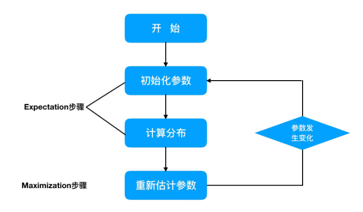
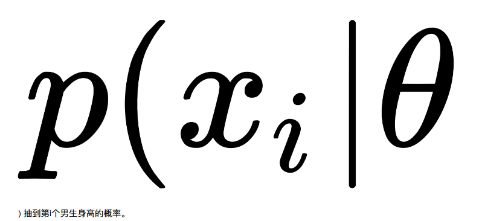
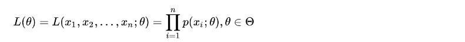
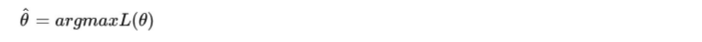
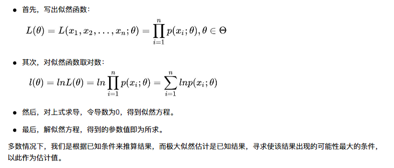
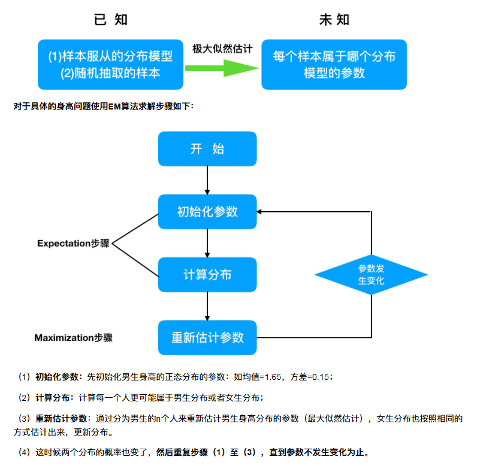
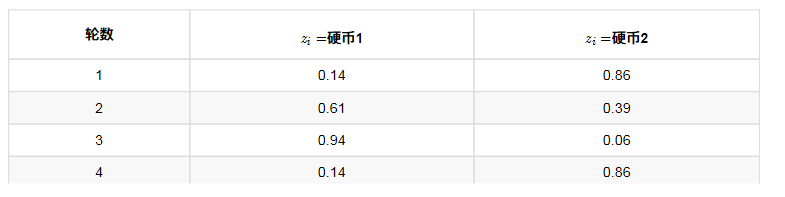

# 1 初识EM算法

EM算法也称期望最大化（Expectation-Maximum,简称EM）算法。
**它是一个基础算法，是很多机器学习领域算法的基础**，比如隐式⻢尔科夫算法（HMM）等等。
EM算法是一种迭代优化策略，由于它的计算方法中每一次迭代都分两步，

- 其中一个为期望步（E步），
- 另一个为极大步（M步），

所以算法被称为EM算法（Expectation-Maximization Algorithm）。
EM算法受到缺失思想影响，**最初是为了解决数据缺失情况下的参数估计问题**，其算法基础和收敛有效性等问题在
Dempster、Laird和Rubin三人于1977年所做的文章《Maximum likelihood from incomplete data via the EM algorithm》中给出了详细的阐述。其基本思想是：

- 首先根据己经给出的观测数据，估计出模型参数的值；
- 然后再依据上一步估计出的参数值估计缺失数据的值，再根据估计出的缺失数据加上之前己经观测到的数据重新再对参数值进行估计；
- 然后反复迭代，直至最后收敛，迭代结束。2

## EM算法计算流程：

## 小结
- EM算法是一种迭代优化策略，由于它的计算方法中每一次迭代都分两步：
    - 其中一个为期望步（E步）
    - 另一个为极大步（M步）

# 2 EM算法介绍

想清晰的了解EM算法，我们需要知道一个基础知识：

- “极大似然估计”

## 1 极大似然估计

### 1.1 问题描述

假如我们需要调查学校的男生和女生的身高分布 ，我们抽取100个男生和100个女生，将他们按照性别划分为两组。
然后，统计抽样得到100个男生的身高数据和100个女生的身高数据。
如果我们知道他们的身高服从正态分布，**但是这个分布的均值μ 和方差δ  是不知道，这两个参数就是我们需要估计的。**

问题：我们知道样本所服从的概率分布模型和一些样本，我们需要求解该模型的参数

- 我们已知的条件有两个：
    - 样本服从的分布模型
    - 随机抽取的样本。
- 我们需要求解模型的参数。

根据已知条件，通过极大似然估计，求出未知参数。

总的来说：**极大似然估计就是用来估计模型参数的统计学方法。**

### 1.2 用数学知识解决现实问题

问题数学化：

- 样本集
- 概率密度是：

- 由于100个样本之间独立同分布，所以同时抽到这100个男生的概率是它们各自概率的乘积，也就是样本集X中各个样本的联合概率，用下式表示：

- 这个概率反映了在概率密度函数的参数是θ时，得到X这组样本的概率。
- 我们需要找到一个参数θ，使得抽到X这组样本的概率最大，也就是说需要其对应的似然函数L(θ)最大。
    - 满足条件的θ叫做θ的最大似然估计值，记为：

### 1.3 最大似然函数估计值的求解步骤

## 2 EM算法实例描述
我们目前有100个男生和100个女生的身高，但是我们不知道这200个数据中哪个是男生的身高，哪个是女生的身高，即
抽取得到的每个样本都不知道是从哪个分布中抽取的。
这个时候，对于每个样本，就有两个未知量需要估计：
（1）这个身高数据是来自于男生数据集合还是来自于女生？
（2）男生、女生身高数据集的正态分布的参数分别是多少？
具体问题如下图：

## 3 EM算法流程
...

## 4 小结
- 极大似然估计
    - 根据已知条件，通过极大似然估计，求出未知参数；
    - 极大似然估计就是用来估计模型参数的统计学方法。
- EM算法基本流程
    - 1） 初始化参数；
    - 2） 计算分布；
    - 3） 重新估计参数；
    - 4） 重复1-3步，直到参数不发生变化为止。

# 3 EM算法实例

## 1 一个超级简单的案例
假设现在有两枚硬币1和2，,随机抛掷后正面朝上概率分别为P1，P2。为了估计这两个概率，做实验，每次取一枚硬币，连掷5下，记录下结果，如下：

| 硬币 | 结果       | 统计    |
| ---- | ---------- | ------- |
| 1    | 正正反正反 | 3正-2反 |
| 2    | 反反正正反 | 2正-3反 |
| 1    | 正反反反反 | 1正-4反 |
| 2    | 正反反正正 | 3正-2反 |
| 1    | 反正正反反 | 2正-3反 |

可以很容易地估计出P1和P2，如下：
P1 = （3+1+2）/ 15 = 0.4 P2= （2+3）/10 = 0.5
到这里，一切似乎很美好，下面我们加大难度

## 2 加入隐变量z后的求解

还是上面的问题，现在我们抹去每轮投掷时使用的硬币标记，如下：

| 硬币    | 结果       | 统计    |
| ------- | ---------- | ------- |
| Unknown | 正正反正反 | 3正-2反 |
| Unknown | 反反正正反 | 2正-3反 |
| Unknown | 正反反反反 | 1正-4反 |
| Unknown | 正反反正正 | 3正-2反 |
| Unknown | 反正正反反 | 2正-3反 |

好了，现在我们的目标没变，还是估计P1和P2，要怎么做呢？
显然，此时我们多了一个隐变量z，可以把它认为是一个5维的向量（z1,z2,z3,z4,z5)，代表每次投掷时所使用的硬币，比如z1，就代表第一轮投掷时使用的硬币是1还是2。但是，这个变量z不知道，就无法去估计P1和P2，所以，我们必须先估计出z，然后才能进一步估计P1和P2。
但要估计z，我们又得知道P1和P2，这样我们才能用最大似然概率法则去估计z，这不是鸡生蛋和蛋生鸡的问题吗，如何破？

答案就是先随机初始化一个P1和P2，用它来估计z，然后基于z，还是按照最大似然概率法则去估计新的P1和P2，如果新的P1和P2和我们初始化的P1和P2一样，请问这说明了什么？（此处思考1分钟）
这说明我们初始化的P1和P2是一个相当靠谱的估计！
就是说，我们初始化的P1和P2，按照最大似然概率就可以估计出z，然后基于z，按照最大似然概率可以反过来估计出P1和P2，当与我们初始化的P1和P2一样时，说明是P1和P2很有可能就是真实的值。这里面包含了两个交互的最大似然估计。
如果新估计出来的P1和P2和我们初始化的值差别很大，怎么办呢？就是继续用新的P1和P2迭代，直至收敛。
这就是下面的EM初级版。

### 2.1 EM初级版
我们不妨这样，先随便给P1和P2赋一个值，比如：

- P1 = 0.2
- P2 = 0.7

然后，我们看看第一轮抛掷最可能是哪个硬币。

- 如果是硬币1，得出3正2反的概率为 0.2∗0.2∗0.2∗0.8∗0.8 = 0.00512
- 如果是硬币2，得出3正2反的概率为0.7∗0.7∗0.7∗0.3∗0.3 = 0.03087

然后依次求出其他4轮中的相应概率。做成表格如下：

| 轮数 | 若是硬币1 | 若是硬币2 |
| ---- | --------- | --------- |
| 1    | 0.00512   | 0.03087   |
| 2    | 0.02048   | 0.01323   |
| 3    | 0.08192   | 0.00567   |
| 4    | 0.00512   | 0.03087   |
| 5    | 0.02048   | 0.01323   |

按照最大似然法则：(谁的概率大就选择谁)

- 第1轮中最有可能的是硬币2
- 第2轮中最有可能的是硬币1
- 第3轮中最有可能的是硬币1
- 第4轮中最有可能的是硬币2
- 第5轮中最有可能的是硬币1

我们就把上面的值作为z的估计值。然后按照最大似然概率法则来估计新的P1和P2。

- P1 = （2+1+2）/15 = 0.33
- P2=（3+3）/10 = 0.6

设想我们是全知的神，知道每轮抛掷时的硬币就是如本文第001部分标示的那样，那么，P1和P2的最大似然估计就是0.4和0.5（下文中将这两个值称为P1和P2的真实值）。那么对比下我们初始化的P1和P2和新估计出的P1和P2：

| 初始化的P1 | 估计出的P1 | 真实的P1 |
| ---------- | ---------- | -------- |
| 0.2        | 0.33       | 0.4      |
| 初始化的P2 | 估计出的P2 | 真实的P2 |
| 0.7        | 0.6        | 0.5      |

 看到没？我们估计的P1和P2相比于它们的初始值，更接近它们的真实值了！

可以期待，我们继续按照上面的思路，用估计出的P1和P2再来估计z，再用z来估计新的P1和P2，反复迭代下去，就可以最终得到P1 = 0.4，P2=0.5，此时无论怎样迭代，P1和P2的值都会保持0.4和0.5不变，于是乎，我们就找到了P1和P2的最大似然估计。
这里有两个问题：

- 1、新估计出的P1和P2一定会更接近真实的P1和P2？
    - 答案是：没错，一定会更接近真实的P1和P2，数学可以证明，但这超出了本文的主题，请参阅其他书籍或文章。
- 2、迭代一定会收敛到真实的P1和P2吗？
    - 答案是：不一定，取决于P1和P2的初始化值，上面我们之所以能收敛到P1和P2，是因为我们幸运地找到了好的初始化值。

### 2.2 EM进阶版

下面，我们思考下，上面的方法还有没有改进的余地？
我们是用最大似然概率法则估计出的z值，然后再用z值按照最大似然概率法则估计新的P1和P2。也就是说，我们使用了一个最可能的z值，而不是所有可能的z值。
如果考虑所有可能的z值，对每一个z值都估计出一个新的P1和P2，将每一个z值概率大小作为权重，将所有新的P1和P2分别加权相加，这样的P1和P2应该会更好一些。
所有的z值有多少个呢？

- 显然，有2^5 = 32种，需要我们进行32次估值？？

不需要，我们可以用期望来简化运算。

| 轮数 | 若是硬币1 | 若是硬币2 |
| ---- | --------- | --------- |
| 1    | 0.00512   | 0.03087   |
| 2    | 0.02048   | 0.01323   |
| 3    | 0.08192   | 0.00567   |
| 4    | 0.00512   | 0.03087   |
| 5    | 0.02048   | 0.01323   |

利用上面这个表，我们可以算出每轮抛掷中使用硬币1或者使用硬币2的概率。
比如第1轮，使用硬币1的概率是：
0.00512/(0.00512+0.03087) = 0.14
使用硬币2的概率是1-0.14=0.86
依次可以算出其他4轮的概率，如下：

上表中的右两列表示期望值。看第一行，0.86表示，从期望的⻆度看，这轮抛掷使用硬币2的概率是0.86。相比于前面的方法，我们按照最大似然概率，直接将第1轮估计为用的硬币2，此时的我们更加谨慎，我们只说，有0.14的概率是硬币1，有0.86的概率是硬币2，不再是非此即彼。这样我们在估计P1或者P2时，就可以用上全部的数据，而不是部分的数据，显然这样会更好一些。
这一步，我们实际上是估计出了z的概率分布，这步被称作E步。
结合下表：

| 硬币    | 结果       | 统计    |
| ------- | ---------- | ------- |
| Unknown | 正正反正反 | 3正-2反 |
| Unknown | 反反正正反 | 2正-3反 |
| Unknown | 正反反反反 | 1正-4反 |
| Unknown | 正反反正正 | 3正-2反 |
| Unknown | 反正正反反 | 2正-3反 |

我们按照期望最大似然概率的法则来估计新的P1和P2：
以P1估计为例，第1轮的3正2反相当于

- 0.14*3=0.42正
- 0.14*2=0.28反

依次算出其他四轮，列表如下：

| 轮数 | 正面 | 反面 |
| ---- | ---- | ---- |
| 1    | 0.42 | 0.28 |
| 2    | 1.22 | 1.83 |
| 3    | 0.94 | 3.76 |
| 4    | 0.42 | 0.28 |
| 5    | 1.22 | 1.83 |
| 总计 | 4.22 | 7.98 |

P1=4.22/(4.22+7.98)=0.35
可以看到，改变了z值的估计方法后，新估计出的P1要更加接近0.4。原因就是我们使用了所有抛掷的数据，而不是之前只使用了部分的数据。
这步中，我们根据E步中求出的z的概率分布，依据最大似然概率法则去估计P1和P2，被称作M步。

## 3 小结
- EM算法的实现思路：
    - 首先根据己经给出的观测数据，估计出模型参数的值；
    - 然后再依据上一步估计出的参数值估计缺失数据的值，再根据估计出的缺失数据加上之前己经观测到的数据重新再对参数值进行估计；
    - 然后反复迭代，直至最后收敛，迭代结束。

