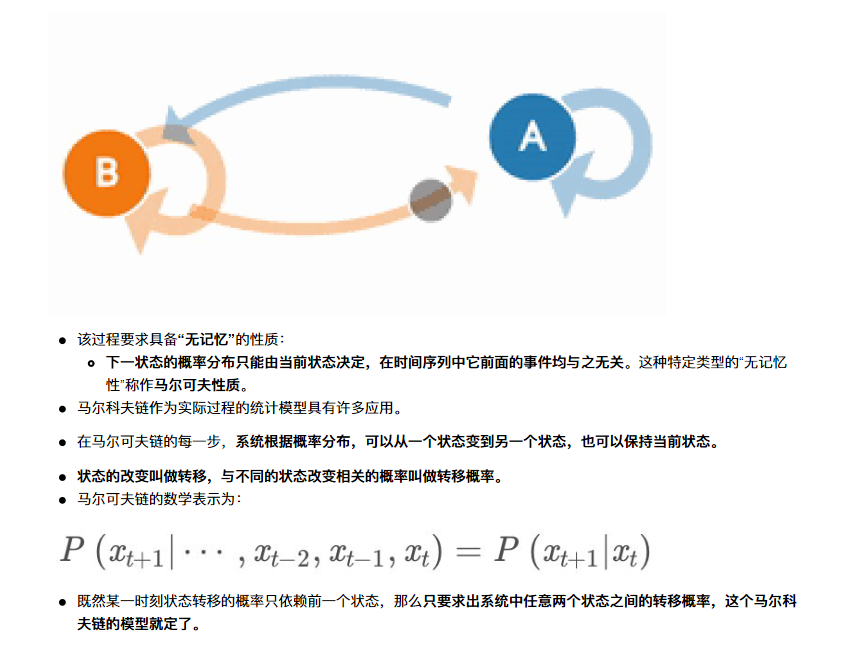
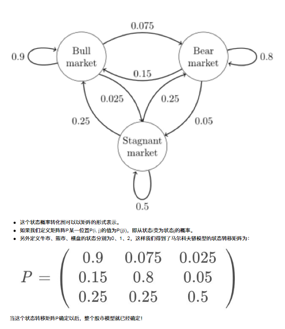
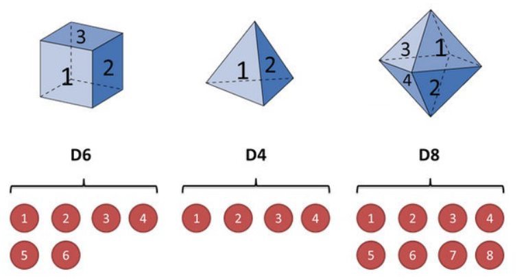
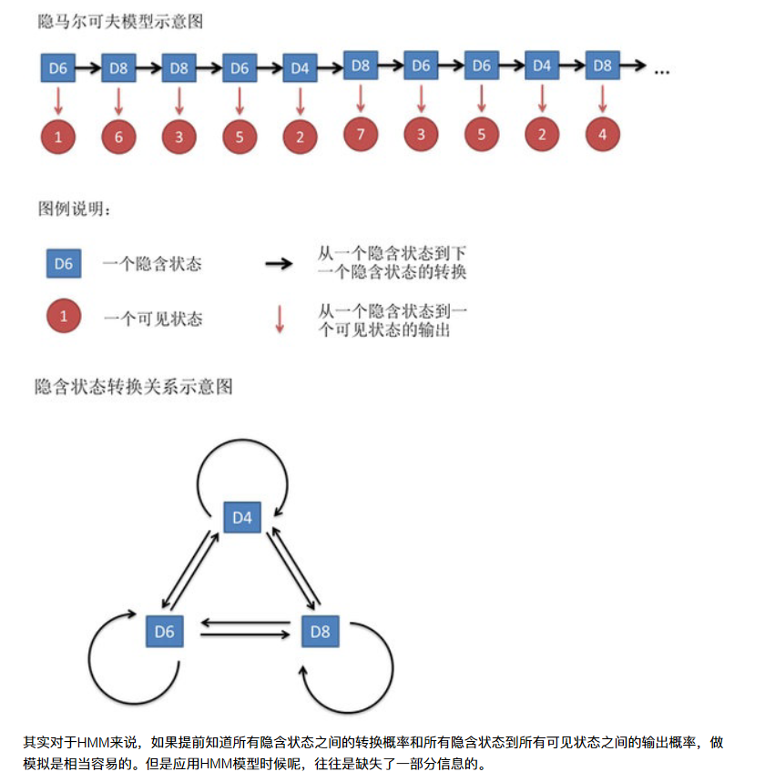
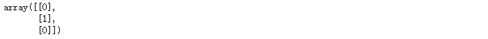
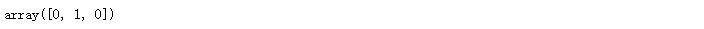
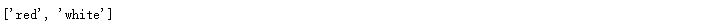
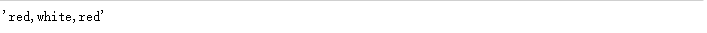
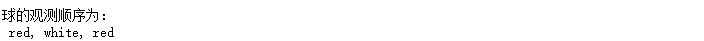
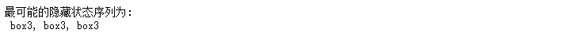

# HMM模型


# 1 ⻢尔科夫链

在机器学习算法中，⻢尔可夫链(Markov chain)是个很重要的概念。⻢尔可夫链（Markov chain），又称离散时间⻢尔可夫链（discrete-time Markov chain），因俄国数学家安德烈·⻢尔可夫（俄语：Андрей Андреевич Марков）得名。

## 1 简介
⻢尔科夫链即为状态空间中从一个状态到另一个状态转换的随机过程。



## 2 经典举例
下图中的⻢尔科夫链是用来表示股市模型，共有三种状态：牛市（Bull market）, 熊市（Bear market）和横盘
（Stagnant market）。
每一个状态都以一定的概率转化到下一个状态。比如，牛市以0.025的概率转化到横盘的状态。



## 3 小结
- ⻢尔科夫链即为
    - 状态空间中从一个状态到另一个状态转换的随机过程。
    - 该过程要求具备“无记忆”的性质：
        - 下一状态的概率分布只能由当前状态决定，在时间序列中它前面的事件均与之无关。


# 2 HMM简介

隐⻢尔可夫模型（Hidden Markov Model，HMM）是统计模型，它用来描述一个含有隐含未知参数的⻢尔可夫过程。其难点是从可观察的参数中确定该过程的隐含参数。然后利用这些参数来作进一步的分析，例如模式识别。

## 1 简单案例
下面我们一起用一个简单的例子来阐述：

- 假设我手里有三个不同的骰子。
    - 第一个骰子是我们平常⻅的骰子（称这个骰子为D6），6个面，每个面（1，2，3，4，5，6）出现的概率是1/6。
    - 第二个骰子是个四面体（称这个骰子为D4），每个面（1，2，3，4）出现的概率是1/4。
    - 第三个骰子有八个面（称这个骰子为D8），每个面（1，2，3，4，5，6，7，8）出现的概率是1/8。



- 我们开始掷骰子，我们先从三个骰子里挑一个，挑到每一个骰子的概率都是1/3。
- 然后我们掷骰子，得到一个数字，1，2，3，4，5，6，7，8中的一个。不停的重复上述过程，我们会得到一串数字，每个数字都是1，2，3，4，5，6，7，8中的一个。
- 例如我们可能得到这么一串数字（掷骰子10次）：1 6 3 5 2 7 3 5 2 4
- 这串数字叫做可⻅状态链。

但是在隐⻢尔可夫模型中，我们不仅仅有这么一串可⻅状态链，还有一串隐含状态链。

- 在这个例子里，这串隐含状态链就是你用的骰子的序列。
    - 比如，隐含状态链有可能是：D6 D8 D8 D6 D4 D8 D6 D6 D4 D8

一般来说，HMM中说到的⻢尔可夫链其实是指隐含状态链，因为隐含状态（骰子）之间存在转换概率（transition probability）。

- 在我们这个例子里，D6的下一个状态是D4，D6，D8的概率都是1/3。D4，D8的下一个状态是D4，D6，D8的转换概率也都一样是1/3。
- 这样设定是为了最开始容易说清楚，但是我们其实是可以随意设定转换概率的。
    - 比如，我们可以这样定义，D6后面不能接D4，D6后面是D6的概率是0.9，是D8的概率是0.1。
    - 这样就是一个新的HMM。

同样的，尽管可⻅状态之间没有转换概率，但是隐含状态和可⻅状态之间有一个概率叫做输出概率（emission probability）。

- 就我们的例子来说，六面骰（D6）产生1的输出概率是1/6。产生2，3，4，5，6的概率也都是1/6。
- 我们同样可以对输出概率进行其他定义。比如，我有一个被赌场动过手脚的六面骰子，掷出来是1的概率更大，是1/2，掷出来是2，3，4，5，6的概率是1/10。



- 有时候你知道骰子有几种，每种骰子是什么，但是不知道掷出来的骰子序列；
- 有时候你只是看到了很多次掷骰子的结果，剩下的什么都不知道。

如果应用算法去估计这些缺失的信息，就成了一个很重要的问题。这些算法我会在后面详细讲。

## 2 案例进阶

### 2.1 问题阐述
和HMM模型相关的算法主要分为三类，分别解决三种问题：
**1）知道骰子有几种（隐含状态数量），每种骰子是什么（转换概率），根据掷骰子掷出的结果（可⻅状态链），我想知道每次掷出来的都是哪种骰子（隐含状态链）。可见推出不可见**

- 这个问题呢，在语音识别领域呢，叫做解码问题。
- 这个问题其实有两种解法，会给出两个不同的答案。每个答案都对，只不过这些答案的意义不一样。
  - 第一种解法求最大似然状态路径，说通俗点呢，就是我求一串骰子序列，这串骰子序列产生观测结果的概率最大。
  - 第二种解法呢，就不是求一组骰子序列了，而是求每次掷出的骰子分别是某种骰子的概率。比如说我看到结果后，我可以求得第一次掷骰子是D4的概率是0.5，D6的概率是0.3，D8的概率是0.2。

**2）还是知道骰子有几种（隐含状态数量），每种骰子是什么（转换概率），根据掷骰子掷出的顺序和结果（可⻅状态链），我想知道掷出这个结果的概率。不可见推出可见**

- 看似这个问题意义不大，因为你掷出来的结果很多时候都对应了一个比较大的概率。
- 问这个问题的目的呢，其实是**检测观察到的结果和已知的模型是否吻合。**
- 如果很多次结果都对应了比较小的概率，那么就说明我们已知的模型很有可能是错的，有人偷偷把我们的骰子給换了。

**3）知道骰子有几种（隐含状态数量），不知道每种骰子是什么（转换概率），观测到很多次掷骰子的结果（可⻅状态链），我想反推出每种骰子是什么（转换概率）。可见推出不可见**

- 这个问题很重要，因为这是最常⻅的情况。
- 很多时候我们只有可⻅结果，不知道HMM模型里的参数，我们需要从可⻅结果估计出这些参数，这是建模的一个必要步骤。

### 2.2 问题解决

看pdf


# 7  HMM模型API介绍

## 1 API的安装：

官网链接：https://hmmlearn.readthedocs.io/en/latest/

```python
pip3 install hmmlearn
```

## 2 hmmlearn介绍
hmmlearn实现了三种HMM模型类，按照观测状态是连续状态还是离散状态，可以分为两类。
GaussianHMM和GMMHMM是连续观测状态的HMM模型，而MultinomialHMM是离散观测状态的模型，也是我们在HMM原理系列篇里面使用的模型。
在这里主要介绍我们前面一直讲的关于离散状态的MultinomialHMM模型。
对于MultinomialHMM的模型，使用比较简单，里面有几个常用的参数：

- "startprob_"参数对应我们的隐藏状态初始分布Π,
- _"transmat_"对应我们的状态转移矩阵A,
- "emissionprob_"对应我们的观测状态概率矩阵B。

## 3 MultinomialHMM实例
下面我们用我们在前面讲的关于球的那个例子使用MultinomialHMM跑一遍。

```python
import numpy as np
from hmmlearn import hmm

# 设定隐藏状态的集合
states = ["box 1", "box 2", "box3"]
n_states = len(states)
# 设定观察状态的集合
observations = ["red", "white"]
n_observations = len(observations)
# 设定初始状态分布
start_probability = np.array([0.2, 0.4, 0.4])
# 设定状态转移概率分布矩阵
transition_probability = np.array([
  [0.5, 0.2, 0.3],
  [0.3, 0.5, 0.2],
  [0.2, 0.3, 0.5]
])
# 设定观测状态概率矩阵
emission_probability = np.array([
  [0.5, 0.5],
  [0.4, 0.6],
  [0.7, 0.3]
])
    
# 设定模型参数
model = hmm.MultinomialHMM(n_components=n_states)
# 初始状态分布
model.startprob_=start_probability  
# 状态转移概率分布矩阵
model.transmat_=transition_probability
# 观测状态概率矩阵
model.emissionprob_=emission_probability  
```

现在我们来跑一跑HMM问题三维特比算法的解码过程，使用和之前一样的观测序列来解码，代码如下：

```python
# 设定观测序列
seen = np.array([[0,1,0]]).T 
seen
```



```python
# 二维变为一维,下面的observations也是一维的,因此要一样
seen.flatten()
```



```python
observations
```



```python
','.join(map(lambda x: observations[x], seen1))
```



```python
# 注意：需要使用flatten方法，把seen从二维变成一维
print("球的观测顺序为：\n", ", ".join(map(lambda x: observations[x], seen.flatten())))
```



```python
# 维特比模型训练
box = model.predict(seen)
print("最可能的隐藏状态序列为:\n", ', '.join(map(lambda x: states[x], box)))
```



我们再来看看求HMM问题一的观测序列的概率的问题，代码如下：

```python
print(model.score(seen))
# 输出结果是：-2.03854530992
```

要注意的是score函数返回的是以自然对数为底的对数概率值，我们在HMM问题一中手动计算的结果是未取对数的原始概率是0.13022。对比一下：

```python
import math

math.exp(-2.038545309915233)
# ln0.13022≈−2.0385
# 输出结果是：0.13021800000000003
```

