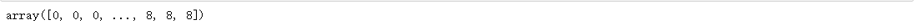
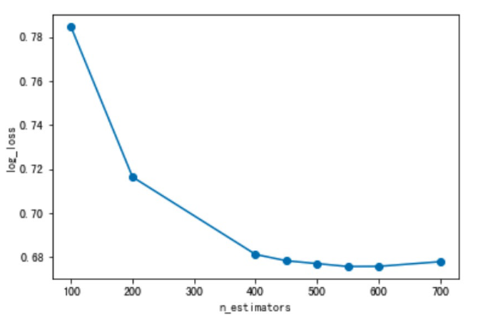
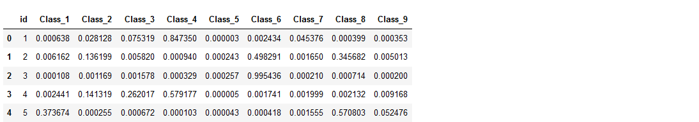
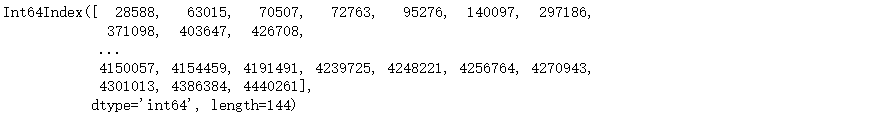

**RandomForestClassifier和XGBClassifier支持predict_proba(), 返回可能性**

# 集成学习进阶

# 1 xgboost算法原理

XGBoost（Extreme Gradient Boosting）全名叫极端梯度提升树，XGBoost是集成学习方法的王牌，在Kaggle数据挖掘比赛中，大部分获胜者用了XGBoost。
XGBoost在绝大多数的回归和分类问题上表现的十分顶尖，本节将较详细的介绍XGBoost的算法原理。

## 1.1 最优模型的构建方法


## 1.2 XGBoost的目标函数推导

### 1.2.1 目标函数确定


### 1.2.2 CART树的介绍


### 1.2.3 树的复杂度定义
#### 1.2.3.1 定义每课树的复杂度


#### 1.2.3.2 树的复杂度举例


### 1.2.4 目标函数推导


## 1.3 XGBoost的回归树构建方法

### 1.3.1 计算分裂节点

### 1.3.2 停止分裂条件判断

## 1.4 XGBoost与GDBT的区别

- 区别一：
    - XGBoost生成CART树考虑了树的复杂度，
    - GDBT未考虑，GDBT在树的剪枝步骤中考虑了树的复杂度。
- 区别二：
    - XGBoost是拟合上一轮损失函数的二阶导展开，GDBT是拟合上一轮损失函数的一阶导展开，因此，XGBoost的准确性更高，且满足相同的训练效果，需要的迭代次数更少。
- 区别三：
    - XGBoost与GDBT都是逐次迭代来提高模型性能，但是XGBoost在选取最佳切分点时可以开启多线程进行，大大提高了运行速度。

## 1.5 小结

- XGBoost的目标函数
- 知道XGBoost的回归树构建方法
- XGBoost与GDBT的区别
    - 区别一：
        - XGBoost生成CART树考虑了树的复杂度，
        - GDBT未考虑，GDBT在树的剪枝步骤中考虑了树的复杂度。
    - 区别二：
        - XGBoost是拟合上一轮损失函数的二阶导展开，GDBT是拟合上一轮损失函数的一阶导展开，因此，
        - XGBoost的准确性更高，且满足相同的训练效果，需要的迭代次数更少。
    - 区别三：
    - XGBoost与GDBT都是逐次迭代来提高模型性能，但是XGBoost在选取最佳切分点时可以开启多线程进
        行，大大提高了运行速度。


# 2 xgboost算法api介绍    xgboost.XGBClassifier

## 1 xgboost的安装：

官网链接：https://xgboost.readthedocs.io/en/latest/

```python
pip3 install xgboost
```

## 2 xgboost参数介绍

xgboost虽然被称为kaggle比赛神奇，但是，我们要想训练出不错的模型，必须要给参数传递合适的值。
xgboost中封装了很多参数，主要由三种类型构成：**通用参数（general parameters），Booster 参数（booster parameters）和学习目标参数（task parameters）**

- 通用参数：主要是**宏观函数控制；**
- Booster参数：取决于选择的Booster类型，**用于控制每一步的booster（tree, regressiong）；**
- 学习目标参数：**控制训练目标的表现。**

### 2.1 通用参数（general parameters）

- **booster [缺省值=gbtree]**

- **决定使用哪个booster，可以是gbtree，gblinear或者dart。**
    - gbtree和dart使用基于树的模型(dart 主要多了 Dropout)，而gblinear 使用线性函数.

- **silent [缺省值=0]**
    - 设置为0打印运行信息；设置为1静默模式，不打印

- **nthread [缺省值=设置为最大可能的线程数]**
    - 并行运行xgboost的线程数，输入的参数应该<=系统的CPU核心数，若是没有设置算法会检测将其设置为CPU的全部核心数

> 下面的两个参数不需要设置，使用默认的就好了

- **num_pbuffer [xgboost自动设置，不需要用户设置]**
    - 预测结果缓存大小，通常设置为训练实例的个数。该缓存用于保存最后boosting操作的预测结果。
- **num_feature [xgboost自动设置，不需要用户设置]**
    - 在boosting中使用特征的维度，设置为特征的最大维度

### 2.2 Booster 参数（booster parameters）
#### 2.2.1 Parameters for Tree Booster

- **eta [缺省值=0.3别名：learning_rate] 学习率**
    - 更新中减少的步⻓来防止过拟合。
    - 在每次boosting之后，可以直接获得新的特征权值，这样可以使得boosting更加鲁棒。
    - **范围： [0,1]**
- **gamma [缺省值=0，别名: min_split_loss]（分裂最小loss）**
    - 在节点分裂时，只有分裂后损失函数的值下降了，才会分裂这个节点。
    - Gamma指定了节点分裂所需的最小损失函数下降值。 这个参数的值越大，算法越保守。这个参数的值和损失函数息息相关，所以是需要调整的。
    - **范围: [0,∞]**
- **max_depth [缺省值=6]**
    - 这个值为树的最大深度。 这个值也是用来避免过拟合的。max_depth越大，模型会学到更具体更局部的样本。
    - 设置为0代表没有限制
    - **范围: [0,∞]**
- **min_child_weight [缺省值=1]**
    - 决定最小叶子节点样本权重和。XGBoost的这个参数是最小样本权重的和.
    - 当它的值较大时，可以避免模型学习到局部的特殊样本。 但是如果这个值过高，会导致欠拟合。这个参数需要使用CV来调整。.
    - **范围: [0,∞]**
- **subsample [缺省值=1]**
    - 这个参数控制对于每棵树，随机采样的比例。
    - 减小这个参数的值，算法会更加保守，避免过拟合。但是，如果这个值设置得过小，它可能会导致欠拟合。
    - 典型值：0.5-1，0.5代表平均采样，防止过拟合.
    - **范围: (0,1]**
- **colsample_bytree [缺省值=1]**
    - 用来控制每棵随机采样的列数的占比(每一列是一个特征)。
    - 典型值：0.5-1
    - **范围: (0,1]**
- **colsample_bylevel [缺省值=1]**
    - 用来控制树的每一级的每一次分裂，对列数的采样的占比。
    - 我个人一般不太用这个参数，因为subsample参数和colsample_bytree参数可以起到相同的作用。但是如果感兴趣，可以挖掘这个参数更多的用处。
    - **范围: (0,1]**
- **lambda [缺省值=1，别名: reg_lambda]**
    - 权重的L2正则化项(和Ridge regression类似)。
    - 这个参数是用来控制XGBoost的正则化部分的。虽然大部分数据科学家很少用到这个参数，但是这个参数
    - 在减少过拟合上还是可以挖掘出更多用处的。.
- **alpha [缺省值=0，别名: reg_alpha]**
    - 权重的L1正则化项。(和Lasso regression类似)。 可以应用在很高维度的情况下，使得算法的速度更快。
- **cale_pos_weight[缺省值=1]**
    - 在各类别样本十分不平衡时，把这个参数设定为一个正值，可以使算法更快收敛。通常可以将其设置为负
    - 样本的数目与正样本数目的比值。

#### 2.2.2 Parameters for Linear Booster

> linear booster一般很少用到。

- **lambda [缺省值=0，别称: reg_lambda]**
    - L2正则化惩罚系数，增加该值会使得模型更加保守。
- **alpha [缺省值=0，别称: reg_alpha]**
    - L1正则化惩罚系数，增加该值会使得模型更加保守。
- **lambda_bias [缺省值=0，别称: reg_lambda_bias]**
    - 偏置上的L2正则化(没有在L1上加偏置，因为并不重要)

### 2.3 学习目标参数（task parameters）

- **objective [缺省值=reg:linear]**
    - i.  “reg:linear” – 线性回归
    - ii.  “reg:logistic” – 逻辑回归
    - iii.  “binary:logistic” – 二分类逻辑回归，输出为概率
    - iv.  “multi:softmax” – 使用softmax的多分类器，返回预测的类别(不是概率)。在这种情况下，你还需要多设一个参数：num_class(类别数目)
    - v.  “multi:softprob” – 和multi:softmax参数一样，但是返回的是每个数据属于各个类别的概率。
- **eval_metric [缺省值=通过目标函数选择]**
    可供选择的如下所示：
    - i.  “rmse”: 均方根误差
    - ii.  “mae”: 平均绝对值误差
    - iii.  “logloss”: 负对数似然函数值
    - iv.  “error”: 二分类错误率。
        其值通过错误分类数目与全部分类数目比值得到。对于预测，预测值大于0.5被认为是正类，其它归为负
        类。
    - v.  “error@t”: 不同的划分阈值可以通过 ‘t’进行设置
    - vi.  “merror”: 多分类错误率，计算公式为(wrong cases)/(all cases)
    - vii.  “mlogloss”: 多分类log损失
    - viii.  “auc”: 曲线下的面积
- **seed [缺省值=0]**
    - 随机数的种子
- **设置它可以复现随机数据的结果，也可以用于调整参数**


# 3 xgboost案例介绍
## 1 案例背景

> 该案例和前面决策树中所用案例一样。

泰坦尼克号

案例：https://www.kaggle.com/c/titanic/overvie

数据：http://biostat.mc.vanderbilt.edu/wiki/pub/Main/DataSets/titanic.txt

经过观察数据得到:

- 1 乘坐班是指乘客班（1，2，3），是社会经济阶层的代表。
- 2 其中age数据存在缺失。

## 2 步骤分析
- 1.获取数据
- 2.数据基本处理
    - 2.1 确定特征值,目标值
    - 2.2 缺失值处理
    - 2.3 数据集划分
- 3.特征工程(字典特征抽取)
- 4.机器学习(xgboost)
- 5.模型评估

## 3 代码实现
- 导入需要的模块

```python
import pandas as pd
import numpy as np
from sklearn.model_selection import train_test_split
# 字典特征提取
from sklearn.feature_extraction import DictVectorizer
from xgboost import XGBClassifier
```

- 1.联网获取数据

```python
# 1、获取数据
titan = pd.read_csv("http://biostat.mc.vanderbilt.edu/wiki/pub/Main/DataSets/titanic.txt")
```

- 本地获取数据

```python
# 乘客数据
titanic = pd.read_csv('../data/titanic/test.csv')
titanic.head()

# 幸存数据
survive = pd.read_csv('../data/titanic/gender_submission.csv')
survive
```

- 2.数据基本处理

    - 2.1 确定特征值,目标值

    ```python
    # 特征值
    x = titanic[["Pclass", "Age", "Sex"]]
    # 目标值
    y = survive['Survived']
    ```

    - 2.2 缺失值处理

    ```python
    np.any(x['Age'].isnull())
    # 缺失值需要处理，将特征当中有类别的这些特征进行字典特征抽取
    # inplace=True 会修改原值
    x['Age'].fillna(x['Age'].mean(), inplace=True)
    np.any(x['Age'].isnull())
    ```

    - 2.3 数据集划分

    ```python
    x_train, x_test, y_train, y_test = train_test_split(x, y, random_state=22)
    ```

- 3.特征工程(字典特征抽取)

    特征中出现类别符号，需要进行one-hot编码处理(DictVectorizer)

    x.to_dict(orient="records") 需要将数组特征转换成字典数据

```python
# x_train格式不对,
x_train 
```


```python
# x_train格式不对,
# 转换成字典格式
x_train1 = x_train.to_dict(orient="records")
x_test1 = x_test.to_dict(orient="records")
```


```python
# 对于x转换成字典数据x.to_dict(orient="records")
# [{"pclass": "1st", "age": 29.00, "sex": "female"}, {}]

# sparse=False 返回非sparse矩阵
transfer = DictVectorizer(sparse=False)

x_train2 = transfer.fit_transform(x_train1)
x_test2 = transfer.fit_transform(x_test1)
```


- 4.训练数据

```python
# 模型初步训练
from xgboost import XGBClassifier
xg = XGBClassifier()
xg.fit(x_train2, y_train)
xg.score(x_test2, y_test)
```

```python
# 针对max_depth进行模型调优
depth_range = range(10)
score = []
for i in depth_range:
    xg = XGBClassifier(eta=1, gamma=0, max_depth=i)
    xg.fit(x_train2, y_train)
    s = xg.score(x_test2, y_test)
    print(s)
    score.append(s)
score
# [0.6904761904761905, 1.0, 1.0, 1.0, 1.0, 1.0, 1.0, 1.0, 1.0, 1.0]
```

```python
# 结果可视化
import matplotlib.pyplot as plt
plt.plot(depth_range, score)
plt.grid()
plt.show()
```


# 4 otto案例介绍 -- Otto Group Product Classification Challenge

## 4.1 背景介绍

奥托集团是世界上最大的电子商务公司之一，在20多个国家设有子公司。该公司每天都在世界各地销售数百万种产品,所以对其产品根据性能合理的分类非常重要。
不过,在实际工作中,工作人员发现,许多相同的产品得到了不同的分类。本案例要求,你对奥拓集团的产品进行正确的分类。尽可能的提供分类的准确性。

链接：https://www.kaggle.com/c/otto-group-product-classification-challenge/overview


## 4.2 思路分析

- 1.数据获取
- 2.数据基本处理
    - 2.1 截取部分数据
    - 2.2 把标签纸转换为数字
    - 2.3 分割数据(使用StratifiedShuffleSplit)
    - 2.4 数据标准化
    - 2.5 数据pca降维
- 3.模型训练
    - 3.1 基本模型训练
    - 3.2 模型调优
        - 3.2.1 调优参数:
            - n_estimator,
            - max_depth,
            - min_child_weights,
            - subsamples,
            - consample_bytrees,
            - etas
        - 3.2.2 确定最后最优参数

## 4.3 代码实现

### 1 引入包

```python
import numpy as np
import pandas as pd
import matplotlib.pyplot as plt
import seaborn as sns
```

### 2 读取文件

```python
data = pd.read_csv('../data/otto/train.csv')
data.shape
# (61878, 95)
```

### 3 seaborn图形可视化查看数据分布

```python
# countplot 求总数
sns.countplot(data.target)
plt.show()
```


上图可以看出,该数据类别不均衡,所以需要后期处理

### 4 数据基本处理

数据已经经过脱敏,不需要特殊处理

#### 4.1 截取部分数据

```python
new_1_data = data[:1000]
new_1_data.shape
# (1000, 95)
# 展示效果并不好
sns.countplot(new_1_data.target)
plt.show()
```


##### 4.1.1 使用随机欠采样获取数据

```python
# 首先确定特征值/目标值
y = data['target']
# 删除 id 和 target, axis=1 按列删除
x = data.drop(['id','target'], axis=1)
x.head()
```


```python
y.head()
```


```python
# 欠采样获取数据
from  imblearn.under_sampling import RandomUnderSampler
# 欠采样获取数据
under = RandomUnderSampler(random_state=0)

x_resampled, y_resampled = under.fit_resample(x, y)

x_resampled.shape, y_resampled.shape
# 特征值和目标值的数量相等了
```


```python
# 展示效果很好
sns.countplot(y_resampled)
plt.show()
```


#### 4.2 目标标签值转换成数字 LabelEncoder

```python
y_resampled.head()
```


```python
# 标签转换为数字
from sklearn.preprocessing import LabelEncoder

le = LabelEncoder()
y_resampled = le.fit_transform(y_resampled)
# 变成数字了 
y_resampled
```



####  4.3 分割数据(使用StratifiedShuffleSplit)

参数:

- **n_splits**是将训练数据分成train/test对的组数，可根据需要进行设置，默认为10

```python
# train_test_split 分隔数据 
from sklearn.model_selection import train_test_split
x_train, x_test, y_train, y_test = train_test_split(x_resampled, y_resampled, test_size=0.2, random_state=0)

# 图形可视化
import seaborn as sns
sns.countplot(y_test)
# 数据没有严格1: 1
```


```python
# StratifiedShuffleSplit 数据分隔
from sklearn.model_selection import StratifiedShuffleSplit

# 参数 n_splits是将训练数据分成train/test对的组数，可根据需要进行设置，默认为10
sss = StratifiedShuffleSplit(n_splits=1, test_size=0.2, random_state=0)
for train_index, test_index in sss.split(x_resampled, y_resampled):
    # 测试能不能正常使用
    #print(len(train_index))
    #print(len(test_index))
    
    # x,y的训练和测试要一一对应
    # 获取验证集和测试集
    x_train1= x_resampled.values[train_index]
    x_test1 = x_resampled.values[test_index]
    
    # y只有一列数据,因此不用values,直接取下标即可
    y_train1= y_resampled[train_index]
    y_test1 = y_resampled[test_index]
    
# 形状
x_train1.shape, y_test1.shape
```

```python
# 分割数据图形可视化
import seaborn as sns
sns.countplot(y_test1)
plt.show()
# 数据严格分隔了
```


#### 4.4 特征数据标准化StandardScaler

```python
from sklearn.preprocessing import StandardScaler
scaler = StandardScaler()
scaler.fit(x_train)
x_train_scaled = scaler.transform(x_train)
x_val_scaled = scaler.transform(x_val)
```

#### 4.5 数据pca降维

```python
x_train_scaled.shape, x_test_scaled.shape
# ((13888, 93), (3473, 93))

from sklearn.decomposition import PCA
# 保留 90%
pca = PCA(n_components=0.9)
# fit之后就能transform
x_train_pca = pca.fit_transform(x_train_scaled)
x_test_pca = pca.transform(x_test_scaled)

x_train_pca.shape, x_test_pca.shape,
# ((13888, 65), (3473, 65))
```

从上面输出的数据可以看出,只选择65个元素,就可以表达出特征中90%的信息

```python
# 降维数据可视化
plt.plot(np.cumsum(pca.explained_variance_ratio_))
plt.xlabel("元素数量")
plt.ylabel("可表达信息的百分占比")
plt.show()
```


### 5 模型训练 XGBClassifier

#### 5.1 模型基本训练

```python
from xgboost import XGBClassifier
xgb = XGBClassifier()
xgb.fit(x_train_pca, y_train)
# 改变预测值的输出模式,让输出结果为百分占比,降低logloss值
y_pre_proba = xgb.predict_proba(x_val_pca)
```

```python
# logloss进行模型评估, 越小越好
from sklearn.metrics import log_loss
log_loss(y_val, y_pre_proba, eps=1e-15, normalize=True)
# 0.735851001353164
```

#### 5.2 模型调优

##### n_estimator

```python
scores_ne = []
n_estimators = [100, 200, 400, 450, 500, 550, 600, 700]
for nes in n_estimators:
    print("n_estimators:", nes)
    xgb = XGBClassifier(learning_rate=0.1, 
        				n_estimators=nes,
                        max_depth=3, 
                        min_child_weight=1,
                        subsample=1,
                        colsample_bytree=1,
                        objective="multi:softprob", 
                        n_jobs=-1, 
                        nthread=4, 
                        seed=42)
    xgb.fit(x_train_pca, y_train1)
    y_pre = xgb.predict_proba(x_test_pca)
    score = log_loss(y_test1, y_pre, eps=1e-15, normalize=True)
    scores_ne.append(score)
    print("测试数据的logloss值为:{}".format(score))
scores_ne
```

```python
# 数据变化可视化
plt.plot(n_estimators, scores_ne, "o-")
plt.grid()
plt.ylabel("log_loss")
plt.xlabel("n_estimators")
# np.argmin(???) 返回最小值下标
print("n_estimators的最优值为:{}".format(n_estimators[np.argmin(scores_ne)]))
```



##### max_depth

```python
scores_md = []
max_depths = [1, 3, 5, 6, 7]
for md in n_estimators:
    print("n_estimators:", nes)
    # 直接使用上面的值, np.argmin(???) 返回最小值下标, 再通过下标找值
    xgb = XGBClassifier(learning_rate=0.1, 
        				n_estimators=n_estimators[np.argmin(scores_ne)]
                        max_depth=md, 
                        min_child_weight=1,
                        subsample=1,
                        colsample_bytree=1,
                        objective="multi:softprob", 
                        n_jobs=-1, 
                        nthread=4, 
                        seed=42)
    xgb.fit(x_train_pca, y_train1)
    y_pre = xgb.predict_proba(x_test_pca)
    score = log_loss(y_test1, y_pre, eps=1e-15, normalize=True)
    scores_md.append(score)
    print("测试数据的logloss值为:{}".format(score))
scores_md
```

```python
# 数据变化可视化
plt.plot(max_depths, scores_md, "o-")  # 修改
plt.grid()
plt.ylabel("log_loss")
plt.xlabel("max_depths")  # 修改
# np.argmin(???) 返回最小值下标
print("max_depths的最优值为:{}".format(max_depths[np.argmin(scores_md)]))  # 修改
```


##### min_child_weights,

- 依据上面模式进行调整

##### subsamples,

##### consample_bytrees,

##### etas(learning_rate)


#### 5.3 确定最后最优参数

```python
xgb = XGBClassifier(learning_rate=0.1,
                    n_estimators=550, 
                    max_depth=3, 
                    min_child_weight=3, 
                    subsample=0.7, 
                    colsample_bytree=0.7, 
                    nthread=4, 
                    seed=42, 
                    objective='multi:softprob')

xgb.fit(x_train_pca, y_train1)
y_pre = xgb.predict_proba(x_test_pca)

score = log_loss(y_test1, y_pre, eps=1e-15, normalize=True)
print("测试数据的logloss值为 : {}".format(score))
# 测试数据的logloss值为 : 0.6707750432398957
```

### 6 生成提交数据

#### 6.1 获取提交数据

```python
test_data = pd.read_csv('../data/otto/test.csv')
test_data.head()
```


```python
# 去掉id列
test_data_drop_id = test_data.drop('id', axis=1)
test_data_drop_id.head()
```


#### 6.2 数据标准化

```python
test_data_std = scaler.transform(test_data_drop_id)
```

#### 6.3 PCA数据降维,训练时降维了,测试时也得降维

```python
test_data_pca = pca.transform(test_data_std)
```

#### 6.4 预测数据

```python
test_data_pre = xgb.predict_proba(test_data_pca)
test_data_pre
```


#### 6.5 数据格式改为DataFrame,列名改为Class_?

```python
res_data = pd.DataFrame(test_data_pre, columns=['Class_'+str(i) for i in range(1, 10)])
res_data.head()
```


#### 6.6 添加id列

column 列名; value列值

```PYTHON
res_data.insert(loc=0, column='id', value=test_data.id)
res_data.head()
```



#### 6.7 保存文件

```PYTHON
# 保存文件
res_data.to_csv('submit.csv', index=False)
```


# 5 lightGBM

## 1 写在介绍lightGBM之前
### 1.1 lightGBM演进过程


### 1.2 AdaBoost算法
AdaBoost是一种提升树的方法，和三个臭皮匠，赛过诸葛亮的道理一样。
AdaBoost两个问题：

- (1) 如何改变训练数据的权重或概率分布
    - 提高前一轮被弱分类器错误分类的样本的权重，降低前一轮被分对的权重
- (2) 如何将弱分类器组合成一个强分类器，亦即，每个分类器，前面的权重如何设置
    - 采取”多数表决”的方法.加大分类错误率小的弱分类器的权重，使其作用较大，而减小分类错误率大的弱分类器的权重，使其在表决中起较小的作用。

### 1.3 GBDT算法以及优缺点
GBDT和AdaBosst很类似，但是又有所不同。

- GBDT和其它Boosting算法一样，通过将表现一般的几个模型（通常是深度固定的决策树）组合在一起来集成一个表现较好的模型。
- AdaBoost是通过提升错分数据点的权重来定位模型的不足， Gradient Boosting通过负梯度来识别问题，通过计算负梯度来改进模型，即通过反复地选择一个指向负梯度方向的函数，该算法可被看做在函数空间里对目标函数进行优化。

因此可以说 。

- GradientBoosting = GradientDescent +Boosting

缺点：
GBDT ->预排序方法(pre-sorted)

- (1) 空间消耗大。
    - 这样的算法需要保存数据的特征值，还保存了特征排序的结果（例如排序后的索引，为了后续快速的计算分割点），这里需要消耗训练数据两倍的内存。
- (2) 时间上也有较大的开销。
    - 在遍历每一个分割点的时候，都需要进行分裂增益的计算，消耗的代价大。
- (3) 对内存(cache)优化不友好。
    - 在预排序后，特征对梯度的访问是一种随机访问，并且不同的特征访问的顺序不一样，无法对cache进行优化。
    - 同时，在每一层⻓树的时候，需要随机访问一个行索引到叶子索引的数组，并且不同特征访问的顺序也不一样，也会造成较大的cache miss。

### 1.4 启发
常用的机器学习算法，例如神经网络等算法，都可以以mini-batch的方式训练，训练数据的大小不会受到内存限制。而GBDT在每一次迭代的时候，都需要遍历整个训练数据多次。
如果把整个训练数据装进内存则会限制训练数据的大小；如果不装进内存，反复地读写训练数据又会消耗非常大的时间。
尤其面对工业级海量的数据，普通的GBDT算法是不能满足其需求的。
LightGBM提出的主要原因就是为了解决GBDT在海量数据遇到的问题，让GBDT可以更好更快地用于工业实践。

## 2 什么是lightGBM
lightGBM是2017年1月，微软在GItHub上开源的一个新的梯度提升框架。

[GitHub链接](https://github.com/Microsoft/LightGBM)

在开源之后，就被别人冠以“速度惊人”、“支持分布式”、“代码清晰易懂”、“占用内存小”等属性。
LightGBM主打的高效并行训练让其性能超越现有其他boosting工具。在Higgs数据集上的试验表明，LightGBM比
XGBoost快将近10倍，内存占用率大约为XGBoost的1/6。

> higgs数据集介绍：这是一个分类问题，用于区分产生希格斯玻色子的信号过程和不产生希格斯玻色子的信号过程。

[数据链接](https://archive.ics.uci.edu/ml/datasets/HIGGS)

## 3 lightGBM原理
lightGBM 主要基于以下方面优化，提升整体特特性：

- 基于Histogram（直方图）的决策树算法
- Lightgbm 的Histogram（直方图）做差加速
- 带深度限制的Leaf-wise的叶子生⻓策略
- 直接支持类别特征
- 直接支持高效并行

具体解释⻅下，分节介绍。

## 3.1 基于Histogram（直方图）的决策树算法


# 6 lightGBM算法api介绍

## 1 lightGBM的安装

- windows下：

```python
pip install lightgbm
```

- mac下:

```python
https://github.com/Microsoft/LightGBM/blob/master/docs/Installation-Guide.rst#macos
```

## 2 lightGBM参数介绍

### 2.1 Control Parameters

| Control Parameters   | 含义                                                         | 用法                                                         |
| -------------------- | ------------------------------------------------------------ | ------------------------------------------------------------ |
| max_depth            | 树的最大深度                                                 | 当模型过拟合时,可以考虑首先降低max_depth                     |
| min_data_in_leaf     | 叶子可能具有的最小记录数                                     | 默认20，过拟合时用                                           |
| feature_fraction     | 例如 为0.8时，意味着在每次迭代中随机选择80％的参数来建树     | boosting 为 random forest 时用                               |
| bagging_fraction     | 每次迭代时用的数据比例                                       | 用于加快训练速度和减小过拟合                                 |
| early_stopping_round | 如果一次验证数据的一个度量在最近的early_stopping_round 回合中没有提高，模型将停止训练 | 加速分析，减少过多迭代                                       |
| lambda               | 指定正则化                                                   | 0～1                                                         |
| min_gain_to_split    | 描述分裂的最小 gain                                          | 控制树的有用的分裂                                           |
| max_cat_group        | 在 group 边界上找到分割点                                    | 当类别数量很多时，找分割点很容易过拟合时                     |
| n_estimators         | 最大迭代次数                                                 | 最大迭代数不必设置过大，可以在进行一次迭代后，根据最佳迭代数设置 |

### 2.2 Core Parameters

| Core Parameters | 含义       | 用法                                                         |
| --------------- | ---------- | ------------------------------------------------------------ |
| Task            | 数据的用途 | 选择 train 或者 predict                                      |
| application     | 模型的用途 | 选择 regression: 回归时，<br>binary: 二分类时，<br/>multiclass: 多分类时 |
| boosting        | 要用的算法 | gbdt， <br/>rf: random forest， <br/>dart: Dropouts meet Multiple Additive Regression Trees， <br/>goss: Gradient-based One-Side Sampling |
| num_boost_round | 迭代次数   | 通常 100+                                                    |
| learning_rate   | 学习率     | 常用 0.1, 0.001, 0.003..                                     |
| num_leaves      | 叶子数量   | 默认 31                                                      |
| device          | 选择设备   | cpu 或者 gpu                                                 |
| metric          | 评估对象   | mae: mean absolute error ， <br/>mse: mean squared error ， <br/>binary_logloss: loss for binary classification ，<br/>multi_logloss: loss for multi classificatio |

### 2.3 IO parameter

| IO parameter        | 含义                                                         |
| ------------------- | ------------------------------------------------------------ |
| max_bin             | 表示 feature 将存入的 bin 的最大数量                         |
| categorical_feature | 如果 categorical_features = 0,1,2， 则列 0，1，2是 categorical 变量 |
| ignore_column       | 与 categorical_features 类似，只不过不是将特定的列视为categorical，而是完全忽略 |
| save_binary         | 这个参数为 true 时，则数据集被保存为二进制文件，下次读数据时速度会变快 |

## 3 调参建议


| IO parameter     | 含义                                                         |
| ---------------- | ------------------------------------------------------------ |
| num_leaves       | 取值应， 超过此值会导致过拟合 |
| min_data_in_leaf | 将它设置为较大的值可以避免生⻓太深的树，但可能会导致 underfitting，在大型数据集时就设置为数百或数千 |
| max_depth        | 这个也是可以限制树的深度                                     |

下表对应了 Faster Speed ，better accuracy ，over-fitting 三种目的时，可以调的参数

| Faster Speed                                                 | better accuracy                                              | over-fitting                                                 |
| ------------------------------------------------------------ | ------------------------------------------------------------ | ------------------------------------------------------------ |
| 将  max_bin  设置小一些                                      | 用较大的  max_bin                                            | max_bin  小一些                                              |
|                                                              | num_leaves  大一些                                           | num_leaves  小一些                                           |
| 用  feature_fraction 来做 sub-sampling                       |                                                              | 用  feature_fraction                                         |
| 用  bagging_fraction和 bagging_freq <br>【bagging的次数。0表示禁用bagging，非零值表示执行k次bagging】 |                                                              | 设定  bagging_fraction 和bagging_freq                        |
|                                                              | training data 多一些                                         | training data 多一些                                         |
| 用  save_binary 来加速数据加载                               |                                                              | 用  gmin_data_in_leaf 和min_sum_hessian_in_leaf<br>【和xgboost中的min_child_weight类似】 |
| 用 parallel learning                                         | 用 dart【DART利用了深度神经网络中dropout设置的技巧，<br>随机丢弃生成的决策树，然后再从剩下的决策树集中迭代优化提升树】 | 用  lambda_l1, lambda_l2 ，<br/>min_gain_to_split  做正则化  |
|                                                              | num_iterations  大一些， learning_rate 小一些                | 用  max_depth  控制树的深度                                  |


# 7 lightGBM案例介绍

接下来，通过鸢尾花数据集对lightGBM的基本使用，做一个介绍。

```python
from sklearn.datasets import load_iris
from sklearn.model_selection import train_test_split
from sklearn.model_selection import GridSearchCV
from sklearn.metrics import mean_squared_error
import lightgbm as lgb
```

## 1 加载数据，对数据进行基本处理

```python
# 加载数据
iris = load_iris()
data = iris.data
target = iris.target
X_train, X_test, y_train, y_test = train_test_split(data, target, test_size=0.2, random_state=0)
```

## 2 模型训练 lgb.LGBMRegressor

```python
# regression 回归
gbm = lgb.LGBMRegressor(objective='regression', learning_rate=0.05, n_estimators=20)
gbm.fit(x_train, y_train, eval_set=[(X_test, y_test)], eval_metric='l1', early_stopping_rounds=5)

gbm.score(x_test, y_test)
# 0.8118770336882779
```

## 3 网格搜索 GridSearchCV

```python
#  网格搜索，参数优化
estimator = lgb.LGBMRegressor(num_leaves=31)

param_grid = {
    'learning_rate': [0.01, 0.1, 1],
    'n_estimators': [20, 40]
}
gbm = GridSearchCV(estimator, param_grid, cv=4)
gbm.fit(x_train, y_train)

# 获取最好的参数,参数从parma_grid中找
print('Best parameters found by grid search are:', gbm.best_params_)
# Best parameters found by grid search are: {'learning_rate': 0.1, 'n_estimators': 40}
```

## 4 模型调优训练

```python
gbm = lgb.LGBMRegressor(num_leaves=31, learning_rate=0.1, n_estimators=40)
gbm.fit(X_train, y_train, eval_set=[(X_test, y_test)], eval_metric='l1', early_stopping_rounds=5)
gbm.score(X_test, y_test)
# 0.9536626296481988
```


# 8 《绝地求生》**玩家排名预测**

## 数据集介绍

本项目中，将为您提供大量匿名的《绝地求生》游戏统计数据。
其格式为每行包含一个玩家的游戏后统计数据，列为数据的特征值。
数据来自所有类型的比赛：单排，双排，四排；不保证每场比赛有100名人员，每组最多4名成员。
文件说明:

- train_V2.csv - 训练集

- test_V2.csv - 测试集

数据集局部图如下图所示:


数据集中字段解释：

- Id [用户id]
    - Player’s Id
- groupId [所处小队id]
    - ID to identify a group within a match. If the same group of players plays in different matches, they will have a different groupId each time.
- matchId [该场比赛id]
    - ID to identify match. There are no matches that are in both the training and testing set.
- assists [助攻数]
    - Number of enemy players this player damaged that were killed by teammates.
- boosts [使用能量,道具数量]
    - Number of boost items used.
- damageDealt [总伤害]
    - Total damage dealt. Note: Self inflicted damage is subtracted.
- DBNOs [击倒敌人数量]
    - Number of enemy players knocked.
- headshotKills [爆头数]
    - Number of enemy players killed with headshots.
- heals [使用治疗药品数量]
    - Number of healing items used.
- killPlace [本厂比赛杀敌排行]
    - Ranking in match of number of enemy players killed.
- killPoints [Elo杀敌排名]
    - Kills-based external ranking of player. (Think of this as an Elo ranking where only kills matter.) If there is a value other than -1 in rankPoints, then any 0 in killPoints should be treated as a “None”.
- kills [杀敌数]
    - Number of enemy players killed.
- killStreaks [连续杀敌数]
    - Max number of enemy players killed in a short amount of time.
- longestKill [最远杀敌距离]
    - Longest distance between player and player killed at time of death. This may be misleading, as downing a player and driving away may lead to a large longestKill stat.
- matchDuration [比赛时⻓]
    - Duration of match in seconds.
- matchType [比赛类型(小组人数)]
    - String identifying the game mode that the data comes from. The standard modes are “solo”, “duo”, “squad”, “solo-fpp”, “duo-fpp”, and “squad-fpp”; other modes are from events or custom matches.
- maxPlace [本局最差名次]
    - Worst placement we have data for in the match. This may not match with numGroups, as sometimes the data skips over placements.
- numGroups [小组数量]
    - Number of groups we have data for in the match.
- rankPoints [Elo排名]
    - Elo-like ranking of player. This ranking is inconsistent and is being deprecated in the API’s next version, so use with caution. Value of -1 takes place of “None”.
- revives [救活队员的次数]
    - Number of times this player revived teammates.
- rideDistance [驾⻋距离]
    - Total distance traveled in vehicles measured in meters.
- roadKills [驾⻋杀敌数]
    - Number of kills while in a vehicle.
- swimDistance [游泳距离]
    - Total distance traveled by swimming measured in meters.
- teamKills [杀死队友的次数]
    - Number of times this player killed a teammate.
- vehicleDestroys [毁坏机动⻋的数量]
    - Number of vehicles destroyed.
- walkDistance [步行距离]
    - Total distance traveled on foot measured in meters.
- weaponsAcquired [收集武器的数量]
    - Number of weapons picked up.
- winPoints [胜率Elo排名]
    - Win-based external ranking of player. (Think of this as an Elo ranking where only winning matters.) If there is a value other than -1 in rankPoints, then any 0 in winPoints should be treated as a “None”.
- winPlacePerc [百分比排名]
    - The target of prediction. This is a percentile winning placement, where 1 corresponds to 1st place, and 0 corresponds to last place in the match. It is calculated off of maxPlace, not numGroups, so it is possible to have missing chunks in a match.

## 项目评估方式
你必须创建一个模型，根据他们的最终统计数据预测玩家的排名，从1（第一名）到0（最后一名）。
最后结果通过平均绝对误差（MAE）进行评估，即通过预测的winPlacePerc和真实的winPlacePerc之间的平均绝对误差
关于MAE:

- sklearn.metrics.mean_absolute_error


## 代码实现

### 1 获取数据,基本信息查看

```python
import matplotlib.pyplot as plt
import pandas as pd
import seaborn as sns
```

```python
train = pd.read_csv('../data/day13/train_V2.csv')
train.head()
```


```python
# 描述
train.describe()
```


```python
# 查看多少玩家
train.shape
# (4446966, 29)
```

```python
# 查看有多少场比赛 两种写法
train['matchId'].unique().shape
np.unique(train['matchId']).shape
# (47965,)
```

```python
# 查看有多少个队伍
np.unique(train['groupId']).shape
# (2026745,)
```

### 2 数据基本处理

#### 2.1 数据缺失值处理

```python
# 检测
np.any(train.isnull())
# True
```

```python
# 这一列有空余值
np.any(train['winPlacePerc'].isnull())
# True
```

```python
# 找出有空数据的行
train[train['winPlacePerc'].isnull()]
```


```python
# 删除这一行 drop默认不修改原值,可以添加参数 inplace=True 修改原值
train1 = train.drop(2744604)

# 检测
np.any(train1.isnull())
# False
```

#### 2.2 特征值数据规范化处理

##### 2.2.1 查看每场比赛参加的人数

```python
# 按照matchId分组,再获取matchId,再通过transform进行个数统计
count = train1.groupby('matchId')['matchId'].transform('count')
count
# 可以看出count是按照原有id进行匹配的,所以可以放进原表
```


```python
# 将每一场人数添加到数据中
train1['playersJoined'] = count
train1['playersJoined'].head()
```


```python
# 按照数据多少进行排序,法线有人数很少的比赛
train1['playersJoined'].sort_values().head()
```


```python
plt.figure(figsize=(20, 8), dpi=100)
sns.countplot(train1['playersJoined'])
plt.grid()
plt.show()
# 有很多场人很少
```


```python
# 获取每场人数多于75人的比赛
train2 = train1[train1['playersJoined'] >= 75]

plt.figure(figsize=(20, 8), dpi=100)
sns.countplot(train2['playersJoined'])
plt.grid()
plt.show()
# 有很多场人很少
```


#### 2.2.2 规范化输出部分数据

```python
train2["killsNorm"] = train2["kills"] * ((100-train2["playersJoined"])/100+1)
train2["killsNorm"]
```


```python
train2["damageDealtNorm"] = train2["damageDealt"] * \
    ((100-train2["playersJoined"])/100+1)
train2["maxPlaceNorm"] = train2["maxPlace"] * \
    ((100-train2["playersJoined"])/100+1)
train2["matchDurationNorm"] = train2["matchDuration"] * \
    ((100-train2["playersJoined"])/100+1)
```

```python
# 比较经过规范化的特征值和原始特征值的值
to_show = ['Id', 'kills','killsNorm','damageDealt', 'damageDealtNorm', 'maxPlace', 'maxPlaceNorm', 'matchDuration', 'matchDurationNorm']
train2[to_show][0:11]
```


#### 2.3 部分变量合成

```python
train2['healsandboosts'] = train2['heals'] + train2['boosts']
train2[['heals', 'boosts', 'healsandboosts']].tail()
```


#### 2.4 异常值处理

##### 2.4.1 删除有击杀,但完全没有移动的玩家

```python
# 总移动距离 = 载具 + 走路 + 游泳
train2["totalDistance"] = train2["rideDistance"] + train2["walkDistance"] + train2["swimDistance"]
train2["totalDistance"].sort_values().head()
# 为0说明没动,开挂了
```


```python
# 有杀敌但没有移动的玩家,返回真和假
train2["killwithoutMoving"] = (train2['kills'] > 0) & (train2['totalDistance'] == 0)
# 作弊玩家
train2[train2["killwithoutMoving"] == True].head()
```


```python
# 通过作弊玩家索引删除数据
# inplace=True 修改原数据
train2.drop(train2[train2["killwithoutMoving"] == True].index, inplace=True)
train2.shape
# (4389366, 37) 数据少了一些
```

##### 2.4.2 删除驾车杀敌数异常的数据

```python
# 找出相应数据的index
train2.drop(train2[train2['roadKills'] > 10].index, inplace=True)
train2.shape
# (4389363, 37)
```

##### 2.4.3 删除杀敌数超出30人的

```python
plt.figure(figsize=(20, 8))
sns.countplot(train2['kills'])
plt.show()
```


```python
# 找出相应数据的index
train2.drop(train2[train2['kills'] > 30].index, inplace=True)
train2.shape
# (4389359, 37)
```

##### 2.4.4 删除爆头率异常数据

```python
# 创建变量爆头率
train2['headshot_rate'] = train2['headshotKills'] / train2['kills']
# 填充空数据
train2['headshot_rate'] = train2['headshot_rate'].fillna(0)
train2['headshot_rate'].head()
# 最大为1, 全部爆头
```


```python
# 删除杀敌数大于9且爆头率为100的数据
train2[(train2['headshot_rate'] == 1) & (train2['kills'] > 9)].index
```


```python
# inplace=True 修改原值
train2.drop(train2[(train2['headshot_rate'] == 1) & (train2['kills'] > 9)].index, inplace=True)
train2.shape
# (4389335, 38)
```

##### 2.4.5 删除最远杀敌异常数据

```python
train2[train2['longestKill'] >= 1000].index
```


```python
train2.drop(train2[train2['longestKill'] >= 1000].index, inplace=True)
train2.shape
# (4389332, 38)
```

##### 2.4.6 删除运动距离的异常值

```python
# 行走
train2[train2['walkDistance'] >= 10000].index
train2.shape
# (4389332, 38)
```

```python
train2.drop(train2[train2['walkDistance'] >= 10000].index, inplace=True)
train2.shape
# (4389118, 38)
```

```python
# 载具
train2[train2['rideDistance'] >= 20000].index
```



```python
train2.drop(train2[train2['rideDistance'] >= 20000].index, inplace=True)
train2.shape
# (4388974, 38)
```

```python
# 游泳
train2[train2['swimDistance'] >= 2000].index
```

```python
train2.drop(train2[train2['swimDistance'] >= 2000].index, inplace=True)
train2.shape
# (4388962, 38)
```

##### 2.4.7 武器收集数据异常

```python
train2[train2['weaponsAcquired'] >= 80].index
```


```python
train2.drop(train2[train2['weaponsAcquired'] >= 80].index, inplace=True)
train2.shape
# (4388948, 38)
```

##### 2.4.8 治疗药物异常

```python
train2[train2['heals'] >= 80].index
```


```python
train2.drop(train2[train2['heals'] >= 80].index, inplace=True)
train2.shape
# (4388947, 38)
```

#### 2.5 类别型数据处理

##### 2.5.1 比赛类型ont-hot处理

```python
# 比赛类型
# 对象.unique
train2['matchType'].unique()
```


```python
# 转换成0 1 2
train3 = pd.get_dummies(train2, columns=['matchType'])
train3.head()
```


```python
# pandas正则化找数据
matchTpye_encoding = train3.filter(regex='matchType')
matchTpye_encoding.head()
```


##### 2.5.2 对groupId,matchId进行处理

###### 2.5.2.1 groupId

```python
train3['groupId'].head()
# 类型是object
```


```python
# 类型改为category,要用变量保存
train3['groupId'] = train3['groupId'].astype('category')
train3['groupId'].head()
```


```python
train3['groupId_cat'] = train3['groupId'].cat.codes
train3['groupId_cat'].head()
```


###### 2.5.2.2 matchId

```python
train3['matchId'].head()
# 类型是object
```


```python
# 类型改为category,要用变量保存
train3['matchId'] = train3['matchId'].astype('category')
train3['matchId'].head()
```


```python
train3['matchId_cat'] = train3['matchId'].cat.codes
train3.drop(['matchId', 'groupId'], axis=1, inplace=True)
train3[['groupId_cat', 'matchId_cat']].head()
```


#### 2.6 数据提取

##### 2.6.1 sample函数截取部分数据 不使用截取和欠采样

```python
# sample(数据量)
df_sample = train3.sample(100000)
df_sample.info()
```


##### 2.6.2 特征值和目标值

```python
x = df_sample.drop(['winPlacePerc', 'Id'], axis=1)
y = df_sample['winPlacePerc']
x.shape, y.shape
# ((100000, 48), (100000,))
```

##### 2.6.3 分隔数据集和测试集

```python
from sklearn.model_selection import train_test_split
x_train, x_test, y_train, y_test = train_test_split(x, y, test_size=0.2, random_state=1)
x_train.shape, y_train.shape
# ((80000, 48), (80000,))
```

### 3 使用随机森林RandomForestRegressor进行模型训练

- RandomForestClassifier 处理分类问题
- RandomForestRegressor 处理回归问题

```python
from sklearn.ensemble import RandomForestRegressor
# 数据分析,值越小越好
from sklearn.metrics import mean_absolute_error
```

#### 3.1 使用随机森林进行初步训练

```python
m1 = RandomForestRegressor(n_estimators=40,
                     min_samples_leaf=3,
                     max_features='sqrt',
                     n_jobs=-1)
m1.fit(x_train, y_train)
```

```python
y_pre = m1.predict(x_test)
# 特征值测试和目标值测试
m1.score(x_test, y_test)
# 0.9092604661830507
```

```python
# 平均绝对误差
mean_absolute_error(y_test, y_pre)
# 0.06707688930717984
```

#### 3.2 再次使用随机森林进行模型训练 feature_importances_


```python
# 创建列名和重要性的df
imp_df = pd.DataFrame({'cols':x.columns, 'imp':m1.feature_importances_})
imp_df.head()
```


```python
# 列名和重要性排序
imp_df1 = imp_df.sort_values('imp', ascending=False)
imp_df1.head()
```


```python
# 特征重要性排序
imp_df1.plot('cols', 'imp', figsize=(20, 8), kind='barh')
```


```python
# 获取要保留的列名
to_keep = imp_df1[imp_df1.imp > 0.005].cols
to_keep
```


```python
# 获取有用的数据
x_keep = x[to_keep]

# 重新分隔数据
x_train1, x_test1, y_train1, y_test1 = train_test_split(x_keep, y, test_size=0.2, random_state=0)
x_train1.shape
# (80000, 19)
```

```python
m2 = RandomForestRegressor(n_estimators=40,
                     min_samples_leaf=3,
                     max_features='sqrt',
                     n_jobs=-1)
m2.fit(x_train1, y_train1)

y_pre1 = m2.predict(x_test1)
```

```python
# 特征值测试和目标值测试
m2.score(x_test1, y_test1)
# 0.9154471829197293
```

```python
# 平均绝对误差
mean_absolute_error(y_test, y_pre1)
# 0.34082801716181305
```

### 4 使用lightGBM对模型进行训练

#### 4.1 模型初步尝试

```python
x_train2, x_test2, y_train2, y_test2 = train_test_split(x, y, test_size=0.2, random_state=1)
x_train2.shape
# (80000, 48)
```

```python
import lightgbm as lgb

gbm = lgb.LGBMRegressor(objective='regression',
                        num_leaves=31, 
                        learning_rate=0.05, 
                        n_estimators=20)
# eval_set 按照哪一个来返回数据进行测试
# eval_metric 通过什么来回测
gbm.fit(x_train2, y_train2, eval_set=[
        (x_test2, y_test2)], 
        eval_metric='l1', 
        early_stopping_rounds=5)
```


```python
# num_iteration=gbm.best_iteration_ 最好的迭代
y_pre2 = gbm.predict(x_test2, num_iteration=gbm.best_iteration_,)
y_pre2
```


```python
mean_absolute_error(y_test2, y_pre2)
# 0.12216067897852984
```

#### 4.2 模型二次优化GridSearchCV

```python
from sklearn.model_selection import GridSearchCV

# 这里写了参数,下面调优就不用写了,也可以放到下面写
estimator = lgb.LGBMRegressor(num_leaves=31)

param_grid = {
    'learning_rate': [0.01, 0.1 , 1],
    'n_estimators': [ 40, 60, 80, 100, 200, 300]
}
gd = GridSearchCV(estimator, param_grid, cv=3, n_jobs=-1)
gd.fit(x_train2, y_train2)
```

```python
y_pre3 = gd.predict(x_test2)
mean_absolute_error(y_test2, y_pre3)
# 0.05625731100635988
```

```python
# 获取最好参数
gd.best_params_
# {'learning_rate': 0.1, 'n_estimators': 300}
```

#### 4.3 模型三次优化

##### 4.3.1 n_estimators

```python
scores = []
param = [100, 300, 500, 800]
for i in param:
    lgbm = lgb.LGBMRegressor(n_estimators=i,
                      max_depth=5,
                      num_leaves=31, 
                      learning_rate=0.1, 
                      min_child_samples=20, 
                      boosting_type='gbdt', 
                      n_jobs=-1)
    # eval_set 按照哪一个来返回数据进行测试
    # eval_metric 通过什么来回测
    lgbm.fit(x_train2, y_train2, eval_set=[(x_test2, y_test2)], eval_metric='l1', early_stopping_rounds=5)
    
    y_pre4 = lgbm.predict(x_test2)
    mae = mean_absolute_error(y_test2, y_pre4)

    scores.append(mae)
    print('本次结果输出的mae值是:\n', mae)
    
scores
```


```python
# np.argmin(scores) 返回最小值下标
best_n_estimators = param[np.argmin(scores)]
print("n_estimators的最优值为:{}".format(best_n_estimators))
# n_estimators的最优值为:300

plt.plot(param, scores)
plt.grid()
plt.show()
```


##### 4.3.2 max_depth

```python
scores = []
param = [3, 5, 7, 9, 11]
for i in param:
    lgbm = lgb.LGBMRegressor(n_estimators=best_n_estimators, 
                      max_depth=i,
                      num_leaves=31,
                      learning_rate=0.1, 
                      min_child_samples=20, 
                      boosting_type='gbdt', 
                      n_jobs=-1)
    # eval_set 按照哪一个来返回数据进行测试
    # eval_metric 通过什么来回测
    lgbm.fit(x_train2, y_train2, eval_set=[(x_test2, y_test2)], eval_metric='l1', early_stopping_rounds=5)
    
    y_pre4 = lgbm.predict(x_test2)
    mae = mean_absolute_error(y_test2, y_pre4)

    scores.append(mae)
    print('本次结果输出的mae值是:\n', mae)
    
scores
```


```python
# np.argmin(scores) 返回最小值下标
best_max_depth = param[np.argmin(scores)]
print("max_depth的最优值为:{}".format(best_max_depth))
# max_depth的最优值为:7

plt.plot(param, scores)
plt.grid()
plt.show()
```


